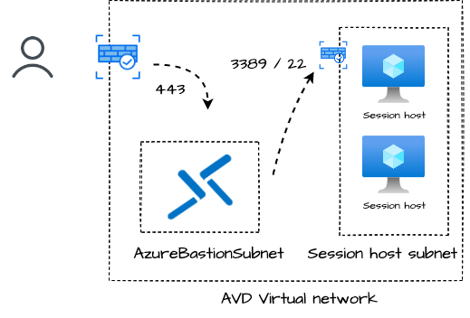
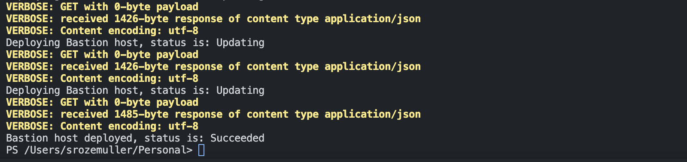
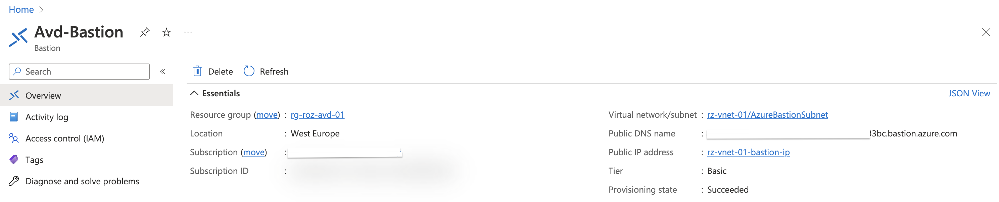
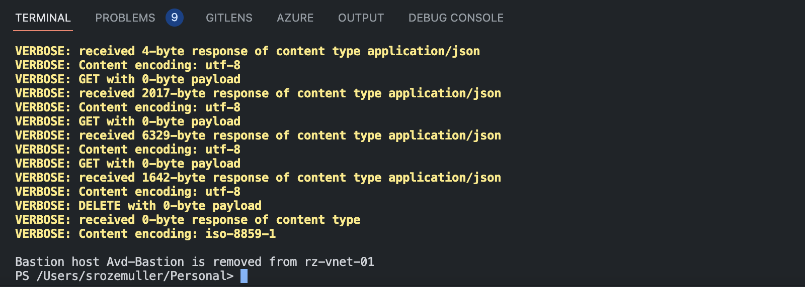

The IT landscape is changing. Hardware takes place for serverless and resources are moving to public cloud platforms. With that, also the IT processes are changing. In this blog post, I show how to make one of the most common processes more secure in the public cloud. Manage a client endpoint with remote control. 



In the case of an on-prem or hybrid scenario, IT admins use RDP over the local network. But imagine there is no local network directly connected to the backend and all resources are on a public cloud platform. Azure Virtual Desktop is a service that can run in the public cloud only. AVD fully supports Azure AD which makes it possible to connect with an internet connection only.  
But what if a session host becomes unresponsive you can't just connect with RDP to the local IP. I've seen situations where session hosts are accessible on a public IP over RDP, or 'temporary' VPN connections are configured.  

Luckily, there is a more secure, and modern way to remote control machines, Azure Bastion.

## Azure Bastion
In short (from Microsoft), Azure Bastion is a service you deploy that lets you connect to a virtual machine using your browser and the Azure portal, or via the native SSH or RDP client already installed on your local computer. The Azure Bastion service is a fully platform-managed PaaS service that you provision inside your virtual network. It provides secure and seamless RDP/SSH connectivity to your virtual machines directly from the Azure portal over TLS. When you connect via Azure Bastion, your virtual machines don't need a public IP address, agent, or special client software.

The key benefits in this context are: 

- RDP and SSH through the Azure portal or RDP client
- No Public IP address is required on the Azure VM
- No hassle of managing Network Security Groups (NSGs)

Check for all the Azure Bastion information in the overview: https://learn.microsoft.com/en-us/azure/bastion/bastion-overview

## Deploy Azure Bastion in Azure Virtual Desktop environment
Azure Bastion lets you remote-control virtual machines. So there is no special treatment in an Azure Virtual Desktop environment. The main idea is to create a bastion host in the session host's virtual network. To create a bastion host, I use the [Az.Avd PowerShell module](https://www.powershellgallery.com/packages/Az.Avd). 



### Requirements
- Latest Az.Avd Powershell module. Update with ```Update-Module Az.Avd```
- Available public IP
- AzureBastionSubnet subnet in AVD virtual network

### Add Azure Bastion
To deploy an Azure Bastion host you need a virtual network with a subnet called AzureBastionSubnet, and a public IP. Creating the subnet and public IP is not part of the Az.Avd module. 

Adding a bastion host to the AVD environment is simple by using the ```Add-AvdBastionHost``` command. The command accepts input from the ```Get-AvdHostpool``` results.  In the command below I created the *AzureBastionSubnet* subnet in the AVD virtual network and created a public IP which is the public endpoint. 

After authentication, using ```Connect-AzAccount```, provide the command below.
```powershell
$avdParams = @{
    hostpoolName      = "AVD-Hostpool"
    resourceGroupName = 'rg-roz-avd-01'
}
$subnetId = "/subscriptions/xx/resourceGroups/rg-roz-avd-01/providers/Microsoft.Network/virtualNetworks/rz-vnet-01/subnets/AzureBastionSubnet"
$publicIpId = "/subscriptions/xx/resourceGroups/rg-roz-avd-01/providers/Microsoft.Network/publicIPAddresses/pip-external-avd"
Get-AvdHostPool @avdParams | Add-AvdBastionHost -BastionHostName "Avd-Bastion" -SubnetId $subnetId -PublicIpId $publicIpId -Verbose
```
Deploying a Bastion Host takes time, the command shows the deployment status every 5 seconds. 




### Remove Azure Bastion
Azure Bastion has pros but also cons. One of them is pricing. The Azure Bastion costs can be very expensive. To reduce costs, it is good to have a Bastion host as short as possible. Adding a host was very simple. With the command below it simply removes the host when it is not needed. 

```powershell
Get-AvdHostPool @avdParams | Remove-AvdBastionHost -Verbose
```

The command searches for Bastion hosts and the AVD virtual network based on the AVD host pool. The Bastion host related to the  *AzureBastionSubnet* subnet is picked and removed.



