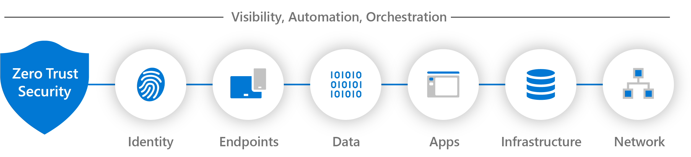
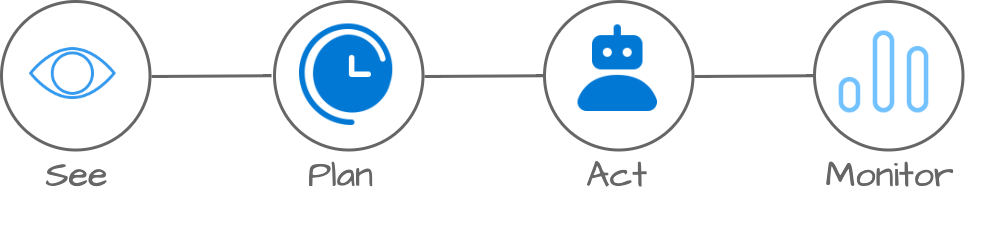
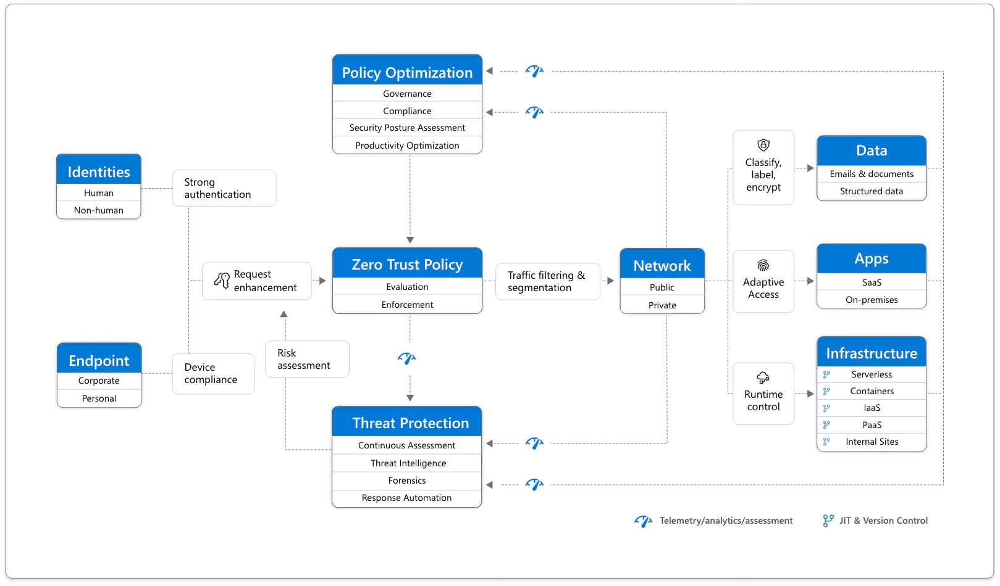
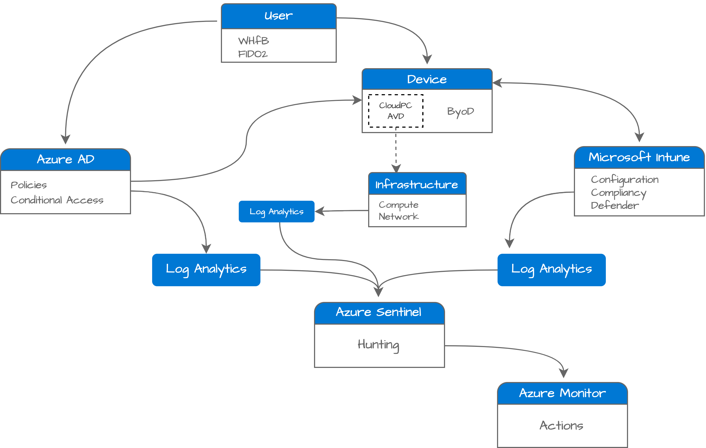

The IT landscape is changing. Private becomes public, local resources are moving to the public cloud. More and more workloads return to the local endpoint. Cloud endpoints (AVD, W365) are mostly used to run legacy software.
With all those movements, it could be challenging to keep the herd in the pasture. Devices are everywhere and what about security?
 
Welcome to The Endpoint Security Train, aka TEST, blog series. In this blog series, I show different aspects of security and the modern workplace based on the zero-trust model. The main idea is to show where to start building an environment to help to secure the weakest points, modern workplace endpoints. All with an automation background, Zero-Trust-As-A-Code.



## Zero trust model
Zero Trust is a security strategy. It is not a product or a service, but an approach in designing and implementing the following set of security principles:

- Verify explicitly
- Use least privilege access
- Assume breach

Zero trust strategy is more than implementing technologies. It is also important to train people to recognize untrusted situations and act in a proper way. This blog series focuses on implementing technologies in an automated way. Keep in mind that it is just a part of the total. 

For more information about Zero Trust, check: https://learn.microsoft.com/en-us/security/zero-trust/zero-trust-overview

## Starting Point
With the zero-trust model in mind, I keep the following processes in mind: See, Plan, Act, and Monitor, aka SPAM.  
- See (visibility): This is the step that gives answers to what is happening. Get sight of your environment. 
- Plan (when): After you have seen something that needs action, plan what you need to do and when.
- Act: (how): Automate actions.
- Monitor (check): To make sure your action was successful, monitor the corresponding event in the future.

To keep sight, I divided the environment into three parts, aka IAM. 
- Entra ID: All that has to do with authentication and authorization. (MFA, Passwordless, CA policies)
- Azure: Azure-related components like AVD and to store logs at Log Analytics
- M365: Microsoft Intune, security baselines, compliance policies and more. 

>If you don't look, you won't see.

## What is next?
In the upcoming series, I will collaborate with other community people to get the best Zero-Trust configuration. Step by step the different elements are peeled off with an explanation based on real-life experiences.

The series starts with building the platform. The first thing is getting sights. Several Log Analytics Workspaces are created, for every purpose a workspace (will explain that later). The central point is Azure Sentinel for log intelligence, Mircosoft Intune to manage endpoints and, Azure AD for identity. If possible, the configuration is deployed in an automated way.

Then, after the log platform, the identity element is next with subjects like conditional access, Windows Hello for Business (WHfB), and strong authentication. How to implement logging, execute actions, and monitor.  
From that point, Intune comes over where policies, logging, actions and monitoring are configured. 
Later on, the Microsoft Intune part comes in. At last, Azure Sentinel closes the train.

I use the diagram below act as a guideline.
 

Source: https://www.microsoft.com/en-us/security/business/zero-trust

### Component deployment
For every part, I discuss the different processes from visibility to monitoring. The needed components to keep your environment as secure as possible.  
Think about installing Defender for Endpoint, MFA, configuring conditional access policies, passwordless authentication, security baselines, and more.  
Also the underlying environment for logging (think about Azure Log Analytics and Azure Sentinel), planning remediation, creating remediation tasks and configuring monitoring are shown.   

All the needed components are deployed in the most automated way. The diagram below shows the deployment in basic.  

