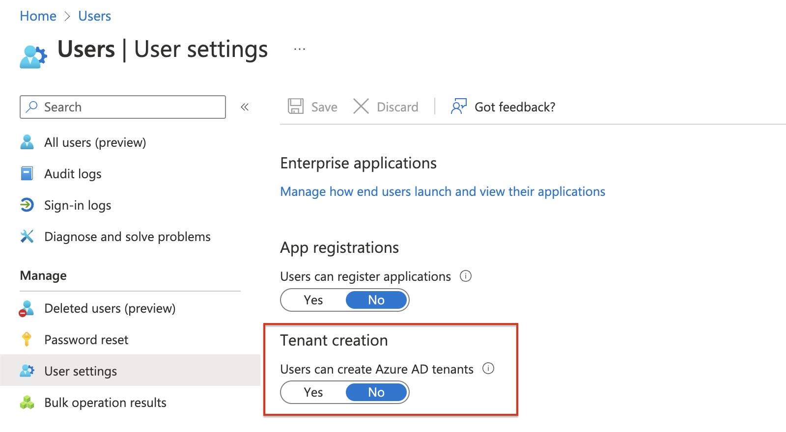
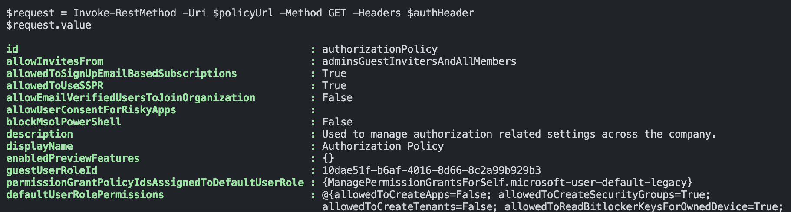
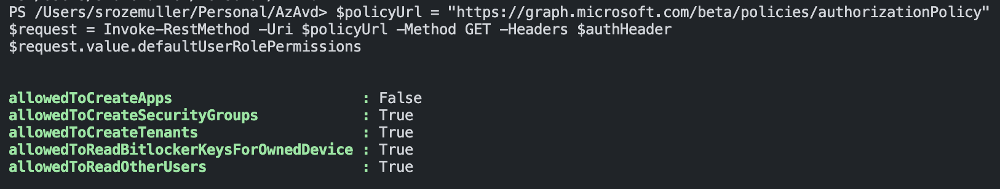

It looks like Microsoft has added a new option that allows users to create tenants. Some people have seen the Tenant Creation option in the regular Azure portal but was removed fast. For now, the option is still available in the Preview Azure Portal (https://preview.portal.azure.com/)

The nasty thing about it is that the option default allows users to create new tenants. Also without a global admin or tenant creator role.  



In this short blog, I show how to disable this option for users. 




## Disable Tenant Creation option

What does tenant creation allow:  
*'Yes' allows default users to create Azure AD tenants. 'No' allows only users with the global administrator or tenant creator roles to create Azure AD tenants. Anyone who creates a tenant will become the global administrator for that tenant.*

The tenant creation option is part of the authorization policy and is available in the Graph API BETA version. See: https://learn.microsoft.com/en-us/graph/api/authorizationpolicy-get?view=graph-rest-beta  
The documentation, however, is not updated (yet).

### Get authorization policy
Use the command below to update the authorization policy with the Graph API. First, I request the authorization policy to get the name.

```powershell
Connect-AzAccount
$resource = "https://graph.microsoft.com"
$context = [Microsoft.Azure.Commands.Common.Authentication.Abstractions.AzureRmProfileProvider]::Instance.Profile.DefaultContext
$Token = [Microsoft.Azure.Commands.Common.Authentication.AzureSession]::Instance.AuthenticationFactory.Authenticate($context.Account, $context.Environment, $context.Tenant.Id.ToString(), $null, [Microsoft.Azure.Commands.Common.Authentication.ShowDialog]::Never, $null, $resource).AccessToken
$authHeader = @{
    'Content-Type' = 'application/json'
    Authorization  = 'Bearer ' + $Token
}
$policyUrl = "https://graph.microsoft.com/beta/policies/authorizationPolicy"
$request = Invoke-RestMethod -Uri $policyUrl -Method GET -Headers $authHeader
$request.value
```




### Update authorization policy
Based on the policy name the command below updates the role permission where the new option is in.

```powershell
$body = @{
    defaultUserRolePermissions = @{
        allowedToCreateTenants = $false
    } 
} | ConvertTo-Json
$updateUrl = "https://graph.microsoft.com/beta/policies/authorizationPolicy/{0}" -f $req.value.id
Invoke-RestMethod -Uri $updateUrl -Method PATCH -Headers $authHeader -Body $body
```
The command does not return any content.


Check the discussion below.



