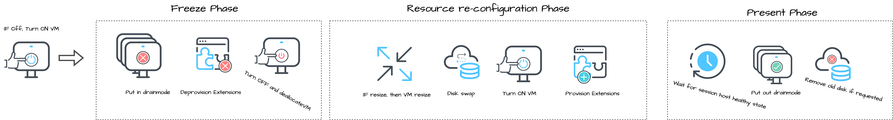
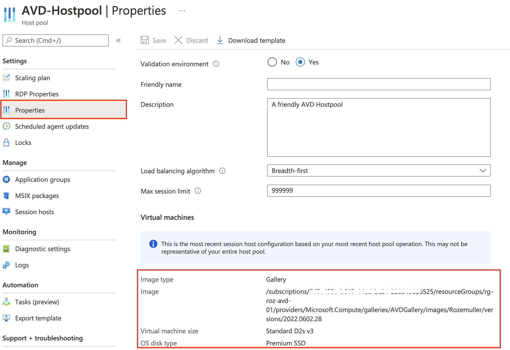

Recently Microsoft announced a new feature called AVD hostpool image update. In this blog, I explain how to configure this new feature in an automated way.



## Why use a (golden) image?

First, let’s talk about images. Because why should you use an image. Well, I could be short in that, you don’t want trouble. Often I see AVD environments without the back of the Azure Compute Gallery or managed images. If I ask why not using images, I got answers like there are just a few hosts, it is a cost thing, or too complex.

In fact, except for the cost thing, I can’t say people are not right. Yes if you have a few hosts it looks a bit overkill. And yes, if you are not that familiar with the image updating process (or updating manually(!)) it could be complex.  
But, regardless of the host count and process, you don’t want any problems in your production environment after the update. I understand, you always have to test. But (in place) updating hosts in a production environment isn’t just a good idea. And the fact you don’t have a way back of something is really broken.

So when having an AVD or W365 environment, using an image is recommended. Luckily, there are several options for using images. The [Azure Compute Gallery](https://docs.microsoft.com/en-us/azure/virtual-machines/azure-compute-gallery) and [managed image](https://docs.microsoft.com/en-us/azure/virtual-machines/windows/capture-image-resource) are the most common within a tenant. So let’s say one more time, use an image :).

In case you are not that familiar with image management, check this [document about setting up a golden image](https://docs.microsoft.com/en-us/azure/virtual-desktop/set-up-golden-image).

In addition to the golden image document above, I wrote a [blog about image management and how to automate](https://rozemuller.com/create-avd-image-version-based-on-existing-config-with-powershell/) it.

## About the scheduled host pool image update

After you have an image available it would be nice to update hosts with the new image. Previously, updating session hosts was a pretty extensive process.  
First, we have to add the new session hosts (to make sure everybody can still use AVD). Secondly, we enable drain-mode into the old session hosts. At last, when the old hosts are empty, we delete the old session hosts. Besides AVD, we also have the Azure AD pollution because of old session hosts, object ID issues, and double costs because of a double amount of session hosts (to avoid downtime).

Till today, Microsoft announced the public preview of scheduled host pool image updates.

Host pool image Update is an IT administrator feature for **pooled** host pools. It enables the admin to update the current OS image of all the VMs in a pooled host pool to a new image (version).

Source: Microsoft

### Permissions

To use the host pool image update feature permissions must be set on the Windows Virtual Desktop application. Setting the correct permissions is simple by adding the 
If you have all resources in one resource group the custom IAM role should be configured at the resource group level. Otherwise, the role must be set at the subscription level.

The resources are:

- AVD Host pool
- Session hosts (the virtual machines)
- The image or Azure Compute Gallery where the image is in
- Azure Key vault

### Extra features

In addition to updating the image, you can also change the size and/or change the OS disk type of the VMs in a pooled host pool using Host Pool Image Update. Any changes to the image, VM size, and/or OS disk type made in the image update flow will be applied to the entire host pool.

Azure properties of the VMs (availability options, network, and security options) assigned while creating the host pool or while adding the VMs will be persisted after the host pool image update concludes. OS properties of the VMs will be lost unless they are a part of the new image being applied to the host pool.

The OU Path and domain name need to stay the same as they were during host pool creation. All session hosts in the host pool after the image update will have the same image, OS disk type, VM size, join type, domain, and local administrator credentials. The host pool to be updated can be updated with Active Directory domain join type or Azure Active Directory join type based on how the host pool was created.

## How does it work?

I did a lot of testing, digging, and talking with Microsoft about what is going on in the background. In the upcoming paragraph, we look into the backend process and how all data is related. In the drawing below I show the process.


The backend operations that take place during the image update process can be found below. We will provide visibility to the session host-level states via Log Analytics. That may or may not include operation-level details.

On existing VM:

- Switch VM ON  
- Deprovision VM DSC Extension  
- Deprovision VM Domain Join Extension  
- Deallocate VM

Slightly behind the scenes we:

- Provision Temp VM NIC  
- Provision Temp VM and attach temp NIC  
- Provision OS etc as defined in the deployment  
- Poll for Agent VM Available  
- Delete Temp VM & NIC

On the original VM:

- Swap Disk built on Temp VM – update SKU  
- Start VM  
- Provision Domain Join Extension  
- Delete Domain Join Extension  
- Provision Agent  
- Deprovision DSC Extension  
- Wait for Session Host Healthy status  
- Cleanup Old Disks if requested

### Host pool update configuration

When scheduling a host pool image update in the portal, you can select an image and change the session host size. In the case of a Compute Gallery, you can select the correct gallery. In the most common situations, the portal gives you all the options you need. From an automation perspective, you just want to schedule a new update. So, where is the image update and session host size information stored?

When updating the host pool the image selection looks like this:

PICTURE

What does the configuration look like at the back? The information is stored in the portal at the host pool properties. Currently, this information is not editable in the portal.



## Configure host pool image update automated

To configure the host pool image update automated, I use [the Az.Avd PowerShell module](https://www.powershellgallery.com/packages/Az.Avd/).  
To install the Az.Avd PowerShell module, use the commands below.

```powershell
Install-Module -Name Az.Avd
Import-Module -Name Az.Avd
```

## Revert to the previous version

Good testing is key, but sometimes you have to revert to a previous version. I did some tests with revert and can tell this is working.

To get this working, you have to use PowerShell.

## Final words

### Requirements and limits

To start with this cool new feature it is good to know what are the requirements and limits of this feature.

- Requirement: Currently, you must create a custom RBAC role in your subscription. (How to create the necessary RBAC role automated and assign it to the correct subscription is discussed below)
- Limit: The feature is only supported on the AVD based on ARM templates
- Limit: The feature is only available in the Azure public cloud
- Limit: The feature can only be used at pooled host pools that have session hosts at the same resource group
- Limit: The destination image needs to be a gallery image (this is an image managed by Mircosoft), a platform image (Azure Compute Gallery), or a managed image
- Limit: Manually joined Session hosts are not considered for the image update

The farthest date that the image update can be scheduled is 2 weeks from today’s date

### Keep in mind

- To minimize downtime, the host pool image update operation is recommended should be planned during non-business hours/weekends
- If you have enabled Autoscale on your host pool, you will need to disable it for your host pool image update to be kicked off. It needs to stay off until the host pool image update is complete or else the update will fail with a run time error.
- Leave the session hosts at the host pool while the image update is ongoing. Doing so may create issues with the ongoing update.
- Leave the drain mode of any VMs in the host pool while an image update is ongoing. The update service automatically changes the drain mode of the VMs based on which stage of the update it is in. Note that if a session host is not recoverable after an update, its drain mode setting will be enabled. Once the update is complete, the drain mode is reset for the session hosts.
- Only 1 image update can be scheduled or kicked off.
- There could be any number of host pool updates across the subscription or tenant happening concurrently. However, keep in mind that more than 1 update at a time will consume resources and may cause update failures. The best practice is to only have 1 running update at a time to prevent running out of Azure usage quota.
- The approximate time taken for each session host to be updated to a new image is around 25 minutes. Depending on the specified batch size (customer admin specified # of session hosts to be updated concurrently), the time can roughly be calculated by:

Update time = (host pool size ÷ batch size) \* 25 minutes

This is not an exact end-to-end update time. The update process takes time to ensure that session hosts are back online in a healthy state before declaring the update successfully completed.

I hope you got a bit inspired.

Enjoy your day and happy automating 👋