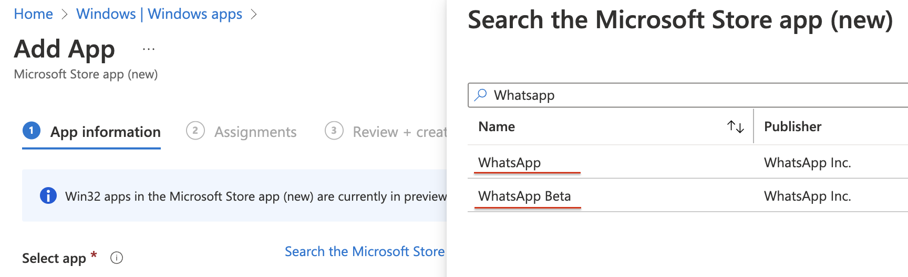
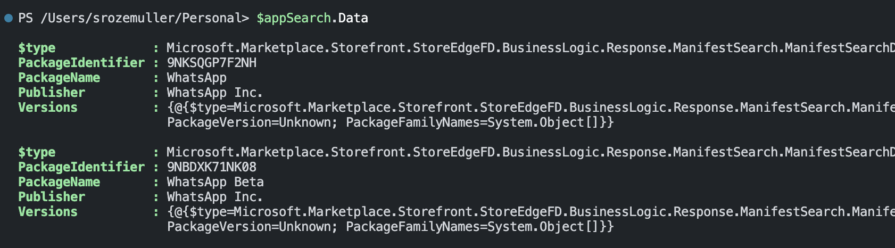
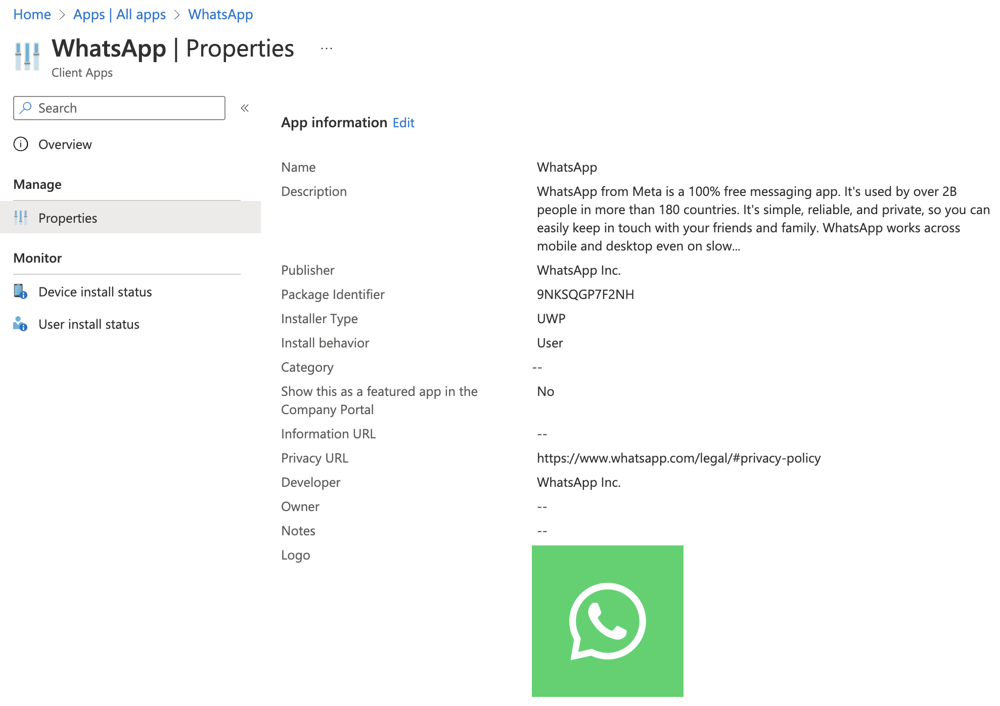

In the week of November 28, 2022, Microsoft released the new Microsoft Store which is implemented in Intune using the Windows Packager Manager. This is because the Microsoft Store for Business will be deprecated in the first quarter of 2023.  
It is a great feature that helps distribute applications in a very simple way. 

You can find the announcement [here](https://techcommunity.microsoft.com/t5/microsoft-mechanics-blog/updates-to-windows-app-management-in-intune-with-winget/ba-p/3685406).

In this blog post, I show how to create these store apps in Intune in an automated way. I show how to get the correct application from the store and configure the Windows Store App into Intune. 



## Search applications in Microsoft Store
The first step is searching for the application in the Microsoft Store.  When using the portal start typing the application name. Every result that contains your search show up in the results. 

There is no exact match search option available. In the case of automation, we need an exact match to make sure the specified application will be installed. 

In the example below, I install WhatsApp on every device. To search in the Microsoft store, I use the API below. 
Microsoft Store for Endpoints API URL: https://storeedgefd.dsx.mp.microsoft.com

```powershell
$appName = "WhatsApp"
$storeSearchUrl = "https://storeedgefd.dsx.mp.microsoft.com/v9.0/manifestSearch"
$body = @{
    Query = @{
        KeyWord   = $appName
        MatchType = "Substring"
    }
} | ConvertTo-Json
$appSearch = Invoke-RestMethod -Uri $storeSearchUrl -Method POST -ContentType 'application/json' -body $body
```

After searching, I got the results below. WhatsApp and WhatsApp Beta, in my case I want to install the WhatsApp application.


In the code, we see the same. 


To make sure the correct application is installed, I search for the exact match based on the application name I provided. 

```powershell
$exactApp = $appSearch.Data | Where-Object { $_.PackageName -eq $appName }
```
### Get the application details from Microsoft Store
In the Microsoft Store, every application has a unique ID. The identifier is the ID we need in the next steps. 
Before adding the application to Intune, we need more information. Based on the identifier a next search is needed. The next search is searching for the application details. 

To get the application details from the Microsoft Store with code I used the PowerShell code below. To get package details, I use this Microsoft Store API URL: https://storeedgefd.dsx.mp.microsoft.com/v9.0/packageManifests/{id}.  

```powershell
$appUrl = "https://storeedgefd.dsx.mp.microsoft.com/v9.0/packageManifests/{0}" -f $exactApp.PackageIdentifier
$app = Invoke-RestMethod -Uri $appUrl -Method GET 
$appId = $app.Data.PackageIdentifier
$appInfo = $app.Data.Versions[-1].DefaultLocale
$appInstaller = $app.Data.Versions[-1].Installers
```
To make sure I get the latest version, I use the ```[-1]``` selector behind the versions-object.

### Get Windows Store application icon URL
A second request is needed to the Microsoft store to get an icon URL. This time I use the 'normal' store URL. Unfortunately, the endpoint store does not return an icon URL. In the 'normal' store the installation scope is not returned, so I need both. 


In the code below I request the specific application, with the ID again. Thereafter, I download the image to a temporary location, convert it to a hashed string and sent the output in the deploy body. 
```powershell
$imageUrl = "https://apps.microsoft.com/store/api/ProductsDetails/GetProductDetailsById/{0}?hl=en-US&gl=US" -f $exactApp.PackageIdentifier
$test = Invoke-RestMethod -Uri $imageUrl -Method GET 
$test
$wc = New-Object System.Net.WebClient
$wc.DownloadFile($test.IconUrl, "./temp.jpg")
$base64string = [Convert]::ToBase64String([IO.File]::ReadAllBytes('./temp.jpg'))
```

## Deploy Windows Store application in Intune automated with icon
We have all the needed details to create a valid request. In the request below I deploy the application in Intune first.  
As you can see there is a new type available called ```#microsoft.graph.winGetApp```. Using this type gives options to provide Microsoft Store application details in the deployment. 

To authenticate please check this part of my other blog: https://www.rozemuller.com/intune-filters-explained-and-create-automated/#authentication

Give your app the correct permissions: *```DeviceManagementApps.ReadWrite.All```*

The body isn't very hard. The only thing I noticed is the ```installExperience```. 

```powershell
$deployUrl = "https://graph.microsoft.com/beta/deviceAppManagement/mobileApps"
$appBody = @{
    '@odata.type'         = "#microsoft.graph.winGetApp"
    description           = $appInfo.ShortDescription
    developer             = $appInfo.Publisher
    displayName           = $appInfo.packageName
    informationUrl        = $appInfo.PublisherSupportUrl
    largeIcon             = @{
        "@odata.type"= "#microsoft.graph.mimeContent"
        type = "String"
        value = $base64string 
    }
    installExperience     = @{
        runAsAccount = $appInstaller.scope
    }
    isFeatured            = $false
    packageIdentifier     = $appId
    privacyInformationUrl = $appInfo.PrivacyUrl
    publisher             = $appInfo.publisher
    repositoryType        = "microsoftStore"
    roleScopeTagIds       = @()
} | ConvertTo-Json 
$appDeploy = Invoke-RestMethod -uri $deployUrl -Method POST -Headers $authHeader -Body $appBody
```

Make sure you use the correct scope (user / system). Using the wrong scope results in an error like below.


*Your app is not ready yet. If app content is uploading, wait for it to finish. If app content is not uploading, try creating the app again.*

### Assign Windows Store application
The last step assigning the application to users or devices. To assign the Windows Store application to all devices, for example, I used the code below.
Also in this body, there is a new type called ```microsoft.graph.winGetAppAssignmentSettings```
```powershell
$assignUrl = "https://graph.microsoft.com/beta/deviceAppManagement/mobileApps/{0}/assign" -f $appDeploy.Id
$assignBody = 
@{
    mobileAppAssignments = @(
        @{
            "@odata.type" = "#microsoft.graph.mobileAppAssignment"
            target        = @{
                "@odata.type" = "#microsoft.graph.allDevicesAssignmentTarget"
            }
            intent        = "Required"
            settings      = @{
                "@odata.type"       = "#microsoft.graph.winGetAppAssignmentSettings"
                notifications       = "showAll"
                installTimeSettings = $null
                restartSettings     = $null
            }
        }
    )
} | ConvertTo-Json -Depth 8
Invoke-RestMethod -uri $assignUrl -Method POST -Headers $authHeader -ContentType 'application/json' -body $assignBody
```

In the end, the Windows Store application is deployed including assignment and an icon in an automated way. 


If you want more underlying information in detail you should check Peter Klapwijk his post. You can check it here: https://www.inthecloud247.com/new-microsoft-store-integrated-in-intune/
