

A few days ago a question reached me about creating Win32Lob applications including the ```intunewin``` file upload using the REST API. The ```create``` Win32Lob Graph API has no object available to store a file in, and [the documentation](https://learn.microsoft.com/en-us/graph/api/intune-apps-win32lobapp-create?view=graph-rest-beta) doesn't explain how to upload files while creating Win32Lob applications automated.   
That decided me to look into the file upload process and write this blog. 

Check the question and responses below :point_down:



## Create Win32LOB App portal process
The reason why there is no file placeholder available in the Graph API is because of the application creation process has multiple phases.  
The file upload process is a separate process for example. There is no direct connection to the application creation process. During the process, there is a breakout to an Azure Storage blob container.   

### Create Win32LOB App in Intune
In the screenshot below, I created a test Win32 app in the portal. I filled in the required fields where the screenshot shows the last page just before deployment. 

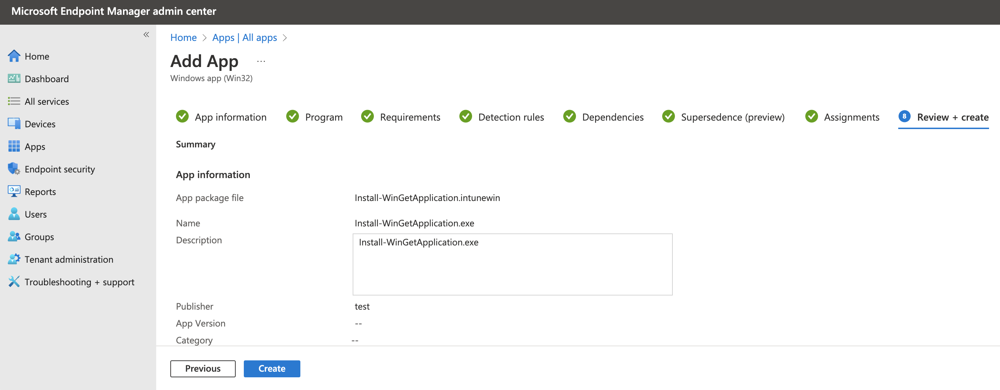

After hitting the create button the process starts. At the backend, when looking into the browser's development, you will see the Win32 app is created **without** a file upload. 

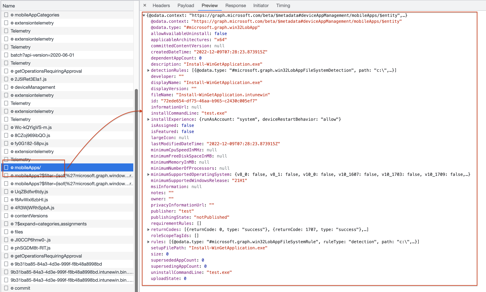

### Request intunewin file version 

When the application deployment is finished, there is a response with the application ID. Based on the ID, the backend searches for the application you have just created.  
From that point, The first step is requesting a version number. The response is a version ID.  
In the case of a new application, the version ID is 1. 

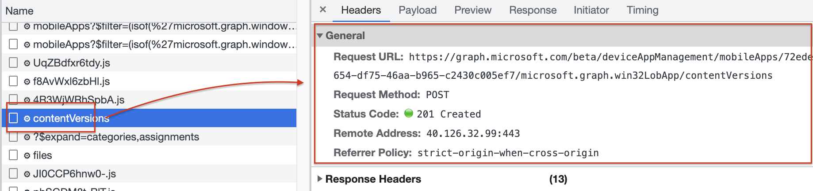

With the version, a file placeholder is created with file metadata.  
Meta data like the file's name and size. In the placeholder creation background, a place is created on Azure storage. 

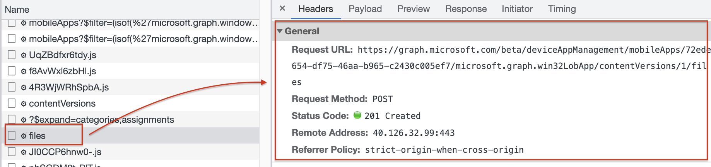
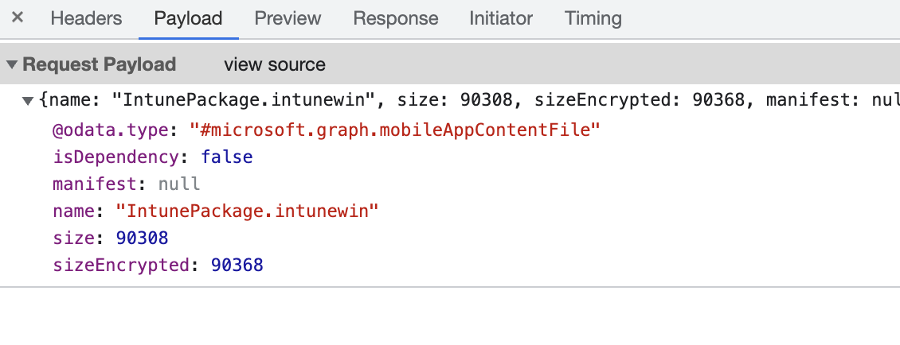

When the placeholder is created, a response is returned with an ID that represents the placeholder on the Azure storage location. Creating the Azure storage location can take a while. While waiting the browser requests the ID till the moment the storage location URL is returned.

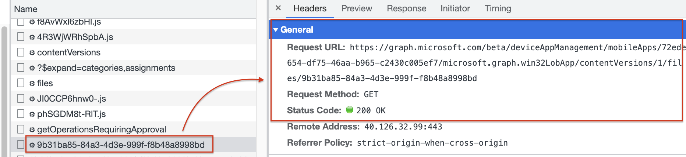
After a small minute, the storage location is present. 

### Upload and commit intunewin file to Azure Storage Blob
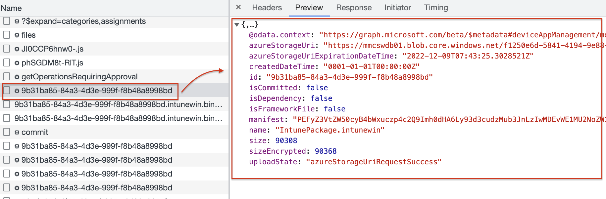 

In the next step, the process takes the file and reads all file bytes in memory, and uses the blob placeholder information to stage the data. This is where the actual upload process starts.

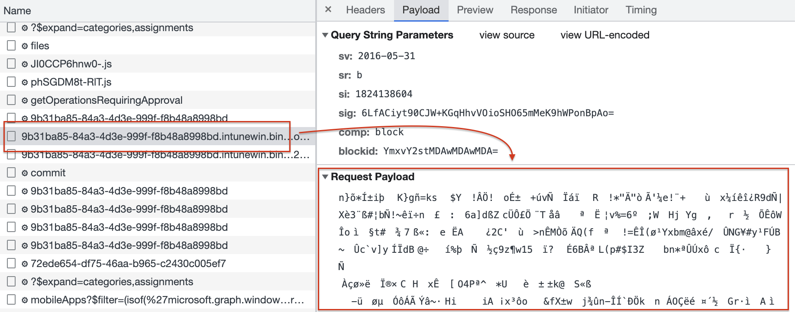

When the file is read, the last step is to commit the staged file to the blob storage. In the commit phase, you see the request URL has the application ID (ID in Intune), the file version (which is 1 at the initial application creation), and the response ID (ID on the Azure Blob Storage).  

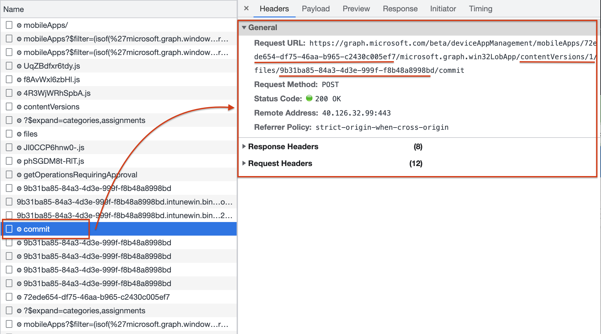

In the next few requests, the browser waits till the commit status has been completed successfully by sending a GET request.
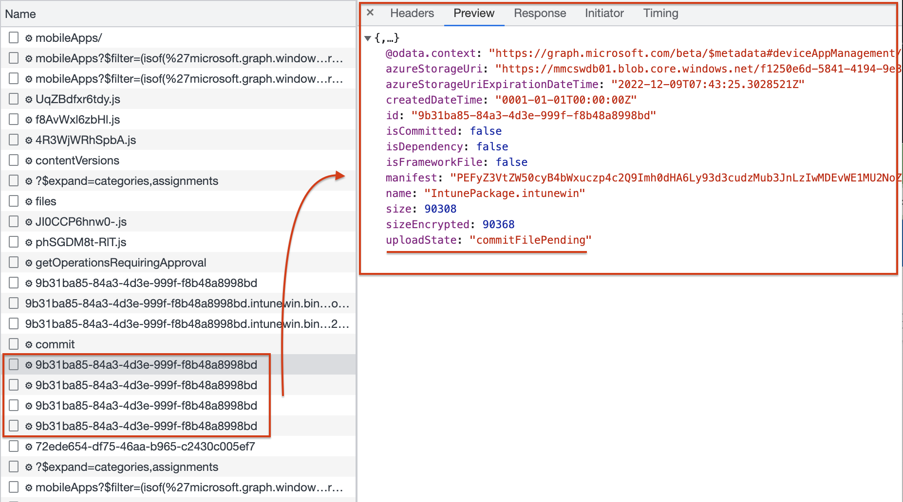

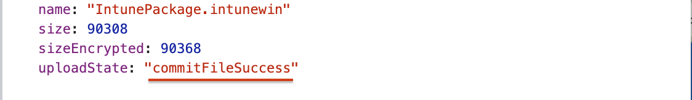


## Create Win32LOB App in automation
Ok, now we know what phases we have, and multiple tasks are executed to create Win32LOB applications in Intune. In the next part of this blog, let's take a look at how these steps look in the automation world.   
*To keep the post readable and as short as possible, I only show the happy flow*

### Create Win32LOB App in Intune automated
The first step is creating the Win32LOB App in Intune. In this step, only the application is created with no file attached. To create a Win32LOB file in Intune automated with the REST API, I used the code below. The body is a JSON-formatted body with the application details. 

```powershell
$win32LobBody = @"
{
        "@odata.type": "#microsoft.graph.win32LobApp",
        "applicableArchitectures": "x64",
        "allowAvailableUninstall": false,
        "categories": [],
        "description": "Install-WinGetApplication.exe",
        "developer": "",
        "displayName": "Install-WinGetApplication.exe",
        "displayVersion": "",
        "fileName": "Install-WinGetApplication.intunewin",
        "installCommandLine": "test.exe",
        "installExperience": {
            "deviceRestartBehavior": "allow",
            "runAsAccount": "system"
        },
        "informationUrl": "",
        "isFeatured": false,
        "roleScopeTagIds": [],
        "notes": "",
        "minimumSupportedWindowsRelease": "21H1",
        "msiInformation": null,
        "owner": "",
        "privacyInformationUrl": "",
        "publisher": "test",
        "returnCodes": [
            {
                "returnCode": 0,
                "type": "success"
            },
            {
                "returnCode": 1707,
                "type": "success"
            },
            {
                "returnCode": 3010,
                "type": "softReboot"
            },
            {
                "returnCode": 1641,
                "type": "hardReboot"
            },
            {
                "returnCode": 1618,
                "type": "retry"
            }
        ],
        "rules": [
            {
                "@odata.type": "#microsoft.graph.win32LobAppFileSystemRule",
                "ruleType": "detection",
                "operator": "notConfigured",
                "check32BitOn64System": false,
                "operationType": "exists",
                "comparisonValue": null,
                "fileOrFolderName": "test.exe",
                "path": "c:\\"
            }
        ],
        "runAs32Bit": false,
        "setupFilePath": "Install-WinGetApplication.exe",
        "uninstallCommandLine": "test.exe"
}
"@
$win32LobUrl = "https://graph.microsoft.com/beta/deviceAppManagement/mobileApps"
$win32LobApp = Invoke-RestMethod -Uri $win32LobUrl -Body $win32LobBody -Headers $authHeader -Method Post -ContentType 'application/json'
```

I stored the deployment output in the ```$win32LobApp``` variable. In the variable the Intune application ID is stored which is needed in the next phase. 

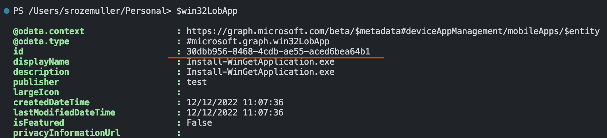

### Request intunewin file version
The application is created and we have an Intune application ID. Now it is time to create a file placeholder on the Azure Storage. 

```powershell
$Win32LobVersionUrl = "https://graph.microsoft.com/beta/deviceAppManagement/mobileApps/{0}/microsoft.graph.win32LobApp/contentVersions" -f $win32LobApp.id
$win32LobAppVersionRequest = Invoke-RestMethod -Uri $Win32LobVersionUrl -Method "POST" -Body "{}" -Headers $authHeader
$win32LobAppVersionRequest
```

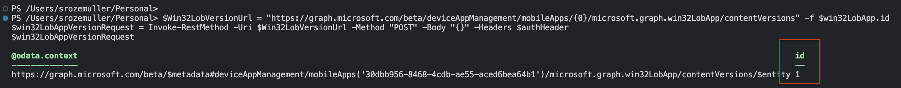

It doesn't matter how often you request a version, the version ID remains the same till the commit phase was successful.

### Create place holder for intunewin file version automated
This is the part where it becomes more complex and the first time we pick up the intunewin file. To create a placeholder, we need file information like the name and the size. This is called the metadata. 
To get the file information I used the code below.

I search the intunewin file and open it. An intunewin file has a detection.xml inside that holds the needed information. After reading the application information, we close the file to save memory.

```powershell
$filePath = (Get-childItem './Install-WinGetApplication.intunewin').FullName
$IntuneWin32AppFile = [System.IO.Compression.ZipFile]::OpenRead($filePath) 
$DetectionXMLFile = $IntuneWin32AppFile.Entries | Where-Object { $_.Name -like "detection.xml" }
$FileStream = $DetectionXMLFile.Open()
$StreamReader = New-Object -TypeName "System.IO.StreamReader" -ArgumentList $FileStream -ErrorAction Stop
$DetectionXMLContent = [xml]($StreamReader.ReadToEnd())
$FileStream.Close()
$StreamReader.Close()
$IntuneWin32AppFile.Dispose()
```

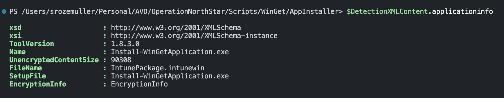

With the above-gathered information, I create a body with the needed information and send the request. 

```powershell
$Win32LobFileBody = [ordered]@{
    "@odata.type"   = "#microsoft.graph.mobileAppContentFile"
    "name"          = $DetectionXMLContent.ApplicationInfo.FileName
    "size"          = [int64]$DetectionXMLContent.ApplicationInfo.UnencryptedContentSize
    "sizeEncrypted" = (Get-Item -Path $filePath).Length
    "manifest"      = $null
    "isDependency"  = $false
} | ConvertTo-Json
$Win32LobFileUrl = "https://graph.microsoft.com/beta/deviceAppManagement/mobileApps/{0}/microsoft.graph.win32LobApp/contentVersions/{1}/files" -f $win32LobApp.id, $win32LobAppVersionRequest.id
$Win32LobPlaceHolder = Invoke-RestMethod -Uri $Win32LobFileUrl -Method "POST" -Body $Win32LobFileBody -Headers $authHeader
```
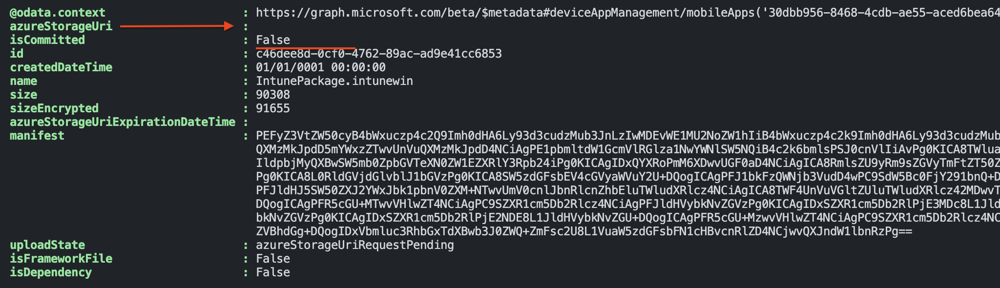
The screenshot above shows the first response. As you can see the request is pending under the ```uploadState```. Also, the ```isCommited``` object is False which means there is no file uploaded under the id yet.
The last thing is the azureStorageUri which is still empty. 

The code below checks, based on the placeholder ID, if the request is handled.
```powershell
$storageCheckUrl = "https://graph.microsoft.com/beta/deviceAppManagement/mobileApps/{0}/microsoft.graph.win32LobApp/contentVersions/{1}/files/{2}" -f $win32LobApp.id, $win32LobAppVersionRequest.id, $Win32LobPlaceHolder.id
$storageCheck =  Invoke-RestMethod -Uri $storageCheckUrl -Method "GET" -Headers $authHeader
$storageCheck
```
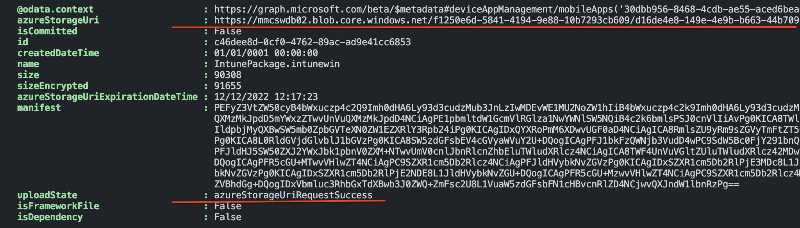

Now we have a placeholder to store the intunewin file at and start the real upload. 

**Attention: The storage URL location is temporary and has an expiration time, make sure the upload is done within the expiration time**

### Upload file to Win32 LOB App automated
Uploading files through the HTTP protocol needs some attention. I'm not going into deep but explaining the basics. To upload files through HTTP we need to slice the packages in pieces, this is called chunking.  
Chunked encoding is cutting data into smaller "blocks." Chunks are sent independently of one another, usually through a single persistent connection. The type is specified in the Transfer-Encoding header (in the first block).  
The receiver never sees the entire file (as it might not have been completely available in the first place — some examples being a server reading and sending a large file to a client, or generating a table of results from a database).

For more information about chunking check: https://bunny.net/academy/http/what-is-chunked-encoding/

The whole upload process has the following steps in basics:
- Extract intunewin file to an unencrypted file;
- Chunk extracted file;
- Upload the chunks;
- Commit the upload;
- Update the file version in the Intune application;

#### Extract Intunewin file
Before we can create chunks the file needs to be extracted in an unencrypted file. To extract the file the code below is needed.

```powershell
$Base64Key = $DetectionXMLContent.ApplicationInfo.EncryptionInfo.EncryptionKey
$Base64IV = $DetectionXMLContent.ApplicationInfo.EncryptionInfo.InitializationVector
$ExtractedIntuneWinFile = $FilePath + ".extracted"
$ZipFile = [System.IO.Compression.ZipFile]::OpenRead($FilePath)
#$IntuneWinFileName = Split-Path -Path $FilePath -Leaf
$IntuneWinFileName = $DetectionXMLContent.ApplicationInfo.FileName
$ZipFile.Entries | Where-Object { $_.Name -like $IntuneWinFileName } | ForEach-Object {
    [System.IO.Compression.ZipFileExtensions]::ExtractToFile($_, $ExtractedIntuneWinFile, $true)
}
$ZipFile.Dispose()
$Key = [System.Convert]::FromBase64String($Base64Key)
$IV = [System.Convert]::FromBase64String($Base64IV)
$TargetFilePath = $FilePath + ".decoded"
$TargetFilePathName = Split-Path -Path $TargetFilePath -Leaf
[System.IO.FileStream]$FileStreamTarget = [System.IO.File]::Open($TargetFilePath, [System.IO.FileMode]::Create, [System.IO.FileAccess]::ReadWrite, [System.IO.FileShare]::None)
$AES = [System.Security.Cryptography.Aes]::Create()
[System.Security.Cryptography.ICryptoTransform]$Decryptor = $AES.CreateDecryptor($Key, $IV)
[System.IO.FileStream]$FileStreamSource = [System.IO.File]::Open($ExtractedIntuneWinFile, [System.IO.FileMode]::Open, [System.IO.FileAccess]::Read, [System.IO.FileShare]::None)
$FileStreamSourceSeek = $FileStreamSource.Seek(48l, [System.IO.SeekOrigin]::Begin)
[System.Security.Cryptography.CryptoStream]$CryptoStream = New-Object -TypeName System.Security.Cryptography.CryptoStream -ArgumentList @($FileStreamTarget, $Decryptor, [System.Security.Cryptography.CryptoStreamMode]::Write) -ErrorAction Stop
$buffer = New-Object byte[](2097152)
while ($BytesRead = $FileStreamSource.Read($buffer, 0, 2097152)) {
    $CryptoStream.Write($buffer, 0, $BytesRead)
    $CryptoStream.Flush()
}
```


#### Calculate and create chunks
With the basics in mind, I use the code block below to create chunks and send every chunk to the Azure Storage Blob.
In the first part, I create 6MB chunks and calculate, based on the expanded file size, how many chunks there are. 

```powershell
$ChunkSizeInBytes = 1024l * 1024l * 6l;
$SASRenewalTimer = [System.Diagnostics.Stopwatch]::StartNew()
$FileSize = (Get-Item -Path $ExtractedIntuneWinFile).Length
$ChunkCount = [System.Math]::Ceiling($FileSize / $ChunkSizeInBytes)
$BinaryReader = New-Object -TypeName System.IO.BinaryReader([System.IO.File]::Open($FilePath, [System.IO.FileMode]::Open, [System.IO.FileAccess]::Read, [System.IO.FileShare]::ReadWrite))
```

In my case, the intunewin file is that small I only have one chunk.

#### Upload chunks
In the loop below, I create chunks and load the bytes into it. Thereafter, I send every chunk and corresponding bytes to the storage location. 
```powershell
$ChunkIDs = @()
for ($Chunk = 0; $Chunk -lt $ChunkCount; $Chunk++) {
    $ChunkID = [System.Convert]::ToBase64String([System.Text.Encoding]::ASCII.GetBytes($Chunk.ToString("0000")))
    $ChunkIDs += $ChunkID
    $Start = $Chunk * $ChunkSizeInBytes
    $Length = [System.Math]::Min($ChunkSizeInBytes, $FileSize - $Start)
    $Bytes = $BinaryReader.ReadBytes($Length)
    $CurrentChunk = $Chunk + 1

    $Uri = "{0}&comp=block&blockid={1}" -f $storageCheck.azureStorageUri, $ChunkID
    $ISOEncoding = [System.Text.Encoding]::GetEncoding("iso-8859-1")
    $EncodedBytes = $ISOEncoding.GetString($Bytes)
    $Headers = @{
        "x-ms-blob-type" = "BlockBlob"
        "content-type" = "text/plain; charset=iso-8859-1"
    }
    $UploadResponse = Invoke-WebRequest $Uri -Method "Put" -Headers $Headers -Body $EncodedBytes -UseBasicParsing -ErrorAction Stop
}
```
In the last step, I finalize the chunk list and send an XML list to the storage location.
```powershell 
$finalChunkUri = "{0}&comp=blocklist" -f $storageCheck.azureStorageUri
$XML = '<?xml version="1.0" encoding="utf-8"?><BlockList>'
foreach ($Chunk in $ChunkID) {
    $XML += "<Latest>$($Chunk)</Latest>"
}
$XML += '</BlockList>'

Invoke-RestMethod -Uri $finalChunkUri -Method "Put" -Body $XML -ErrorAction Stop -ContentType 'text/plain;charset=UTF-8'
$BinaryReader.Close()
$BinaryReader.Dispose()
```

#### Commit upload
The last step is to commit the chunks into the file at the storage location. To commit we head back to the XML content. In the XML content, we grab the encryption info. The encryption info is used to decrypt the file in the Intune environment.   

After creating, the encryption body is sent to the commit URL. This is the Azure Storage URL including the placeholder ID.
The API request does not give a response. 

```powershell
$Win32FileEncryptionInfo = @{
    "fileEncryptionInfo" = [ordered]@{
        "encryptionKey"        = $DetectionXMLContent.ApplicationInfo.EncryptionInfo.EncryptionKey
        "macKey"               = $DetectionXMLContent.ApplicationInfo.EncryptionInfo.macKey
        "initializationVector" = $DetectionXMLContent.ApplicationInfo.EncryptionInfo.initializationVector
        "mac"                  = $DetectionXMLContent.ApplicationInfo.EncryptionInfo.mac
        "profileIdentifier"    = $DetectionXMLContent.ApplicationInfo.EncryptionInfo.ProfileIdentifier
        "fileDigest"           = $DetectionXMLContent.ApplicationInfo.EncryptionInfo.fileDigest
        "fileDigestAlgorithm"  = $DetectionXMLContent.ApplicationInfo.EncryptionInfo.fileDigestAlgorithm
    }
} | ConvertTo-Json

$CommitResourceUri = "{0}/commit" -f $storageCheckUrl, $Win32LobPlaceHolder.id
Invoke-RestMethod -uri $CommitResourceUri -Method "POST" -Body $Win32FileEncryptionInfo -Headers $authHeader
```
After committing the file, I check the upload state. 
```powershell
$CommitStatus = Invoke-RestMethod -uri $storageCheckUrl  -Method GET -Headers $authHeader
$CommitStatus
```

#### Update file version
At last, the code below tells the application which version is committed. 

```powershell
$Win32AppCommitBody = [ordered]@{
    "@odata.type"             = "#microsoft.graph.win32LobApp"
    "committedContentVersion" = $win32LobAppVersionRequest.id
} | ConvertTo-Json
$Win32AppUrl = "{0}/{1}" -f $win32LobUrl, $win32LobApp.id
Invoke-RestMethod -uri $Win32AppUrl -Method "PATCH" -Body $Win32AppCommitBody -Headers $authHeader
```

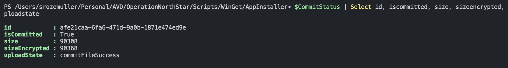

## Summary
In this blog post, I explained in basics how to update (intunewin) files with the Graph API. The whole process is quite complex and I showed the happy flow with small code blocks. There are no checks and the code is not very efficient. 
Luckily there is a good PowerShell module that has all the logic and intelligence to upload intunewin files with the Graph API.
I would recommend taking a look at Nicolaj Andersen's PowerShell module IntuneWin32App. See the GitHub project at: https://github.com/MSEndpointMgr/IntuneWin32App or in the PowerShell gallery at: https://www.powershellgallery.com/packages/IntuneWin32App/1.3.6


