Azure Virtual Desktop (AVD) Insights is a way to get sight into your AVD environment. In short (from Microsoft), Azure Virtual Desktop Insights is a dashboard built on Azure Monitor Workbooks that helps IT professionals understand their Azure Virtual Desktop environments. 

In this blog post, I show how to configure AVD Insights in an automated way using the [Az.Avd PowerShell module](https://www.powershellgallery.com/packages/Az.Avd/).   
The commands used in the blog post are available in the [v2.5.0-beta.32](https://github.com/srozemuller/AzAvd/releases/tag/v2.5.0-beta.32) and above.



## AVD and Insights
The Insights part is based on a Log Analytics workspace. To make sure all AVD parts store logs into Log Analytics, we need to store all needed information in a workspace. It is not necessary to store all logs in the same workspace. But it is recommended to store session host information in a separate workspace. But there is more, we also need insight information from the AVD session hosts. Insight information like Windows Events and Performance Counters.  

In the end, AVD Insights shows log information from different AVD components combined in a workbook. 

To make AVD Insights work, diagnostics settings must be set with mandatory logs. The Az.Avd module provides commands that help configure AVD Insights with all mandatory settings. 

The commands have an ```insights``` part in them. To check all the commands. use the command below.

```powershell
Get-Command -module Az.Avd *insights*
```

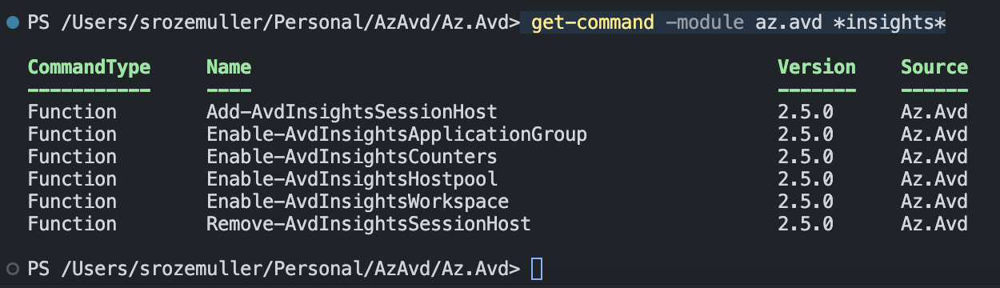

In the commands below, I refer to ```@avdParams``` parameter. 
```powershell
$avdParams = @{
    hostpoolName      = "Rozemuller-AAD"
    resourceGroupName = 'rg-roz-avd-01'
}
```

### Hostpool
The AVD toplevel component is a hostpool. This is the first component where to configure diagnostics settings in. 
AVD Insights at host pool level.

Assuming there is a Log Analytics Workspace already, I use the command below.

```powershell
Enable-AvdInsightsHostpool @avdParams -LAWorkspace 'log-analytics-avd-89608' -LaResourceGroupName 'rg-roz-avd-mon' -DiagnosticsName 'avdInsights' -Verbose
```

If you don't have a Log Analytics workspace yet, use the ```-autocreate``` flag and provide also the ```LaLocation``` and ```RetentionInDays``` parameters. The default SKU is standard. If you like to change it, then also provide the ```LaSku``` parameter.

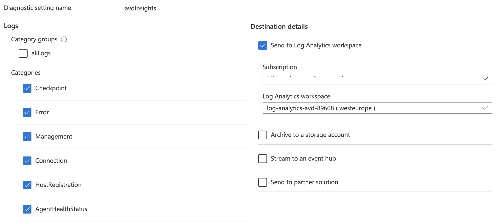

### Application Group
The next level is the application group. Other categories apply to this setting. The command configures every application group in a host pool. Just provide the host pool details.

```powershell
Enable-AvdInsightsApplicationGroup @avdParams -LAWorkspace 'log-analytics-avd-89608' -LaResourceGroupName 'rg-roz-avd-mon' -DiagnosticsName 'avdInsights' -Verbose
```

If you just want a specific application group enabled, then provide the ```ApplicationGroupName``` and ```ApplicationResourceGroup``` instead of the host pool details.

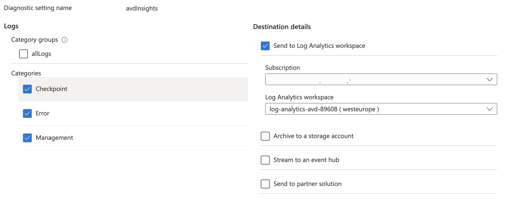

### Workspace
The last main AVD component is the workspace. To configure workspace insights use the code below.
Also, this command is based on a host pool.

```powershell
Enable-AvdInsightsWorkspace @avdParams -LAWorkspace 'log-analytics-avd-89608' -LaResourceGroupName 'rg-roz-avd-mon' -DiagnosticsName 'AVDInsights' -Verbose
```

If you want to enable Insights for a specific workspace, replace the host pool values with ```WorkspaceName``` and ```WorkspaceResourceGroup```.

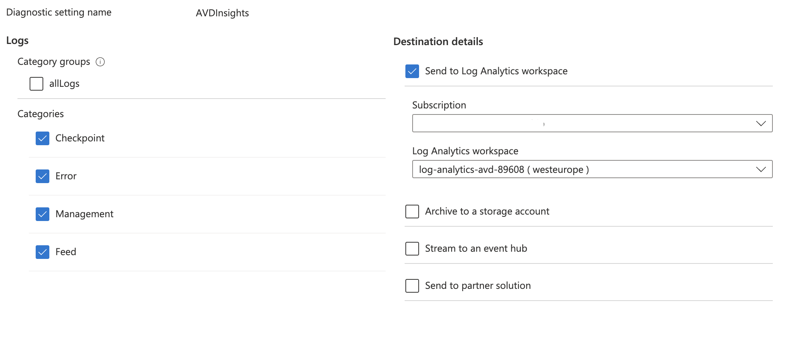

## Session hosts
AVD session hosts are Windows Clients. To get all the needed information from these clients we need to configure the session hosts to send logs to a Log Analytics workspace.   
To send logs, the ```OMSExtenstion``` extension is needed. The command below installs the extension.

```powershell
Add-AvdInsightsSessionHost -id $id -WorkSpaceId $workspaceResourceId
```

The ```$id``` is the session host's resource ID. You can get the ID using the ```Get-AvdSessionHost``` or ```Get-AvdSessionHostResources```.

If hosts are missing you will see a screen like below.

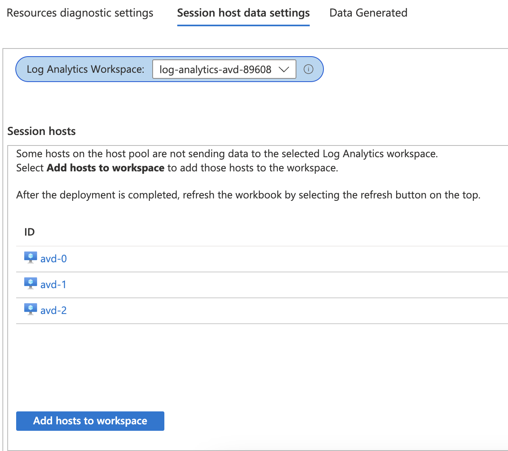


### Performance Counters and Events
In the last step, we configure the needed Windows Performance Counters and Events as sources in the Log Analytics workspace to capture. 

```powershell
Enable-AvdInsightsCounters -Id $resourceId -Verbose
```
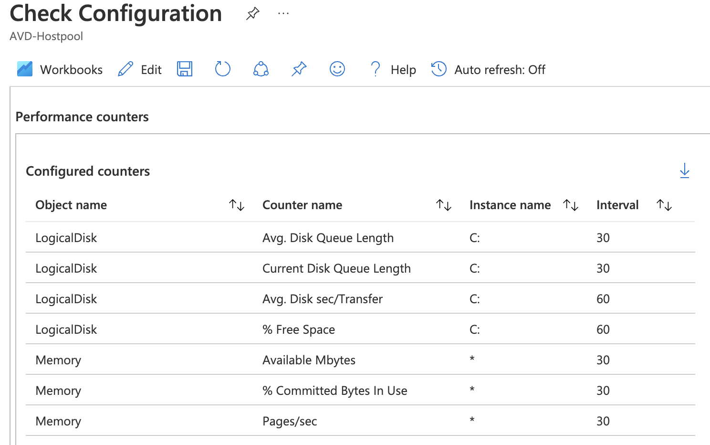

## Verify
When all is configured correctly, you don't see errors like the error below in the main Insights blade.
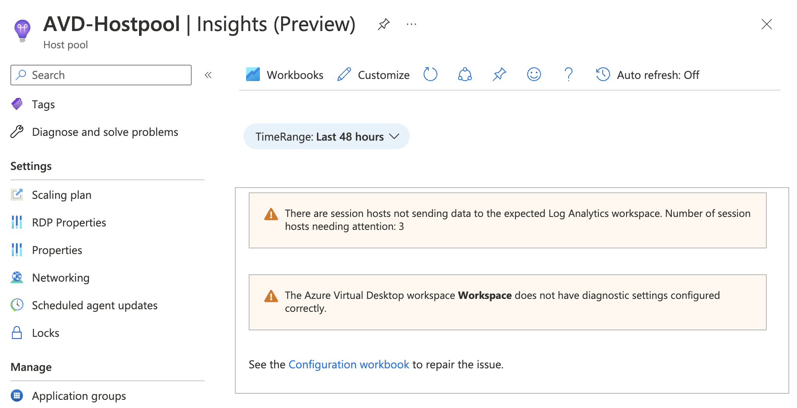

When looking into Insights (under Configuration Workbook) you will notice all checkmarks are green.

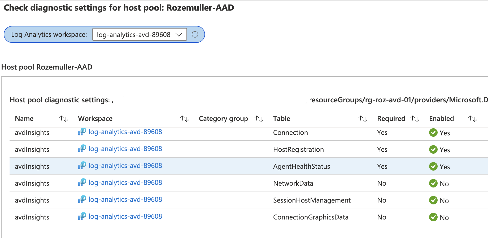

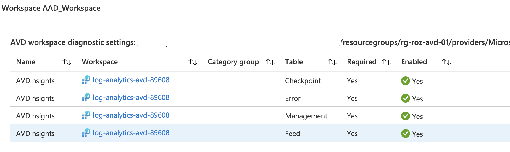

Under the session host tab, no session hosts are listed. In the screen below, I 'forgot' one.

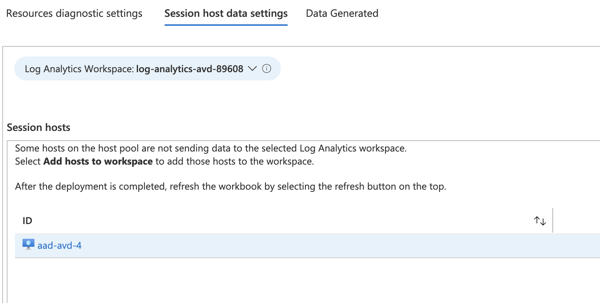

Also, no counters and events are missing.

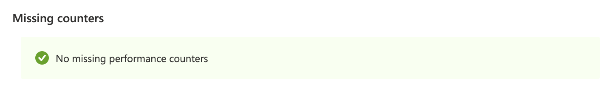
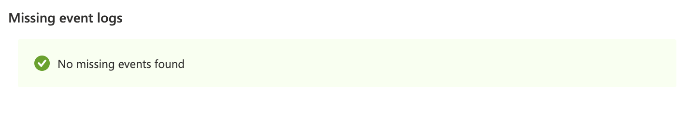

### Data captured
At last, after some time, also there is data captured. I shot some of the graphs to show.

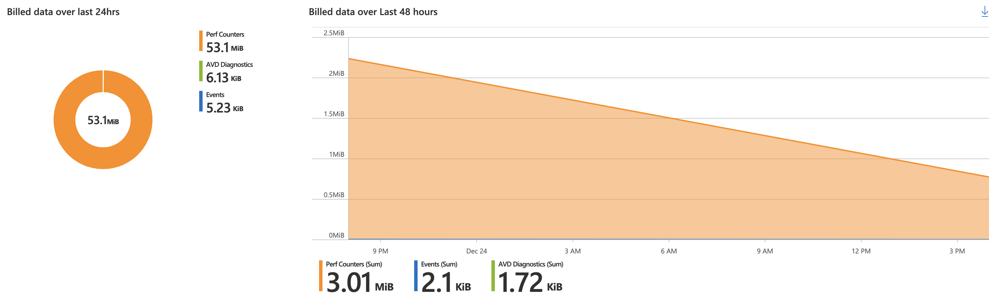

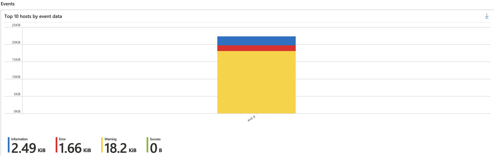

For more information about AVD Insights, check the documentation at Microsoft Docs: https://learn.microsoft.com/en-us/azure/virtual-desktop/insights

