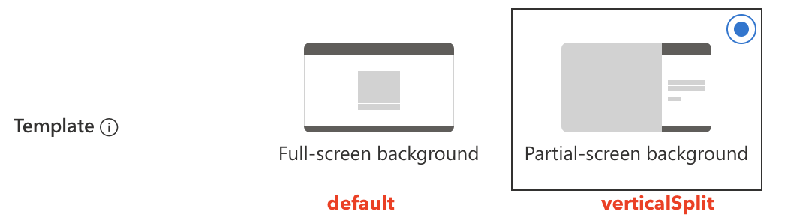

Recently Microsoft redesigned the company branding functionality. That means you have more flexibility in the main layout, full-screen background image for example. But also the ability to change the header, footer and even link relating to self-service password reset, privacy & cookies or Terms of Use. 
Also, there is an option to upload a CSS style sheet to change colors, buttons, and more. 

In this blog, I show how to configure company branding in an automated way. When automated, you can do some cool things like changing style to light or dark on specific hours. 

You can read the official article here: https://techcommunity.microsoft.com/t5/microsoft-entra-azure-ad-blog/introducing-enhanced-company-branding-for-sign-in-experiences-in/bc-p/3701590/highlight/true



## Company Branding
When users sign in to https://login.microsoft.com, https://portal.azure.com, or own build applications with an Azure AD identity provider, the default Microsoft sign-in screen shows up like below.


The company branding feature allows you to give users a nice sign-in experience that matches the corporate identity of your company. I created a simple light theme and did a small modification on the button which is shown in the screenshot below. 


In the upcoming chapters, I show how to modify the company branding configuration in an automated way. 

## To CSS or not to CSS
The company branding feature consists of two main parts, in my opinion, CSS and not CSS. At least, that's what I thought in the beginning.
During my tests, I stored all configurable items in a CSS style sheet. Items like colors, font sizes, shadows, link colors, the background image, etc in the CSS file. 


The main idea was to create two style sheets, a light and a dark mode style. I stored the backgrounds on a public location (GitHub) and the background is loaded with the CSS code below in the ```.ext-background-image``` object.

```css
 background: url('https://github.com/urltotheimage.jpg');
```
After some tries, I noticed the color settings, font sizes etc are working as expected. But setting a background also from the CSS file isn't working quite well. The background image isn't responsive for example. 

In the end, I noticed I need both components to get the full benefit. 

As described above I stored items like link colors, font sizes and button preferences in the CSS file.

```css
a:link
{
    /* Styles for links */
    color: grey;
}
.ext-sign-in-box
{
    /* Styles for the sign in box container */
    opacity: 90%;
}
.ext-button.ext-primary
{
    /* Styles for primary buttons */
    display: flex;
    flex-direction: column;
    align-items: center;
    padding: 6px 14px;
    border-radius: 0px;
    border: none;
    background: #ccc;
    box-shadow: 0px 0.5px 1px rgba(0, 0, 0, 0.1), inset 0px 0.5px 0.5px rgba(255, 255, 255, 0.5), 0px 0px 0px 0.5px rgba(0, 0, 0, 0.12);
    color: #222;
    user-select: none;
    -webkit-user-select: none;
    touch-action: manipulation;
}
```
Mircosoft provides a predefined CSS stylesheet with all configurable items. This file can be downloaded from this page: https://learn.microsoft.com/en-us/azure/active-directory/fundamentals/how-to-customize-branding#layout 
(See custom CSS item).  


### Not to CSS
So, I removed the background image from the CSS file and used the background image placeholder under the basis tab.


Currently, only the predefined items in the CSS file are configurable with CSS. All other needs to be configured using the placeholders. (Layout for example)  


## Configure Company Branding automated
To configure company branding in an automated way, I split the process into three parts.
- Configure settings like layout type or link configuration; These are predefined items on Microsoft's site
- Image upload;
- CSS upload;

The reason why I separated the upload process has to do with the content and the request header. (Will explain below).

### Authentication
Several options are available to authenticate. You can use the client-secret method with ```Organization.ReadWrite.All``` permission. 
I use the ```Connect-AzAccount``` command with a user account that has Contributor permissions. Because Azure AD also works with Azure Roles I don't need a client/secret with Graph API permissions. 

```powershell
$context = [Microsoft.Azure.Commands.Common.Authentication.Abstractions.AzureRmProfileProvider]::Instance.Profile.DefaultContext
$token = [Microsoft.Azure.Commands.Common.Authentication.AzureSession]::Instance.AuthenticationFactory.Authenticate($context.Account, $context.Environment, $context.Tenant.Id.ToString(), $null, [Microsoft.Azure.Commands.Common.Authentication.ShowDialog]::Never, $null, $resource).AccessToken
$authHeader = @{
    Authorization  = 'Bearer ' + $token
}
$tenantId = $context.tenant.id
```

### Configure predefined settings
These predefined settings have to do with all that is shown (hide/unhide) or specific texts. These items are all behind the ```/organization/{tenantId}/branding``` Graph API endpoint. I sent the body below to this endpoint.

```powershell
$brandingBody = @{
    "backgroundColor" = $null
    "customAccountResetCredentialsUrl" = $null
    "customCannotAccessYourAccountText" = $null
    "customCannotAccessYourAccountUrl" = $null
    "customForgotMyPasswordText" = $null
    "customPrivacyAndCookiesText" = $null
    "customPrivacyAndCookiesUrl" = $null
    "customResetItNowText" = $null
    "customTermsOfUseText" = $null
    "customTermsOfUseUrl" = "https://rozemuller.com"
    "headerBackgroundColor" = $null
    "signInPageText" = "Hello!"
    "usernameHintText" = $null
    "loginPageTextVisibilitySettings" = @{
        "hideCannotAccessYourAccount" = $null
        "hideAccountResetCredentials" = $false
        "hideTermsOfUse" = $false
        "hidePrivacyAndCookies" = $false
        "hideForgotMyPassword" = $null
        "hideResetItNow" = $null
    }
    "contentCustomization" = @{
        "adminConsentRelativeUrl" = $null
        "attributeCollectionRelativeUrl" = $null
        "registrationCampaignRelativeUrl" = $null
        "conditionalAccessRelativeUrl" = $null
        "adminConsent" = @()
        "attributeCollection" = @()
        "registrationCampaign" = @()
        "conditionalAccess" = @()
    }
    "loginPageLayoutConfiguration" = @{
        "layoutTemplateType" = "default"
        "isHeaderShown" = $false
        "isFooterShown" = $true
    }
} | ConvertTo-Json
$brandingUrl = "https://graph.microsoft.com/beta/organization/{0}/branding/" -f $tenantId
Invoke-RestMethod -uri $brandingUrl -Headers $authHeader -Method PATCH -body $brandingBody -ContentType 'application/json'
```
Make a note about the Content-Type ```application/json```. The Content-Type will change in later steps.  

The layout template types have two options: ```default``` and ```verticalSplit```.


The basics are set.

### Upload images
For the image part, we need several Graph API endpoints. Every image has a specific endpoint but works all the same in the end. 
In an earlier post, I explained [how the intunewinfile upload process works in automation](https://www.rozemuller.com/win32lob-intunewin-file-upload-process-explained-for-automation/).  
In this post, the file upload process works almost the same.  

I read the file and file size. Then I read the file and encode all bytes. The encoded bytes are sent to the Graph API endpoint. Encoding image files with PowerShell to send to the Graph API can be done with the code below. 


```powershell
$imagePath = Get-Item 'pathToImageFile.jpeg/png'
$fileSize = (Get-Item -Path $imagePath).Length
$BinaryReader = New-Object -TypeName System.IO.BinaryReader([System.IO.File]::Open($imagePath, [System.IO.FileMode]::Open, [System.IO.FileAccess]::Read, [System.IO.FileShare]::ReadWrite))
$bytes = $BinaryReader.ReadBytes($fileSize)
$isoEncoding = [System.Text.Encoding]::GetEncoding("iso-8859-1")
$encodedBytes = $isoEncoding.GetString($bytes)
```
I repeat this process for every image.

In the next step, I sent the encoded bytes to the Graph API.  
This time I use the ```image/*``` content type. This tells the request I'm sending an image.  (In the example below I sent the background image)

```powershell
$imageUrl = "https://graph.microsoft.com/beta/organization/{0}/branding/localizations/0/backgroundImage" -f $tenantId
Invoke-RestMethod -uri $imageUrl -Headers $authHeader -Method PUT -body $encodedBytes -ContentType 'image/*'
```

The following Graph API company branding image endpoints are available:

| Purpose     |Graph API Endpoint|
|-------------|---------|
| Favicon | https://graph.microsoft.com/beta/organization/{0}/branding/localizations/0/favicon |
| Banner Logo | https://graph.microsoft.com/beta/organization/{0}/branding/localizations/0/bannerLogo |
| Header Logo | https://graph.microsoft.com/beta/organization/{0}/branding/localizations/0/headerLogo |
| Square Logo |https://graph.microsoft.com/beta/organization/{0}/branding/localizations/0/squareLogo |
| Square Logo (dark) | https://graph.microsoft.com/beta/organization/{0}/branding/localizations/0/squareLogoDark |
| Background Image   | https://graph.microsoft.com/beta/organization/{0}/branding/localizations/0/backgroundImage |

### Upload CSS
The last step is uploading the CSS file. This step is quite easy. I read the CSS file content and send the content to the Graph API CustomCss endpoint. To send CSS files, I use the ```text/css``` content type. 

```powershell
$cssBody = Get-Content ./style.css
$cssUrl = "https://graph.microsoft.com/beta/organization/{0}/branding/localizations/0/customCSS" -f $tenantID
Invoke-RestMethod -uri $cssUrl -Headers $authHeader -Method PUT -body $cssBody -ContentType 'text/css'
```

Good to know is that all these endpoints do not return content. When using ```Invoke-WebRequest``` a status code ```204 NO CONTENT``` is returned.

### Add languages
The whole above process is the default login. It is also possible to configure different languages with their own branding. To create languages automated, use the code below.

First, create the language object itself. I changed the header a bit where I tell also to accept the Dutch language with the ```nl-NL``` code.

```powershell
$language = "nl-NL"
$authHeader = @{
    'Accept-Language' = $language
    Authorization  = 'Bearer ' + $Token
}
$locBody = @{
    id = $language
    backgroundColor = '#0072c6'
} | ConvertTo-Json
$locUrl = "https://graph.microsoft.com/beta/organization/{0}/branding/localizations" -f $tenantId
Invoke-RestMethod -uri $locUrl -Headers $authHeader -Method POST -body $locBody -ContentType 'application/json'
```
I create an object with the language code ID and provide just an object because it is mandatory. 

Secondly, I configure the rest of the branding with the code (CSS example) below. Only this time I also provide the language ID in the URL. 

```powershell
$cssBody = Get-Content ./style.css
$cssUrl = "https://graph.microsoft.com/beta/organization/{0}/branding/localizations/{1}/customCSS" -f $tenantId, $language
Invoke-RestMethod -uri $cssUrl -Headers $authHeader -Method PUT -body $cssBody
```


The correct language is shown based on the browser's default language. 

### Benefits
Besides automation saving time, there is more.
Let's take a look at the background image upload process. In the portal, we are restricted by sending a file with a max image size of 1920x1080px and a max file size of 300KB. 


However, it looks like the image is there you are not able to save the configuration


When using the automated way, I was able to send an image over the 2MB. 
It is recommended to store images as small as possible of course. But I can be a lifesaver.

Another thing is you can play with multiple themes. It is not possible to configure more themes and schedule themes at a specific time. A light theme during the day and a dark theme during the night for example. 

If you like to use multiple themes, automation is key. Create different configurations and run an automation task to configure the specific config. 

## Keep in mind
To use the company branding feature you must have one of the following licenses
- Azure AD Premium 1
- Azure AD Premium 2
- Office 365 (for Office apps)

## Summary
In this blog post, I showed how to configure company branding in an automated way. Automating the process gives you the possibility to configure specific themes at specific times. I also showed how to send different content to the Graph API by providing the correct content type. 

For more information, I would suggest reading the articles below.
- Configure company branding: https://learn.microsoft.com/en-us/azure/active-directory/fundamentals/customize-branding
- Company branding preview: https://learn.microsoft.com/en-us/azure/active-directory/fundamentals/how-to-customize-branding

