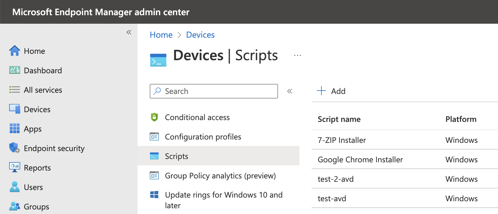
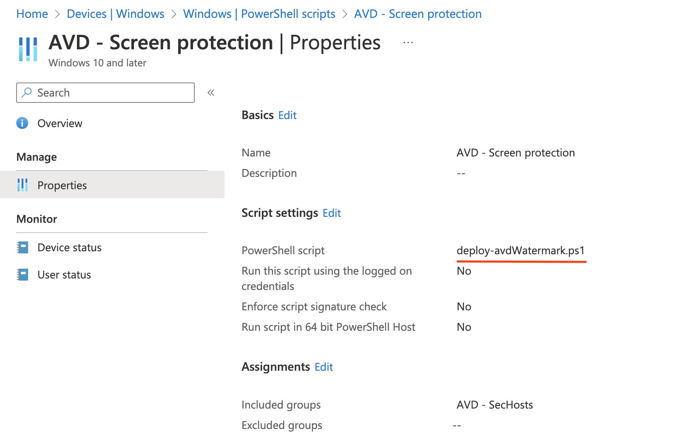
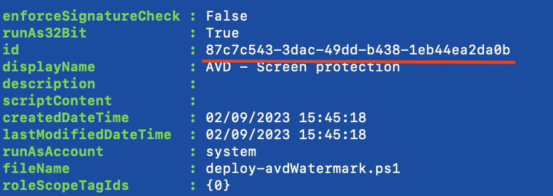
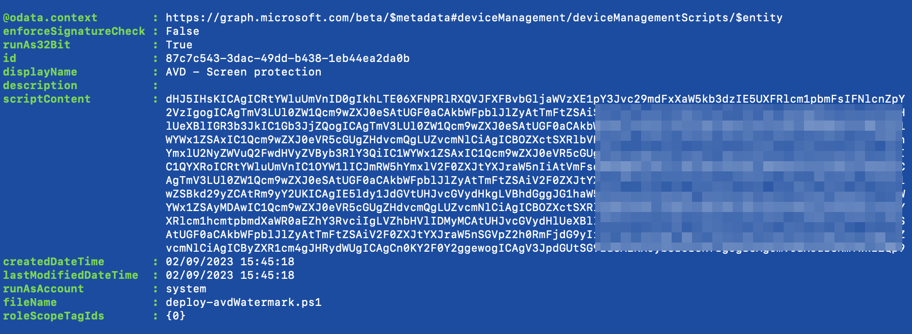
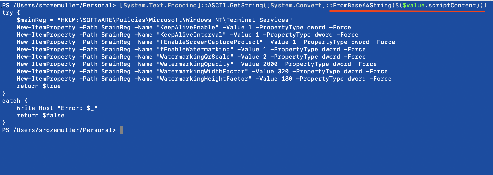

Device management scripts in Intune are custom scripts that can run on Windows 10 and higher clients and  MacOS. The ability to run scripts on local devices gives you an alternative to configuring devices with settings that are not available under the configuration policies or in the apps part of Intune.

Unfortunately, it is not possible to read, or even download, the file after the script is uploaded and configured in Intune. This is very inconvenient.
In this blog, I show a way how to get the content from an uploaded script in Intune.


## Scripts
The scripts component can be found under Devices -> Scripts in the portal.

In the screenshot below a script is deployed to set some registry keys. Keys that are not allowed to be set through configuration profiles. As you can see, there is no option available to see what is in the script or you can click it to download the file.


### Get script content
To get the script content, we must go back to the first step, upload. During the upload, the script content is read by the upload process and converted to a BASE64 string. In the example below, I request my script that writes some registry settings to a group of devices.  
At first, I request all the scripts to find out the script ID.

```powershell
$appUrl = "https://graph.microsoft.com/beta//deviceManagement/deviceManagementScripts"
$value = Invoke-RestMethod -Uri $appUrl -Method GET -Headers $authHeader
$value.value
```


Based on the ID, I look further into the configuration itself by using the code below.  

```powershell
$appUrl = "https://graph.microsoft.com/beta//deviceManagement/deviceManagementScripts/87c7c543-3dac-49dd-b438-1eb44ea2da0b"
$value = Invoke-RestMethod -Uri $appUrl -Method GET -Headers $authHeader
$value
```


Now the script content is shown, which is a BASE64 string. So, we need to convert it back to a human-readable string
Converting the Intune script content back to normal text is very simple using PowerShell.
I paste the ```$value.scriptContent``` value into ```[System.Convert]::FromBase64String()``` object. 

```powershell
[System.Text.Encoding]::ASCII.GetString([System.Convert]::FromBase64String($($value.scriptContent))) 
```



If you want to write it down into a file, pipeline the content to the ```Out-File``` PowerShell command. $value.fileName represents the original filename in Intune. 

```powershell
[System.Text.Encoding]::ASCII.GetString([System.Convert]::FromBase64String($($value.scriptContent)))  | out-file $value.fileName
```

## Keep in mind
Using scripts can be a lifesaver but I prefer using configuration profiles. This is because of the following reasons:
- **SECURITY** is the biggest thing in my opinion. You don't have any clue about what is going on in the script after uploading. There is no sight in the script content. Anything can be written in the script without any notice.  
- Hard to manage: Besides you being blind to the content, it is also not possible to simply modify some settings without walking through the whole process. 
- The script timeouts after 30 minutes, hopefully, when using scripts, you only use them to tweak some small settings.
- Error handling, not that I'm very experienced using scripts in Intune, but error handling must be done at the client level in the Intune logs. Not very convenient.
- The script has a max of 200 KB. That's a very big script. As said before, hopefully, you just use a script to set small configurations  

For more information about scripts check the [PowerShell](https://learn.microsoft.com/en-us/mem/intune/apps/intune-management-extension) or [MacOS shell](https://learn.microsoft.com/en-us/mem/intune/apps/macos-shell-scripts) documentation.


