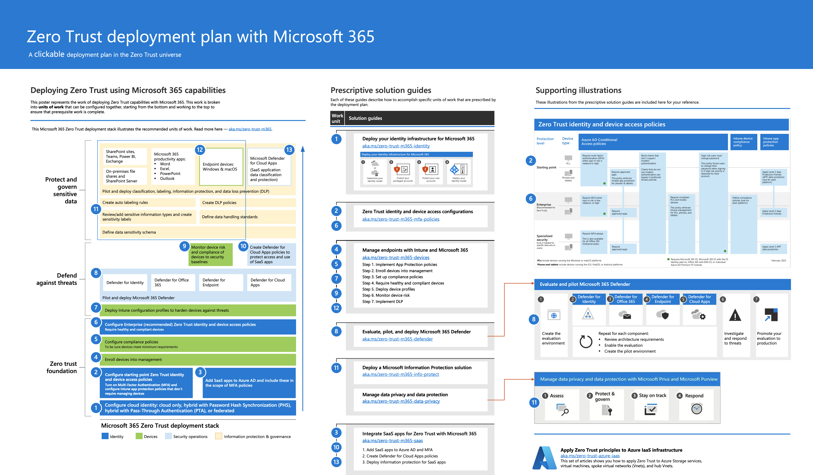
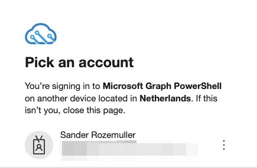
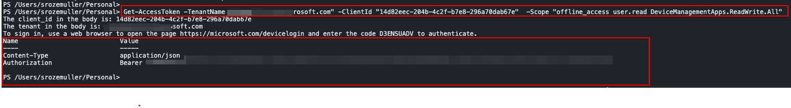
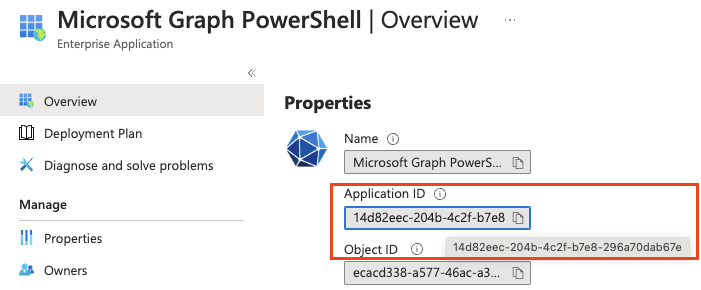

Welcome to the Zero to Zero Trust series automated and to this automation index. In this series, I will show the process from a zero security configuration to Zero Trust in the Microsoft public cloud. The series passes all the important items and show how to configure the components automated if applicable.



## What is Zero Trust?
From Microsoft: Zero Trust is a security strategy. It is not a product or a service, but an approach to designing and implementing the following set of security core principles:

- Verify explicitly: Always authenticate and authorize based on all available data points.
- Use least privilege access: Limit user access with Just-In-Time and Just-Enough-Access (JIT/JEA), risk-based adaptive policies, and data protection.
- Assume breach: Minimize blast radius and segment access. Verify end-to-end encryption and use analytics to get visibility, drive threat detection, and improve defenses.

Instead of believing everything behind the corporate firewall is safe, the Zero Trust model assumes breach and verifies each request as though it originated from an uncontrolled network. Regardless of where the request originates or what resource it accesses, the Zero Trust model teaches us to ```"never trust, always verify."```

Below, the key technology pillars are shown. 


### Used platforms and products
The following main platforms and products are used in this series:
- Azure Active Directory (Identity)
- Microsoft Intune
- Microsoft Defender
- Microsoft Purview
- Azure

Every component has a set of prerequisites that need to be configured before you can start with the Zero Trust configuration. 

## Zero Trust Automation plan
Before we start, it is good to have a plan. In this series, I will discuss the key concepts and object from there enrolling the configurations.
Microsoft has published two Zero Trust models. The first one is the Zero Trust model for [Microsoft 365](https://learn.microsoft.com/en-us/microsoft-365/security/microsoft-365-zero-trust?bc=https%3A%2F%2Flearn.microsoft.com%2Fen-us%2Fsecurity%2Fzero-trust%2Fbreadcrumb%2Ftoc.json%3Fview%3Do365-worldwide&toc=https%3A%2F%2Flearn.microsoft.com%2Fen-us%2Fsecurity%2Fzero-trust%2Ftoc.json%3Fview%3Do365-worldwide&view=o365-worldwide). The second one focus on [Azure (PAAS)](https://learn.microsoft.com/en-us/security/zero-trust/azure-infrastructure-avd?view=o365-worldwide) and [infrastructure (IAAS)](https://learn.microsoft.com/en-us/security/zero-trust/azure-infrastructure-overview?view=o365-worldwide). In this series, I will focus on both, starting with the Microsoft 365 Zero Trust model.


### Zero Trust model for Microsoft 365
The Zero Trust model for Microsoft 365 focuses on the following areas:
- Identity
- Endpoints
- Data
- Applications

The complete Zero Trust model for Microsoft 365 is shown below.


The full overview is located [here](https://learn.microsoft.com/en-us/microsoft-365/security/microsoft-365-zero-trust?view=o365-worldwide).

Based on [Zero Trust guidance](https://learn.microsoft.com/en-us/security/zero-trust/deploy/identity?view=o365-worldwide) I created a list of blogs that will be published and are listed below.
The model above returns in every blog and shows where we are at that time. Every blog helps you to deploy a Zero Trust infrastructure in an automated way. Every needed component is deployed and configured. 

#### Zero Trust automation blog overview
In the following table, the blogs are listed and the corresponding area is shown. The blogs are published in the order of the Zero Trust model. Some of the blogs are not published yet and more blogs are planned.

|Area|Blog|
|---------     |---------|
|---------|---------|                      
|Identity|[Configure Break Glass Accounts Infrastructure Automated](../configure-break-glass-accounts-infrastructure-automated/)|
|Identity|[Protect Privileged Accounts Automated](../protect-privileged-accounts-the-zero-trust-way-automated/)|
|Identity|[Common Identity and Device Access Protection](../zero-trust-common-identity-and-device-access-protection/)|
|Identity|<i>Monitor privilegded account usage</i>|
|Identity|<i>Monitor conditional access changes</i>|
|Identity|<i>Configure Privileged Identity Management automated</i>|
|Application & Data|[Zero Trust Data Protection Using App Protection Policies Automated](../zero-trust-data-protection-using-app-protection-policies-automated/)|
|Endpoints|<i>Monitor device risk and compliance to security baselines</i>|
|Endpoints|<i>Configure Windows Hello for Business automated</i>|
|Data|<i>Implement data loss prevention (DLP) automated<i/>|
|Data & Collaboration|<i>Deploy Zero Trust for Microsoft Teams automated</i>|


### Zero Trust model for Azure (PAAS & IAAS)
|Area|Blog|
|---------     |---------|
|---------|---------|    
|Azure PAAS|<i>Deploy Zero Trust for AVD automated</i>|


## Preparation
Before starting with the Zero Trust configuration automated, some preparation is needed. In this section, I will show the needed preparation steps.

### Authentication
In this series, several configuration layers pass. Think about Graph, hidden Azure AD API, Security & Compliance and Azure environments. Every layer (aka scope), has its permissions and way of authentication. For deployment, I use the user impersonation device code flow. For managing the Zero Trust infrastructure I use a service principal.

The needed permissions are listed in every article.

For the device code flow authentication, I created a PowerShell function that can be used in every article. The function is located in the [GitHub repository](https://github.com/srozemuller/Identity/tree/main/Authentication).  

In the example below, I request an access token for the Microsoft Graph PowerShell application. The scope is DeviceManagementApps.ReadWrite.All. The function returns the access token in the variable $AuthHeader.
```powershell
$AuthHeader = .\graph.authentication.interactive.ps1 -TenantName "contoso.onmicrosoft.com" -ClientId "14d82eec-204b-4c2f-b7e8-296a70dab67e" -Scope "DeviceManagementApps.ReadWrite.All"
```

After running the command, you will get a device code. Open a browser and navigate to https://microsoft.com/devicelogin.  
Enter the code and authenticate. After authentication, you will get a token.





The clientId I used is the Microsoft Graph PowerShell application ID under Azure AD Enterprise Applications.


<i><u>This authentication part is used for automating the Zero Trust component deployment. The managing part is be added later.</u></i>

#### Client ID overview
The following table shows the client IDs that are used in this series.
|Scope|ClientID|
|------|------ |
|Microsoft Graph PowerShell|14d82eec-204b-4c2f-b7e8-296a70dab67e|
|Microsoft Intune PowerShell|d1ddf0e4-d672-4dae-b554-9d5bdfd93547|
|Azure API Management|8602e328-9b72-4f2d-a4ae-1387d013a2b3|

### Licensing
During the series, I use some premium features that require licenses. The licenses are listed below.
- Azure AD Premium P2
- Mircosoft 365 E3 with E5 Security Add-On Mircosoft 365 E5

### Code, scripts and templates
All the code, scripts and templates are available on [GitHub](https://github.com/srozemuller/Identity/tree/main/ZeroTrust)  
I would suggest cloning the repository to your local machine.

>This blog post is growing and will be updated. For now, I keep my focus on the M365 Zero Trust model. The Azure Zero Trust model will be added later for example.

Like to collaborate? Feel free to contact me using the social links at the top of this website.


