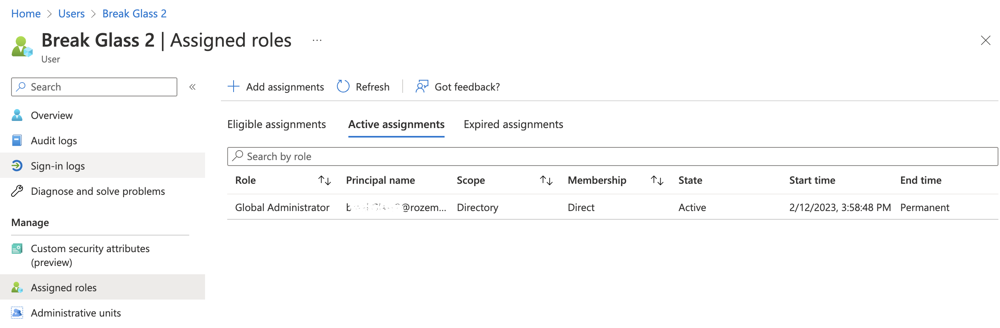
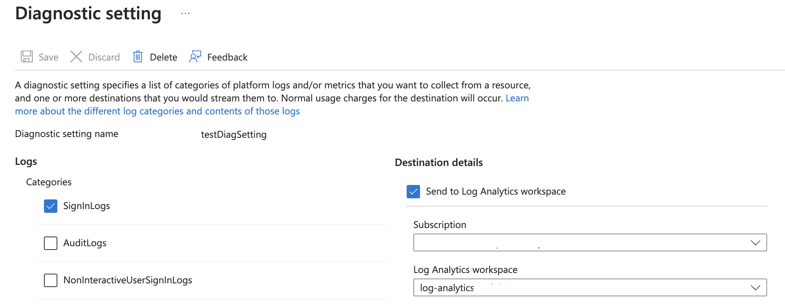
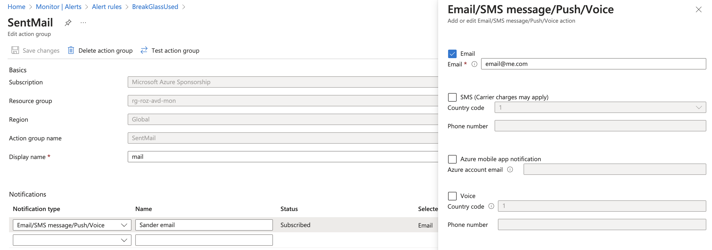
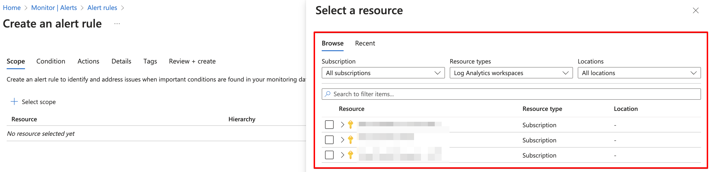
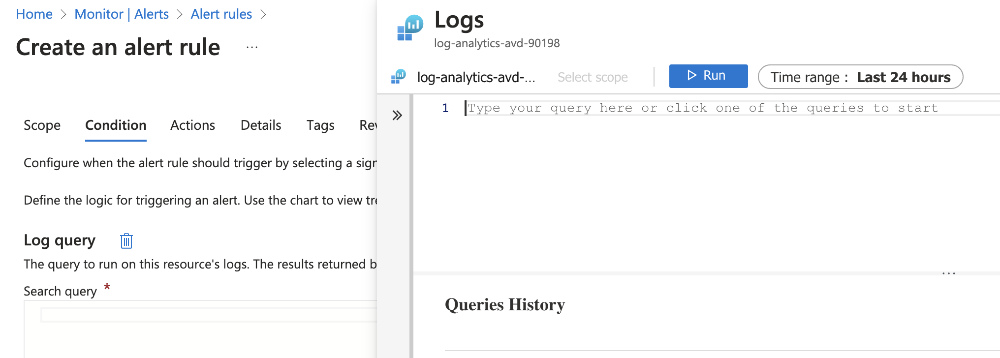
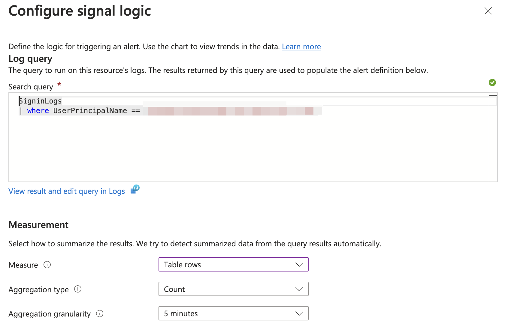
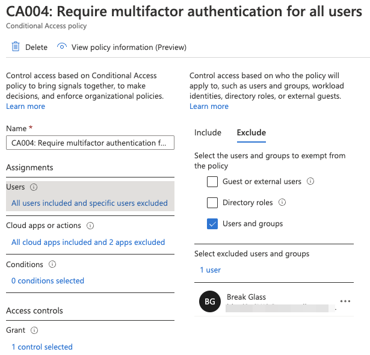
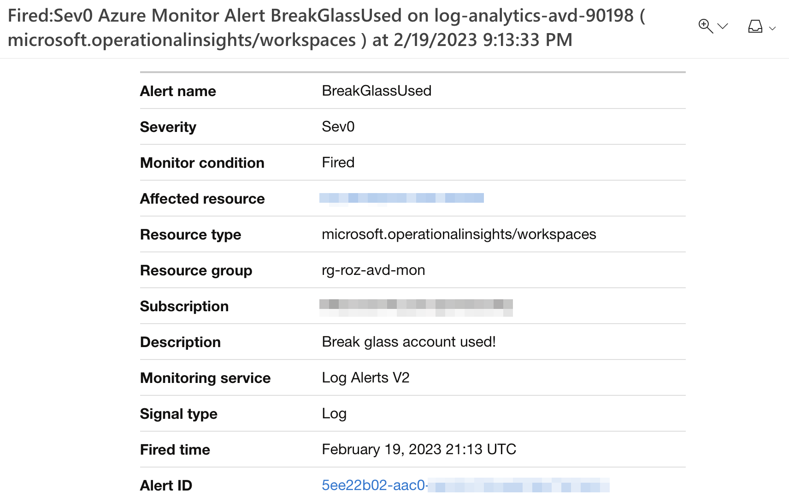
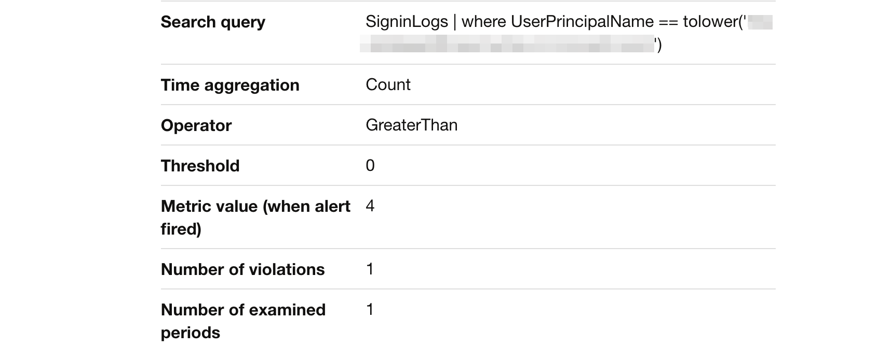
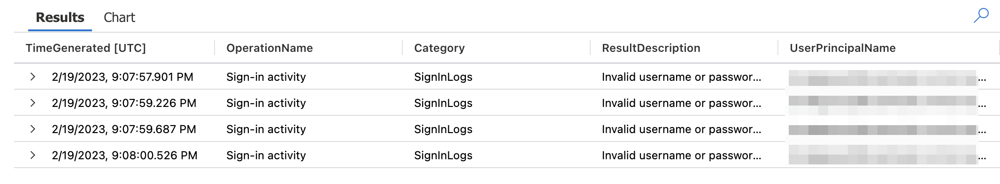

Nowadays a good cloud environment has strict security policies. Well-known policies are conditional access policies. Policies that require a compliant device before login for example or forcing MFA. Configuring conditional access is good but there is always a risk of lockout yourself. To not lock yourself out, you must create an emergency account.  

This post is the start of my Zero to Zero Trust series. 
Creating emergency accounts is the first step to a Zero Trust environment. The post explains how to create an emergency, aka break glass, user account including basic monitoring in an automated way.  






## Account creation and permissions 
Emergency access accounts are highly privileged, and they are not assigned to specific individuals. Emergency access accounts are limited to emergency or "break glass"' scenarios where normal administrative accounts can't be used. Think about a scenario where MFA is broken. 
It is highly recommended that you maintain a goal of restricting emergency account use to only the times when it is absolutely necessary.

### Create a Break Glass user account
The first step is creating a break glass account. With the code below I use the Graph API. I generate a strong password based on random characters. The ```Get-RandomPassword``` function can be found on my GitHub page.

```powershell
$username = Get-RandomString 8
$password = Get-RandomString 24
$userInfo = @{
    "accountEnabled"    = $true
    "displayName"       = "Break Glass"
    "mailNickname"      = $username
    "userPrincipalName" = "{0}{1}@contoso.onmicrosoft.com" -f "bkr", $username
    "passwordProfile"   = @{
        "forceChangePasswordNextSignIn" = $false
        "password"                      = $password
    }
} | ConvertTo-Json -Depth 5
$userUrl = "https://graph.microsoft.com/beta//users"
$value = Invoke-RestMethod -Uri $userUrl -Method POST -Headers $authHeader -Body $userInfo -ContentType "application/json"
$value
```
Keep the account ID ready for the next steps. Because I stored the output into a variable, I can request the ID any time.

For more information check the [emergency access documentation](https://learn.microsoft.com/en-us/azure/active-directory/roles/security-emergency-access).

### Assign permanent Global Admin role with PIM
In the next step, we make sure the break glass account has global admin permissions assigned permanently. To assign permissions I use Azure AD Privileged Identity Management (PIM). PIM is a service in Azure Active Directory (Azure AD) that enables you to manage, control, and monitor access to important resources in your organization.

The reason why I give permanent permissions is because of I can't assign permissions in the case of an emergency. If I'm not able to log in anymore, I can't elevate permissions ;). 

In the code below, I assign the global admin role to the user I created above. The role definition ID ```"62e90394-69f5-4237-9190-012177145e10"``` is a built-in role ID that is available in every tenant and has the same ID. (See [BuiltIn Roles](https://learn.microsoft.com/en-us/azure/active-directory/roles/permissions-reference#global-administrator)) 

The ```Get-Date``` makes sure the start date is NOW. The expiration date is set to ```noExpiration```.
The ```principalId``` is the user ID from above. 

```powershell
$pimUrl = "https://graph.microsoft.com/beta/roleManagement/directory/roleAssignmentScheduleRequests"
$pimBody = @{
    action = "adminAssign"
    justification = "Assign permanent break glass global admin permissions"
    reason = "Permanent global admin permissions needed in case of emergency"
    roleDefinitionId = "62e90394-69f5-4237-9190-012177145e10"
    directoryScopeId = "/"
    principalId = $value.id
    scheduleInfo = @{
        startDateTime = Get-Date
        expiration = @{
            type = "noExpiration"
        }
    }
} | ConvertTo-Json -Depth 5
$pimValue = Invoke-RestMethod -Uri $pimUrl -Method POST -Headers $authHeader -Body $pimBody -ContentType "application/json"
$pimValue
```


More info is available in the [PIM overview](https://learn.microsoft.com/en-us/azure/active-directory/privileged-identity-management/pim-configure).

For more information about assigning permissions in PIM using Graph API, check the [Graph API documentation](https://learn.microsoft.com/en-us/graph/api/rbacapplication-post-roleassignmentschedulerequests?view=graph-rest-beta&tabs=http)

## Monitor Account Usage
As discussed above, the break glass account is a highly privileged user account that must be handled with care. Because of that, it is recommended to monitor account usage. This is the reason why I create a monitor rule to check for account usage.  
The idea is to create an alert rule in Azure Monitor that checks the sign-in logs in the Log Analytics. Every log-in step is logged even when the login is not succesful. If the user account is logged, the IT admin gets an email. 


### Diagnostic settings Azure AD
To get information into Log Analytics, diagnostic settings must be set on the AAD IAM resource. The needed logs are the SignInLogs. 
In the code below, I create a ```testDiagSetting``` value with the log settings ```SignInLogs``` in it. 

Assuming there is a Log Analytics workspace already I use the code below to configure diagnostics settings for Azure AD using the Azure Management API. 

```powershell
$logsUrl = "https://management.azure.com/providers/microsoft.aadiam/diagnosticSettings/{0}?api-version=2017-04-01" -f "testDiagSetting"
$logsBody = @{
    properties = @{
        logs        = @(
        @{    
        "category" = "SignInLogs"
            "categoryGroup" = $null
            "enabled" = $true
            "retentionPolicy" = @{
                "days" = 90
                "enabled"= $true
            }
        }
        )
        workspaceID = "/subscriptions/xxx/resourcegroups/rg-mon/providers/microsoft.operationalinsights/workspaces/lawork"
    }
} | ConvertTo-Json -Depth 5
$logsValue = Invoke-RestMethod -Uri $logsUrl -Method PUT -Headers $authHeader -Body $logsBody -ContentType "application/json"
$logsValue
```


### Create Action Group
The next step is creating an action group. An action group is the next step in line after an alert has occurred. An alert group contains 'endpoints' where alerts are sent too. This can be a webhook, logic app or an e-mail for example. 
In this case, I use the e-mail and SMS endpoint. If this alert group receives an alert, the message is sent to my e-mail address and telephone number. 

The body below is quite simple. I create an alert group in a resource group and call it ```SentMail```.   

The reason why I create an action group first is because I can directly provide the correct action group while creating an alert rule.

```powershell
$actionGroupUrl = "https://management.azure.com/subscriptions/xxx/resourceGroups/rg-roz-avd-mon/providers/Microsoft.Insights/actionGroups/{0}?api-version=2021-09-01" -f "SentMail"
$actionGroupBody = @{
    location   = "Global"
    properties = @{
        groupShortName = "mail"
        emailReceivers = @(
            @{
                name                 = "Sander email"
                emailAddress         = "email@me.com"
                useCommonAlertSchema = $true
            }
        )
        smsReceivers = @(
            @{
                name         = "Sander SMS"
                countryCode  = "31"
                phoneNumber  = "0612345678"
                status = "Enabled"
            }
        )
    }
} | ConvertTo-Json -Depth 5
$actionGroupValue = Invoke-RestMethod -Uri $actionGroupUrl -Method PUT -Headers $authHeader -Body $actionGroupBody -ContentType "application/json"
$actionGroupValue
```  

  
For more information about creating alert groups with Azure API, check the [docs](https://learn.microsoft.com/en-us/rest/api/monitor/action-groups/create-or-update?tabs=HTTP).

### Create monitor rule
The last step is creating the monitor rule itself. Several alert rule types are available. Think about metrics, activity logs and custom logs. Every type has its own API endpoint. For this type (custom logs), we need the ```Scheduled Query Rules``` endpoint. This sounds a bit weird maybe, but in fact the name fits quite well. This is because this rule type is actually a scheduled task. A task that runs every n-minutes. 

In the body below, all above-created components are coming together.  
The first resource is the ```workspaceID```. This is the rule scope and the first thing you select when creating a rule manually.



The next resource is stored in the query object. This is the next step, when selecting the custom log type. 



The query is in Kusto Query language (KQL) format. This query searches for logs in SignInLogs for a user principal name equal to the created break glass account above.  
KQL is case sensitive, because an UPN is lowercase, I convert the value to lower case. 

```basic
SigninLogs
| where UserPrincipalName == tolower('$($value.userPrincipalName)')
```

  

After filling in the rest of the conditions the next step is what the alert rule needs to do. This is the place where the action group comes up. 

You can have more action groups configured. The body then look like the following.

```powershell
 actions = @{
        actionGroups = @(
          $actionGroupValue.id
          $actiongroup2
        )
      }
```

The complete action rule body is stored below. In the end, we have a rule that searches every 5 minutes for a sign-in log where the user principal name equals the break glass account. 

I configured also a dimension based on the user's SPN. This is to receive a split overview when more break glass accounts are monitored and used. 

If there is a result, a severity 0 (highest) alert will be created and I will be notified at my email address. 

```powershell
$queryUrl = "https://management.azure.com/subscriptions/xxx/resourceGroups/rg-roz-avd-mon/providers/Microsoft.Insights/scheduledQueryRules/{0}?api-version=2021-08-01" -f "BreakGlassUsed"
$queryBody = @{
    location = "westeurope"
    properties = @{
      description = "Break glass account used!"
      severity = 0
      evaluationFrequency = "PT5M"
      scopes = @(
        $workspaceId
      )
      windowSize = "PT5M"
      criteria = @{
        allOf = @(
          @{
            query = "SigninLogs
            | where UserPrincipalName == tolower('$($value.userPrincipalName)')"
            timeAggregation = "count"
            dimensions = @(
              @{
                name = "ServicePrincipalName"
                operator = "Include"
                values = @(
                  "*"
                )
              }
            )
            operator = "GreaterThan"
            threshold = 0
          }
        )
      }
      actions = @{
        actionGroups = @(
          $actionGroupValue.id
        )
      }
      autoMitigate = $false
    }
} | ConvertTo-Json -Depth 10
$queryValue = Invoke-RestMethod -Uri $queryUrl -Method PUT -Headers $authHeader -Body $queryBody -ContentType "application/json"
$queryValue
```

For more information about creating Custom Logs monitor rules automated, check the [API Documentation](https://learn.microsoft.com/en-us/rest/api/monitor/scheduledqueryrule-2021-08-01/scheduled-query-rules/create-or-update?tabs=HTTP#create-or-update-a-scheduled-query-rule-for-single-resource)

## Edit MFA Conditional Access policies
The last step is to make sure the break-glass accounts are excluded from your MFA policies. This is where it all goes about :). 
With the code below, I search for all conditional access policies with MFA configuration. Based on the results, the break glass account will be added, to every policy, as an excluded user. 

```powershell
$caUrl = "https://graph.microsoft.com/beta/identity/conditionalAccess/policies"
$caPolicies = Invoke-RestMethod -Uri $caUrl -Method GET -Headers $authHeader
$caBody = @{
    conditions = @{
        users = @{
            excludeUsers = @(
                $value.id
            )
        }
    }
} | ConvertTo-Json -Depth 5
$caPolicies.value | Where-Object {$_.grantControls.builtInControls -match "mfa"} | ForEach-Object {
    $caUrl = "https://graph.microsoft.com/beta/identity/conditionalAccess/policies/{0}" -f $_.id
    $caValue = Invoke-RestMethod -Uri $caUrl -Method PATCH -Headers $authHeader -Body $caBody -ContentType "application/json"
    $caValue
}
```



## Results
I did a simple test by trying to log in with invalid credentials. That results in an alert in my mailbox.




In Log Analtics, the results look like below.



### Script
I created a small script that is stored at my [ZeroTrust Repo](https://github.com/srozemuller/Identity/tree/main/ZeroTrust/CreateBreakGlass)
To use the script change the variables into your own and run the code in a PowerShell environment. 

## Notes from the field
Break Glass accounts are highly privileged accounts, that's no surprise anymore (I hope). So, we need to handle these accounts with care.
Microsoft's documentation says we need to create a Global Admin. But, to be honest I (and more MVPs) do have their concerns about creating an account with the highest permission level with no MFA configured. I also spoke with some fellow MVPs ([Jan Bakker](https://janbakker.tech/about-me/) and [Niels Kok](https://www.nielskok.tech/)) and they have the same.  

Because of that, an extra blog post comes with content on how to get more control over your break-glass accounts.  

For now, these are the first baby steps to a Zero Trust environment. 



[def]: diagnostics-settings