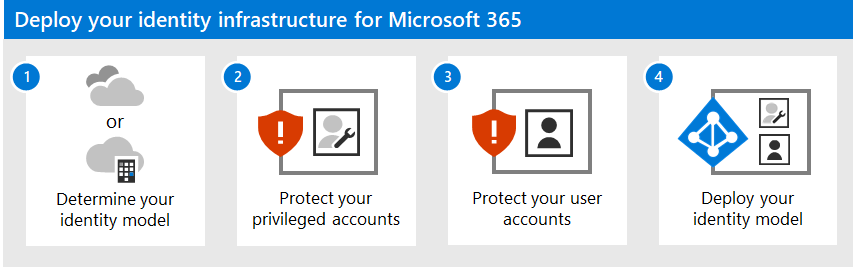
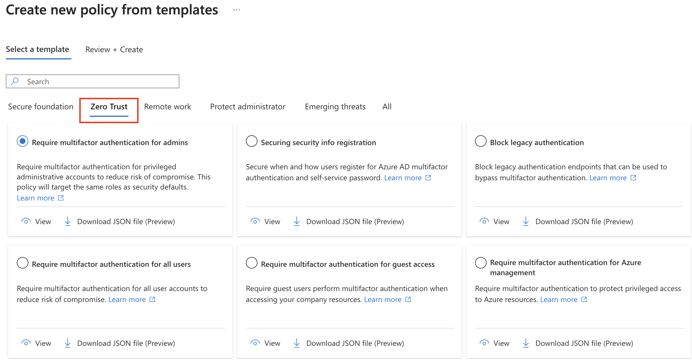
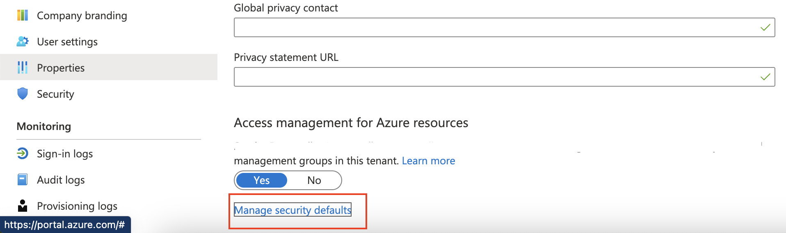
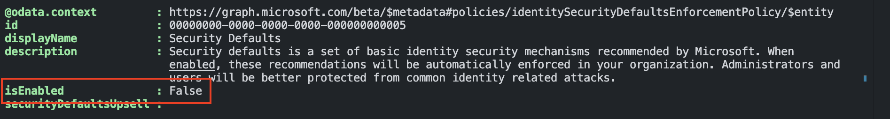
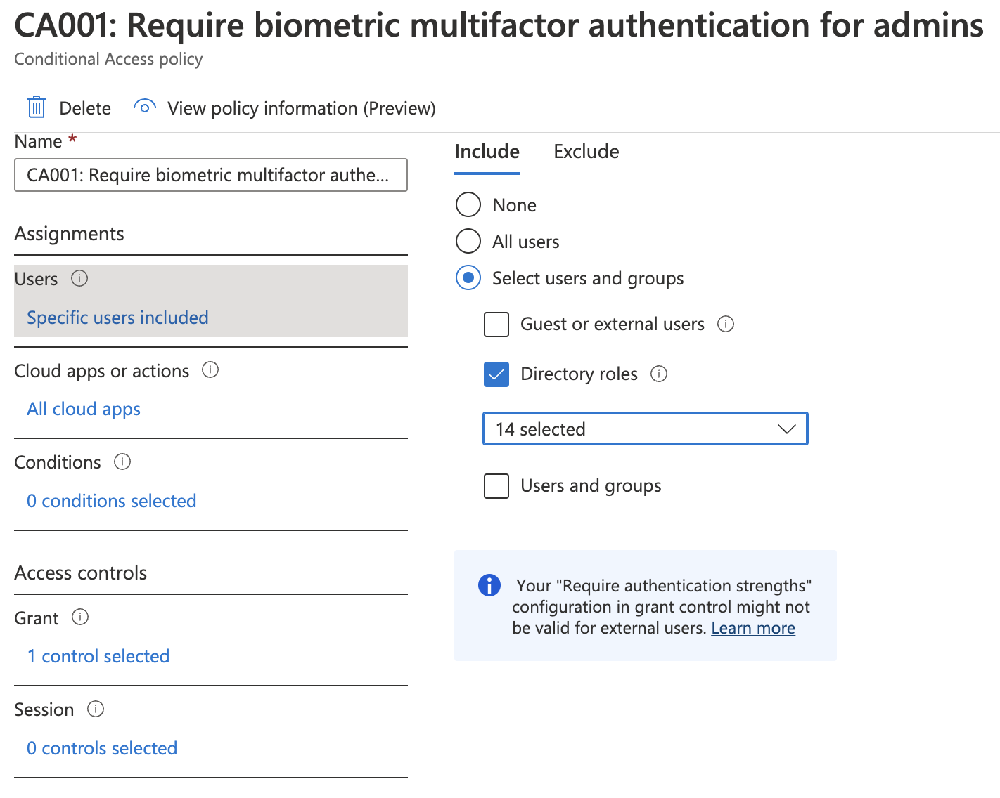
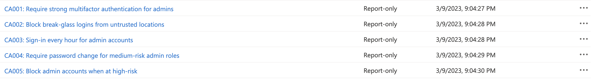
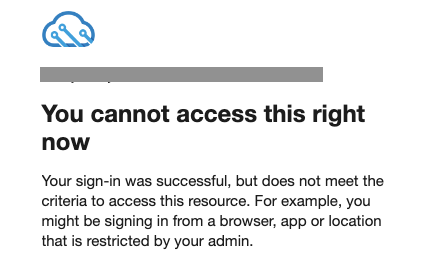
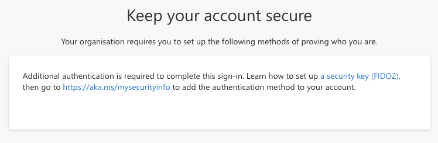

Identities are the key to environments and must be configured as securely as possible. To achieve this goal, conditional access policies are indispensable. In this blog post, I show how to secure privileged accounts that need more attention than MFA only. This post shows how to configure Zero Trust conditional access policies in an automated way.  
This is the next step in our Zero to Zero Trust journey. 



Using conditional access policies requires one of the following plans:

- Azure Active Directory Premium P1 or P2
- Microsoft 365 Business Premium
- Microsoft 365 E3 or E5
- Enterprise Mobility & Security E3 or E5





Further in this blog multi-factor authentication (MFA) is configured. Imagine what happens when the MFA service is not working for some reason. In that case, you can't log in. To avoid situations like that, creating a highly privileged cloud-based user account is recommended. This user account has global admin permissions, with NO MFA, and is also called a break-glass account.  

I've created a separate blog post about [creating break glass accounts in an automated way](https://rozemuller.com/configure-break-glass-accounts-infrastructure-automated/), this is the first step.

## Protect your Microsoft 365 privileged accounts
Now we can't lock out anymore, it is time to protect all other accounts with MFA. To protect these accounts, we use conditional access policies. When heading to the conditional access policies blade you see several categories, like Zero Trust, when clicking create from templates. 



By clicking the tab, you get an overview of policies that fit the Zero Trust philosophy. However, there are more conditional access policies to implement.  
Before diving into specific settings, some actions must be done first. Otherwise, the policies won't affect your tenant. 

### Disable legacy per-user MFA
(From Microsoft) 
If you've previously turned on per-user MFA, you must turn it off before enabling Security defaults.
[Check the docs to turn off legacy per-user MFA](https://learn.microsoft.com/en-us/microsoft-365/admin/security-and-compliance/set-up-multi-factor-authentication?view=o365-worldwide#turn-off-legacy-per-user-mfa)


### Turn off security defaults automated
Security defaults are a Microsoft-managed basic security level to ensure that all organizations have at least the minimum security settings enabled at no extra cost. Think about forcing MFA and blocking legacy authentication.

That sounds great and why should you use a conditional access policy?  
Well, if you have one location and only users that should use MFA anyway, security defaults are fine. 
But, in the case of excluding trusted locations, excluding specific users ([break glass](https://www.rozemuller.com/configure-break-glass-accounts-infrastructure-automated/)) or applications, conditional access will help you. 



```powershell
$secDefaultUrl = "https://graph.microsoft.com/beta/policies/identitySecurityDefaultsEnforcementPolicy"
$jsonBody = @{
  isEnabled = $false
} | ConvertTo-Json
$params = @{
    uri = $secDefaultUrl
    method = "PATCH"
    headers = $graphHeader
    body = $jsonBody
}
Invoke-RestMethod @params
```

The header contains an access token based on the graph endpoint. 



For more information about security defaults, check the [security defaults overview](https://learn.microsoft.com/en-us/azure/active-directory/fundamentals/concept-fundamentals-security-defaults).

## Implement Conditional access policies automated
At this point, you have prepared your tenants to use conditional access policies. A lot is written about conditional access policies. Because of that, I will discuss the basics only. A conditional access policy environment can be very complex, It is a good idea to write down your scenarios and dimensions. 
Scenario's like blocking legacy authentication, forcing MFA from untrusted locations, or blocking access for a specific user from untrusted locations. 
For dimensions, you should think about users, locations, devices or apps.

Now it is time to configure conditional access policies in an automated way. The policies below, are ONLY to protect privileged accounts. Protecting normal user accounts is discussed later in this series.

### Zero Trust Conditional Access policies scenarios according to privileged accounts
Conditional access scenarios are environment specific. It depends on your situation and internal security policies. The examples below are just some scenarios I think strengthen your Zero Trust policy.
The scenarios are:

|Nr.|Scenario|Dimensions|
|--|--|--|
|1|An MFA conditional access policy for all admin roles with the strongest authentication strength, the break glass account is excluded.|Users|
|2|A conditional access policy that allows break glass account logins from a trusted location only.|Users, Locations|
|3|A policy that has a 1-hour MFA sign-in frequency for admin roles. |Users|"
|4|Force password change when admin roles are at medium risk.|Users|
|5|Block access for admin roles that are at high risk. (the above policy is mandatory to make this work the right way), the break glass account is excluded. |Users|  

>To keep the break-glass account safe, monitoring of the account risk state is needed. This comes in a later post in this series. 

The files used in the code below are stored in my repository.  
WARNING: The default states in the files are ```enabledForReportingButNotEnforced```. Just to be sure you don't lock yourself out after importing. Change the state to ```enabled``` or remove the complete line. 

### Create locations automated
Some policies have a location dimension. In a conditional access policy, a location object can have different values: All, Trusted, Untrusted, or a specific location. 
To make the locations part work correctly, we must create locations first. 
Because locations are environment-specific, the location objects are empty in my templates. After creating the locations, please update the policies with your location IDs.

Creating names-locations automated can be done with the commands below.  
```powershell
$locationUrl = "https://graph.microsoft.com/beta/identity/conditionalAccess/namedLocations"
$params = @{
    uri = $locationUrl
    method = "POST"
    headers = $graphHeader
    body = get-content './Identity/ZeroTrust/ProtectPrivilegedAccounts/locations.trusted.home.json'
}
Invoke-RestMethod @params
```
The returned ID is the location ID that must be used in the location object.

```json
"locations": {
            "includeLocations": [
                "locationID"
            ],
            "excludeLocations": [
                "AllTrusted"
            ]
        },
```

### Import Zero Trust Conditional Access policies automated
With the code below I import a JSON file that holds the conditional access policy configuration into my tenant. 
```powershell
$caPolUrl = "https://graph.microsoft.com/beta/identity/conditionalAccess/policies"
$params = @{
    uri = $caPolUrl
    method = "POST"
    headers = $graphHeader
    body = get-content './Identity/ZeroTrust/ProtectPrivilegedAccounts/CA001: Require biometric multifactor authentication for admins.json'
}
Invoke-RestMethod @params
```


Let me explain the JSON file a bit. While most settings are empty, the user IncludeRoles object is filled with Azure built-in role IDs. The IDs are documented [here](https://learn.microsoft.com/en-us/azure/role-based-access-control/built-in-roles). If you like to have more roles in the policy, just add the ID to the list. 
```json
 "users": {
            "includeUsers": [],
            "excludeUsers": [],
            "includeGroups": [],
            "excludeGroups": [],
            "includeRoles": [
                "62e90394-69f5-4237-9190-012177145e10",
                "194ae4cb-b126-40b2-bd5b-6091b380977d",
                "f28a1f50-f6e7-4571-818b-6a12f2af6b6c",
                "29232cdf-9323-42fd-ade2-1d097af3e4de",
                "b1be1c3e-b65d-4f19-8427-f6fa0d97feb9",
                "729827e3-9c14-49f7-bb1b-9608f156bbb8",
                "b0f54661-2d74-4c50-afa3-1ec803f12efe",
                "fe930be7-5e62-47db-91af-98c3a49a38b1",
                "c4e39bd9-1100-46d3-8c65-fb160da0071f",
                "9b895d92-2cd3-44c7-9d02-a6ac2d5ea5c3",
                "158c047a-c907-4556-b7ef-446551a6b5f7",
                "966707d0-3269-4727-9be2-8c3a10f19b9d",
                "7be44c8a-adaf-4e2a-84d6-ab2649e08a13",
                "e8611ab8-c189-46e8-94e1-60213ab1f814"
            ],
            "excludeRoles": [],
            "includeGuestsOrExternalUsers": null,
            "excludeGuestsOrExternalUsers": null
 }
```
For the biometric part, we need the ```authenticationStrength``` block under ```grantControls```. Check my other blog about [Deploy and monitor conditional access authentication strength automated](https://www.rozemuller.com/deploy-monitor-conditional-access-require-authentication-strength/) for the correct IDs.

```json
        "authenticationStrength": {
            "id" : "00000000-0000-0000-0000-000000000004"
        }
```

The other scenarios work all the same. Read the JSON content and run the PowerShell code.  

I created a small loop to import all policies at once.

```powershell
$files = Get-ChildItem -Path './Identity/ZeroTrust/ProtectPrivilegedAccounts' -Filter *.json
foreach ($file in $files) {
    $caPolUrl = "https://graph.microsoft.com/beta/identity/conditionalAccess/policies"
    $params = @{
        uri = $caPolUrl
        method = "POST"
        headers = $graphHeader
        body = get-content $file
    }
    Invoke-RestMethod @params
}
```



### Verify 
The error below is one of the results, after importing, when using a break-glass account from an untrusted location.





