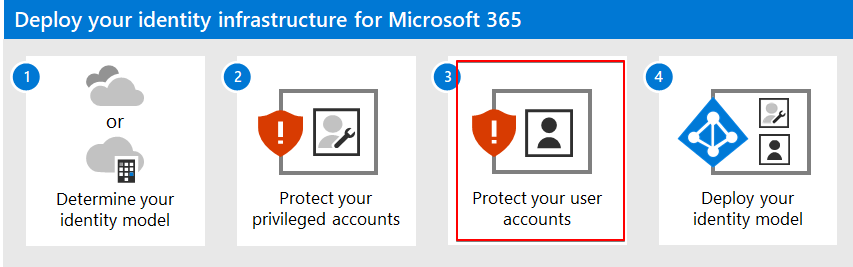
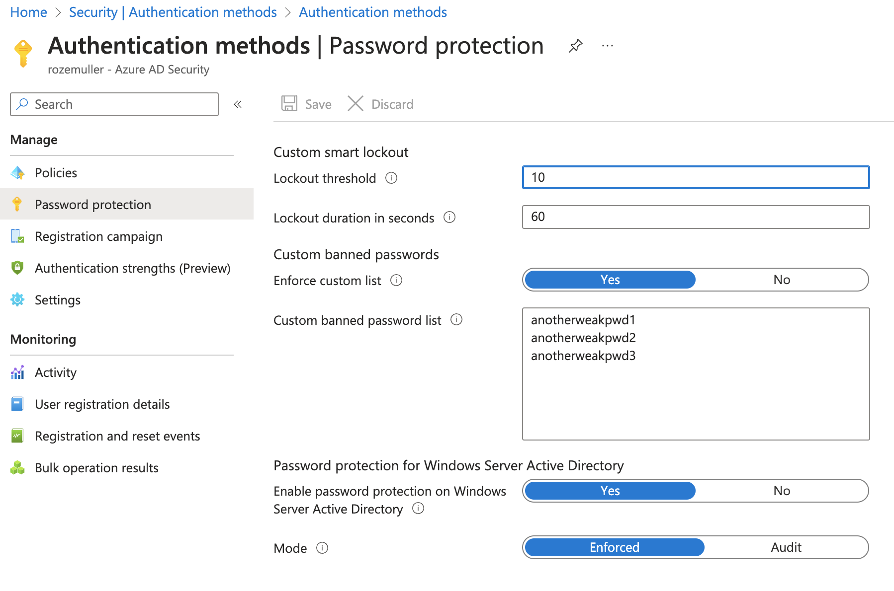
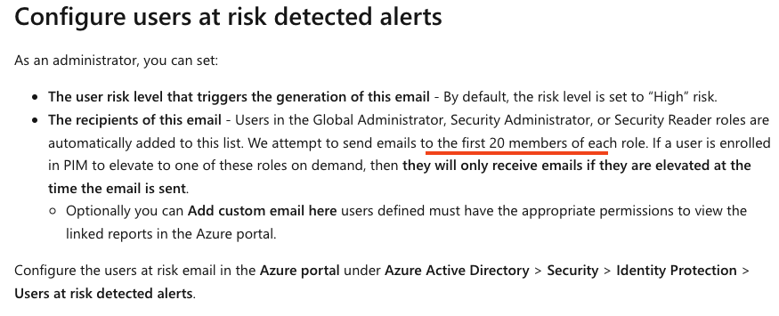
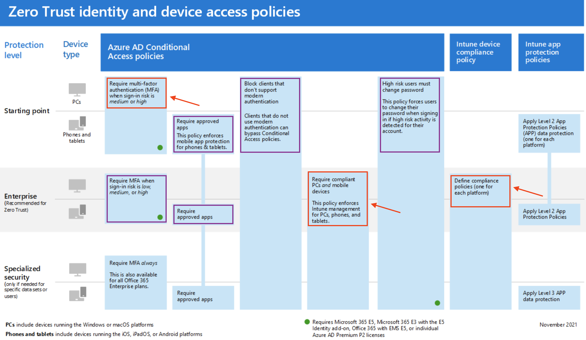
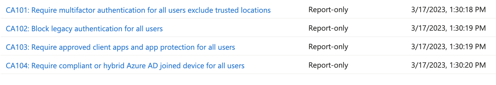
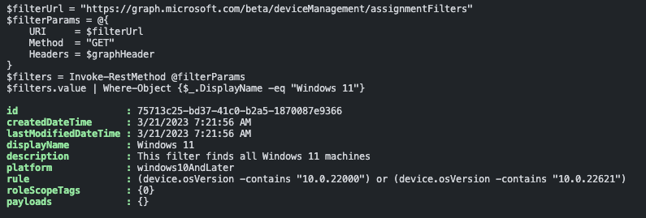
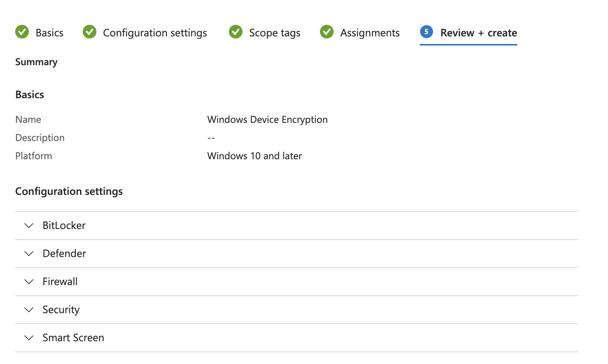
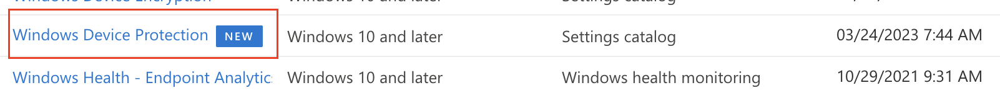
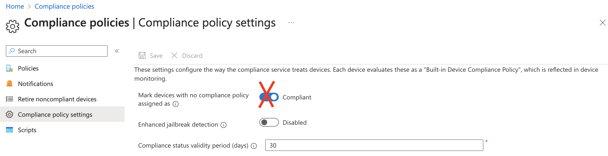

This is the 3rd step in the series Zero to Zero Trust in an automated way. In the previous steps, we configured an emergency account and protected the account with conditional access policies. The conditional access policies control the log-in process. In this step, we configure access policies for other users and devices.







## Prerequisites
Before using the Zero Trust identity and device access policies that are recommended, your tenant needs to meet prerequisites.
The full prerequisites list is stored [here](https://learn.microsoft.com/en-us/microsoft-365/security/office-365-security/identity-access-prerequisites?view=o365-worldwide#prerequisites).  
Considering the list, the [Configure name locations and Multi Factory Authentication](https://www.rozemuller.com/protect-privileged-accounts-the-zero-trust-way-automated/) are in place already. 
From the list, I'm focussing now on Azure AD password protection and Identity protection. 

### Authentication
Some prerequisites are part of the Azure AD that has no Graph API or Azure Management API endpoint. To configure these parts, we need the Azure AD backend API ```main.iam.ad.ext.azure.com```

Earlier I wrote a post on how to authenticate to the backend API. You can find that post [here](https://www.rozemuller.com/use-internal-azure-api-in-automation/#authenticate-to-mainiamadextazurecom). 
I use the header used in the code that I picked from [this part](https://www.rozemuller.com/use-internal-azure-api-in-automation/#log-in-with-the-refresh-token)

### Add custom banned password list
Microsoft has a global banned password list that is enabled for every user automatically. You don't have to enable a feature or something. However this is a long list that avoids creating weak passwords, there could be a situation where you want to add your passwords as well.
In this example, I configure a small additional banned password list. 

<font style=color:#E63900><i>NOTE: The banned password needs to have a min length of 4 characters and a max length of 16 characters.</i></font>

```powershell
$passwordPolicyUrl = "https://main.iam.ad.ext.azure.com/api/AuthenticationMethods/PasswordPolicy"
$body = @{
  lockoutThreshold = 10
  lockoutDurationInSeconds = 60
  enforceCustomBannedPasswords = $true
  customBannedPasswords = @(
    "anotherweakpwd1"
    "anotherweakpwd2"
    "anotherweakpwd3"
    )
  enableBannedPasswordCheckOnPremises = $true
  bannedPasswordCheckOnPremisesMode = 1
} | ConvertTo-Json
$params = @{
    uri = $passwordPolicyUrl
    method = "POST"
    headers = $headers
    body = $body
}
Invoke-RestMethod @params
```



For more information about password policies, check the [documentation about the custom banned password list](https://learn.microsoft.com/en-us/azure/active-directory/authentication/concept-password-ban-bad).


## Identity protection
Most of the identity protection part is handled by conditional access policies. Check [my blog about securing privileged accounts automated](https://www.rozemuller.com/protect-privileged-accounts-the-zero-trust-way-automated/). 
But more settings should be checked under the Azure AD - Security - identity protection blade.
Users at risk detected alerts and Weekly digest, which are default enabled by Microsoft could be disabled somehow. The commands below enable risk detection events and weekly digest notifications.

We need to authenticate to the Graph API with the correct scope. I almost use the same token request where I changed the resource and scope.

First, I request the current state. This is to get all current users that are on the notification list.  
<i>Global Administrators are on the list by default. The first 20 identities on the list get a notification (per role).</i> 


Needed permissions: ```IdentityRiskEvent.ReadWrite.All```

```powershell
$uri =  "https://graph.microsoft.com/beta/identityProtection/settings/notifications"
$currentState = Invoke-WebRequest -Headers $graphHeader -Uri $uri -Method GET
$currentState.notificationRecipients.Foreach({
  $_.isRiskyUsersAlertsRecipient = $true
  $_.isWeeklyDigestRecipient=$true

  # Remove the properties that are not needed
  $_.PSObject.Properties.Remove('DisplayName')
  $_.PSObject.Properties.Remove('email')
  $_.PSObject.Properties.Remove('roles')
})
$currentState.isWeeklyDigestEnabled = $true
$currentState.minRiskLevel = "Medium"
$body = $currentState | ConvertTo-Json -Depth 5
Invoke-WebRequest -Headers $graphHeader -Uri $uri -Method PATCH -Body  $body -ContentType "application/json"
```



More information about configuring notifications can be found [here](https://learn.microsoft.com/en-us/azure/active-directory/identity-protection/howto-identity-protection-configure-notifications)

### Conditional access policies
As mentioned before, most of the identity protection part is handled by conditional access policies. Check [my blog about securing privileged accounts automated](https://www.rozemuller.com/protect-privileged-accounts-the-zero-trust-way-automated/). In the blog post, I configure the conditional access policies for the emergency account. In this part, we configure the conditional access policies for all users and make sure they only log in from compliant devices.

Considering the image below, we need to configure the red-circled conditional access policies.



The purple-circled conditional access policies are already configured in the previous blog.

The policies are stored on my [GitHub](https://github.com/srozemuller/Identity/tree/main/ZeroTrust/CommonIdentityDeviceProtection)

To enroll the normal user conditional access policies please read the [import Zero Trust conditional access policies automated part](https://www.rozemuller.com/protect-privileged-accounts-the-zero-trust-way-automated/#import-zero-trust-conditional-access-policies-automated)

Run the following command to import the conditional access policies for normal users. 
<i>NOTE: The state in the file is set to report only. Remove the state line or enable the policies manually.</i>

```powershell
$files = Get-ChildItem -Path './Identity/ZeroTrust/CommonIdentityDeviceProtection' -Filter *.json
foreach ($file in $files) {
    $caPolUrl = "https://graph.microsoft.com/beta/identity/conditionalAccess/policies"
    $params = @{
        uri = $caPolUrl
        method = "POST"
        headers = $graphHeader
        body = get-content $file
    }
    Invoke-RestMethod @params
}
```


<font style=color:#4CA129><i>NOTE: The policies I provided are just a subset of a wide range of policies. I would suggest taking a look at [Kenneth van Surksum his website](https://www.vansurksum.com/) to find out a wide range of conditional access policies. He explains the scenarios where to use them.</i></font>


## Device protection
This is the part where ```Mircosoft Intune``` comes in. In the upcoming steps, we will configure the following settings:
- Require device compliance
- Require managed devices

Before enabling these settings, we need to make sure that the devices are compliant. To get the compliance status, we need to configure the compliance policies in Intune.

### Filters
Because Windows 10 and Windows 11 both are under the ```Windows 10 and later``` category, we need to create a filter to find the Windows 11 devices. This is because Windows 10 and Windows 11 have different build numbers to check on later in the compliance policies.  
It is recommended to use filters above dynamic groups to assign compliance policies in Intune. This way, you can assign the correct compliance policy to the correct device type. In this example, I create a filter for Windows 11. All filters are stored on my [GitHub](https://github.com/srozemuller/Identity/tree/main/ZeroTrust/CommonIdentityDeviceProtection/Intune/Filters)

```json
{
    "displayName" : "Windows 11",
    "description" : "This filter finds all Windows 11 machines",
    "platform" : "windows10AndLater",
    "rule" : "(device.osVersion -contains \"10.0.22000\") or (device.osVersion -contains \"10.0.22621\") and (device.model -ne \"Virtual Machine\")"
} 
```
The rule is needed to find the Windows 11 devices. In later steps, we will use the filter to assign the compliance policy to the correct devices. For Windows 10 and Windows 11, the configuration profile is different.  

For Windows 10, the rule is ```(device.osVersion -contains \"10.0.19044\") or (device.osVersion -contains \"10.0.19045\")```.

Create the filter with the following command:
```powershell
$filterUrl = "https://graph.microsoft.com/beta/deviceManagement/assignmentFilters"
$filterParams = @{
    URI     = $filterUrl 
    Method  = "POST"
    Headers = $authHeader
    Body = Get-Content .\filters.windows11.json
}
Invoke-RestMethod @filterParams
```

For more information about creating filters automated, check my blog post about [Intune filters explained create automated and assignments](https://www.rozemuller.com/intune-filters-explained-and-create-automated/)

The build number overview can be found [here](https://learn.microsoft.com/en-us/windows/release-health/windows11-release-information)

### Configure compliance policies
It is recommended to create a compliance policy for each device type. In this example, I create a compliance policy for Windows 11.
The difference between them is the OS version build numbers. The policies are stored on my [GitHub](https://github.com/srozemuller/Identity/tree/main/ZeroTrust/CommonIdentityDeviceProtection/Intune/CompliancePolicies)


Creating and assigning compliance policies (with filters) is a two-step process. First, we need to create a compliance policy. Second, we need to assign the compliance policy to the correct filters.  
The whole process is explained in my blog post about [Intune compliance policies explained create automated](https://www.rozemuller.com/intune-filters-explained-and-create-automated/)

In basics we create a compliance policy with the following command:
```powershell
$compliancyUrl = "https://graph.microsoft.com/beta/deviceManagement/deviceCompliancePolicies/"
$filterParams = @{
    URI     = $compliancyUrl 
    Method  = "POST"
    Headers = $graphHeader
    Body = Get-Content .\compliance.windows11.json
}
$policy = Invoke-RestMethod @filterParams
$policy
```
Save the output into a variable. This variable is needed to assign the compliance policy to the correct filters.

#### Assign compliance policy to filter
In the next step, we request the Windows 11 filter. This filter is needed to assign the compliance policy to the correct devices.

```powershell
$filterUrl = "https://graph.microsoft.com/beta/deviceManagement/assignmentFilters"
$filterParams = @{
    URI     = $filterUrl 
    Method  = "GET"
    Headers = $graphHeader
}
$filters = Invoke-RestMethod @filterParams
$win11Filter = $filters.value | Where-Object {$_.DisplayName -eq "Windows 11"}
```



In the last step, we assign the compliance policy to the correct filter. This is done with the following command:
```powershell
$assignBody = @{
  assignments = @(
    @{
      "target" = @{
        "@odata.type"                              = "#microsoft.graph.allDevicesAssignmentTarget"
        deviceAndAppManagementAssignmentFilterId   = $win11Filter.id
        deviceAndAppManagementAssignmentFilterType = "include"
      }
    }
  )
} | ConvertTo-Json -Depth 5
$compliancyUrl = "https://graph.microsoft.com/beta/deviceManagement/deviceCompliancePolicies/{0}/assign" -f $policy.id
$filterParams = @{
  URI     = $compliancyUrl 
  Method  = "POST"
  Headers = $graphHeader
  Body    = $assignBody
}
Invoke-RestMethod @filterParams
```

This step must be repeated for every compliance policy. If no filters are used, then skip the GET filter step and remove the ```FilterId``` and  ```FilterType``` lines in the POST body.

### Configure configuration profiles
Some settings in compliance policies need a configuration profile to configure a specific setting on the device. Take Bitlocker for example. BitLocker must be installed on the device to get compliant. The configuration profile handles the Bitlocker installation and configures common security settings. 



In the example below, I create a configuration profile for all Windows devices. All configuration profiles are stored on my [GitHub](https://github.com/srozemuller/Identity/tree/main/ZeroTrust/CommonIdentityDeviceProtection/Intune/DeviceConfiguration)


```powershell
$compliancyUrl = "https://graph.microsoft.com/beta/deviceManagement/configurationPolicies"
$filterParams = @{
  URI     = $compliancyUrl 
  Method  = "POST"
  Headers = $graphHeader
  Body    = Get-Content .\windows.endpointprotection.json
}
$result = Invoke-RestMethod @filterParams
```

After creation, we need to assign the configuration profile to the correct compliance policy. Assigning configuration profiles works the same as assigning compliance profiles. Use the command above to assign the configuration profile to the correct compliance policy.




### OS Update policies
In this part of the blog post, I will explain how to configure OS update policies. Planning updates is a complex topic and it is recommended to use several update rings instead of updating all devices at once. I will not go into detail about the planning. I will only explain how to configure the OS update policies.

```powershell
$updateParams = @{
  URI     = "https://graph.microsoft.com/beta/deviceManagement/deviceConfigurations"
  Method  = "POST"
  Headers = $graphHeader
  Body    = Get-Content .\update.windows.json
}
Invoke-RestMethod @updateParams
```

Again we need to assign the OS update policy to the correct devices. In the case of Windows make sure you select the correct filters as discussed in the filters section.

The OS update policies are stored on my [GitHub](https://github.com/srozemuller/Identity/tree/main/ZeroTrust/CommonIdentityDeviceProtection/Intune/UpdatePolicies)

### Disable default compliancy
Considering Zero Trust, we need to disable the feature below. This feature is enabled by default and it sets all devices to a compliant state if no policy is assigned.


The most ironic part of this is the name of the setting. It is called ```secureByDefault``` which is default set to ```false```. In the portal, the false setting represents the compliant state and sets all devices to a compliant state if no policy is assigned. 

To disable this feature, we need to create a configuration profile with the following command:
```powershell
$settingsBody = @{
  settings = @{
    secureByDefault = $true
  }
} | ConvertTo-Json
$secureByDefault = @{
  URI     = "https://graph.microsoft.com/beta/deviceManagement"
  Method  = "PATCH"
  Headers = $graphHeader
  Body    = $settingsBody
}
Invoke-RestMethod @secureByDefault

```

## Wrap Up
In this blog post, I explained how to add extra security by configuring a banned password list into Azure AD. The next step was configuring risk and health alerts. However these are enabled by default, it is good to be sure. Thereafter the 'normal' user conditional access policies were deployed automated. 
The next part of the blog focus on device protection in Intune. I showed an example of configuring filters (for assignments) and creating compliance- and configuration policies for Windows 11 devices with Intune. 

At last, I explained how to disable the default compliance setting in Intune automated. This setting is enabled by default and it sets all devices to a compliant state if no policy is assigned.




