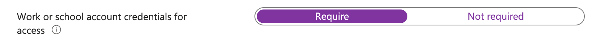

In earlier steps, I explained how to control identity and devices to connect to your environment. Now people are connected to your environment safely, the next step is to make sure your data won't walk out.  
In this step of the Zero to Zero Trust journey we will look at the first step of how to keep your data safe. In this blog, I show how to automate the creation of App Protection Policies. Intune App Protection policies help protect corporate data even if a device itself is not managed.






## Introduction
This blog post focuses on the green box on the right side. Some of the steps are already explained in the previous blogs and are marked in the red box. The orange box shows the steps that are explained in this blog.


All blogs related to the Zero to Zero Trust journey are listed in the [Zero to Zero Trust](https://www.rozemuller.com//tags/zero-to-zero-trust/) overview.  
All blogs related to level 1 Zero Trust are listed in the [Zero Trust Level 1](https://www.rozemuller.com//tags/zero-trust-level-1/) overview.

The full Zero Trust plan is available [here](https://learn.microsoft.com/en-us/microsoft-365/security/microsoft-365-zero-trust?bc=https%3A%2F%2Flearn.microsoft.com%2Fen-us%2Fsecurity%2Fzero-trust%2Fbreadcrumb%2Ftoc.json&toc=https%3A%2F%2Flearn.microsoft.com%2Fen-us%2Fsecurity%2Fzero-trust%2Ftoc.json&view=o365-worldwide).
## Intune App Protection Policies
With APP, Intune creates a wall between your organization's data and personal data and has a focus on mobile iOS and Android devices. The app protection policies define which apps are allowed to access your data. After creating an App Protection policy, you enforce data protection with a conditional access policy.  
Currently, the following App Protection Policy types are available:
- iOS/iPadOS
- Android

The Windows Information Protection (WIP) policies are supported but deprecated. [Microsoft Purview](https://learn.microsoft.com/en-us/azure/purview/overview) replaces WIP and will be discussed in a later blog.


For more information about WIP, see [Get ready for Windows Information Protection in Windows 10/11](https://learn.microsoft.com/en-us/mem/intune/apps/app-protection-policies-configure-windows-10?source=recommendations).

In the basics, both types are the same in common. In the first step, you select the apps which you want to protect. In the second step, you can configure the protection settings. The enforcement settings are the same for both platforms.


For level 1 protection I selected to secure only the Microsoft Apps.

### Data transfer override
Unlike the default settings, I choose to block the backup service in the iOS/iPadOS and Android settings. This is because I don't want my data on personal cloud storage like iCloud or Google Drive.


Another setting I changed is the printing. I don't want my data to be printed. This is because I don't want my data to be printed from mobile devices since mobile devices are more likely to be lost or stolen.


### Access requirements override
In the access requirements blade, I selected to block simple pins and require a work- or school account. This is because I don't want my data to be accessed by personal accounts. This is also a good way to prevent data leakage.




### Conditional launch override
In the conditional launch override blade, I added some extra conditions. In the app conditions part, I selected to block access in the case a user has been disabled. If a device has been lost, the first thing you may want to do is disable a user. If a user is disabled, access to the app is stopped immediately. 


## Create App Protection Policies automated
As mentioned in the introduction, app protection policies have two types. When automating the creation of the policies, you need to use also two different Graph API endpoints. 

- https://graph.microsoft.com/beta/deviceAppManagement/iosManagedAppProtections
- https://graph.microsoft.com/beta/deviceAppManagement/androidManagedAppProtections

Creating the policies is done in the same way as the conditional access policies. The only difference is that you need to use the correct endpoint. The JSON file for the iOS/iPadOS policy is stored in the [GitHub repository](https://github.com/srozemuller/Identity/tree/main/ZeroTrust/DataProtection)

In the example below, I create an iOS app protection policy automated.  

```powershell
$iosUrl = "https://graph.microsoft.com/beta/deviceAppManagement/iosManagedAppProtections"
$iosBody = Get-Content .\lvl1.appprotection.ios.json
$iosPolicy = Invoke-RestMethod -uri $iosUrl -Method POST -Headers $authHeader -ContentType 'application/json' -body $iosBody
```


In the example below, I create an Andriod app protection policy automated.  

```powershell
$androidUrl = "https://graph.microsoft.com/beta/deviceAppManagement/androidManagedAppProtections"
$androidBody = Get-Content .\lvl1.appprotection.android.json
$androidPolicy Invoke-RestMethod -uri $androidUrl -Method POST -Headers $authHeader -ContentType 'application/json' -body $androidBody
```


### Assign App Protection Policies to groups automated
The assignment process consists of two steps. Since application protection policies only support AD groups, we first need to find the Azure AD group ID. To find the group ID, I also use the Graph API.
In the example below, I search for the All Users group first and then assign the app protection policy to the group.

```powershell
$allUsersGroup = Invoke-RestMethod -uri "https://graph.microsoft.com/beta/groups?`$filter=displayName eq 'All Users'" -Method GET -Headers $authHeader 
$body = @{
    "assignments" = @(
        @{
            target = @{
                groupId       = $allUsersGroup.value.id 
                "@odata.type" = "#microsoft.graph.groupAssignmentTarget"
            }
        }
    )
} | ConvertTo-Json -Depth 5
$androidPolicyUrl = "https://graph.microsoft.com/v1.0/deviceAppManagement/androidManagedAppProtections('{0}')/assign" -f $androidPolicy.Id 
Invoke-RestMethod -uri $androidPolicyUrl -Method POST -Headers $authHeader -ContentType 'application/json' -body $body
```

## Conditional Access Policies
To make sure the App Protection Policy is enforced, we return to conditional access policies. In the conditional access policy, you select the App Protection Policy and the users or groups you want to apply the policy. 


How to automate conditional access policy creation is explained in the [previous blog](https://www.rozemuller.com/zero-trust-common-identity-and-device-access-protection/#conditional-access-policies/).

The needed policies are:
- CA202: Require app protection policy with mobile devices.
- CA203: Block Exchange ActiveSync on all devices

Both policies are also stored as a JSON file in the [GitHub repository](https://github.com/srozemuller/Identity/tree/main/ZeroTrust/CommonIdentityDeviceProtection).

