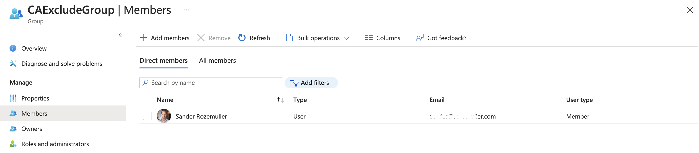

Emergency accounts are a fundamental part of any security strategy. They are used to access systems when the primary account is unavailable or locked out. In the past, emergency accounts were often called “break glass” accounts. In an earlier post, I explained [how to create an emergency account based on a user account with a password](../configure-break-glass-accounts-infrastructure-automated/). In this post, I will show you how to automate the creation of a passwordless, multi-layered emergency account using Graph API. 



## The idea
The idea is to log in with a service principal using a client certificate in the first place. With Zero Trust in mind, the principal has the minimal needed permissions that only allow adding users to an [Azure Role-assignable group](https://learn.microsoft.com/en-us/azure/active-directory/roles/groups-concept#how-are-role-assignable-groups-protected). 
The group is empty by default and assigned to the MFA Conditional Access policy exclusion list.  

In the case of an emergency, a person connects to the tenant using the service principal. After logging in, users are added to the exclusion group (layer 1).  
Thereafter, the person can log in using the user account as the emergency user (layer 2).

A big pro of this approach is that the emergency account is passwordless. Also, the emergency account is multi-layered. Even when the service principal is compromised, the attacker can only add users to the exclusion group and needs an extra existing user to log in. The attacker can’t change the Conditional Access policy.  
This is a major improvement over a single high-privileged break glass account with only a password.

## The setup
Assuming you already have a Conditional Access policy with MFA enabled, we need the following:
- A service principal with the following permissions:
    - RoleManagement.ReadWrite.Directory
    - Users.Read.All (optional), If you know the user object ID of the user you want to add to the exclusion group, you can skip this permission to find the user object id.

I consciously chose to not add the Group.Read.All as a permission. This to make this solution as secure as possible. In the case of a breach, you still don't know to which group you need to add members to.

- A client certificate with key. Instead of using an application ID and secret, we will use a client certificate. This is more secure than using a secret.
- An empty <u>Azure Role-enabled</u> AD group that is assigned to the MFA Conditional Access policy exclusion list.

If you don't have a Conditional Access policy with MFA enabled, I would suggest reading my post [Protect Privileged Accounts the Zero Trust Way Automated](../protect-privileged-accounts-the-zero-trust-way-automated//).

## Create an app registration
The next step is creating a service principal. In the following steps, I create the following:
- An app registration with the correct Graph API permissions
- A service principal based on the app registration
- An admin consent for the app registration

### Graph API permissions explained
The Graph API permission landscape consists of two parts from an automation perspective.  
In the basics, we have an app registration and a service principal. If not using automation only the app registration is needed. You log in interactively with the app registration and grant permissions on behalf of the user.   
If using automation you need a service principal. The service principal is created based on the app registration. 

The code below creates the app registration in the first place. The permissions are the Graph API OAuthPermissions, not confusing with the application roles. I used the application permissions.
Using the OAuthPermissions IDs allows the creation of an admin consent under application permissions instead of delegated permissions. 

```powershell
$appUrl = "https://graph.microsoft.com/beta/applications"
$appBody = @{
    "displayName"            = "EmergencyAccess"
    "signInAudience"         = "AzureADMyOrg"
    "requiredResourceAccess" = @(
        @{
            "resourceAppId"  = "00000003-0000-0000-c000-000000000000"
            "resourceAccess" = @(
                @{
                    "id"   = "9e3f62cf-ca93-4989-b6ce-bf83c28f9fe8" # RoleManagement.ReadWrite.Directory
                    "type" = "Role"
                },
                @{
                    "id"   = "df021288-bdef-4463-88db-98f22de89214" # User.Read.All
                    "type" = "Role"
                }
            )
        }
    )
} | ConvertTo-Json -Depth 5
$appRequest = Invoke-WebRequest -Method POST -Uri $appUrl -Headers $authHeader -Body $appBody
$appOutput = $appRequest.Content | ConvertFrom-Json
```

In the screenshot below, I created the app registration with the two permissions. As you can see it is missing the admin consent.


### Create service principal
Creating a service principal based on the app registration is quite easy using the command below.  
I just tell the Graph API to create a service principal based on the app registration created above. I use the ```$appOutput``` variable from the app registration to create the service principal.
```powershell
$spUrl = "https://graph.microsoft.com/beta/servicePrincipals"
$spRequest = Invoke-WebRequest -Method POST -Uri $spUrl -Headers $authHeader -Body (@{
        "appId" = $appOutput.appId
    } | ConvertTo-Json)
$spOutput = $spRequest.Content | ConvertFrom-Json
$spOutput
```

### Set the Graph API permissions and admin consent automated
In the next step, we need to grant the service principal the permissions. This is called admin consent.

The code below creates the admin consent. The ```$spOutput``` variable is the service principal created above. The ```$appOutput``` variable is the app registration created above.

While adding permissions, you tell the service principal which permissions it needs under which application. In the example below, I tell the service principal that it needs the permissions from the enterprise application ```00000003-0000-0000-c000-000000000000``` (Microsoft Graph). The permissions in the application are ```RoleManagement.ReadWrite.Directory``` and ```Users.Read.All```.  

In the step below, I first request the internal ID from the Graph API application (resourceId). While the appId is always the same, the internal ID differs in a tenant. 

```powershell
$graphSpUrl = "https://graph.microsoft.com/beta/servicePrincipals?`$filter=appId eq '00000003-0000-0000-c000-000000000000'"
$grapSpRequest = Invoke-WebRequest -Method GET -Uri $graphSpUrl -Headers $authHeader
$grapshspOutput = ($grapSpRequest.Content | ConvertFrom-Json).value
```

In the body below all pieces are put together. The ```clientId``` is the service principal ID. The ```resourceId``` is the internal ID of the Graph API application. The ```scope``` is holding the API permissions from the Graph API application. The ```startTime``` and ```expiryTime``` are ignored but required.

```powershell
$assignUrl = "https://graph.microsoft.com/beta/servicePrincipals/{0}/appRoleAssignments" -f $spOutput.id
$ids = @("df021288-bdef-4463-88db-98f22de89214", "9e3f62cf-ca93-4989-b6ce-bf83c28f9fe8")
foreach ($id in $ids) {
	$body = @{
		"principalId" = $spOutput.id
		"resourceId" = $grapshspOutput.id
		"appRoleId" = $id
	} | ConvertTo-Json
	$content = Invoke-WebRequest -Uri $assignUrl -Headers $authHeader -Method POST -Body $body
	$content.Content | ConvertFrom-Json
}
```

After granting ```app role permissions``` , the service principal (under enterprise applications), the permissions look like below.


For more information check about the permissions and ID, check [the API permissions reference documentation](https://learn.microsoft.com/en-us/graph/permissions-reference).

## Client certificate
The first step is creating a client certificate. Several ways are available, I use OpenSSL to create a self-signed certificate with a private key. Creating a certificate consists of the following steps:
- Create a private key.
- Create a certificate signing request (CSR).
- Create a self-signed certificate.
- Convert the certificate to a PFX file.

Thereafter the client certificate is uploaded to the app registration. 

### Create a private key
You can use the following command to create a private key.  
```powershell
openssl genrsa -des3 -out cert.key 2048
```

### Create a certificate signing request (CSR)
You can use the following command to create a CSR with the created private key from above.  
```powershell
openssl req -new -key cert.key -out cert.csr
```

### Create a self-signed certificate
You can use the following command to create a self-signed certificate using the request and private key. The created .crt file is the certificate and will be uploaded to the Azure AD application.  
```powershell
openssl x509 -signkey cert.key -in cert.csr -req -days 365 -out cert.crt
```

### Convert the certificate to a PFX file
You can use the following command to convert the certificate to a PFX file that contains the private key. This is the certificate that is used to log in with the service principal and distributed to a device.
Using a private key avoids that the certificate can be shared easily.  
```powershell
openssl pkcs12 -inkey cert.key -in cert.crt -export -out cert.pfx
```
For more information about creating a client certificate, see [Create a self signed certificate with OpenSSL](https://www.baeldung.com/openssl-self-signed-cert)self-signed.

### Upload the certificate to the application
We have created the certificate and the application. Now it is time to upload the certificate to the application. The application accepts the .crt file in converted binary to Base64String. 

The first step is to get the certificate's raw content and convert to content to a Base64String format. Reading the content using PowerShell is simple by using the `Get-Content -File -Raw` command

```powershell
$certificate = Get-Content .\cert.crt -Raw
```

The content in the $certficate variable is now:

```
-----BEGIN CERTIFICATE-----
MIECsDCCAZgCCQDATkHIiZjVhjANBgkqhkiG9w0BAQsFADAaMQswCQYDVQQGEwJO
TDELMAkGA1UECAwCT1YwHhcNMjMwNDE5MTAwOTIwWhcNMjQwNDE4MTAwOTIwWjAa
MQswCQYDVQQGEwJOTDELMAkGA1UECAwCT1YwggEiMA0GCSqGSIb3DQEBAQUAA4IB
DwAwggEKAoIBAQCaBRnQz4kALtBKWllfuVNZ/L444qMcRBBb6D8Dbr79ZtDw1v89
qOvSdVrtBhM0m2ckQgLt/d+eLp6JBvUIU5QFgfpE4UJnxiHY6yBXHEEZeFuOvIZa
g40yWiK577kxI7HWrCVD/CA3ygU4bydn/93afvjYE+R2uC0YOt28aANEoJxwqdWB
NzD07EKxTw2WWRkwJ45SfJdke3vJLSWY7BjGHiPIfH6Hs5eMA2yyr1SvQYXDy4oe
6yoRj5/j+He7yP5c+HZoIVrhHtIvzrrjne2EkOKvVoR3VRyUq45VRaHEHRDy1h34
iNV5s34K1JnKvt6mQ2RRL1G+9IfdItpnthdtAgMBAAEwDQYJKoZIhvcNAQELBQAD
ggEBAD32cPfN3TG4n3Sq+V2y8hmXbLNTkFEugwzq3LxJusf9t8Z7Jc0qORhhaReT
a6k+M611QOKH4VD6Pho2H2QSgHms5G5mLDdwR6+dI+wOTKlUvpov5KFrt+E8028f
DxZdFI/Y6dLY8n7pouGiQPe97Cac0zaSUgxSLwqj61Dfwspy2RdgsVKZb0F/ONZb
OCitVe8nfdBJIVOdmS0rcBm5y2D/UfHq4kLCV7u3QGtF3HPIrIiqS3vdhKOKg2EM
+CIDb4kLrq+AFU9EwAPymZSX42kXMvlYnDBjYz9qgelBEbtRvwhZvoLryKS74Deo
1nik+lS5pmFI7d6kdw8JF12DpOc=
-----END CERTIFICATE-----
```

After converting to Base64String with the command below the string is formatted.

```powershell
$certUploadKey = [System.Convert]::ToBase64String([System.Text.Encoding]::ASCII.GetBytes($certificate))
```

```
LS0tLS1CRUdJTiBDRVJUSUZJQ0FURS0tLS0tCk1JSUNzRENDQVpnQ0NRREFUa0hJaVpqVmhqQU5CZ2txaGtpRzl3MEJBUXNGQURBYU1Rc3dDUVlEVlFRR0V3Sk8KVERFTE1Ba0dBMVVFQ0F3Q1QxWXdIaGNOTWpNd05ERTVNVEF3T1RJd1doY05NalF3TkRFNE1UQXdPVEl3V2pBYQpNUXN3Q1FZRFZRUUdFd0pPVERFTE1Ba0dBMVVFQ0F3Q1QxWXdnZ0VpTUEwR0NTcUdTSWIzRFFFQkFRVUFBNElCCkR3QXdnZ0VLQW9JQkFRQ2FCUm5RejRrQUx0QktXbGxmdVZOWi9MNDQ0cU1jUkJCYjZEOERicjc5WnREdzF2ODkKcU92U2RWcnRCaE0wbTJja...
```

With the code below, I update the application's (not the service principal's) key credentials.

```powershell
$appUrl = "https://graph.microsoft.com/v1.0/myorganization/applications/{0}" -f $appOutput.id

$certUploadBody = @{
	keyCredentials = @(
		@{
			displayName = "emergencyaccess_cert"
			keyId = (New-Guid).Guid
			type = "AsymmetricX509Cert"
			usage = "Verify"
			key = $certUploadKey
		}
	)
} | ConvertTo-Json -Depth 10

Invoke-WebRequest -Uri $appUrl -Method PATCH -Headers $authHeader -Body $certUploadBody
```

The return is a 204 No Content. Saving the output into a variable is not needed.


## Azure AD Role assignable group
The next step is creating an Azure AD Role assignable group. The reason why specific this group type is because of the following:

Role-assignable groups are designed to help prevent potential breaches by having the following restrictions:

-  The membership type for role-assignable groups must be Assigned and can't be an Azure AD dynamic group. An automated population of dynamic groups could lead to an unwanted account being added to the group and thus assigned to the role. 
This is a pro because now you are forced to assign specific users to the group. Instead of assigning all users for example in the case of a faulty query.

Another thing is: 
-  By default, only Global Administrators and Privileged Role Administrators can manage the membership of a role-assignable group, but you can delegate the management of role-assignable groups by adding group owners. 
Also in this case I'm sure (almost) that only privileged users can assign users to this group. 

To create an Azure AD Role assignable group automated I used the code below. Make a note about ```isAssignableToRole = $true``` value. 

```powershell
### Create Azure AD Group
$groupName = "CAExcludeGroup"
$groupBody = @{
	displayName = $groupName
	mailEnabled = $true	
	securityEnabled = $true
	groupTypes = @(
		"Unified"
)
mailNickname = $groupName
isAssignableToRole = $true
visibility = "Private"
} | ConvertTo-Json

$group = Invoke-WebRequest -Uri "https://graph.microsoft.com/beta/groups" -Headers $authHeader -Method POST -Body $groupBody
$groupOutput = $group.Content | ConvertFrom-Json
```

In the case of an emergency, privileged users can't log in. That means someone else needs to assign users to the emergency group. As mentioned above, also a group owner can assign users to this group. 
The code below adds the created service principal as an owner to the group.

```powershell  
### Add owner to group
$ownerUrl = "https://graph.microsoft.com/beta/groups/{0}/owners/`$ref" -f $groupOutput.id
$ownerBody = @{
	"@odata.id" = "https://graph.microsoft.com/beta/directoryObjects/{0}" -f $spOutput.id
} | ConvertTo-Json

Invoke-WebRequest -Uri $ownerUrl -Headers $authHeader -Method POST -Body $ownerBody
```


Besides the user that has created the group now also the service principal is the owner. 

## Add group to MFA Conditional Access policy
The next step is to assign the group to the MFA CA policy. 
In the first step, I request my MFA policy based on the display name. Based on the output, I use the ID to update ```excludeGroups``` object with the group ID.

```powershell
$caPolicyUrl = "https://graph.microsoft.com/beta/identity/conditionalAccess/policies?`$filter=displayName eq 'CA004: Require multifactor authentication for all users'"
$caPolicies = Invoke-WebRequest -Uri $caPolicyUrl -Headers $authHeader -Method GET 
$caPolicy = ($caPolicies.Content | ConvertFrom-Json).value
$updateBody = @{
	conditions = @{
		users = @{
			excludeGroups = @(
				$groupOutput.id
			)
		}
	}
} | ConvertTo-Json -Depth 10

$updateCaUrl = "https://graph.microsoft.com/beta/identity/conditionalAccess/policies/{0}" -f $caPolicy.id

$content = Invoke-WebRequest -Uri $updateCaUrl -Headers $authHeader -Method PATCH -Body $updateBody

$content.Content | ConvertFrom-Json
```


## Log in process
Everything is in place now. We have created an application with a certificate login. The application has permission to add users to the MFA exclusion group. 
The exclusion group is added to the MFA CA Policy excluded groups. 

Now what if the #$%@* hits the van?

We must log in with the service principal to add a user to the exclusion group. 
In the upcoming part, I show how to log in using the service principal and add a user to the exclusion group. 

### Log in with the service principal using the client certificate
To get a Graph API token for further steps, we need to login with a client credentials using a certificate. Using a certificate is a bit different than loggin in using a normal password. 
I will skip the details, but the main goal is to create a signature from the certificate and private key. The complete signature (which is the JWT token, aka password) is send to the authentication URL.

#### Convert certificate in JWT token with PowerShell
To log in with a client certificate we have to convert the certificate into a JWT token. That token acts as a password. Converting a certificate into a JWT token has two main steps. Create a certifcate hash and a private key hash. In the end both are combined

Requirement is you need a certificate with a private key.  That is de .pfx file created above. 

The first step is converting the certificate itself into a Base64String. This is needed because the content is uploaded in later steps.

```powershell
# Create base64 hash of certificate

$CertificateBase64Hash = [System.Convert]::ToBase64String($certificate.GetCertHash())
```

The second step is create a signature from the private key and add it to the certifcate hash.

```powershell
# Get the private key object of your certificate

$PrivateKey = ([System.Security.Cryptography.X509Certificates.RSACertificateExtensions]::GetRSAPrivateKey($certificate))

# Define RSA signature and hashing algorithm
$RSAPadding = [Security.Cryptography.RSASignaturePadding]::Pkcs1
$HashAlgorithm = [Security.Cryptography.HashAlgorithmName]::SHA256

# Create a signature of the JWT
$Signature = [Convert]::ToBase64String(
$PrivateKey.SignData([System.Text.Encoding]::UTF8.GetBytes($JWT), $HashAlgorithm, $RSAPadding)
) -replace '\+', '-' -replace '/', '_' -replace '='

# Join the signature to the JWT with "."
$JWT = $JWT + "." + $Signature
```

### Use JWT token to Microsoft login
In the step below I send a client_credentials authentication request based on the application I created earlier. For the scope I use `https://graph.microsoft.com//.default` which are all the application's configured permissions.

```powershell
# Create a hash with body parameters

$Body = @{
	client_id = $ApplicationId
	client_assertion = $JWT
	client_assertion_type = "urn:ietf:params:oauth:client-assertion-type:jwt-bearer"
	scope = $Scope
	grant_type = "client_credentials"
}
# Log in with certificate to change user group membership
$Url = "https://login.microsoftonline.com/$TenantName/oauth2/v2.0/token"

  
# Use the self-generated JWT as Authorization
$Header = @{
	Authorization = "Bearer $JWT"
}

# Splat the parameters for Invoke-Restmethod for cleaner code
$paramters = @{
	ContentType = 'application/x-www-form-urlencoded'
	Method = 'POST'
	Body = $Body
	Uri = $Url
	Headers = $Header
}

$Request = Invoke-RestMethod @paramters
```

Check the [Access token request with a certificate](https://learn.microsoft.com/en-us/azure/active-directory/develop/v2-oauth2-client-creds-grant-flow#second-case-access-token-request-with-a-certificate) for more about client credentials login using a certificate. 

I created a script that accepts a tenant name, the PFX certificate and the application ID. When running the script, it asks for the certificate's password. At last it returns the access token that can be use later. 

The script how to create a JWT token from a certificate is stored at my [GitHub](https://github.com/srozemuller/Identity/blob/main/Authentication/get-jwt-accesstoken.ps1)


### Get the user object ID of the user you want to add to the exclusion group
Using the token received from the [certificate to JWT converter script](https://github.com/srozemuller/Identity/blob/main/Authentication/get-jwt-accesstoken.ps1) I create a header and send a request to search a user in the AD.

```powershell
$token = ./get-jwt-accesstoken.ps1 -TenantName tenant.onmicrosoft.com -CertPath ./cert.pfx -ApplicationId created-breakglass-appID

$certGraphHeader = @{
	'Content-Type' = 'application/json'
	Authorization = "Bearer {0}" -f $token
}
```


```powershell
$userUrl = "https://graph.microsoft.com/beta/users?`$filter=userPrincipalName eq 'user@domain.com'"

$users = Invoke-WebRequest -Uri $userUrl -Method GET -Headers $certGraphHeader
$user = ($users.Content | ConvertFrom-Json).value
```

The result in the user variable is the ID that will be added to the group. 

### Add the user to the exclusion group.
To keep all as secure as possible, the application has no group list permissions. Make sure you write down the correct group ID. 

The last step is adding the user to the group based on the group ID. 
```powershell
$groupUrl = "https://graph.microsoft.com//beta/groups/{0}/members/`$ref" -f $groupOutput.id

$addMemberBody = @{
	"@odata.id" = "https://graph.microsoft.com/v1.0/directoryObjects/{0}" -f $user.id
} | ConvertTo-Json

Invoke-WebRequest -Uri $groupUrl -Method POST -Headers $certGraphHeader -Body $addMemberBody
```



At last log in with the user account as the emergency user.

## Summary
You have created a passwordless, multi-layered break glass account based on a service principal that has permissoins to add a normal user to the MFA exclusion group.
To log in you need a password protected certificate.

Objects to store safely:
- Certifcate PFX file
- Certificate password
- Application ID
- Exclusion group ID

