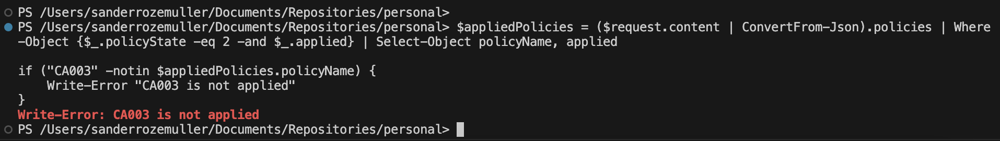

In earlier posts I created several conditional access policies in an automated way. During the time policies may change, users will be added to a specific Azure role, groups are added and so many more. 
All those changes effect on how conditional access policies act. Because of that, it is recommended to check your conditional access policies environment so now and then. 

In this blog post, I show to test your conditional access enviroment in an automated way based on different scenario's.





## Main idea
The main idea of the post is to check the current available conditional access policies based on some scenario's. Checking policies is very usefull from different perspectives. 
First of all you want to know if the current conditional acces policies work. On the other site, you also want to know if you missed some scenario's. 

In this post, the starting point is a scenario and we will check if the scenario hits a policy or not. If a specific scenario does not hit any policy you properly missing a conditional access policy.


## Authentication
Checking conditional access policies is not available in the Graph API. To check conditional access policies, we need to authenticate to ```https://main.iam.ad.ext.azure.com/```. Earlier, I showed [how to use the Azure AD internal API and how to authenticate](./use-internal-azure-api-in-automation/).

In this blog post, I use the access token that returns from the blog post above. 


## Check Conditional Access policies automated
To check conditional access policies automated we need the following API endpoint: ```https://main.iam.ad.ext.azure.com/api/WhatIf/Evaluate```
The API endpoint accepts a JSON body that contains the full scenario.

### Scenarios
As said, the starting point is a scenario. In this post, I test the following scenarios:
- Break Glass account not MFA (should hit a policy)
- Admin account biometric (should hit strong auth MFA policy)
- All users MFA (should hit MFA policy)
- User log in to Azure Virtual Desktop App with High Risk (should hit MFA policy, but does not hit) (Alert!)

The scenarios are each stored in a JSON file. The JSON file content is provided as a body to the evaulate endpoint in the automated check.

The scenarios I used are stored at my [GitHub](https://github.com/srozemuller/Identity/tree/main/ZeroTrust/ConditionalAccessCheck)
### Automated check
This is the part where the scenarios are checked one by one. This is simple done by the following PowerShell script. 
First, the JSON file content is read. Next is sending a POST request to the evaluation API ```"https://main.iam.ad.ext.azure.com/api/WhatIf/Evaluate"```

```powershell
$body = Get-Content ./Identity/ZeroTrust/ConditionalAccessCheck/admin.highrisk.json
$uri = "https://main.iam.ad.ext.azure.com/api/WhatIf/Evaluate"
$request = Invoke-WebRequest -uri $uri -Headers $headers -Method post -Body $body
($request.content | ConvertFrom-Json).policies
```

After requesting the API, the API responds a state per policy. An example is stored below, based on the admin at High Risk scenario.

```
policyId               : e3ffffd1-1220-4398-a098-46420a3e4cd1
policyName             : CA004: Require multifactor authentication for all users
unsatisfiedConditions  : {0}
applied                : True
controls               : @{controlsOr=True; blockAccess=False; challengeWithMfa=True; requireAuthStrength=; compliantDevice=False;
                         domainJoinedDevice=False; approvedClientApp=False; claimProviderControlIds=System.Object[]; 
                         requireCompliantApp=False; requirePasswordChange=False; requiredFederatedAuthMethod=0}
sessionControls        : @{appEnforced=False; cas=False; cloudAppSecuritySessionControlType=0; signInFrequencyTimeSpan=; 
                         signInFrequency=0; persistentBrowserSessionMode=0; continuousAccessEvaluation=0; resiliencyDefaults=0;
                         secureSignIn=False; secureApp=False; networkAccessSecurity=}
baselineType           : 0
policyState            : 2
authenticationStrength :
filters                : @{actorAppAttributes=System.Object[]; actorAppFilterPresent=False; actorAppFilterProblem=False; 
                         targetAppAttributes=System.Object[]; targetAppFilterPresent=False; targetAppFilterProblem=False}
```

In the response above we see the "CA004: Require multifactor authentication for all users" is applied. Interesting in these is the combination applied and policy state (in this case 2). 
A policy can have one of this states:
- Off (1)
- On (2)
- ReportOnly (3)

Based on the response I created a small filter that searches for applied policies that are enabled. The policy name and applied state are returned.

```powershell
($request.content | ConvertFrom-Json).policies | Where-Object {$_.policyState -eq 2 -and $_.applied} | Select-Object policyName, applied


policyName                                                  applied
----------                                                  -------
CA004: Require multifactor authentication for all users        True
CA001: Require strong multifactor authentication for admins    True
CA102: Block legacy authentication for all users               True
```

Based on you own logics it is now possible to create an alert if the correct policy not shows up.
Small example:

```powershell
$appliedPolicies = ($request.content | ConvertFrom-Json).policies | Where-Object {$_.policyState -eq 2 -and $_.applied} | Select-Object policyName, applied

if ("CA003" -notin $appliedPolicies.policyName) {
	Write-Error "CA003 is not applied"
}
```


