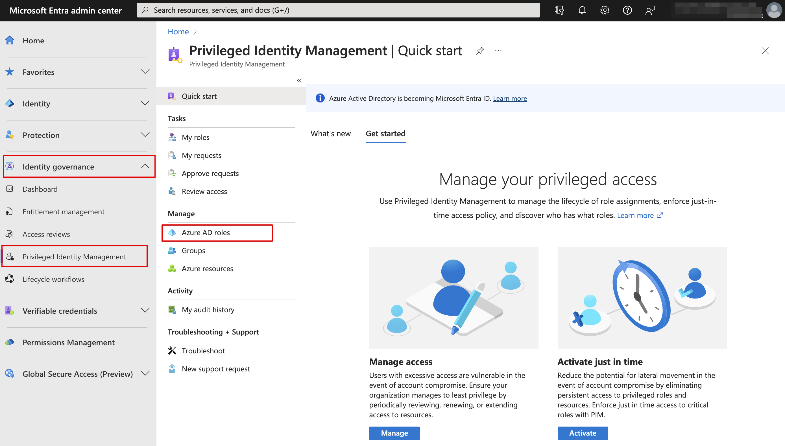
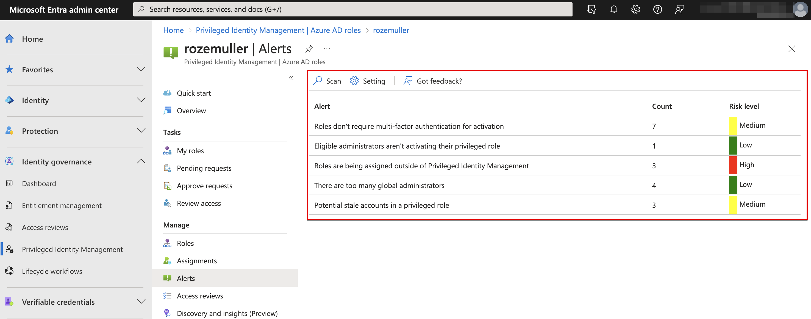
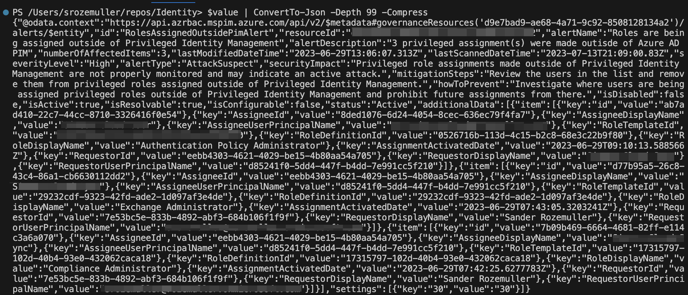
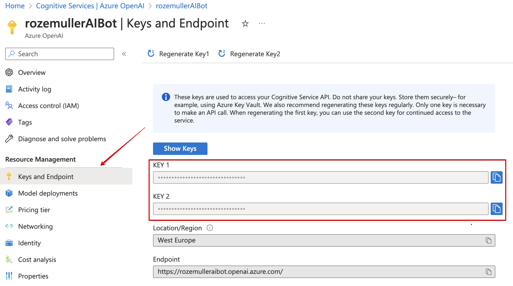
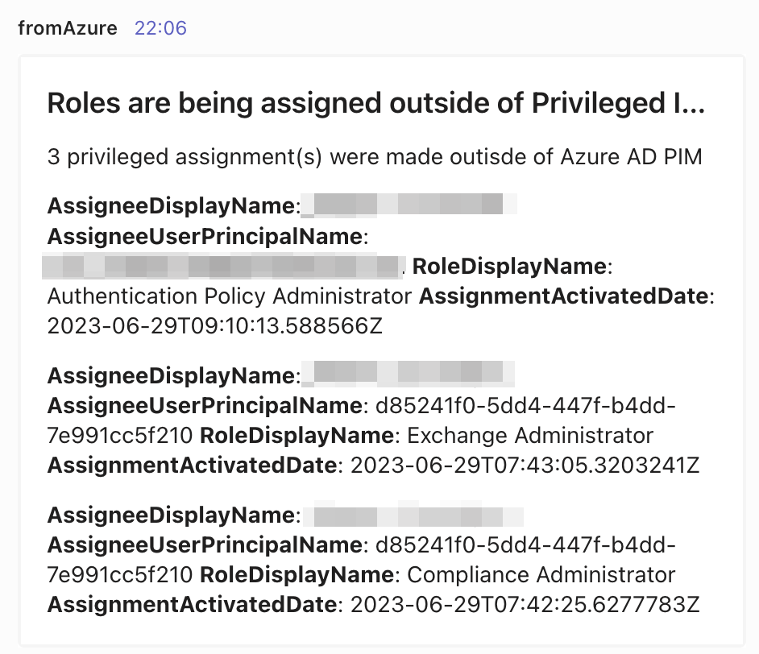

Another big helper in implementing a Zero Trust environment is the use of Privileged Identity Management, aka PIM. It is a best practice assigning the least permissions as needed for the shortest amount of time. PIM helps you with that. 
After implementing PIM you have left-overs of admins assign roles to identities without PIM. In that case there is a mechanism that check if there are roles assign outside PIM.

In this blog I show how to get PIM alerts using the PIM API backend and sent the information to MS Teams. To create a nice MS Teams card, I ask Azure Open AI.



## PIM Alerts
The PIM alerts can be found in the Entra portal (https://entra.microsoft.com), under Identity governance, PIM -> Azure AD Roles. After clicking on that, in the left menu, Alerts appear.



In the screen shot below you see the alert rules that are currently active. If there are no alerts, you wont see the alert rule in this screen. 
In this particular situation, we have 3 roles that are assigned out PIM. 


More information about PIM alerts, please check [this documentation](https://learn.microsoft.com/en-us/azure/active-directory/privileged-identity-management/pim-how-to-configure-security-alerts)

### Get the PIM alerts
By default, you will get an email alert on the global admin account with the alert. In my situation I want to sent the message to a MS Teams channel with a nicely formatted card. 

To get the PIM alerts, we need the API. Unfortunately, there is no Azure or Graph API endpoint available that gives us the needed information. 
The needed API endpoint is behind a special PIM AzRBAC endpoint called `https://api.azrbac.mspim.azure.com/api/v2`

#### Authentication
Authentication is quite simple by using the [authentication method I used in the blog posts before](https://www.rozemuller.com/zero-to-zero-trust-automation-index/#authentication).
```powershell
$graphHeader = ./Authentication/graph.authentication.interactive.ps1 -ClientId "1950a258-227b-4e31-a9cf-717495945fc2" -TenantName contoso.onmicrosoft.com -Scope "https://api.azrbac.mspim.azure.com//.default"
```

In this example I provide the new API endpoint as the scope. The `1950a258-227b-4e31-a9cf-717495945fc2` is the Azure PowerShell application.

#### Request for PIM alerts
The next step is requesting for PIM alerts using the API. The code I used is stored below.
I narrowed the URL to get specific alerts. 
```powershell
$tenantId = "xxx"

$url = "https://api.azrbac.mspim.azure.com/api/v2/privilegedAccess/aadroles/resources/{0}/alerts/RolesAssignedOutsidePimAlert" -f $tenantId
$value = Invoke-RestMethod -uri $url -Method GET -Headers $graphHeader
$result = $value | ConvertTo-Json -Depth 99 -Compress
```
The result is stored in the `$result` variable. I also used the -Compress parameter to make my results as small as possible. This is because I want to provide the result to OpenAI. To save tokens, I want the smallest object as possible without all the nice JSON object overhead. 



## Get help from OpenAI
In this part we use Azure OpenAI to create a well formatted MS Teams card that shows the alerts in a list and explain what we need to do to fix the problem. 

In an earlier post, I showed [how to deploy Azure OpenAI in an automated way](https://www.rozemuller.com/monitor-conditional-access-changes-using-openai-and-teams/#azure-open-ai). You can read the process there. 
From there, we continue our journey. 

### Generate adaptive card automated
Getting an Open AI response that is also usable took some time. It is all in asking a question as complete as possible. To ask a strict question you narrow the outcome that helps to get the response better. 

The question I asked is `"Generate a well formatted Microsoft Teams adaptive card. The body in de card must contain a list from the additionalData array. Items in the array must be formatted as a list in the card body. The list must contain, per item, the following objects: AssigneeDisplayName, AssigneeUserPrincipalName, RoleDisplayName and AssignmentActivatedDate. Every object name must start in bold text, the value is a normal font. Surround every object with **. The value must contain the value from the JSON content below. Please use the alert name as the card title. \" $($($result).Replace('"',"'")) \" At last, please show me how to correct the issue."`

In the question I refer to the JSON content (`\" $($($result).Replace('"',"'")) \"`) that I provide at the end of the question. The JSON content that came from the PIM alert part. 

### Send the request to OpenAI
With the question and some other parameters I sent the request to OpenAI.

```powershell
$body = @"
{
        "prompt": "Generate a well formatted Microsoft Teams adaptive card. The body in de card must contain a list from the additionalData array. Items in the array must be formatted as a list in the card body. The list must contain, per item, the following objects: AssigneeDisplayName, AssigneeUserPrincipalName, RoleDisplayName and AssignmentActivatedDate. Every object name must start in bold text, the value is a normal font. Surround every object with **. The value must contain the value from the JSON content below. Please use the alert name as the card title.  \" $($($result).Replace('"',"'")) \" At last, please show me how to correct the issue.",
        "temperature": 1,
        "top_p": 0.75,
        "frequency_penalty": 0,
        "presence_penalty": 0,
        "max_tokens": 2000,
        "stop": null
}
"@
```

The `$openAIUrl` is the Azure OpenAI resource's URL added by the deployment name that contains the model. 

More information about the URL can be found [here](https://learn.microsoft.com/en-us/azure/cognitive-services/openai/reference#rest-api-versioning)

The `$openAIHeader` holds the content type that is provided and the API key that represents the "password".

```powershell
$openAIHeader = @{
    'api-key'      = "apikey-that-is-created-during-deployment"
    'Content-Type' = "application/json"
}
```



After sending the request (with the code below) it is waiting for the response that is used to sent to MS Teams.

```powershell
$openAIResponse = Invoke-RestMethod -Method post -uri $openAIUrl -Headers $openAIHeader -Body $body
```


## Sent results to Microsoft Teams
The last step is creating a body to sent to MS Teams. In the code below I created a main adaptive card parts. The card specific content is generated by the OpenAI model and is stored in the `$openAIResponse` in the previous step.

```powershell
$cardBody = @"
{
   "type": "message",
   "attachments": [
       {
           "contentType": "application/vnd.microsoft.card.adaptive",
           "contentUrl": null,
           "content": $($openAIResponse.choices.text),
           "msteams": {
               "width": "Full"
           }
       }
   ]
}
"@
Invoke-RestMethod -Method post -uri $env:teamsUrl -body $cardBody -ContentType 'application/json'

```
In the end, the card is sent to MS Teams




## Summary
In the post I showed how to get alert out of the Privileged Identity Management system. Instead of receiving an e-mail, we use the content to create an adaptive card dynamically based on the content. The card is created by using OpenAI.

{{ < bye > }}