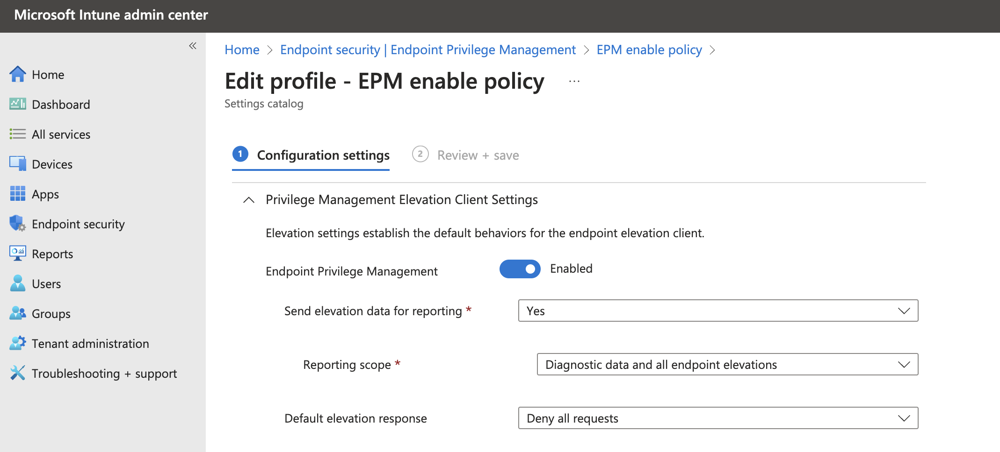
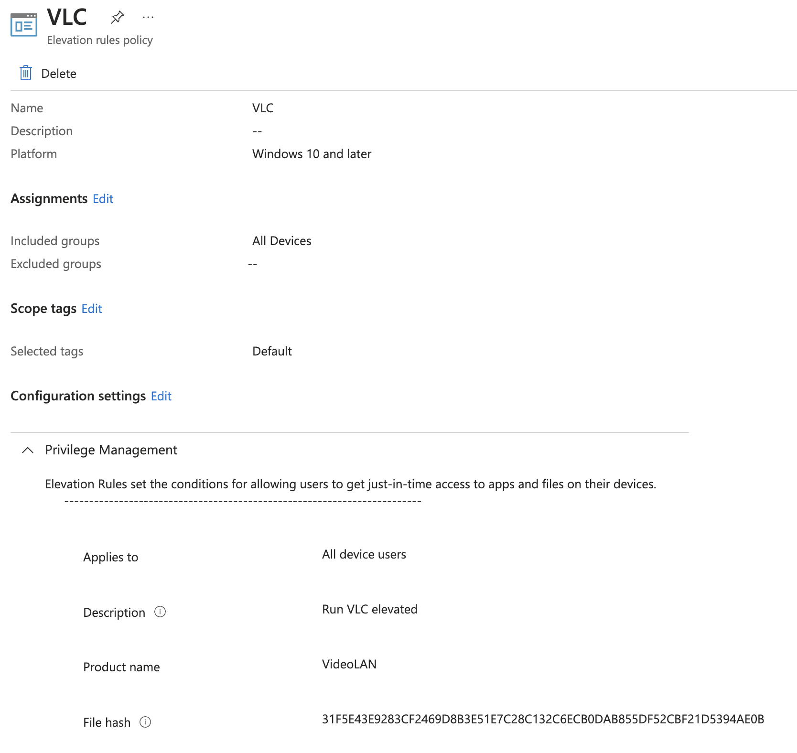
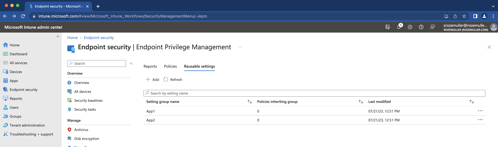
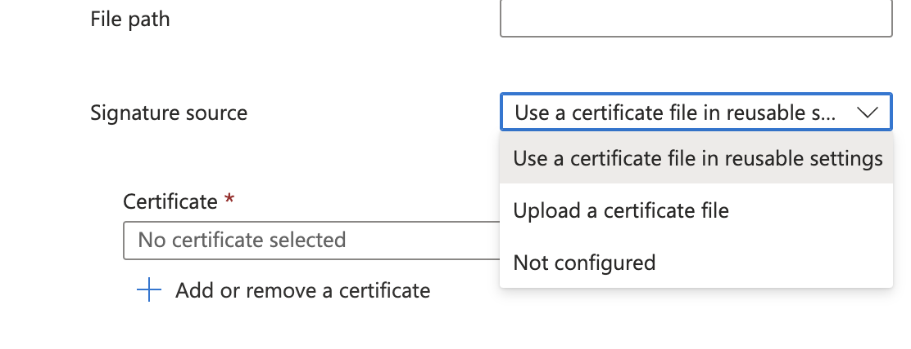

As you may know there is a [Microsoft EMS Community](https://discord.com/invite/msems) Discord channel where we help out eachother. Recently there was a question about how to import certificate file as reusable setting in Endpoint Privilege Management using the Graph API. Together with Steven van Beek we answered that question on how to bulk import certificates using the Graph API. To also help others I like to share the solution.



## Endpoint Privilege Management Overview
Microsoft Intune Endpoint Privilege Management, aka EPM, allows your organization’s users to run as a standard user and complete tasks that require elevated privileges. Tasks that commonly require administrative privileges are application installs (like Microsoft 365 Applications), updating device drivers, and running certain Windows diagnostics.
EPM supports your Zero Trust journey by helping your organization achieve a broad user base running with least privilege, while allowing users to still run tasks allowed by your organization to remain productive. Check my other blog posts about [how to deploy Zero Trust components in an automated way](https://www.rozemuller.com/zero-to-zero-trust-automation-index/).

Without going into deep to much a little EPM explanation.

The EPM configuration consists of policies. A policy can have EPM settings like if it is enabled and what to do when.


The another policy type a the rule policy. The rules policy is to manage the identification of specific files, and how elevation requests for those files are handled. Each Windows elevation rule policy includes one or more elevation rules. It's with elevation rules that you configure details about the file being managed and requirements for it to be elevated.


A part of the rule policy are certificates to sign the rule. There are two option in these.

- Certificates you add directly to an elevation rule: Each certificate that's added directly to a rule is uploaded as a unique instance by Intune, and that certificate instance is then associated with that rule. Adding the same certificate directly to two separate rules results in it uploading twice. Later, if you must change the certificate, you must edit each individual rule that contains it. With each rule change, Intune uploads the updated certificate a single time for each rule.
- Certificates you manage through a reusable settings group: Each time a certificate is added to a reusable settings group, Intune uploads the certificate a single time no matter how many elevation rules include that group. That instance of the certificate is then associated with the file from each rule that uses that group. Later, any change to the certificate you make can be made a single time in the reusable settings group. This change results in Intune uploading the updated file a single time, and then applying that change to each elevation rule that references the group.

With that in mind it is strongly recommended to using reusable groups.

Check for more information the [Microsoft EMP overview documentation](https://learn.microsoft.com/en-us/mem/intune/protect/epm-overview)

### Upload certificates to reusable groups using Graph API
In this part I show how to upload a certificate to Intune reuseable groups by using the Graph API.
The first step is authentication. To authtenticate I like to refer [this blog post on how to authenticate to Graph API](https://www.rozemuller.com/deploy-power-settings-automated-in-microsoft-endpoint-manager/#authentication).

In the code below, I created a simple loop that reads all the certificates from a folder with the `.cer` extension. Per certificate the content is read and converted into a Base64String. The conversion is needed since the Graph API want that type of content.
There after the body is created with the certifcate base64string content and converted into a JSON object.

At last the JSON body is sent to the Graph API.
```powershell
$certificateFilePath = Get-ChildItem '/Intune/EPM' -Filter '*cer'
$certificateFilePath | ForEach-Object {
    $certificate = New-Object System.Security.Cryptography.X509Certificates.X509Certificate2($certificateFilePath.FullName)
    $base64String = [System.Convert]::ToBase64String($certificate.RawData)

    $jsonObject = @{
        displayName         = $_.BaseName
        description         = "This reusable setting contains the certificate file for the $($_.BaseName) certificate"
        settingDefinitionId = "device_vendor_msft_policy_privilegemanagement_reusablesettings_certificatefile"
        settingInstance     = @{
            "@odata.type"       = "#microsoft.graph.deviceManagementConfigurationSimpleSettingInstance"
            settingDefinitionId = "device_vendor_msft_policy_privilegemanagement_reusablesettings_certificatefile"
            simpleSettingValue  = @{
                "@odata.type" = "#microsoft.graph.deviceManagementConfigurationStringSettingValue"
                value         = "-----BEGIN CERTIFICATE-----`n$base64String`n-----END CERTIFICATE-----`n"
            }
        }
        "@odata.type"       = "#microsoft.graph.deviceManagementReusablePolicySetting"
    }
    $json = $jsonObject | ConvertTo-Json
    $uri = "https://graph.microsoft.com/beta/deviceManagement/reusablePolicySettings"
    Invoke-WebRequest -uri $uri -body $json -Method post -Headers $authHeader
}
```
In the end the certifactes are available in the Intune portal.



### Reqeusting the EPM reusable certificates
To retreive the certificates back from the Graph API use the code below. Because there is no specific endpoint for retreiving certificates, I've set a filter in the URL that filters the results back to only items with a property that fits `policy_privilegemanagement_reusablesettings_certificatefile`. Also known as the EPM reusable certificate file.

```powershell
$url = "https://graph.microsoft.com/beta/deviceManagement/reusablePolicySettings?`$select=id,displayName,referencingConfigurationPolicyCount,lastModifiedDateTime&`$filter=settingDefinitionId%20eq%20%27device_vendor_msft_policy_privilegemanagement_reusablesettings_certificatefile%27"
$certificates = (Invoke-WebRequest -uri $url -Method GET -Headers $authHeader) | ConvertFrom-Json
$certificates.value
```

## Create an EPM rule policy with a reusable certificate
After the cerficates are available and we know how to retreive certificates we can create an EPM rule policy with the reuseable certificate.
Creating an EPM policy using the Graph API is a part of `/deviceManagement/configurationPolicies`. Based on the provided types and settings, the Graph API knows what profile type it is. In the case of an EPM policy we have to provide the following types.

The basic body without settings looks like below. By providing `endpointPrivilegeManagement` under technologies the api knows it is an EPM policy.
```powershell
$body = @{
    "name" = "MS Teams"
    "description" = "This is a MS Teams policy"
    "platforms" = "windows10"
    "technologies" = "endpointPrivilegeManagement"
    "settings" = @()
}
```

The settings part is complex. Every setting in Intune has its own id and settings names. A simple example is the part where to select the certificate source (upload or reuseable).


In the settings part the id is `"device_vendor_msft_policy_privilegemanagement_elevationrules_{elevationrulename}_signaturesource_0"`
Based on that setting choise, specific options become available.
In the JSON body it looks like below. (part of all settings).

In the first block under @odata.type `#microsoft.graph.deviceManagementConfigurationReferenceSettingValue` you see the value `054973c0-c52c-4313-b044-be61f5dabf18`
This is the certificate ID from the request above. 

```json
 "children": [
    {
        "@odata.type": "#microsoft.graph.deviceManagementConfigurationSimpleSettingInstance",
        "settingDefinitionId": "device_vendor_msft_policy_privilegemanagement_elevationrules_{elevationrulename}_certificatepayloadwithreusablesetting",
        "simpleSettingValue": {
            "@odata.type": "#microsoft.graph.deviceManagementConfigurationReferenceSettingValue",
            "value": "054973c0-c52c-4313-b044-be61f5dabf18"
        }
    },
    {
        "@odata.type": "#microsoft.graph.deviceManagementConfigurationChoiceSettingInstance",
        "settingDefinitionId": "device_vendor_msft_policy_privilegemanagement_elevationrules_{elevationrulename}_certificatetype",
        "choiceSettingValue": {
            "@odata.type": "#microsoft.graph.deviceManagementConfigurationChoiceSettingValue",
            "value": "device_vendor_msft_policy_privilegemanagement_elevationrules_{elevationrulename}_issuingauthority",
            "children": [],
            "settingValueTemplateReference": {
                "settingValueTemplateId": "e36c490a-62b5-4b8c-8b2a-f099fad4441b"
            }
        },
        "settingInstanceTemplateReference": {
            "settingInstanceTemplateId": "ea3b1b52-411c-4d89-80e9-c2289e59a97f"
        }
    }
],
```

The complete file is stored in my [GitHub](https://github.com/srozemuller/MicrosoftEndpointManager/tree/main/EPM). The file is just a representation of what it could be. This is not a valid working MS Teams rule.

## Summary
In the post I showed how to upload, retreive and how to use reusable Elevated Permission Management certificates in Intune.


