Autoscaling for pooled AVD host pools is GA for a while now. Since 18 July 2023 a new autoscale mechanism became in Public Preview for AVD **personal** host pools.
Currently it is only supported to configure autoscale for personal host pools by using the portal. There are no API's or PowerShell modules available (yet) to automate the creation or mutating personal scaling plans or schedules.

But there are options, of course there is an API available to use for automation. In this blogpost, I show how to use the Azure API to configure AVD Personal Scaling Plans in an automated way.

*As said, the use of the API is not supported yet by Microsoft. The API may change during the time*.


## Azure Virtual Desktop Personal Scaling Plan
First, lets take a look of what the personal scaling plan is, how it looks like and how to configure.
The main scaling plan task is to reduce Azure costs (consumption). This means shutting down and deallocating session host VMs during off-peak usage hours, then turning them back on and reallocating them during peak hours.
About the personal type scaling plan, in the basics it does the same as the pooled scaling plan. It looks every minute to the session host state and kicks in when needed. 

But there are some differents in to configure. 

### How AVD Personal Scaling Plan works


### AVD Personal Scaling Plan configuration
Creating a personal scaling plan can be done by using the Azure Portal under the Azure Virtual Desktop or Scaling Plan services. In the main screen you are able to select the type Pooled or Personal. 

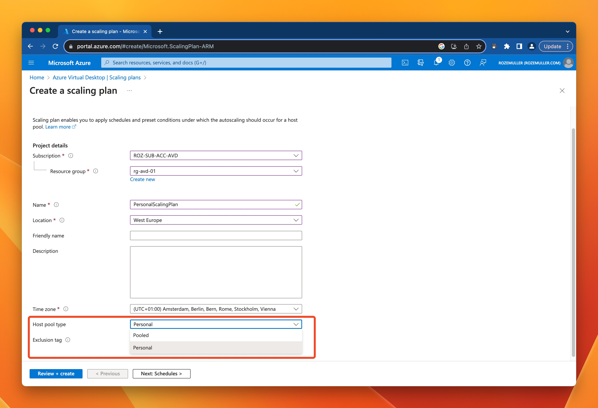

In the next screen you have the option to create schedules. In the *repeat on* dropdown select the days that the plan must work. 
You can only create one schedule per day. That means if there is a schedule that runs on Monday, no other schedule can be made in this plan for Monday.

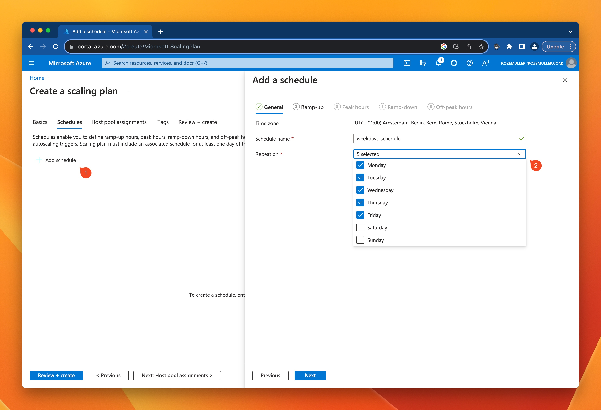

In the next tabs you are able to configure different phases for the plan. The different phases are:

- *Ramp-up*: This is a bit of the warm-up phase. This is the daily moment where the VM's are started in front. 
  The start time for the ramp up phase of the schedule. This is the time at which personal desktops (assigned, all, or none) in the host pool will be started.

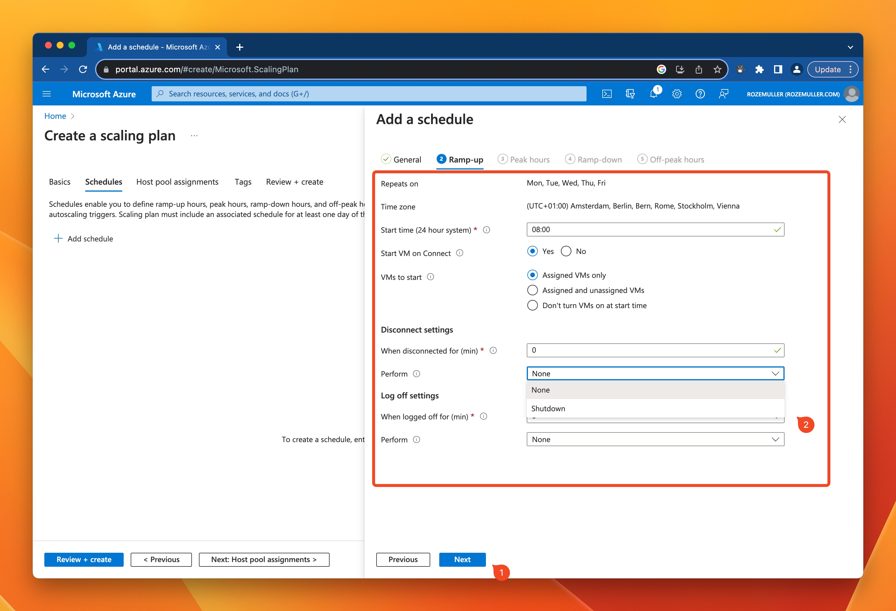

In the next phases (Peak hours, Ramp-down, Off-peak hours) you configure how the VMs are acting during the day after they are started.
From this time the scaling plan is not starting VM out of itself. 
In these phases the following settings are available. 

- Start Time : The start time is the time when the previous phase ends. 
- Start VM on Connect: This setting takes care starting a VM when connecting, if a VM is stopped. (Setting this to Yes is highly recommended)
- Disconnected time in minutes: This is the time the auto scale mechanism waits till performing an action. If the value is 0, the engine takes action as soon he walks by. 
- Logged off time: This is the same as the disconnected time, but now when a user has completely logged off. 

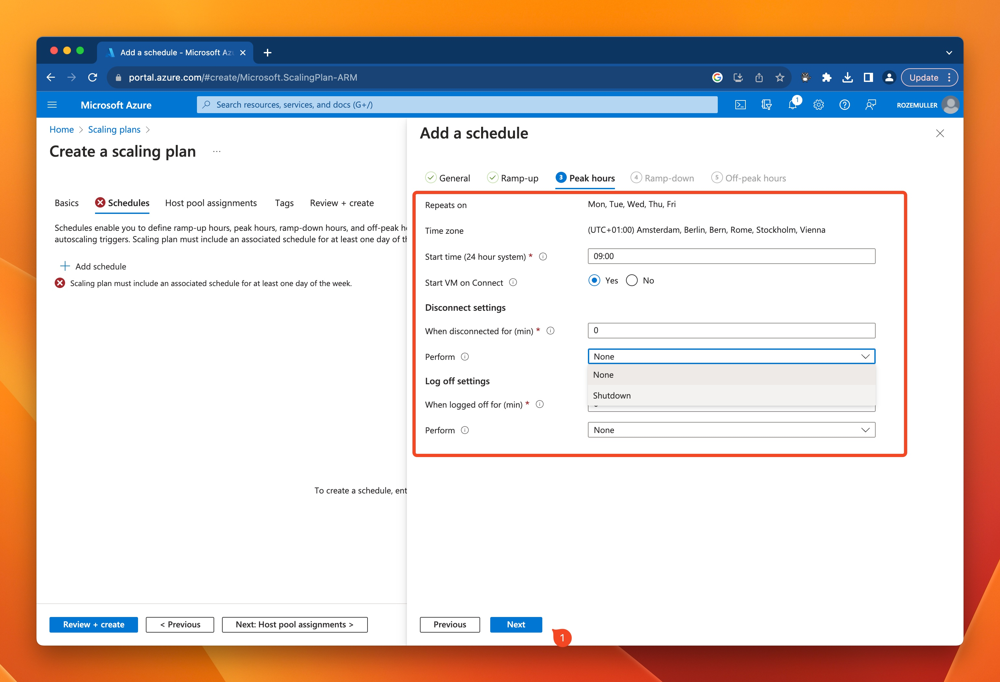

If you have selected Yes at Start VM on Connect and assign the scaling plan to the host pool, it enables the option at the host pool automatically.

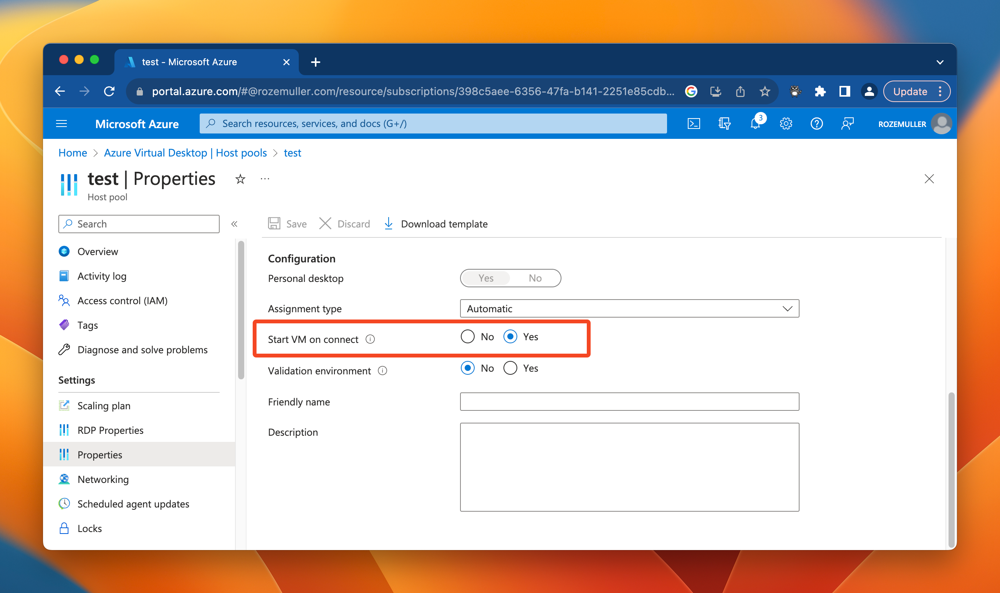

The last step is assigning an AVD host pool. Good to know is that the scaling plan must be at the same region like West Europe. The list only shows the host pools that fits the scaling plan type.

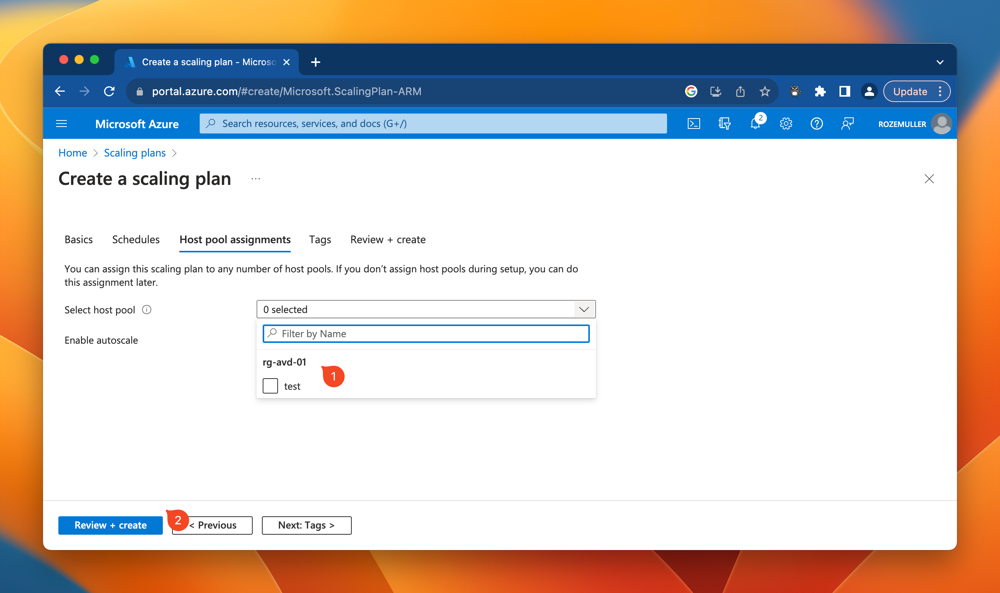
## Create AVD Personal Scaling Plan from an automation perspective
Now the automation part that is not documented yet as available in the Az.DesktopVirtualization PowerShell module. 

### Scaling plan architecture
As shown above, while walking through the create scaling plan wizard, a scaling plan has three main components, the basics, schedules and host pool assignments. However, it looks like it is all the same resource, under the hood the scaling plan and schedules are two different resources. Both also have a different resource ID. 
The host pool assignment is an object in the scaling plan resource.
Lets take a look how a response in the backend looks like.

The red arrows are the scaling plan resource basics like the resource ID, name, description. All that is on the basics tab. 

The green arrow is the object that holds the host pool resource ID(s). 
The yellow arrow is the object that (should) hold the schedules. Unfortunately this is not filled in (yet). I asked Microsoft to add this in the API as well since there is an object already.

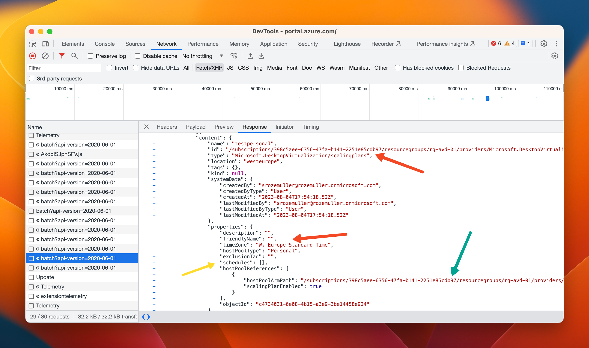

When using the portal and selecting a scaling plan, in the backend two API calls are executed.
In a request later (2), the schedules are gathered in the background.

The response looks like below. 

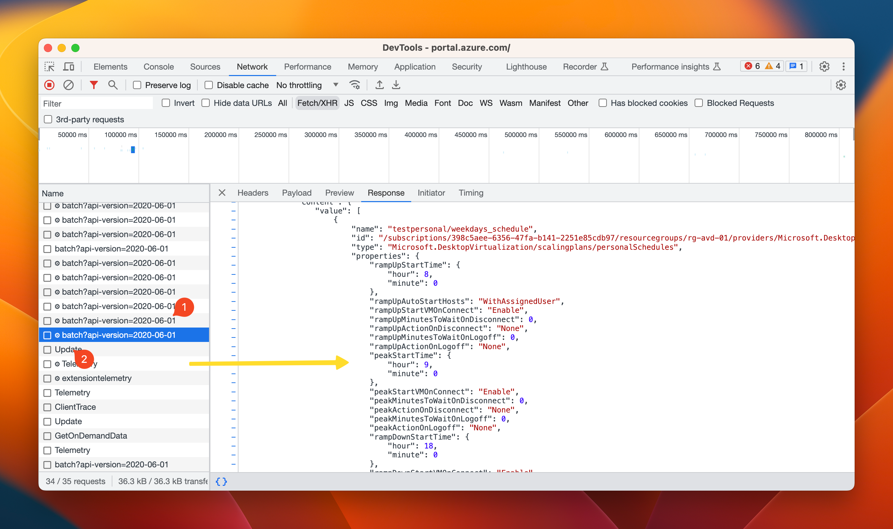

With that in mind, we have to execute two API call in automation to get a scaling plan including the schedules. 

### Get AVD scaling plans automated
To get an AVD personal scaling plans using automation, several scope are available.  The scopes are subscription, resource group, host pool and the plan itself. 

The API endpoints look like below.

At subscription level
```basic
https://management.azure.com/subscriptions/{subscriptionId}/providers/Microsoft.DesktopVirtualization/scalingPlans
```

At resource group level
```basic
https://management.azure.com/subscriptions/{subscriptionId}/resourceGroups/{resourcegrouName}/providers/Microsoft.DesktopVirtualization/scalingPlans
```

At host pool level
```basic
https://management.azure.com/subscriptions/{subscriptionId}/resourceGroups/{resourcegrouName}/providers/Microsoft.DesktopVirtualization/hostpools/{hostpoolname}/scalingPlans
```

At scaling plan level
```basic
https://management.azure.com/subscriptions/{subscriptionId}/resourceGroups/{resourcegrouName}/providers/Microsoft.DesktopVirtualization/scalingPlans/{planName}
```

In the screenshot below, I requested all scaling plans at subscription level.
1) I created the URL as discussed above
2) I created an object with parameters that holds the URL, the method GET (to get information) and the authentication header. Check for more information my [blog post about interactive authentication](https://www.rozemuller.com/zero-to-zero-trust-automation-index/#authentication)
3) In step 3, I send the Invoke-WebRequest command with the parameters. Because the return is in JSON format, I converted the return from JSON into PowerShell objects and selected the value object. 
4) The results.

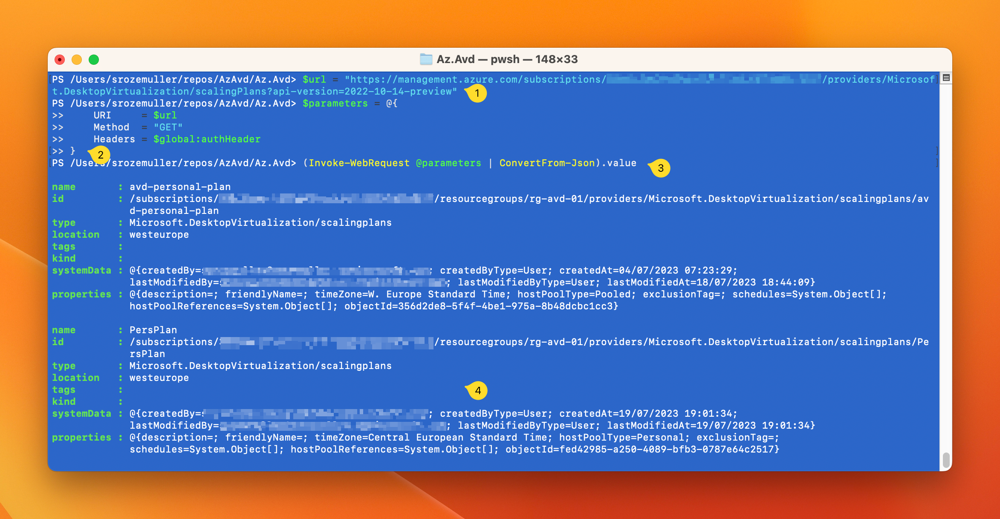
### Get AVD scaling plan schedules automated
As mentioned, a schedule is a separated Azure resource this is connected to the scaling plan. That means, we have to request for schedules at scaling plan level. 

The screenshot below shows a result after requesting the schedules from my 'test' personal scaling plan. 
1) I created an URL again. As you can see the URL has a subscriptionId, the resource group name and the scaling plan name. This is also the part where it becomes a bit strange because we have to request for the specific schedule type 'PersonalSchedules'. 
	This suggests a scaling plan can have more schedule types in the future. (The other type is PooledSchedules)
2) In the second step we fill in the parameters again.
3) In this step the request is send, the response is converted from JSON again and the value object is selected. 
4) The result. 

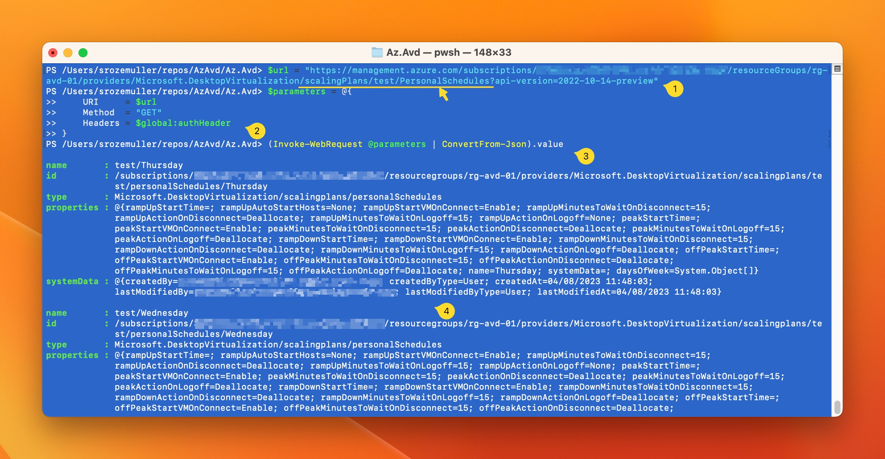

### Az.Avd Personal Scaling plan commands
To automate AVD personal scaling plans, I added new PowerShell commands to the [Az.Avd PowerShell module](https://www.powershellgallery.com/packages/Az.Avd). These commands helps automating the creation, removing and updating the personal AVD scaling plans. 

#### Get AVD Personal scaling plan
After connecting using the `Connect-Avd` command you can use the commands below.
The command below returns all scaling plans (pooled & personal) in the current context. The context is at subscription level. Changing the context can be done by using set `Set-AvdContext -SubscriptionId xxx`.

```powershell
Get-AvdScalingPlan
```

The command returns the default scaling plan info added by the plan type, if the plan is enabled and assigned to a host pool. 

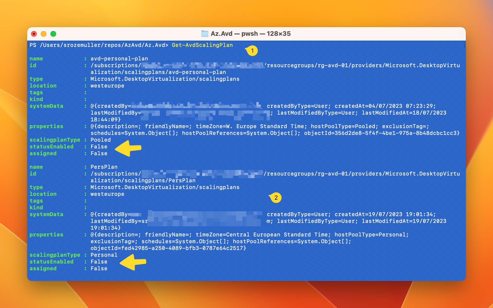

Also the schedule is added in this return under the properties object.
In the command below I request the `test` personal scaling plan and converted the output to a JSON format. This to show the complete output.

```powershell
Get-AvdScalingPlan -Name test -ResourceGroupName rg-avd-01 | Select-Object name, @{N="Schedules";E={$_.properties.schedules}} | ConvertTo-Json -Depth 99
```

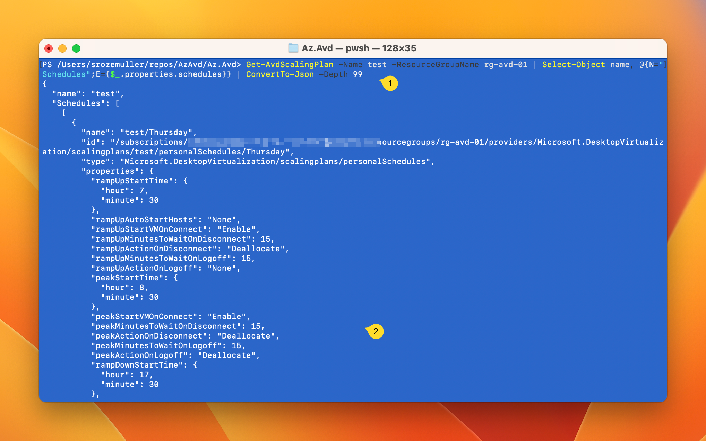

#### Get AVD personal scaling plan schedule
Requesting the schedule is also possible by using the command below.

```powershell
Get-AvdScalingPlanSchedule -ScalingPlanName test -ResourceGroupName rg-avd-01
```

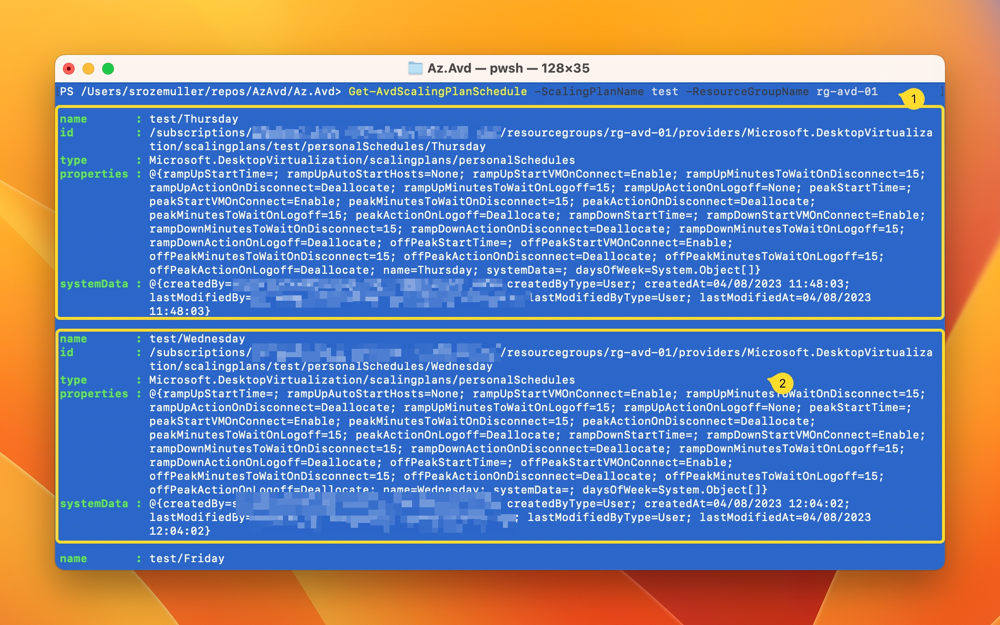

The commands are available in Az.Avd version 3.1.0 and above. To upgrade use `Update-Module Az.Avd`

#### Remove AVD Scaling plan (and schedule)
Removing scaling plans or schedules is also possible. Then, use these commands:

```powershell
Remove-AvdScalingPlan
```

```powershell
Remove-AvdScalingPlanSchedule
```

#### Create an AVD personal scaling plan automated
It is also possible to create an AVD personal scaling plan and schedules. 
To create an AVD personal scaling plan, use the command below. I create a personal scaling plan and assign it to an existing host pool.

If you like to assign the personal plan to several host pools, then provide more host pools like this `@{"Test" = "RG-AVD-01"; "OtherHostpool" = "RG-AVD-02"}`
The plan's name is resource group unique.

```powershell
New-AvdPersonalScalingPlan -Name 'ScalingPlan' -ResourceGroupName 'rg-avd-01' -Location 'WestEurope' -AssignToHostpool @{"Test" = "RG-AVD-01"}
```

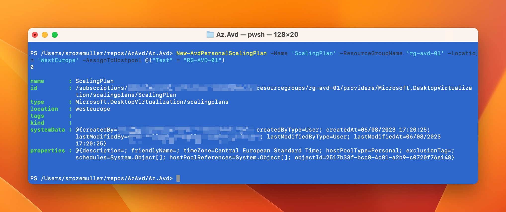

After the plan is created, you must add a schedule to the plan. The code I used is stored below.

```powershell

$peakObject = @{
    peakMinutesToWaitOnDisconnect = 15
    peakMinutesToWaitOnLogoff = 15
    peakStartVMOnConnect = "Enable"
    peakActionOnLogoff = "Deallocate"
    peakActionOnDisconnect = "Deallocate"
    peakStartTime = "08:30"
}

$rampUpObject = @{
    rampUpMinutesToWaitOnDisconnect = 15
    rampUpMinutesToWaitOnLogoff = 15
    rampUpStartVMOnConnect = "Enable"
    rampUpActionOnLogoff = "Deallocate"
    rampUpActionOnDisconnect = "Deallocate"
    rampUpStartTime = "07:30"
}

$rampDownObject = @{
    rampDownMinutesToWaitOnDisconnect = 15
    rampDownMinutesToWaitOnLogoff = 15
    rampDownStartVMOnConnect = "Enable"
    rampDownActionOnLogoff = "Deallocate"
    rampDownActionOnDisconnect = "Deallocate"
    rampDownStartTime = "17:30"
}

$offPeakObject = @{
    offPeakMinutesToWaitOnDisconnect = 15
    offPeakMinutesToWaitOnLogoff = 15
    offPeakStartVMOnConnect = "Enable"
    offPeakActionOnLogoff = "Deallocate"
    offPeakActionOnDisconnect = "Deallocate"
    offPeakStartTime = "18:30"
}

New-AvdScalingPlanSchedule -ScalingPlanName "test" -ResourceGroupName 'rg-avd-01' -ScheduleName 'Thursday' -daysOfWeek @("Tuesday") @peakObject @rampUpObject @rampDownObject @offPeakObject

```


In the demo below, I show how to create a schedule.


#### Assign and unassign AVD host pools to an AVD personal scaling plan
There are 4 commands that help you assigning and unassigning host pools on a personal scaling plan. Two official commands and two aliasses.

```powershell
Publish-AvdScalingPlan -Name 'ScalingPlan' -ResourceGroupName 'rg-avd-01' -AssignToHostpool @{"Test" = "RG-AVD-01"} -verbose
```

```powershell
Unpublish-AvdScalingPlan -Name 'ScalingPlan' -ResourceGroupName 'rg-avd-01' -AssignToHostpool @{"Test" = "RG-AVD-01"} -verbose
```

Also two aliasses are available, `Assign-AvdScalingPlan` and `Unassign-AvdScalingPlan`


#### Enable/disable host pool scaling plans

The short demo below shows how to enable/disable the host pool assignments.




The commands used are:

```powershell
Enable-AvdScalingPlan -Name 'ScalingPlan' -ResourceGroupName 'rg-avd-01' -Hostpool @{"Test2” = "RG-AVD-01"}
```

```powershell
Disable-AvdScalingPlan -Name 'ScalingPlan' -ResourceGroupName 'rg-avd-01' -Hostpool @{"Test2” = "RG-AVD-01"}
```
## Things to keep in mind

- When you create or update a scaling plan that's already assigned to host pools, its changes will be applied immediately.
- It is highly recommend that you enable Start VM on Connect if you choose not to start your VMs during the ramp-up phase. When enabling the option in the scaling plan, the feature will be enabled automatically as host pool level when the host pool is assigned
- While autoscale for personal host pools is in preview, it is not recommended assigning a scaling plan to a personal host pool with more than 2000 session hosts.

Check for more information about AVD personal scaling plans the [AVD personal scaling plan overview](https://learn.microsoft.com/en-us/azure/virtual-desktop/autoscale-scaling-plan?tabs=personal-autoscale)