Implementing conditional access policies have a huge impact on your identities and organisation. After implementation, there could be a situation conditional policies need changes. Think about the state, adding or excluding users, or adding a security strength for example. 

Because changing policies also can have a huge impact, it is good to know if a policy is changed. 
In this blog, I show a how to track changes and get notified when a conditional access policy is changed. If a policy is changed, a message is sent to a MS Teams channel.



## Overview
The main idea is to get triggered by the Azure Monitor if a conditional access policy is changed. In the Azure Monitor an Alert Rule is configured that looks every n period into the Azure AD audit logs. If an alert occurred, the message is sent to an Azure Function. 

The Azure Functions sends a message with content to a MS Teams webhook-URL.


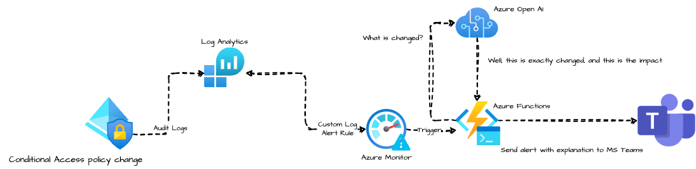

## Azure AD Audit Logs
It all starts with [Azure AD Audit logs](https://learn.microsoft.com/en-us/azure/active-directory/reports-monitoring/concept-audit-logs#how-do-i-access-it). Changes to applications, groups, users, and licenses are all captured in the Azure AD audit logs. Also Conditional Access updates are logged in Audit logs and much more.

No surprise this is my starting point 🙃. 

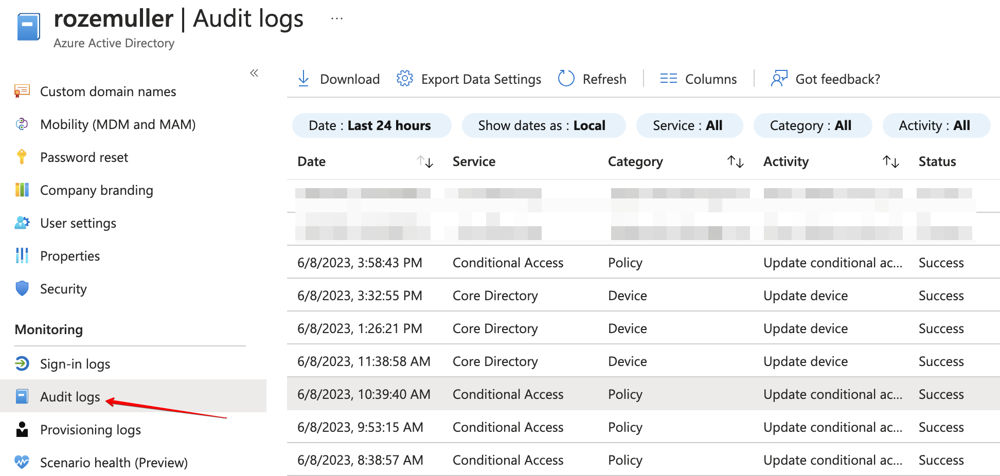

### Monitor Azure AD Audit Logs
To use audit logs for monitoring, diagnostic settings must be configured with at least audit logs enabled. Before configuring diagnostic settings, you must have a Log Analytics workspace to store the data. 

The goal in this part is to send audit logs to a Log Analytics workspace. If you have this configured already, you can skip this whole part. This is because you can send specific logs to one workspace only. 

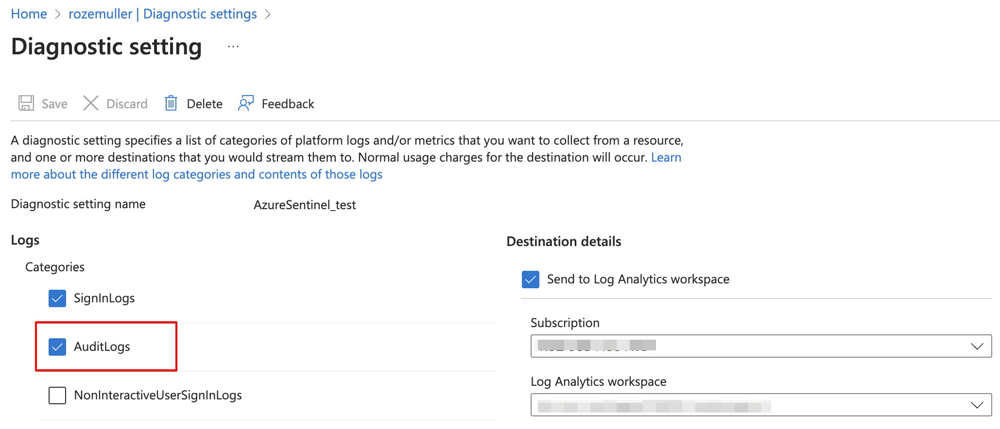

#### Automated checking configuration 
Checking if audit logs are send already, can be done with the code below:
```powershell
$diagUrl = "https://management.azure.com/providers/microsoft.aadiam/diagnosticSettings?api-version=2017-04-01-preview"
$diagSettings = Invoke-RestMethod -uri $diagUrl -Method get -Headers $authHeader

if ($diagSettings.value.properties.logs | Select-Object -Property * | Where-Object { $_.category -eq "AuditLogs" -and $_.enabled -eq "True" })
{
	"Found a policy that has the audit logs enabled"
}
```

This PowerShell code is requesting the URL representing the Azure Active Directory (AAD) diagnostic settings. Let's break it down step by step:

1. The variable `$diagUrl` is assigned the value "[https://management.azure.com/providers/microsoft.aadiam/diagnosticSettings?api-version=2017-04-01-preview](https://management.azure.com/providers/microsoft.aadiam/diagnosticSettings?api-version=2017-04-01-preview)". This URL represents the endpoint for retrieving diagnostic settings for Azure Active Directory.
2. The `Invoke-RestMethod` cmdlet is used to send an HTTP GET request to the specified URL (`$diagUrl`). It retrieves the diagnostic settings for Azure Active Directory using the Azure Management API. The retrieved settings are stored in the variable `$diagSettings`.
3. The code then checks the retrieved diagnostic settings using an `if` statement. It examines the value of the `properties.logs` property within `$diagSettings`.
4. The `Select-Object -Property *` command is used to select all properties of the `properties.logs` object.
5. The `Where-Object` cmdlet is applied to the selected properties to filter and find a specific condition. In this case, it checks if there is a log category with the value "AuditLogs" and its corresponding `enabled` property is set to "True". If such a log category exists, the condition within the `if` statement evaluates to true.
6. If the condition evaluates to true, the code outputs the message "Found a policy that has the audit logs enabled". This indicates that there is a policy in the Azure Active Directory diagnostic settings with the "AuditLogs" category and it is enabled.

Overall, this code fetches the diagnostic settings for Azure Active Directory and checks if there is a policy with audit logs enabled.

#### Configuring audit logs diagnostics settings
If you have a Log Analytics workspace already, you can skip the first part. Otherwise, create a Log Analytics workspace automated using the command below. The code creates the most simple workspace with less retention as needed. It is just used for receiving logs to create alerts.

```powershell
$subscriptionId = 'xxx'
$resourceGroup = 'rg-monitoring-01'
$workspaceName = "la-moni-weu-01"

$laUri = "https://management.azure.com/subscriptions/{0}/resourcegroups/{1}/providers/Microsoft.OperationalInsights/workspaces/{2}?api-version=2021-12-01-preview" -f $subscriptionId, $resourceGroup, $workspaceName
$laBody = @{
	location = "westeurope"
		properties = @{
			retentionInDays = 30
			sku = @{
				name = "PerGB2018"
			}
		immediatePurgeDataOn30Days = $true
	}
} | ConvertTo-Json
$laResponse = Invoke-RestMethod -uri $laUri -Method PUT -Headers $authHeader -Body $laBody
$laResponse
```

If you have an exiting workspace, then use the code below to gather the workspace ID.
```powershell
$subscriptionId = 'xxx'
$resourceGroup = 'rg-monitoring-01'
$workspaceName = "la-moni-weu-01"

$laUri = "https://management.azure.com/subscriptions/{0}/resourcegroups/{1}/providers/Microsoft.OperationalInsights/workspaces/{2}?api-version=2021-12-01-preview" -f $subscriptionId, $resourceGroup, $workspaceName

$laResponse = Invoke-RestMethod -uri $laUri -Method GET -Headers $authHeader
```

To create a diagnostics rule, I use the `$diagUrl` variable again added by the diagnostics name. 
The code configures diagnostic settings for AuditLogs in Azure Active Directory. It constructs a URL for the API request and prepares a request body. The request body specifies the log categories to enable, retention policy, and the destination workspace for the logs. 
The request body is converted to JSON and sent as an HTTP PUT request to the specified URL. 

```powershell
$diagUrl = "https://management.azure.com/providers/microsoft.aadiam/diagnosticSettings/{0}?api-version=2017-04-01-preview" -f "diagTest"
$diagBody = @{
    name = "TestDiag"
    properties = @{
        logs = @(
            @{
                "category"        = "AuditLogs"
                "categoryGroup"   = $null
                "enabled"         = $true
                "retentionPolicy" = @{
                    "days"    = 0
                    "enabled" = $false
                }
            }
        )
    workspaceId = $laResponse.id
    }
} | ConvertTo-Json -Depth 10
Invoke-RestMethod -uri $diagUrl -Method PUT -Headers $authHeader -Body $diagBody
```

Now you have configured sending Azure AD audit logs to a Log Analytics workspace. 


## Azure Open AI
This is the most fun part of this approach. Using OpenAI to generate a message for an administrator. Creating a message using OpenAI is not without a reason. After a conditional access is changed the Audit Logs shows what is changed by displaying the old and new configuration. 
That sounds great, till you see what is shown. 

The overview shows the full before and after conditional access configuration in JSON format. It is very hard to see what is changed. Even when formatting the JSON content into correct JSON format. An example log, with a change, is shown below. 
As you can see, it is very hard to read what is changed exactly.

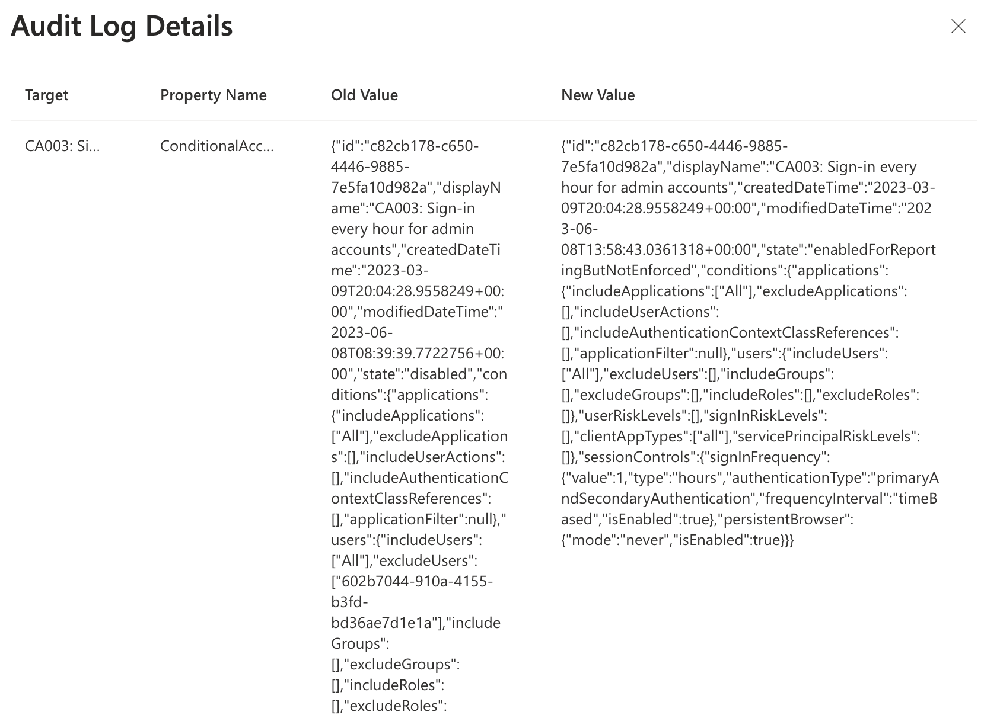

So the main idea is to provide OpenAI both JSON formats, and ask to compare both objects. Many ways are available for using OpenAI, where ChatGTP is the most famous currently. 

In this case, I use [Azure OpenAPI](https://learn.microsoft.com/en-us/azure/cognitive-services/openai/overview). To use Azure OpenAI, the following basic steps are needed for initial setup.

1: You have to ask Microsoft to make this service available in your subscription. After fill in the form, I could take a few days till the service is activated in your subscription.

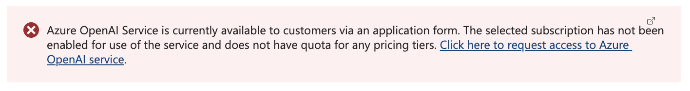
2: After the service is activated, we need an OpenAI resource. I used the code below to create the resource. 
I added the `customSubDomainName` value under the properties object. This is the API endpoint we are calling later. This must be a globally unique URL.

```powershell
$openAiAccount = 'rozemullerAIBot'
$openAiUri = "https://management.azure.com/subscriptions/{0}/resourceGroups/{1}/providers/Microsoft.CognitiveServices/accounts/{2}?api-version=2021-10-01" -f $subscriptionId, $resourceGroup, $openAiAccount
$openAiBody = @{
    location = "West Europe"
    kind = "OpenAI"
    sku = @{
      name = "S0"
    }
    properties = @{
        customSubDomainName = $openAiAccount
    }
} | ConvertTo-Json
$openAiResource = Invoke-RestMethod -Uri $openAiUri -Method PUT -Headers $authHeader -Body $openAiBody
```

The body is very basic by providing a location, the type, SKU type (which S0 is currently the only one), and the resources is also a system assigned identity in the Azure AD.
Make a note of the type that is `OpenAI`. More types are available like speech or language for example. 

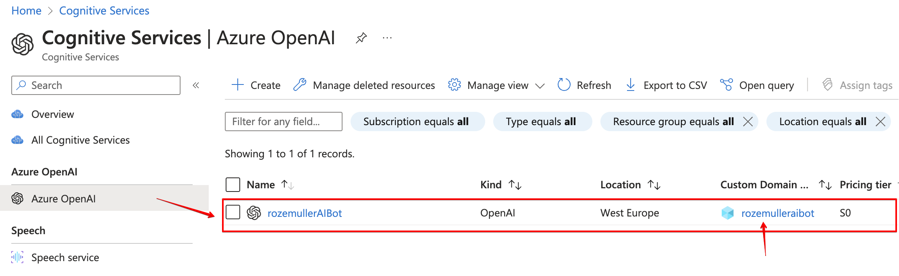

3) After resources is available the AI models can be placed in the resources. Famous models are GPT-4, DALL-E or Codex. Every model has his own specialty. 

More information about AI models can be found [here](https://learn.microsoft.com/en-us/azure/cognitive-services/openai/concepts/models)

The code to deploy a model in a resource is shown below. The deployment name is the display name in the portal. The deployment name is provided in the URI. 

The model name in the properties object (in this example `text-davinci-003`)  is the real OpenAI model name.

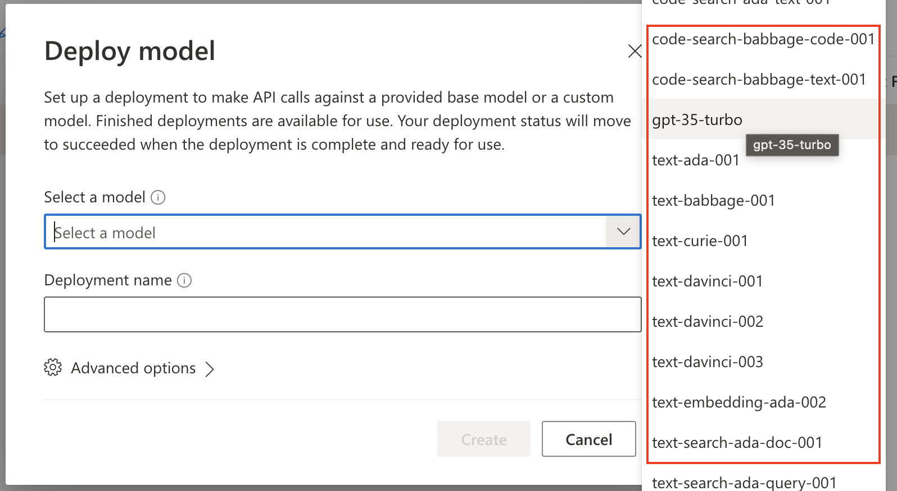
```powershell
$deploymentName = "find-ca-changes"
$openAIModelUri = "https://management.azure.com/{0}/deployments/{1}?api-version=2023-05-01" -f $openAiResource.id, $deploymentName
$openAIModelBody = @{
    properties = @{
        model = @{
            format = "OpenAI"
            name = "text-davinci-003"
            version = 1
        }
        versionUpgradeOption = "OnceNewDefaultVersionAvailable"
    }
    sku = @{
        name = "Standard"
        capacity = 120
    }
} | ConvertTo-Json -Depth 5
$openAIModel = Invoke-RestMethod -Uri $openAIModelUri -Method PUT -Headers $authHeader -Body $openAIModelBody
```

It is possible to add more models in a resource. When sending a request to the AI resource, you must provide the model. 
In the end, the portal shows the models like below.

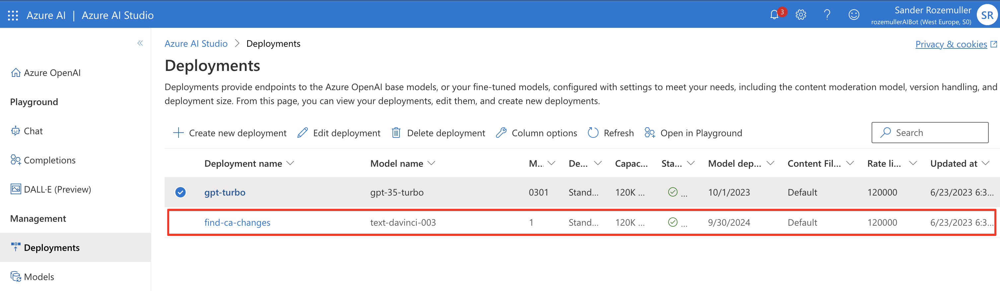

### Retrieve OpenAI key using Azure API
To access an OpenAI resource we need a few details. The public URL and the access key. After the resources is deployed, an URL and key is created automatically. To retrieve the key, use the command below.
I store the output into a variable because I need the values later.

The URL is  https://{account}.openai.azure.com/, check [this](https://learn.microsoft.com/en-us/azure/cognitive-services/openai/reference) Microsoft document for more information.

```powershell
$openAiAccount = 'rozemullerAIBot'
$openAiUri = "https://management.azure.com/subscriptions/{0}/resourceGroups/{1}/providers/Microsoft.CognitiveServices/accounts/{2}/listKeys?api-version=2021-10-01" -f $subscriptionId, $resourceGroup, $openAiAccount
$openAiKeys = Invoke-RestMethod -Uri $openAiUri -Method POST -Headers $authHeader
$openAiKeys
```

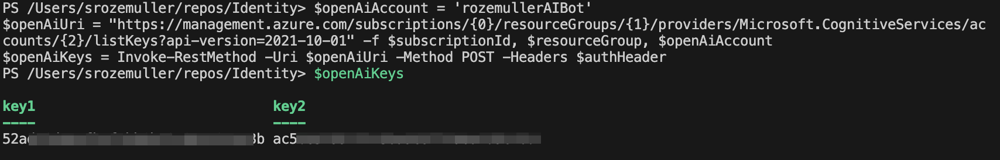

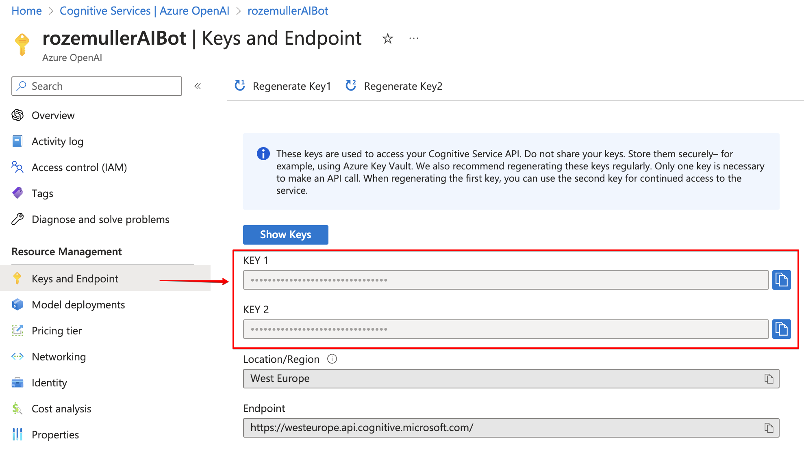

This was a basic Azure OpenAI automated deployment and configuration using the Azure management API. I'm planning a more in depth blog about how to deploy and use Azure OpenAI from an automation perspective. 

## Microsoft Teams
The next step is creating a webhook-connector that presents an public globally unique URL to sent messages to. 
Creating a webhook-connector is pretty simple and out of scope in this post. Please check [this URL for more information about creating an incoming webhook](https://learn.microsoft.com/en-us/microsoftteams/platform/webhooks-and-connectors/how-to/add-incoming-webhook?tabs=dotnet)


### Teams message
To create formatted MS Teams messages, I use adaptive cards. Adaptive cards are JSON formatted content that is send a body to a webhook-URL. In the Azure Function later, I put content into an adaptive card JSON body and sent it to the webhook-URL.

More ways are available to create adaptive cards. The one I used was at https://adaptivecards.io/designer. 
All options are summarised in [this document by Microsoft](https://learn.microsoft.com/en-us/microsoftteams/platform/task-modules-and-cards/cards/design-effective-cards?tabs=design). 

In the end a MS Teams message is sent using the Teams webhook-connector. 
A message example is shown below.

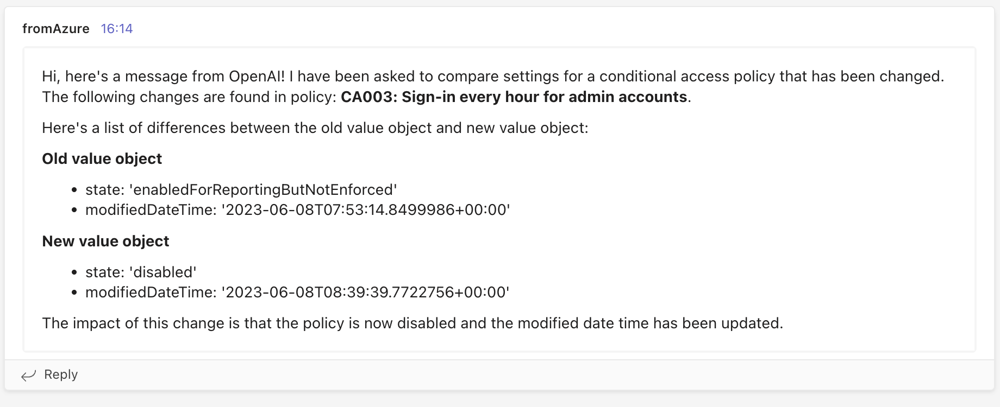

The JSON formatted card I used is stored below.
```json
{
    "type": "message",
    "attachments": [
        {
            "contentType": "application/vnd.microsoft.card.adaptive",
            "contentUrl": null,
            "content": {
                "$schema": "http://adaptivecards.io/schemas/adaptive-card.json",
                "type": "AdaptiveCard",
                "version": "1.4",
                "body": [
                    {
                        "type": "TextBlock",
                        "text": "$($openAIResponse.choices.text)",
                        "wrap": true
                    }
                ],
                "msteams": {
                    "width": "Full"
                }
            }
        }
    ]
}
```

The JSON content above is a part of PowerShell code. In the JSON body I paste the openAI answer on my question. 

## Azure Functions
This is the part where all logic is coming together.  The Azure Function that receives the alert from the Azure Monitor and processes the request to Azure OpenAI. After receiving the response, a message is formatted and sent to an MS Teams web hook.

In the part below, I create a simple Azure Function environment. The environment consists of a service plan (Linux), a storage account (that hosts the files), and the Azure Functions resource. 

### Create a service plan
The first step is creating a service plan.

```powershell
$appserviceName = "aspfaweu01"
$appServiceUri = "https://management.azure.com/subscriptions/{0}/resourceGroups/{1}/providers/Microsoft.Web/serverfarms/{2}?api-version=2022-03-01" -f $subscriptionId, $resourceGroup, $appserviceName
$appServiceBody = @{
    location = "West Europe"
    kind = "linux"
    sku = @{
        Tier = "Dynamic"
        Name = "Y1"
    }
} | ConvertTo-Json
$appservice = Invoke-RestMethod -Uri $appServiceUri -Method PUT -Headers $authHeader -Body $appServiceBody
```

### Create a storage account
The next step is creating the storage account using the code below. Keep in mind the response is empty. 
The code below creates a simple storage account in West Europe. 
```powershell
$storageAccountName = "saopenaifa01"
$storageAccountUri = "https://management.azure.com/subscriptions/{0}/resourceGroups/{1}/providers/Microsoft.Storage/storageAccounts/{2}?api-version=2022-09-01"  -f $subscriptionId, $resourceGroup, $storageAccountName
$storageAccountBody = @{
    location = "West Europe"
    sku = @{
        Name = "Standard_LRS"
    }
    properties = @{
        supportsHttpsTrafficOnly = $true
        minimumTlsVersion = "TLS1_2"
        defaultToOAuthAuthentication = $true
    }
} | ConvertTo-Json
$storageAccount = Invoke-RestMethod -Uri $storageAccountUri -Method PUT -Headers $authHeader -Body $storageAccountBody
```

### Create Azure Function
The next step is creating the Azure Functions resources with all configuration items we need. This is where all the output is coming together. The OpenAI resource URL we created, the requested OpenAI key, and the storage account.

The kind object tells what type the Function is, in this case PowerShell on Linux. The serviceFarmId is the service plan resource ID.  
In the app settings, we configure internal configuration settings that are available as environment variables in the PowerShell script. 


```powershell
$teamsUrl = "https://rozemuller.webhook.office.com/webhookb2/1877d298-e42d-4bb9-b970-ca64bc00c24axxxx"
$functionAppName = "faopenaiweu01"
$functionAppUri = "https://management.azure.com/subscriptions/{0}/resourceGroups/{1}/providers/Microsoft.Web/sites/{2}?api-version=2022-03-01"  -f $subscriptionId, $resourceGroup, $functionAppName
$functionAppBody = @{
    location = "West Europe"
    kind = "functionapp,linux"
    properties = @{
        serverFarmId = $appservice.id
        siteConfig = @{
            appSettings = @(
                @{
                    "name" = "FUNCTIONS_EXTENSION_VERSION"
                    "value" = "~4"
                },
                @{
                    "name" = "FUNCTIONS_WORKER_RUNTIME"
                    "value" = "powershell"
                },
                @{
                    "name" = "AzureWebJobsStorage"
                    "value" = "DefaultEndpointsProtocol=https;AccountName=$storageAccountName;AccountKey=$($storageAccountKey.keys[0].value);EndpointSuffix=core.windows.net"
                },
                @{
                    "name" = "WEBSITE_CONTENTAZUREFILECONNECTIONSTRING"
                    "value" = "DefaultEndpointsProtocol=https;AccountName=$storageAccountName;AccountKey=$($storageAccountKey.keys[0].value);EndpointSuffix=core.windows.net"
                }
                @{
                    "name" = "WEBSITE_CONTENTSHARE"
                    "value" = "openaimonitoringbf13"
                },
                @{
                    "name" = "OpenAIUrl"
                    "value" = "https://{0}.openai.azure.com/" -f $openAiAccount
                }
                @{
                    "name" = "OpenAIKey"
                    "value" = $openAiKeys.key1
                },
                @{
                    "name" = "TeamsUrl"
                    "value" = $teamsUrl
                }
            )
        }
    }
} | ConvertTo-Json -Depth 5
$functionApp = Invoke-RestMethod -Uri $functionAppUri -Method PUT -Headers $authHeader -Body $functionAppBody
```

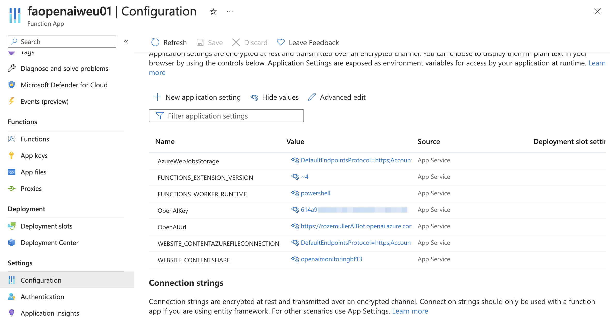

### Configure Azure Function source control automated
The resources are all deployed now. But there is no script live yet. This is the point where source control flies in. At [my GitHub repository](https://www.github.com/srozemuller/monitoring) I have stored my scripts that must be placed in the Azure Functions. 
To make source control work, a specific folder and file format is mandatory. 
Every function must be stored in a folder. In the folder the script must be name as `run.ps1`. The `function.json` is the function configuration file for that specific function.

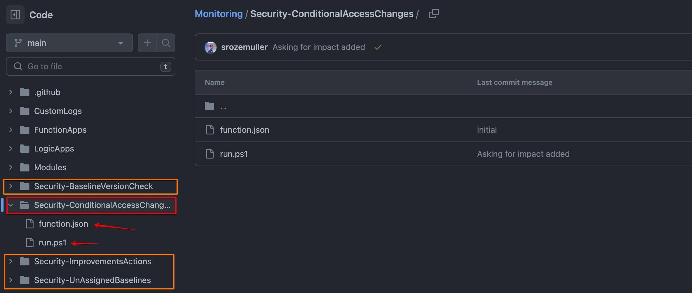

The code below configures source control for Azure Functions using the Azure Managent API. In the body I tell the to which repository the function must connect and to which branch.
The repoAccessToken is the GitHub PAT token to login. 
In the `githubActionConfiguration` I configure settings that creates a GitHub workflow in the repository. The workflow is responsible for synchronise the code between GitHub and Azure Functions. 

```powershell

$sourceControlUri = "https://management.azure.com/{0}/sourcecontrols/web?api-version=2022-03-01" -f $functionApp.id
$sourceControlBody = @{
    location = "GitHub"
    properties = @{
        repoUrl = "https://www.github.com/srozemuller/monitoring"
        branch = "main"
        isManualIntegration = $false
        repoAccessToken = "ghp"
        gitHubActionConfiguration = @{
            generateWorkflowFile = $true
            workflowSettings = @{
                appType = "functionapp"
                publishType = "code"
                os = "linux"
                runtimeStack = "powershell"
                workflowApiVersion = "2020-12-01"
                variables = @{
                    runtimeVersion = "7.2"
                }
            }
        }
        isGithubAction = $true
    }
} | ConvertTo-Json -Depth 5
Invoke-RestMethod -Uri $sourceControlUri -Method PATCH -Headers $authHeader -Body $sourceControlBody
```

In the end, the code is synchronised to Azure Functions. There after it is not possible to edit code from there anymore.

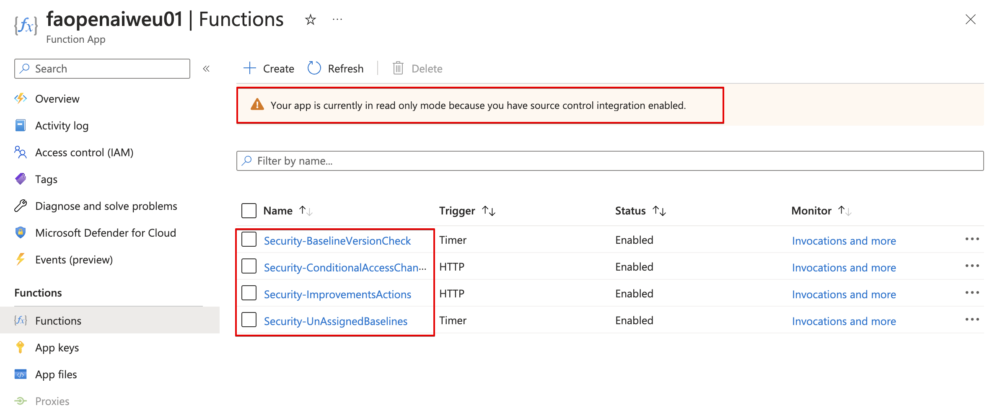

## Azure monitor
The last step glueing the diagnostics to Azure Functions by creating an alert group and monitor alert rule. The rule checks for conditional access changes in audit logs using Kusto Query Language (KQL). If there is a hit, the monitor rule sends the alert to an alert group.

#### Alert group
The first step is creating an alert group that sends alerts to an Azure Function. Before an alert can be sent to a function, we need function information. The name and the HTTP trigger URL. The URL is the 'outside' of the function that accepts a JSON body to work with. 

In the code below, I first request the function information that is needed and then create the Alert Group. I got the most function information already during the proces above. The only thing I need is the security key that completes the whole HTTP trigger URL. 

```powershell
$functionName = "Security-ConditionalAccessChanges"
$functionUri = "https://management.azure.com/subscriptions/{0}/resourceGroups/{1}/providers/Microsoft.Web/sites/{2}/functions/{3}/listKeys?api-version=2022-03-01" -f $subscriptionId, $resourceGroup, $functionAppName, $functionName
$functionKey = Invoke-RestMethod -Uri $functionUri -Method POST -Headers $authHeader

$actionGroupName = "ag-fa-openAi"
$actionGroupUri = "https://management.azure.com/subscriptions/{0}/resourceGroups/{1}/providers/Microsoft.Insights/actionGroups/{2}?api-version=2021-09-01" -f $subscriptionId, $resourceGroup, $actionGroupName
$actionGroupBody = @{
    location   = "Global"
    properties = @{
        enabled                = $true
        groupShortName         = "toOpenAI"
        azureFunctionReceivers = @(
            @{
                name = $functionName
                functionAppResourceId = $functionApp.id
                functionName          = $functionName
                httpTriggerUrl        = "https://{0}.azurewebsites.net/api/{1}?code={2}" -f $functionAppName, $functionName, $functionKey.default
                useCommonAlertSchema  = $true
            }
        )
    }
} | ConvertTo-Json -Depth 5
$actionGroup = Invoke-RestMethod -Uri $actionGroupUri -Method PUT -Headers $authHeader -Body $actionGroupBody
```


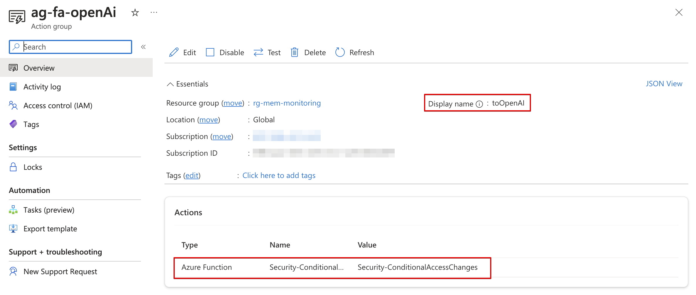

#### Azure monitor rule
The final step is creating an alert rule in an automated way. The rule checks every n period for audit logs in the conditional access category.

This Kusto query is used to retrieve information from the "AuditLogs" table related to the "Update conditional access policy" operation. Let's break down the query step by step:

1. **AuditLogs**: This specifies the table name from which the data is being retrieved.
2. **| where OperationName == 'Update conditional access policy'**: This filters the records in the "AuditLogs" table to only include those with the "OperationName" column equal to "Update conditional access policy".
3. **| extend oldValue=parse_json(TargetResources[0].modifiedProperties[0].oldValue)**: This line extends the query by creating a new column called "oldValue" and populates it with the parsed JSON value from the specified path.
    - `TargetResources[0]` refers to the first element in the "TargetResources" array.
    - `modifiedProperties[0]` refers to the first element in the "modifiedProperties" array within the "TargetResources[0]" object.
    - `oldValue` is the key within the "modifiedProperties[0]" object that contains the previous value. This is also for the newValue.
    This line is extracting and parsing the JSON value of the "newValue" field, which represents the updated value of the modified property.
4. **| project TimeGenerated, OperationName, InitiatedBy, oldValue, newValue**: Finally, this line selects and projects specific columns from the result set. 
   The reason why I only project these columns is to avoid overhead.  
   Rubbish in is rubbish out. 


```basic
AuditLogs
| where OperationName == 'Update conditional access policy'
| extend oldValue=parse_json(TargetResources[0].modifiedProperties[0].oldValue) 
| extend newValue=parse_json(TargetResources[0].modifiedProperties[0].newValue) 
| project TimeGenerated, OperationName, InitiatedBy, oldValue, newValue
```


The code below creates the alert rule. In the body, I use the Log Analytics Workspace ID, and the action group we created earlier. 

```powershell
$alertRuleName = "Conditional Access Policy Changed"
$alertRuleUri = "https://management.azure.com/subscriptions/{0}/resourceGroups/{1}/providers/microsoft.insights/scheduledqueryrules/{2}?api-version=2023-03-15-preview" -f $subscriptionId, $resourceGroup, $alertRuleName
$alertRuleBody = @{
    location   = "West Europe"
    properties = @{
        displayName         = $alertRuleName
        actions             = @{
            actionGroups = @(
                $actionGroup.id
            )
        }
        criteria            = @{
            allOf = @(
                @{
                    operator        = "GreaterThanOrEqual"
                    query           = "AuditLogs | where OperationName == 'Update conditional access policy' | extend oldValue=parse_json(TargetResources[0].modifiedProperties[0].oldValue) | extend newValue=parse_json(TargetResources[0].modifiedProperties[0].newValue) | project TimeGenerated, OperationName, InitiatedBy, oldValue, newValue"
                    threshold       = 1
                    timeAggregation = "Count"
                    dimensions      = @()
                    failingPeriods  = @{
                        minFailingPeriodsToAlert  = 1
                        numberOfEvaluationPeriods = 1
                    }
                }
            )
        }
        description         = "This rule checks for conditional access policy changes every 15 minutes"
        enabled             = $true
        autoMitigate        = $false
        evaluationFrequency = "PT15M"
        scopes              = @(
            $laResponse.id
        )
        severity            = 2
        windowSize          = "PT15M"
        targetResourceTypes = @(
            "Microsoft.OperationalInsights/workspaces"
        )
    }
} | ConvertTo-Json -Depth 8
Invoke-RestMethod -Uri $alertRuleUri -Method PUT -Headers $authHeader -Body $alertRuleBody
```

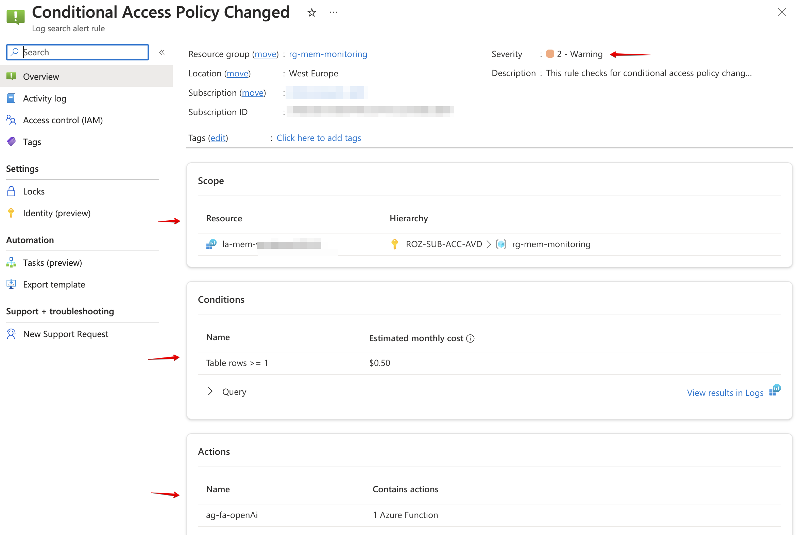

## Summary
In this blog post, I showed how to monitor conditional access policy changes using Azure AD audit logs. If a policy change, a Alert Rule triggers an Azure Function to ask OpenAI what is changed. The explanation is sent to a MS Teams channel. 

The deployment script is stored at: https://github.com/srozemuller/Monitoring/blob/main/ConditionalAccessChanges/deployment.ps1  
The Azure Function script is stored at: https://github.com/srozemuller/Monitoring/tree/main/Security-ConditionalAccessChanges  

  