Welcome to this blog about configuring Azure Virtual Desktop session host with Microsoft Intune. The Intune settings catalog is growing very fast and now also AVD settings making it to the settings catalog. 

In this blog I show what settings, what their effect is and how to deploy this configuration profile in an automated way.


## Intune Settings catalog
The Intune settings catalog is the main place to find settings that are deployed to endpoints. You may see the settings catalog as the on-prem Active Directory group policy management. 
As mentioned more and more settings comes to the new way of managing endpoints. And now AVD specific settings are too. 

In the screenshot below you see the current settings available in the catalog. 

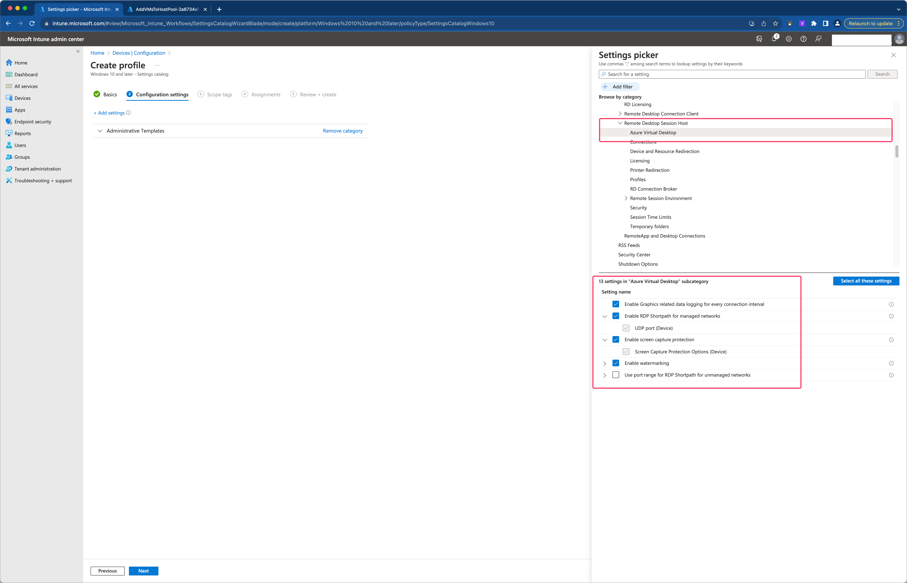

Lets discuss the current available settings below. 
### RDP Shortpath
RDP Shortpath is a feature of Azure Virtual Desktop that establishes a direct UDP-based transport between Remote Desktop Client and Session host. RDP uses this transport to deliver Remote Desktop and RemoteApp while offering better reliability and consistent latency. For a complete overview please check the [Shortpath overview](https://docs.microsoft.com/en-us/azure/virtual-desktop/shortpath).

Earlier [I wrote a blog on how to enable RDP shortpath using PowerShell](https://rozemuller.com/enable-rdp-shortpath-for-azure-virtual-desktop-on-an-image-version-automated/). You can use this post when not using Microsoft Intune.

After enabling RDP shortpath you see the connection is running over UDP.
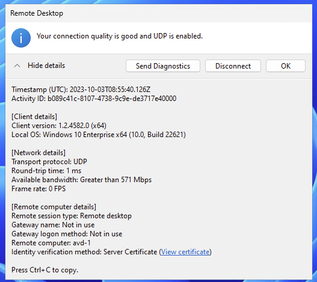

RDP shortpath is only supported for the Windows remote desktop client. When using macOS, it still uses the TCP connection.
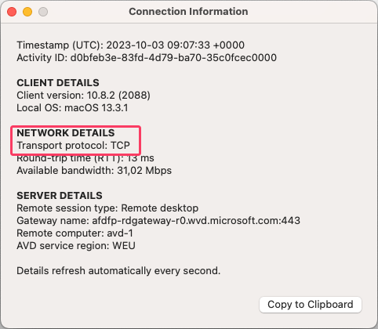

### RDP shortpath from unmanaged networks
This policy setting allows you to specify the UDP port range the Azure Virtual Desktop client will use to communicate with the session host when RDP Shortpath for public networks is used. If you enable this policy setting, the Azure Virtual Desktop client will randomly select the port from the range for every connection. If the specified port range is exhausted, the client's operating system will choose a port to use. If you disable or do not configure this policy setting, the operating system on the client will select a port used for the session (recommended) If you enable this policy setting, it is recommended configuring firewall rules on the client to allow inbound UDP connection in this port range for Azure Virtual Desktop clients.

For more information about public networks check the [Microsoft Learn about RDP Shortpath](https://learn.microsoft.com/en-us/azure/virtual-desktop/rdp-shortpath?tabs=public-networks)

In the test, I added the default settings to the policy. Thereafter I started a Windows 11 machine in Azure (comes from a public network) and tried to open a session to AVD with the Remote Desktop Client. 
As you can see, the UDP ports are blocked by the Defender Firewall.

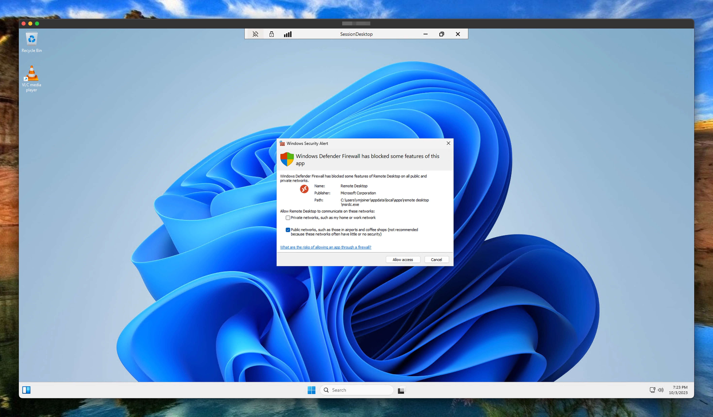

### Water marking
Watermarking, alongside [screen capture protection](https://learn.microsoft.com/en-us/azure/virtual-desktop/screen-capture-protection), helps prevent sensitive information from being captured on client endpoints. When you enable watermarking, QR code watermarks appear as part of remote desktops. The QR code contains the _connection ID_ of a remote session that admins can use to trace the session. Watermarking is configured on session hosts and enforced by the Remote Desktop client. (Source Microsoft)

When enabled, the desktop looks like the screenshot below.
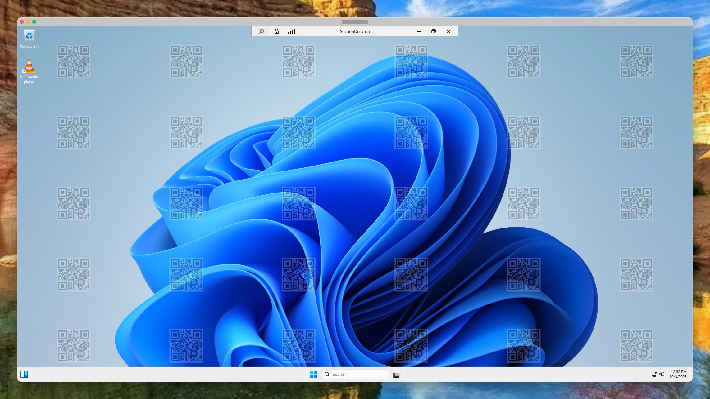

NOTE: The official macOS remote desktop client, as the beta version, does not support water marking yet. The official client shows an error like below. The beta version, starts but shows a black screen only.
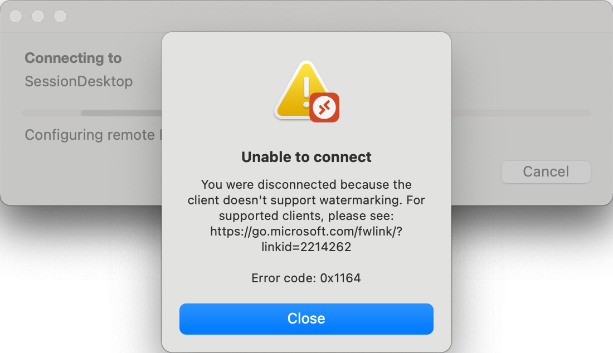

More information about the beta client is documented at [the Microsoft Learn pages](https://learn.microsoft.com/en-us/azure/virtual-desktop/users/client-features-macos#test-the-beta-client).

### Screen protection
The screen capture protection feature prevents sensitive information from being captured on the client endpoints. When you enable this feature, remote content will be automatically blocked or hidden in screenshots and screen shares. Also, the Remote Desktop client will hide content from malicious software that may be capturing the screen.
Earlier I wrote a post on [how to enable AVD screen protection automated](https://rozemuller.com/enable-screen-capture-protection-for-azure-virtual-desktop-automated/).

I tested this setting also with the macOS as Windows remote desktop client.
As in the previous settings the macOS client also does not support screen protection. The client disconnects when the setting is enabled.

There is an option using the [Remote Desktop Client Beta](https://install.appcenter.ms/orgs/rdmacios-k2vy/apps/microsoft-remote-desktop-for-mac/distribution_groups/all-users-of-microsoft-remote-desktop-for-mac), however this only works when the watermarking setting is disabled. If the watermaker setting is enabled, the connection works but screen turns into black. 
It looks like the screen protection mechanism is already thinking the screen is shared for some reason.

In the screenshot below, I opened a session and then the Windows snippet tool to create a screenshot. As you can see, the screen turns into black.

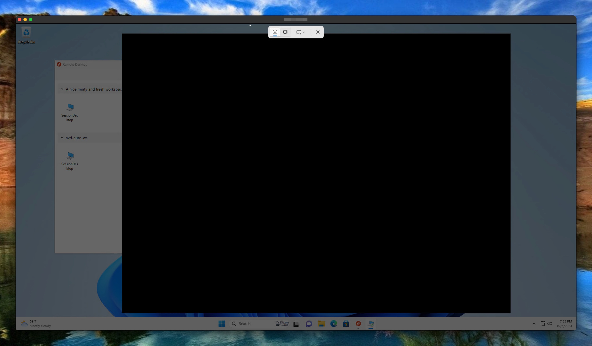
### Enrolling AVD settings using Intune automated
To deploy these settings using the Intune settings catalog a JSON template must be provided to the configuration policy API endpoint. 
For more in-depth information on how to deploy settings from scratch in the Intune settings catalog, check my [blog](https://rozemuller.com/deploy-intune-settings-catalog-automated-from-scratch-with-graph-api/).

The policy file to use is [stored at my GitHub](https://github.com/srozemuller/MicrosoftEndpointManager/blob/main/ConfigurationPolicies/avd-enhancement-settings.json). 

In the end, if the policy applied successful, the AVD host registry is updated with the configured settings.

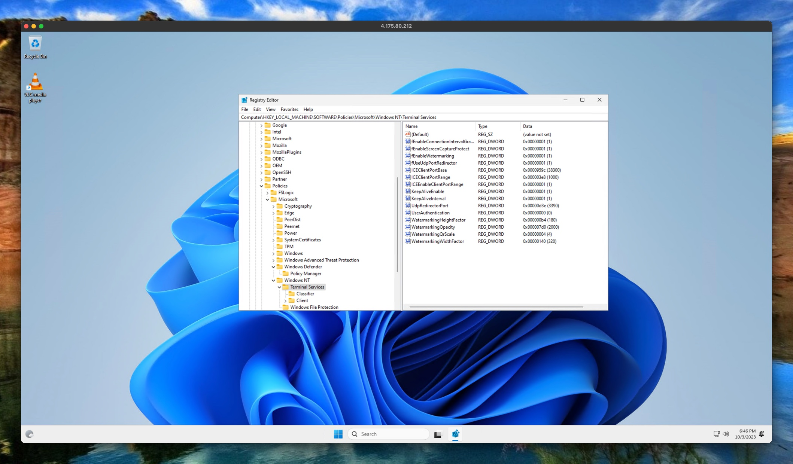
### Bug
During testing, I found a bug when re-enabling the watermarking and screen protection settings. Both need some additional settings that do not show up after the main setting is disabled and the policy has been saved.

As an workaround you have to complete remove the specific setting and add it in total (including the sub settings) again using the settings picker. 

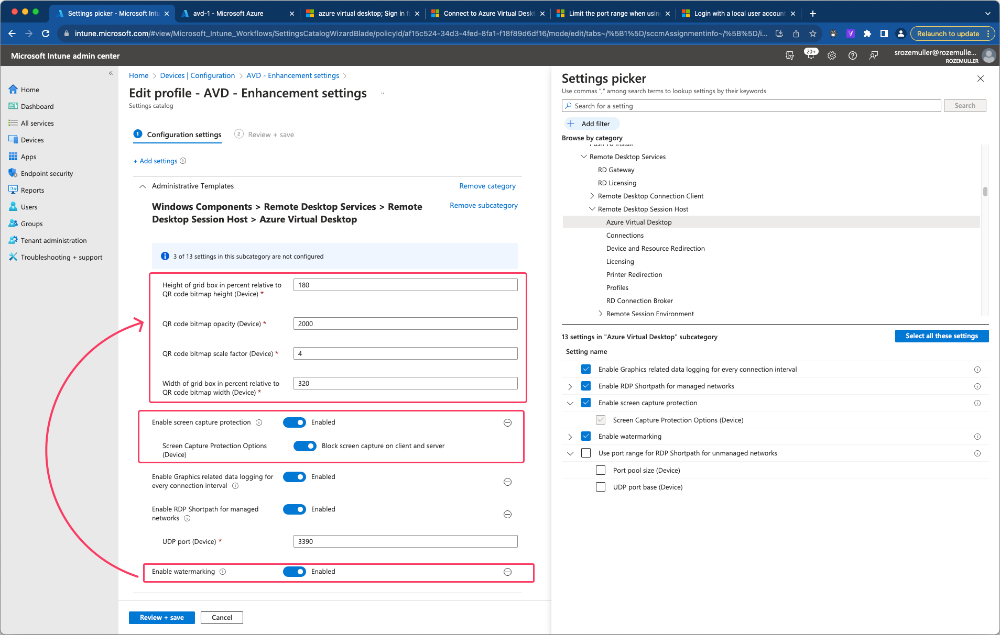

When saving the policy, an error is show in the portal. To get the real message, use the F12 developer screen and go to network.
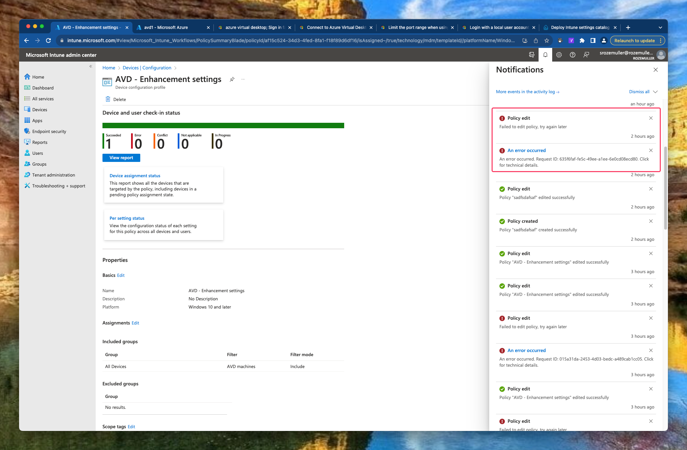

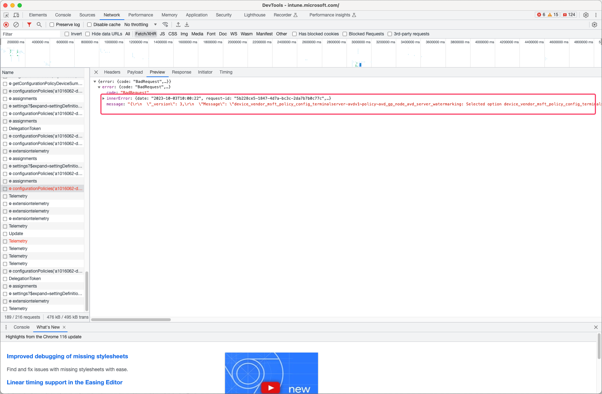

The Microsoft product team has been informed.

