The new Windows Store App feature (aka WinGet installation) becomes more popular. However, this feature is still in preview. That means that not all is working as expected. Adding these applications using the portal has dependencies. One of those things is that an applications needs a valid version. Something not every application has. 
The results in an error like:
- The selected app does not have a valid latest package version
- This app is not supported in preview

Luckily, there is an option to still add these applications with some automation tricks. In this blogpost I show how to still add an "unsupported" Win32 application to Intune.



## The problem
The problem with Windows Store applications is that not all the mandatory properties are filled in by the application developer. When you try to add an application that has not all the mandatory properties you will get a screen like below. 

The screen says "The selected app does not have a valid latest package version". 

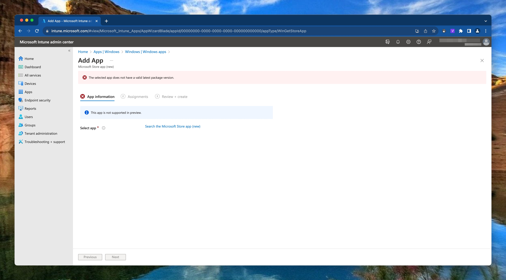

When looking into the application properties this actually correct. In the example below I search for the DeepL Translate application. While searching for the application, in the background an API call to Microsoft Store is executed with the JSON paramaters below.
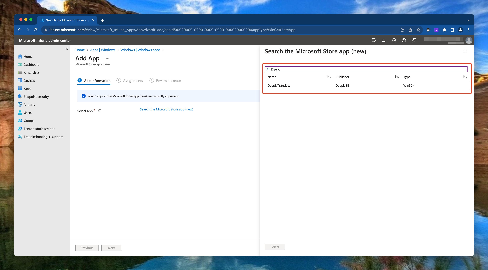

The query is the body that asks to search for applications where DeepL is in the name. 
```json
{
    "Query" : {
        "KeyWord": "DeepL",
        "MatchType": "Substring"
    }
}
```

The URL used is: `https://storeedgefd.dsx.mp.microsoft.com/v9.0/manifestSearch`
As you can see the result is there without a package version that is Unknown. 
This is the reason why the portal does not accept that application.

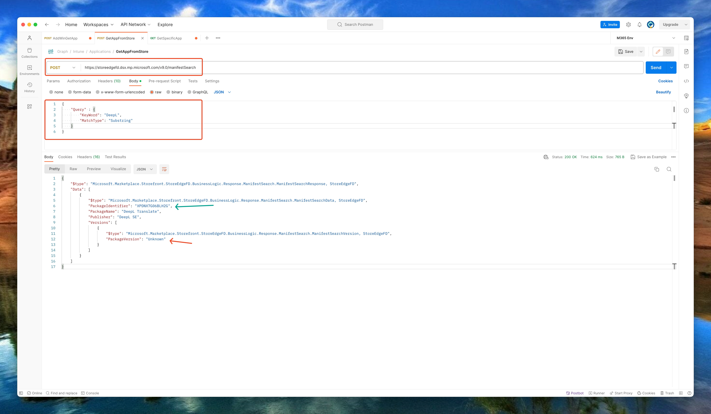

Even when looking further in the application, no package versions are available. 
To get the information below, I request the url `https://storeedgefd.dsx.mp.microsoft.com/v9.0/packageManifests/XPDNX7G06BLH2G` where the `XPDNX7G06BLH2G` is the unique package identifier that where presented in the screenshot above.

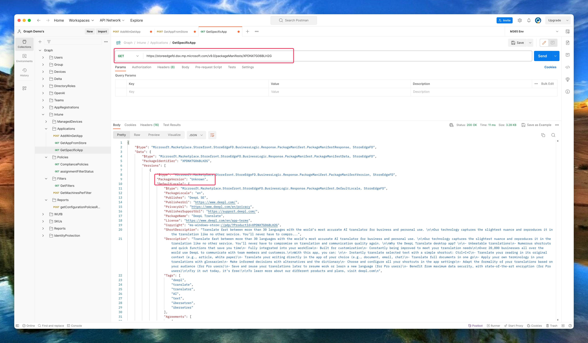

## Solution
To install applications with the package version errors we need the Graph API. It is just the portal that is causing the issue. With the information from the last screenshot, we can send a request to the `deviceAppManagement/mobileApps` endpoint. 
This is because the package version is not a mandatory field in the Graph API request. With the information above I created the body below.

```json
{
  "isFeatured": false,
  "publisher": "DeepL SE",
  "roleScopeTagIds": [],
  "repositoryType": "microsoftStore",
  "@odata.type": "#microsoft.graph.winGetApp",
  "packageIdentifier": "XPDNX7G06BLH2G",
  "developer": "Microsoft Corporation",
  "installExperience": {
    "runAsAccount": "User"
  },
  "privacyInformationUrl": null,
  "largeIcon": {
    "@odata.type": "#microsoft.graph.mimeContent",
    "value": null,
    "type": "String"
  },
  "description": "DeepL SE",
  "displayName": "DeepL SE",
  "informationUrl": null
}
```

The body is sent the `https://graph.microsoft.com/beta/deviceAppManagement/mobileApps` endpoint with a POST request. The request results in a successful created application.

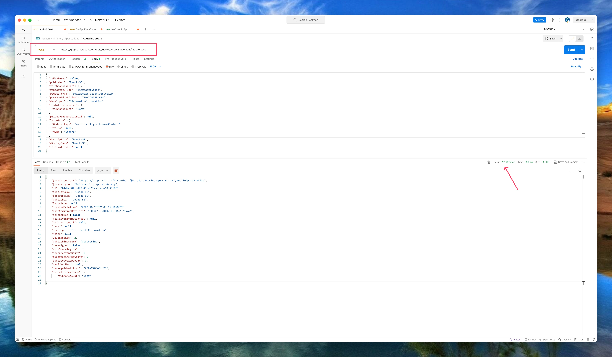

In the portal the application looks like the screenshot below where represents a successful deployment.

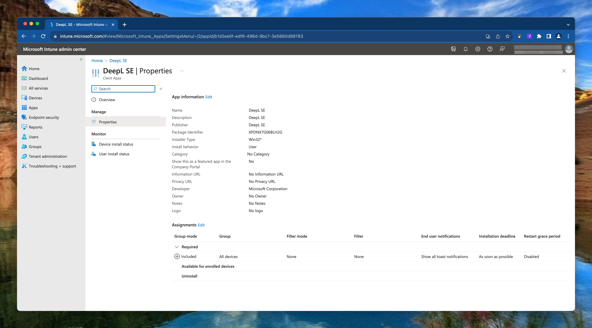

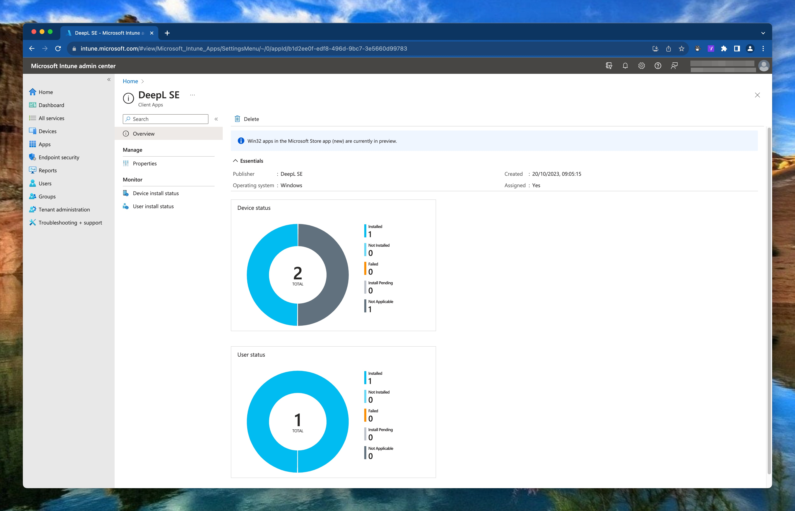

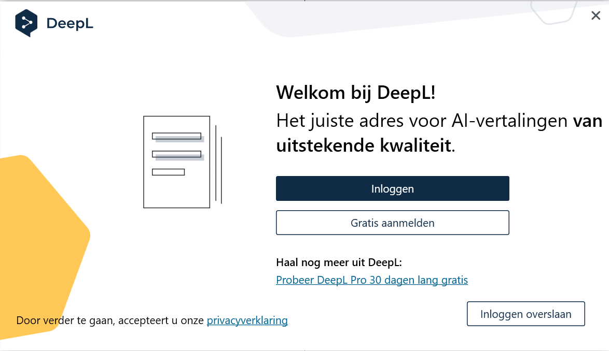
## Other issues
I also have seen these kind of issues when the install experience is not defined correctly. 
In the Intune portal there error is the same however the underlaying issue is different.

Then the scope field is empty or Intune can not read it because the scope is defined elsewhere in the application response. It also can be that a specific installation language package is missing the scope where other languages have this field filled in correctly.

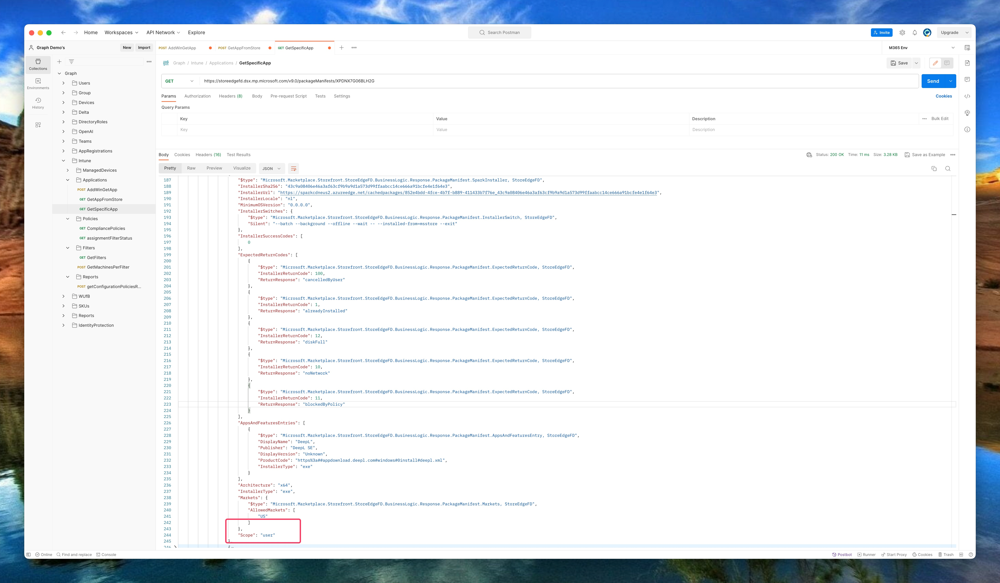

The installation scope is a mandatory field. If no scope is available I would suggest filling the user scope. 

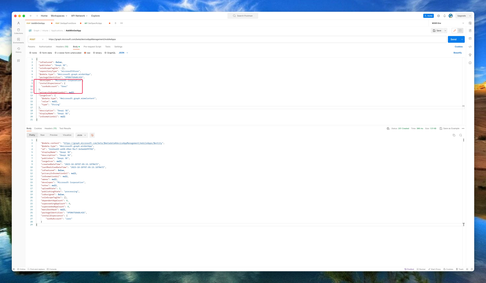

In Intune this is the `Install behavior` field. 
In the case of a system installation, then use the SystemAccount value instead of user.


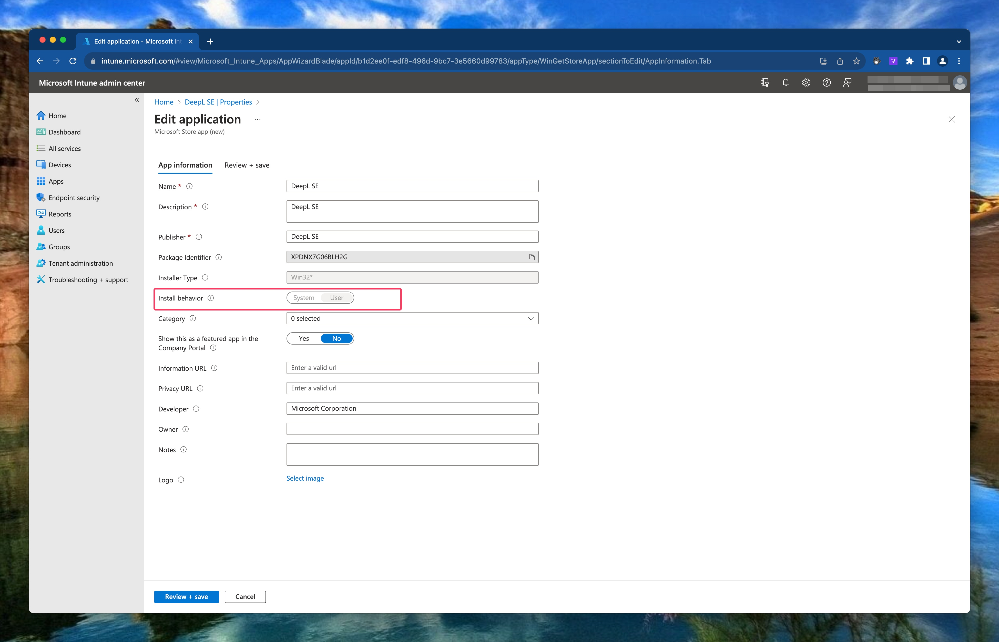

Hope that helps.



