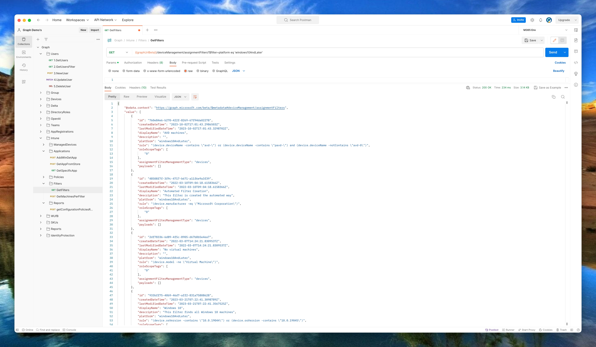

As you also may know is that using filters in Intune is a best practise. With the come of the Windows 11 23H2 build number it is a good idea 💡 to update your filters by adding the new 10.22631.x build number. In this blog post, I show how to update all Windows 11 filters with the new build number using PowerShell and the Graph API.
## Hello Windows 11 23H2
At 30 October 2023 Microsoft announced Windows 11 23H2 became available. As you properly know is that every Windows OS version has its own build number. In this situation there is nothing new. 
The new build number for Windows 11 23H2 is **10.22631.x**. For a complete build number overview please check the [Windows 11 release information documentation](https://learn.microsoft.com/en-us/windows/release-health/windows11-release-information#windows-11-current-versions)



## Intune Filters
As mentioned in the introduction, using filters is an Intune best practice. 
In basics: Filters has to do with targeting. When you create a policy, you can use filters to assign a policy based on rules you create. A filter allows you to narrow the assignment scope of a policy. 
For example, to target devices with a specific OS version or a specific manufacturer. In relation to AD groups, filtering is high performance and low latency. In the rule syntax you add expressions to create a set of rules based on device properties. Good to know is that expressions are only at the device level.

For more information about Intune filters, please check my blog post about [Intune filters explained and create them in an automated way](https://rozemuller.com/intune-filters-explained-and-create-automated/)


## Add Windows 11 23H2 to Intune
I created a little script that searches for the filter type `windows10AndLater`. There after, in the filter I check if the current build numbers are there already, **10.22000.x** (Windows 11 21H2) and **10.22621** (Windows 11 22H2). 

> Assuming when both 'old' build numbers are in a filter, the filter searches for ALL Windows 11 machines. 

The script has 3 scenario's:
- Current filter has no Windows 11 build numbers
- Current filter has both Windows 11 build numbers
- Current filter has one Windows 11 build number

In the case of no Windows 11 numbers, a flag is set to create a new Windows 11 23H2 filter at the end op the script.

In the case of both Windows 11 numbers, the new 10.22631.x Windows 11 build number is added

In the base there is a Windows 11 23H2 number already added in a filter, no new filter will be created. 

That results in the following script.
The first step is gathering all filters used for the windows10AndLater platform. The authentication header is created with a client credential request. That part is in the script.


```powershell
$filterUrl = "https://graph.microsoft.com/beta/deviceManagement/assignmentFilters?`$filter=platform eq 'windows10AndLater'"
$filterReqParams = @{
    uri     = $filterUrl
    method  = "GET"
    headers = $authHeader
}
$filterResults = Invoke-RestMethod @filterReqParams
```



The next step is searching in the filter rules for the correct build number with the use of regex.

```powershell
    $foundMatches = Select-String -InputObject $filterInfo.rule  -Pattern "\b10.0.22000\b|\b10.0.22621\b" -AllMatches
    $foundMatches.Matches.Count
    $createNewFilter = $false
    $foundNewBuildAlready = Select-String -InputObject $filterInfo.rule  -Pattern "\b10.0.22631\b" -AllMatches
```

Based on the matches outcome, the script executes the correct code with the use of a switch statement.

```powershell
switch ($foundMatches.Matches.Count) {
        0 {
            Write-Host "No matches found or allready added for filter $($filterInfo.displayName), do nothing."
        }
        1 {
            "One match found for filter $($filterInfo.displayName), it seems this is a specific Windows 11 filter, if there is no Windows 23H2 filter already, I create one later"
            if ($foundNewBuildAlready.Matches.Count -eq 0) {
                $createNewFilter = $true
            }
        }
        2 {
            if ($null -eq $foundNewBuildAlready) {
            Write-Host "Two matches found for filter $($filterInfo.displayName), it seems this is a full Windows 11 filter, adding new number to the filter"
            $newRule = "{0} -or (device.osVersion -contains `"10.0.22631`")" -f $filterInfo.rule
            $filterUrl = "https://graph.microsoft.com/beta/deviceManagement/assignmentFilters('{0}')" -f $filterInfo.id
            $filterBody = @{
                rule = $newRule
            } | ConvertTo-Json
            $filterReqParams = @{
                uri     = $filterUrl
                method  = "PATCH"
                headers = $authHeader
                body = $filterBody
            }
            Invoke-RestMethod @filterReqParams
        } else {
            Write-Host "Found new build number filter $($filterInfo.displayName) already, do nothing."
        }
        }
    }
```

At last, if the flag `$createNewFilter` is set to true, a new filter for only Windows 11 23H2 is created.


The complete script is stored at my [GitHub](https://github.com/srozemuller/MicrosoftEndpointManager/blob/main/Filters/update-win11filters.ps1)


