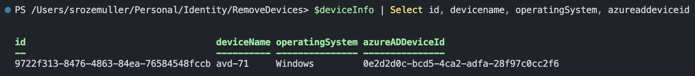
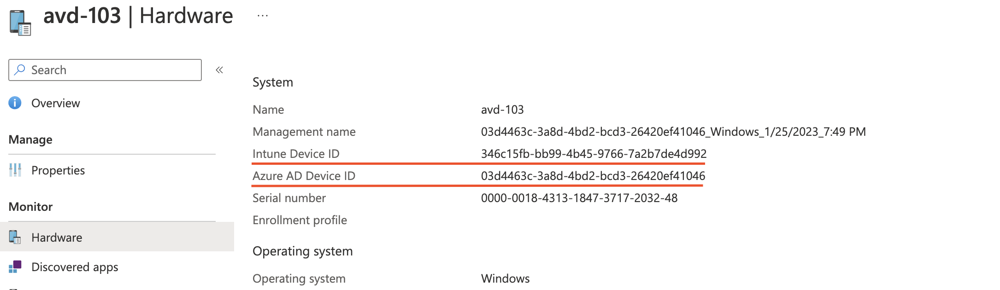
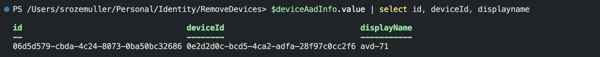
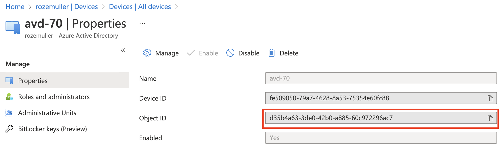

The power of community is to collaborate and help others achieve goals. In this case, I got a question from a good community friend to help write a script that removes over 6000 devices from Intune and Azure Active Directory. The base is a CSV file filled with Intune devices IDs.

In this blog post, I explain the steps how the script works.



## Get device information
The main goal is to remove devices from Intune and Azure Active Directory. That means we have to modify two different worlds. And that's exactly what we see in the background. The first step is to get the needed device information based on the CSV file from both worlds. Luckily, both worlds are connected to the same front door called Graph API.

Let's start with the CSV file that must be imported into PowerShell. The import-CSV read the CSV file content and creates an object for each column. The content is stored in a variable for later use.
```powershell
$PathToCsv = './devices.csv'
$csv = Import-Csv -Path $PathToCsv
```

The CSV contains Intune device IDs. That is the first place to look for information. 
To get Intune device information I use the Graph API managedDevices endpoint. The permissions I need ```DeviceManagementManagedDevices.Read.All```.

```basic
https://graph.microsoft.com/beta/deviceManagement/managedDevices
```

A part of the request:
```powershell
$deleteDeviceIntuneUrl = "https://graph.microsoft.com/beta/deviceManagement/managedDevices('{0}')" -f $intuneDeviceId
$deviceInfo = Invoke-RestMethod -Method Get -Uri $deleteDeviceIntuneUrl -Headers $AuthHeader
```
A part of the result of this request is shown below.


As shown below, the result contains also an AAD device object id. Because AzureAD device IDs differ from Intune IDs we also need to get the AzureAD information. 
 

Based on that AAD ID we can search in the AAD for the correct device.
To search for devices in AzureAD, I use the endpoint below.
```basic
https://graph.microsoft.com/beta/devices
```

```powershell
$getAadDeviceUrl = "https://graph.microsoft.com/beta/devices?`$filter=deviceId eq '{0}'" -f $deviceInfo.azureADDeviceId
$deviceAadInfo = Invoke-RestMethod -Method Get -Uri $getAadDeviceUrl -Headers $AuthHeader
```
This request results in the information below.



## Remove devices in Intune and Azure AD
We have the correct information from both worlds to delete devices. To delete devices we must send the ```DELETE``` method to the Graph API.
Because of two worlds, we must send a DELETE request to two endpoints. 
Intune uses the endpoint below. To delete devices you need ```DeviceManagementManagedDevices.ReadWrite.All``` permission.
```basic
https://graph.microsoft.com/beta/deviceManagement/managedDevices
```
To point to the correct device just put the ID at the end of the URL between (). 
```basis
"https://graph.microsoft.com/beta/deviceManagement/managedDevices('deviceID')"
```

Azure AD instead, uses this endpoint. To delete devices in Azure AD with the Graph API, you need ```Directory.ReadWrite.All``` permissions. 
```basic
https://graph.microsoft.com/beta/devices
```
To point to the correct device just put the ID at the end of the URL after a /. 
```basis
"https://graph.microsoft.com/beta/devices/aadObjectID"
```


In the end, it results in a PowerShell script that accepts a path to CSV. The scripts use the MSAL.PS PowerShell to get an access token with the correct scope. 
Then, the script imports the CSV content, and per row. it searches for the correct device in Intune and Azure AD. In the same loop, the device is deleted in both worlds.

You can find the script at: https://github.com/srozemuller/Identity/blob/main/RemoveDevices/remove-devices.ps1


