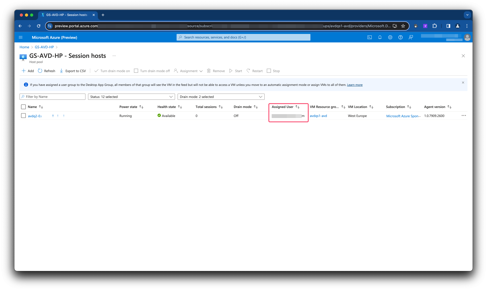
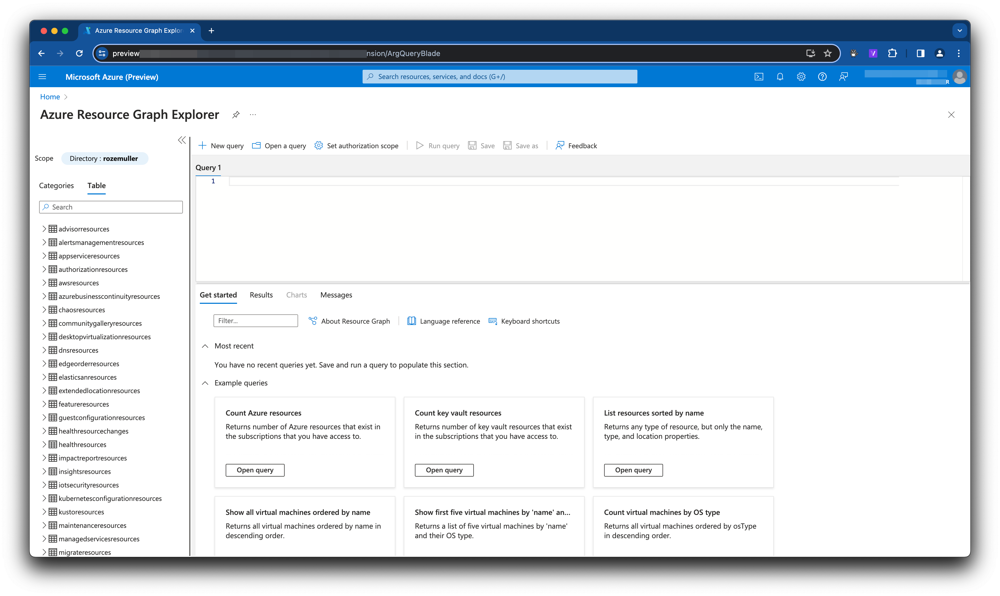
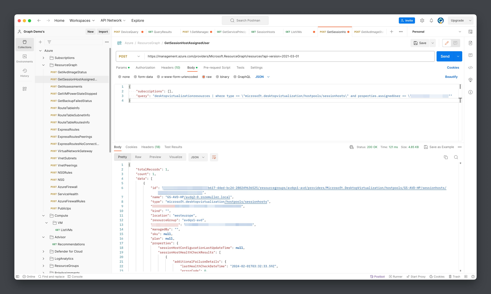

Recently I saw a question on X (Twitter) where someone was looking for a way to filter for a specific Azure Virtual Desktop assigned user using the Azure management API. For some reason, the filter option is not working is this API. Where in the end it was not possible to find the correct user directly from an API request.
In this post, I show a different way, much more efficient way, to find the correct user assigned to an Azure Virtual Desktop session host.



## The case
As said in the intro, we want to find a session host that is assigned to a specific user. The idea is when having the correct session host(s) a user can reboot his session host for example using self-service.
Good to know, the assigned user situation is only applicable when having a Personal hostpool type.



### The first attempt
The first attempt was to use the session host api as documentent [here](https://learn.microsoft.com/en-us/rest/api/desktopvirtualization/session-hosts/get?view=rest-desktopvirtualization-2022-02-10-preview&tabs=HTTP).
The endpoint including the filter should be something like this:

```basic
https://management.azure.com/subscriptions/{{subscription}}/resourceGroups/{{resourceGroup}}/providers/Microsoft.DesktopVirtualization/hostpools/{{hostpool}}/sessionHosts?api-version=2022-02-10-preview&$filter=properties/assignedUser eq 'user@principal.com'
```

Unfortunately, the filter is not working for some reason. Also the `$select` function did not work. This was the point where I found the question at X.



### Solution, using the Microsoft.Resources API
Luckily, there are more ways to Rome ;), and there are more Azure Management API endpoints available to achieve that goal. An endpoint that I use often is the `Microsoft.Resources/resources` endpoint.

```basic
https://management.azure.com/providers/Microsoft.ResourceGraph/resources?api-version=2021-03-01
```
A big advantage of this endpoint is that it is Azure globally available. What I mean with that it is resource independend. So no subscriptionId, resource group or specific resourceId is needed. That means this is extremely suitable for finding resources in Azure.

## Azure Resource Graph API
The Azure Microsoft.Resources API endpoint accepts a `POST` request with in the body a JSON content. The content consists of a Kusto Query. It is the same as the resource graph in the Azure portal.


The body send to the endpoint looks like this. For this particular situation I search for all resources with the type `microsoft.desktopvirtualization/hostpools/sessionhosts` that is assigned to a specific user.

```json
{
    "subscriptions": [],
    "query": "desktopvirtualizationresources | where type == \"microsoft.desktopvirtualization/hostpools/sessionhosts\" and properties.assignedUser == \"user@principal.com\""
}
```


For more information about the Resource Graph endpoint please check [this document](https://learn.microsoft.com/en-us/rest/api/azureresourcegraph/resourcegraph/resources/resources?view=rest-azureresourcegraph-resourcegraph-2022-10-01&tabs=HTTP).

The response gives all resource information that is useable for any next step in you automation.

Using this endpoint gives you much more flexibility than specific resource API endpoint.


