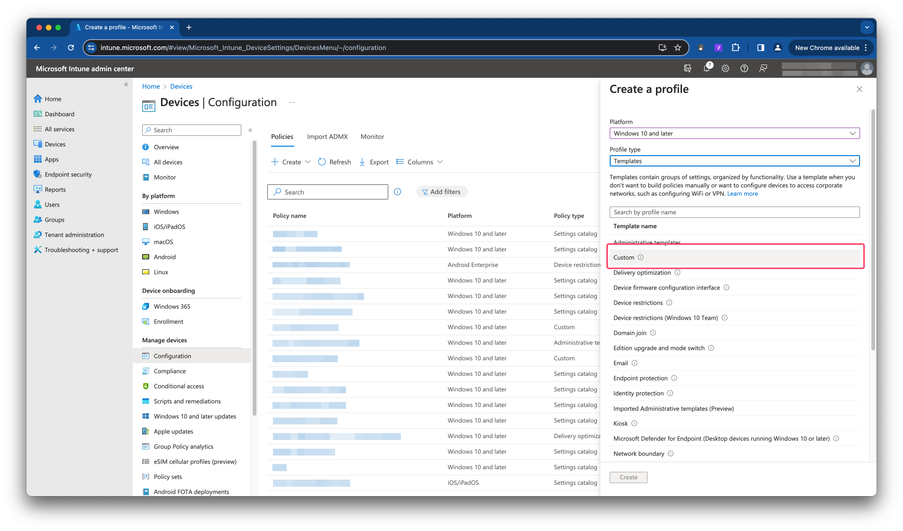
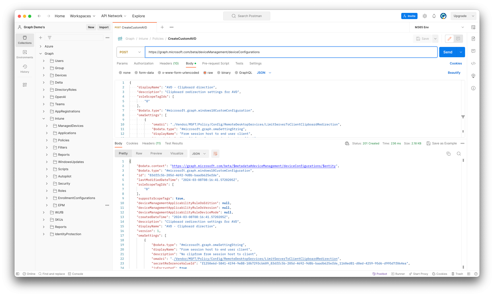

Using the clipboard between Azure Virtual Desktop and the users client is a great way to send data back and forth. But it is also could big leak into the system. So maybe you want to limit the use of the clipboard or get more control on how the clipboard could be used between the user and the Azure Virtual Desktop enviroment.

This is now possible with the clipboard transfer direction options. In this blog post I explain how to configure these settings in Intune and also on the session host directly in an automated way.



# Clipboard redirection
In short, clipboard redirection is a feature that allows a user to copy and paste data from and to an Azure Virtual Desktop session host. 
Now you have options to configure specfic data types that are allowed to send back and forth. 
The types of data that can be copied, from the following options:

- Disable clipboard transfers from session host to client, client to session host, or both.
- Allow plain text only.
- Allow plain text and images only.
- Allow plain text, images, and Rich Text Format only.
- Allow plain text, images, Rich Text Format, and HTML only.

## Prerequisites
To configure the clipboard transfer direction, you need:
- Session hosts running Windows 11 Insider Preview Build 25898 or later.
- Depending on the method you use to configure the clipboard transfer direction:
  - For Intune, you need permission to configure and apply settings.
  - For configuring the local Group Policy or registry of session hosts, you need an account that is a member of the local Administrators group.

# Configure clipboard transfer direction in Intune
Unfortunately, these new configuration items are not available in the settings catalog yet. To configure clipboard transfer direction we need to configuare a Custom template with OMA Uri's.



The JSON body below represents a custom configuration profile that limits copying data from a session host to the user's client. The profile allows copying data plain text and images from a user's client to the session host.  
I think, with `zero trust` in mind, this is a pretty restrictive but workable configuration.

The available settings are.

|Direction|Setting|Explaination|
|---|---|---|
|Session host to client|\<![CDATA[<enabled/\>\<data id="TS_SC_CLIPBOARD_RESTRICTION_Text" value="0"/\>]]\>|Disable clipboard transfers from session host to client.|
|Session host to client|\<![CDATA[<enabled/\>\<data id="TS_SC_CLIPBOARD_RESTRICTION_Text" value="1"/\>]]\>|Allow plain text.|
|Session host to client|\<![CDATA[<enabled/\>\<data id="TS_SC_CLIPBOARD_RESTRICTION_Text" value="2"/\>]]\>|Allow plain text and images.|
|Session host to client|\<![CDATA[<enabled/\>\<data id="TS_SC_CLIPBOARD_RESTRICTION_Text" value="3"/\>]]\>|Allow plain text, images, and Rich Text Format.|
|Session host to client|\<![CDATA[<enabled/\>\<data id="TS_SC_CLIPBOARD_RESTRICTION_Text" value="4"/\>]]\>|Allow plain text, images, Rich Text Format, and HTML.|

|Direction|Setting|Explaination|
|---|---|---|
|Client to session host|\<![CDATA[<enabled/\>\<data id="TS_CS_CLIPBOARD_RESTRICTION_Text" value="0"/\>]]\>|Disable clipboard transfers from session host to client.|
|Client to session host|\<![CDATA[<enabled/\>\<data id="TS_CS_CLIPBOARD_RESTRICTION_Text" value="1"/\>]]\>|Allow plain text.|
|Client to session host|\<![CDATA[<enabled/\>\<data id="TS_CS_CLIPBOARD_RESTRICTION_Text" value="2"/\>]]\>|Allow plain text and images.|
|Client to session host|\<![CDATA[<enabled/\>\<data id="TS_CS_CLIPBOARD_RESTRICTION_Text" value="3"/\>]]\>|Allow plain text, images, and Rich Text Format.|
|Client to session host|\<![CDATA[<enabled/\>\<data id="TS_CS_CLIPBOARD_RESTRICTION_Text" value="4"/\>]]\>|Allow plain text, images, Rich Text Format, and HTML.|

```json
{
    "displayName": "AVD - Clipboard direction",
    "description": "Clipboard redirection settings for AVD",
    "roleScopeTagIds": [
        "0"
    ],
    "deviceManagementApplicabilityRuleOsVersion": {
        "minOSVersion": "25898.0000",
        "maxOSVersion": "26052.1100",
        "name": null,
        "ruleType": "include"
    },
    "@odata.type": "#microsoft.graph.windows10CustomConfiguration",
    "omaSettings": [
        {
            "omaUri": "./Vendor/MSFT/Policy/Config/RemoteDesktopServices/LimitServerToClientClipboardRedirection",
            "@odata.type": "#microsoft.graph.omaSettingString",
            "displayName": "From session host to end user client",
            "description": "No clipfrom from session host to client",
            "value": "<![CDATA[<enabled/><data id=\"TS_SC_CLIPBOARD_RESTRICTION_Text\" value=\"0\"/>]]>"
        },
        {
            "omaUri": "./Vendor/MSFT/Policy/Config/RemoteDesktopServices/LimitClientToServerClipboardRedirection",
            "@odata.type": "#microsoft.graph.omaSettingString",
            "displayName": "From end user client to session host",
            "description": "Only allow text and image to session host",
            "value": "<![CDATA[<enabled/><data id=\"TS_CS_CLIPBOARD_RESTRICTION_Text\" value=\"2\"/>]]>"
        }
    ]
}
```

I have send the JSON body to the Graph API using a `POST` request. The URL is used is:
```basic
https://graph.microsoft.com/beta/deviceManagement/deviceConfigurations
```



In PowerShell the code could be something like the commands below. I have save the JSON content into a file. The [file is also stored at my GitHub](https://github.com/srozemuller/AVD/blob/main/IntuneConfigurations/ConfigurationProfiles/clipboard-transfer-direction.json)

```powershell
$jsonContent = Get-Content .\clipboard-transfer-direction.json
$header = @{
  "Content-Type" = "application/json"
  authorization = "Bearer {0}" -f $accessToken
}
$requestParameters = @{
  uri = "https://graph.microsoft.com/beta/deviceManagement/deviceConfigurations"
  headers = $headers
  body = $jsonContent
  method = "POST"
}
```

In [this part](https://rozemuller.com/zero-to-zero-trust-automation-index/#authentication), I explain how to obtain an access token.

# Configure clipboard transfer direction using registry
Another option is to create the needed registry keys in a session host. In this part, I show how to create these keys using PowerShell and the Azure management API.

Use the PowerShell commands below to configure transfer direction on a session host directly.
```powershell
Import-Module Az.Accounts
Import-Module Az.Avd
Import-Module Az.Compute

Connect-AzAccount

$sessionHosts = Get-Avdsessionhost -hostpool avd-hostpool -ResourceGroupName rg-demo-avd-01
foreach ($sessionHost in $sessionHosts){
    Get-AzVM -ResourceId $sessionHost.properties.resourceId | Invoke-AzVMRunCommand -CommandId 'RunPowerShellScript' -ScriptPath .\set-clipboard_redirection.ps1
}
```

The script looks like below.

```powershell
# Define the registry key path and value name
$keyPath = "HKLM:\Software\Policies\Microsoft\Windows NT\Terminal Services"
$serverClientName = "SCClipLevel"
$clientServerName = "CSClipLevel"
# Define the value data
$scValueData = 0 # 0 = Disable clipboard redirection, no dat transfer between session host and client
$csValueData = 2 # 2 = 	Allow plain text and images to be transferred between the client and the session host

# Set the registry value
New-ItemProperty -Path $keyPath -Name $serverClientName -Value $scValueData -PropertyType DWORD -Force
# Check if the value was successfully set
if (Test-Path "$keyPath\$serverClientName") {
    Write-Host "Registry value '$serverClientName' was successfully created with data '$scValueData'."
} else {
    Write-Host "Failed to create registry value '$serverClientName'."
}

New-ItemProperty -Path $keyPath -Name $clientServerName -Value $csValueData -PropertyType DWORD -Force
# Check if the value was successfully set
if (Test-Path "$keyPath\$clientServerName") {
    Write-Host "Registry value '$clientServerName' was successfully created with data '$csValueData'."
} else {
    Write-Host "Failed to create registry value '$clientServerName'."
}
```


This [file is stored at my GitHub repository](https://github.com/srozemuller/AVD/blob/main/PowerShellScripts/SetClipboardRedirection/set-clipboard_redirection.ps1).

For more information about this feature check the [Microsoft Learn](https://learn.microsoft.com/en-us/azure/virtual-desktop/clipboard-transfer-direction-data-types?tabs=intune&WT.mc_id=EM-MVP-5004114).
