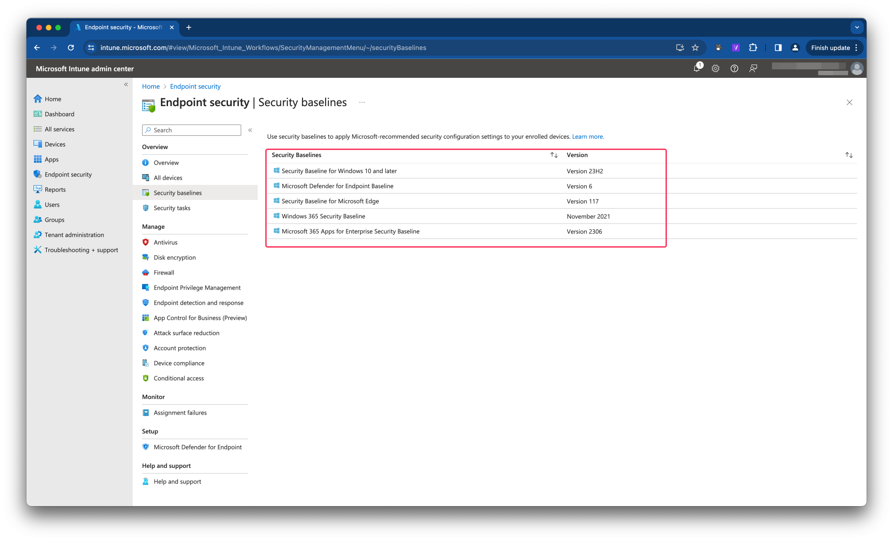
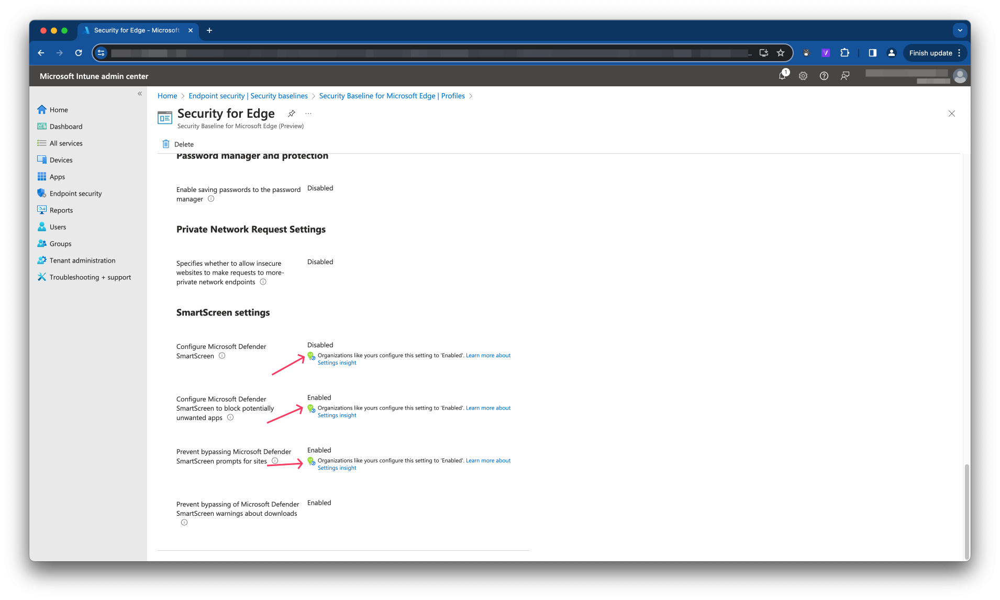
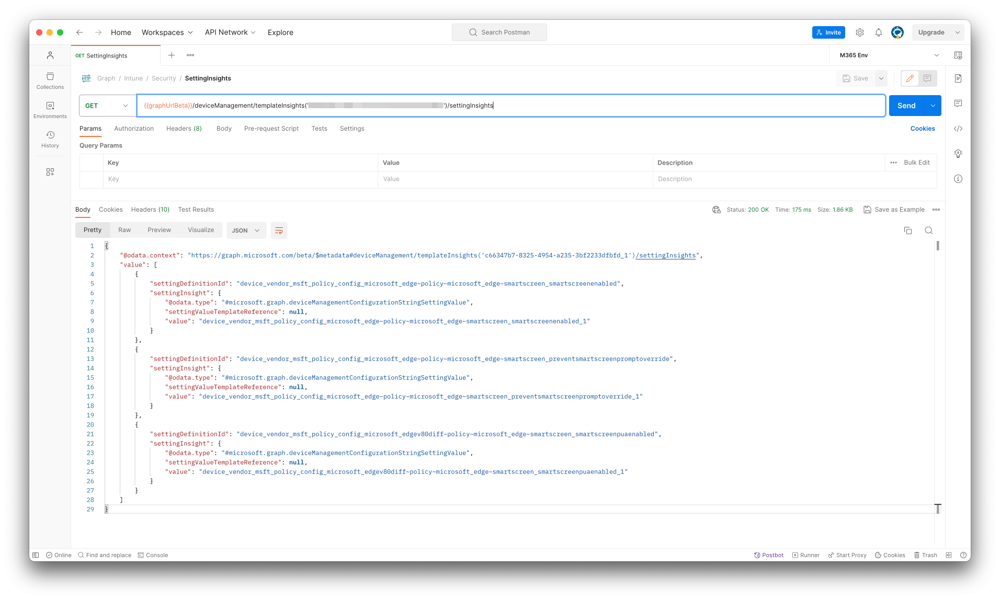
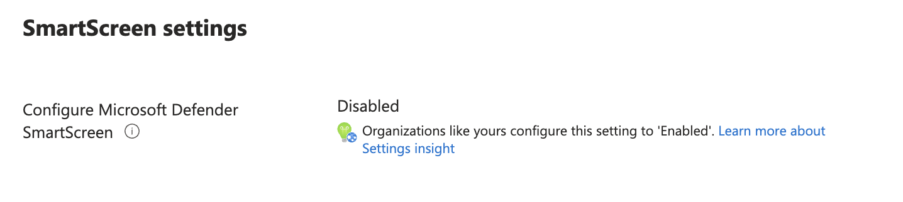
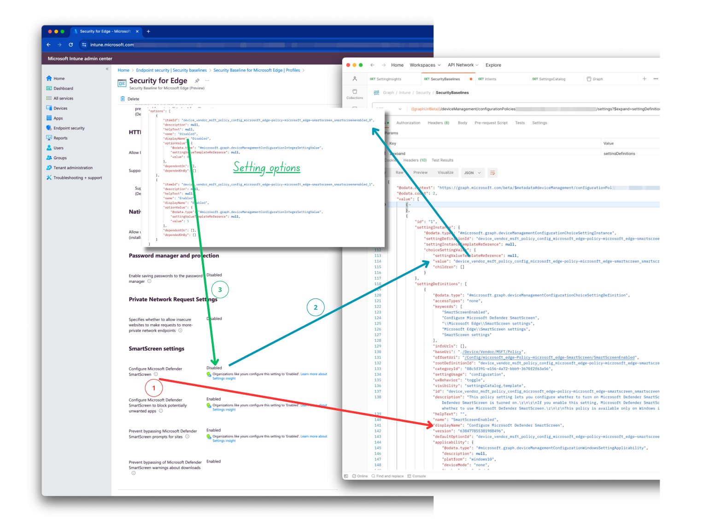
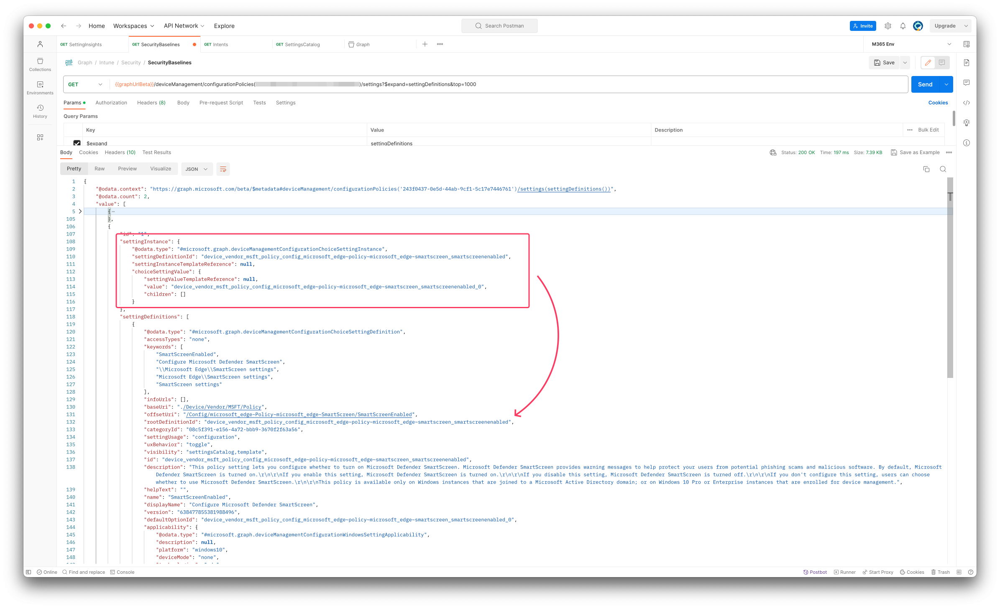
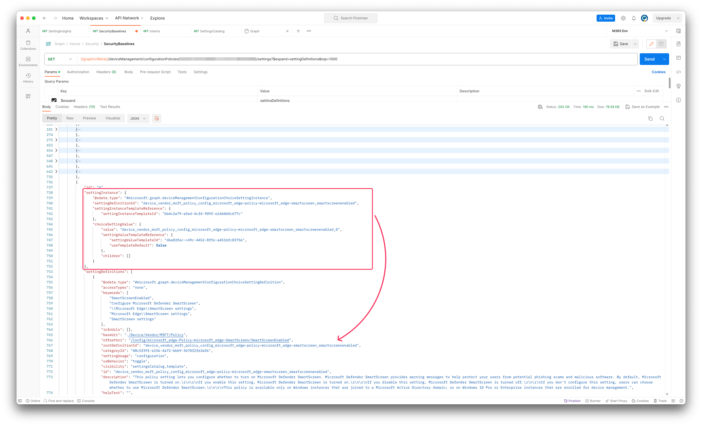

Microsoft has updated their security baselines in Microsoft Intune which you can read in the [What is new in Intune](https://learn.microsoft.com/en-us/mem/intune/fundamentals/whats-new#updated-security-baseline-for-windows-version-23h2). A part of the updates is that Microsoft has added recommended settings based on your organisation. In this blog post, I show how to monitor these recommendations that are part of the security baseline and generate a response when a setting does not met Microsoft's recommendation.


## Security Baselines
In short, with Microsoft Intune’s security baselines, you can rapidly deploy a recommended security posture to your managed Windows devices for Windows security baselines to help you secure and protect your users and devices.
Security baselines do have different starting points as you can see in the screenshot below.



This feature applies to:

Windows 10 version 1809 and later
Windows 11

For more information check the [Security baselines overview](https://learn.microsoft.com/en-us/mem/intune/protect/security-baselines#intune-security-baseline-overview)


### Security baseline settings (insights)
Settings Insights is tailored insights powered by a Machine Learning model. Settings insight works on Machine Learning basis and is currently available within Intune security baselines.
In this further blog post I focus on the Security baseline for Microsoft Edge.
A security baseline comprises a set of expert recommended configurations to secure devices, apps, and services. Settings insight adds insights to security baselines giving you confidence in configurations that are successfully adopted by similar organizations.

In the screenshot below I show a default out-of-the-box Edge baseline I created a while ago. In the settings now you see a green light blub with a globe. That indicates there is Machine Learning information available.



Good to know this work for existing baselines already. For more information about setting insights, please check the [overview](https://learn.microsoft.com/en-us/mem/intune/fundamentals/settings-insight#overview)

## Monitor Security Baseline Insights settings
As mentioned, Setting Insights is based on Machine Learning. As the name Machine Learning pretents it is learning ;). So, it could be that some settings are changing in the future. Because of possible changes, it would be nice to get a trigger when a setting does not met the recommendation anymore.
In this upcoming paragraph I show how to monitor these settings.

### Settings Insights Graph API
There is now a Graph API endpoint available that show which settings do have Machine Learning information. Based on the baseline policy Id, request the endpoint for insights.
The response then is all setting that have information. It does no matter if a setting is configurated 'correctly' already.

```basic
https://graph.microsoft.com/beta/deviceManagement/templateInsights('{baeslinePolicyId}')/settingInsights
```
In the screenshot below, I have send a GET request to the Setting Insights endpoint based on the Mircosoft Edge baseline earlier. As you can see in the screenshot above there are three settings with insights information. The response below shows also three settings do have information.


```json
{
    "@odata.context": "https://graph.microsoft.com/beta/$metadata#deviceManagement/templateInsights('c66347b7-8325-4954-a235-3bf2233dfbfd_1')/settingInsights",
    "value": [
        {
            "settingDefinitionId": "device_vendor_msft_policy_config_microsoft_edge~policy~microsoft_edge~smartscreen_smartscreenenabled",
            "settingInsight": {
                "@odata.type": "#microsoft.graph.deviceManagementConfigurationStringSettingValue",
                "settingValueTemplateReference": null,
                "value": "device_vendor_msft_policy_config_microsoft_edge~policy~microsoft_edge~smartscreen_smartscreenenabled_1"
            }
        },
        {
            "settingDefinitionId": "device_vendor_msft_policy_config_microsoft_edge~policy~microsoft_edge~smartscreen_preventsmartscreenpromptoverride",
            "settingInsight": {
                "@odata.type": "#microsoft.graph.deviceManagementConfigurationStringSettingValue",
                "settingValueTemplateReference": null,
                "value": "device_vendor_msft_policy_config_microsoft_edge~policy~microsoft_edge~smartscreen_preventsmartscreenpromptoverride_1"
            }
        },
        {
            "settingDefinitionId": "device_vendor_msft_policy_config_microsoft_edgev80diff~policy~microsoft_edge~smartscreen_smartscreenpuaenabled",
            "settingInsight": {
                "@odata.type": "#microsoft.graph.deviceManagementConfigurationStringSettingValue",
                "settingValueTemplateReference": null,
                "value": "device_vendor_msft_policy_config_microsoft_edgev80diff~policy~microsoft_edge~smartscreen_smartscreenpuaenabled_1"
            }
        }
    ]
}
```

### Settings insights response explained
As you can see in the response, it all consists of setting catalog Id's. When looking closer to it, you see there is `settingDefinitionId` and a `settingInsight.value`. I picked the first setting insight.
The setting definition Id is the link to the complete setting definition. A setting definition is the full setting object with all setting information and available options.
The JSON below shows the setting definition of the last object in the response above, `device_vendor_msft_policy_config_microsoft_edge~policy~microsoft_edge~smartscreen_smartscreenenabled`
It is a big object will all information about the setting and all of its options.
```json
{
    "settingDefinitions": [
        {
            "@odata.type": "#microsoft.graph.deviceManagementConfigurationChoiceSettingDefinition",
            "accessTypes": "none",
            "keywords": [
                "SmartScreenEnabled",
                "Configure Microsoft Defender SmartScreen",
                "\\Microsoft Edge\\SmartScreen settings",
                "Microsoft Edge\\SmartScreen settings",
                "SmartScreen settings"
            ],
            "infoUrls": [],
            "baseUri": "./Device/Vendor/MSFT/Policy",
            "offsetUri": "/Config/microsoft_edge~Policy~microsoft_edge~SmartScreen/SmartScreenEnabled",
            "rootDefinitionId": "device_vendor_msft_policy_config_microsoft_edge~policy~microsoft_edge~smartscreen_smartscreenenabled",
            "categoryId": "08c5f391-e156-4a72-bbb9-3670f2f63a56",
            "settingUsage": "configuration",
            "uxBehavior": "toggle",
            "visibility": "settingsCatalog,template",
            "id": "device_vendor_msft_policy_config_microsoft_edge~policy~microsoft_edge~smartscreen_smartscreenenabled",
            "description": "This policy setting lets you configure whether to turn on Microsoft Defender SmartScreen. Microsoft Defender SmartScreen provides warning messages to help protect your users from potential phishing scams and malicious software. By default, Microsoft Defender SmartScreen is turned on.\r\n\r\nIf you enable this setting, Microsoft Defender SmartScreen is turned on.\r\n\r\nIf you disable this setting, Microsoft Defender SmartScreen is turned off.\r\n\r\nIf you don't configure this setting, users can choose whether to use Microsoft Defender SmartScreen.\r\n\r\nThis policy is available only on Windows instances that are joined to a Microsoft Active Directory domain; or on Windows 10 Pro or Enterprise instances that are enrolled for device management.",
            "helpText": "",
            "name": "SmartScreenEnabled",
            "displayName": "Configure Microsoft Defender SmartScreen",
            "version": "638477855381988496",
            "defaultOptionId": "device_vendor_msft_policy_config_microsoft_edge~policy~microsoft_edge~smartscreen_smartscreenenabled_0",
            "applicability": {
                "@odata.type": "#microsoft.graph.deviceManagementConfigurationWindowsSettingApplicability",
                "description": null,
                "platform": "windows10",
                "deviceMode": "none",
                "technologies": "mdm",
                "configurationServiceProviderVersion": "5.0",
                "maximumSupportedVersion": null,
                "minimumSupportedVersion": null,
                "windowsSkus": [],
                "requiresAzureAd": false,
                "requiredAzureAdTrustType": "none"
            },
            "occurrence": {
                "minDeviceOccurrence": 1,
                "maxDeviceOccurrence": 1
            },
            "referredSettingInformationList": [],
            "options": [
                {
                    "itemId": "device_vendor_msft_policy_config_microsoft_edge~policy~microsoft_edge~smartscreen_smartscreenenabled_0",
                    "description": null,
                    "helpText": null,
                    "name": "Disabled",
                    "displayName": "Disabled",
                    "optionValue": {
                        "@odata.type": "#microsoft.graph.deviceManagementConfigurationIntegerSettingValue",
                        "settingValueTemplateReference": null,
                        "value": 0
                    },
                    "dependentOn": [],
                    "dependedOnBy": []
                },
                {
                    "itemId": "device_vendor_msft_policy_config_microsoft_edge~policy~microsoft_edge~smartscreen_smartscreenenabled_1",
                    "description": null,
                    "helpText": null,
                    "name": "Enabled",
                    "displayName": "Enabled",
                    "optionValue": {
                        "@odata.type": "#microsoft.graph.deviceManagementConfigurationIntegerSettingValue",
                        "settingValueTemplateReference": null,
                        "value": 1
                    },
                    "dependentOn": [],
                    "dependedOnBy": []
                }
            ]
        }
    ]
}
```

The value of the insights reponse is Microsoft's recommended setting. In the insights reponse above the setting value should be `device_vendor_msft_policy_config_microsoft_edgev80diff~policy~microsoft_edge~smartscreen_smartscreenpuaenabled_1`. 
When looking into the setting options in the setting definition, you see that this setting has two options with the name `Disabled` and `Enabled`. 
Looking to the recommended setting Id, Microsoft suggets that the setting `Configure Microsoft Defender SmartScreen to block potentially unwanted apps` (from the defintion display name) should be set to Enabled.

In the portal you also see that the setting should be Enable, but mine is disabled.


How the settings are connected is shown in the screenshot below.



### Monitor security baseline settings for recommendation
Now we know that the insights API responses with defintions and their recommended settings based on a policy. With that in mind, we have to look for every security baseline if there are insights available.
To achieve that goal, I first search for all Security Baselines in my enviroment using the Graph API and PowerShell

```powershell
# Search for all Edge security baselines
$currentConfiguredBaselinesUrl = "https://graph.microsoft.com/beta//deviceManagement/configurationPolicies?`$filter=(templateReference/TemplateId%20eq%20%27c66347b7-8325-4954-a235-3bf2233dfbfd_1%27%20or%20templateReference/TemplateId%20eq%20%27c66347b7-8325-4954-a235-3bf2233dfbfd_2%27)%20and%20(templateReference/TemplateFamily%20eq%20%27Baseline%27)"
$getCurrentBaselines = Invoke-RestMethod -Uri $currentConfiguredBaselinesUrl -Headers $header -Method Get
```
In the next step I search for insights per baseline using a ForEach loop.
```powershell
# Then for each baseline, get the settings and check the insights against the insights API.
# Settings are needed to get nice names for the settings.
$getCurrentBaselines.value.ForEach
({
    ## Code block for checking insights
})
```
A first part of the block is checking for insights and get all the setting information of the policy.

```powershell
    $baseline = $_
    # Get current baseline information
    $baselineSettingsUrl = "https://graph.microsoft.com/beta/deviceManagement/configurationPolicies('{0}')/settings?`$expand=settingDefinitions&top=1000" -f $baseline.Id
    $getBaselineSettings = Invoke-RestMethod -Uri $baselineSettingsUrl -Headers $header -Method Get

    # Get setting insights for the baseline
    $getSettingInsightsUrl = "https://graph.microsoft.com/beta/deviceManagement/templateInsights('{0}')/settingInsights" -f $baseline.templateReference.templateid
    $getSettingInsights = Invoke-RestMethod -Uri $getSettingInsightsUrl -Headers $header -Method Get
```
In the last part, if there are insights available, I search for setting information per setting.
At first I search for the setting defintion from the Insights response. When having the defintion, we have all needed information for the rest of the script.

Then the second step is searching in the policy for the current configured setting and make it readable by searching in the just founding definition for all setting options. In the options, I search for the Id and select then the displayname.
Then again I search the definition options again but now based on the Id Microsoft suggests.

At last, I compare the current setting with Microsoft and show a message on the screen if a setting is correct or not.

```powershell
# When there are insights available, loop through them and compare the current setting with the recommended setting.
    if ($getSettingInsights.count -gt 0) {
        $getSettingInsights.value.ForEach({
                $getSettingInsightsId = $_.settingDefinitionId
                $recommendedSettingId = $_.settingInsight.value
                # Get Setting information from the definition based on the insights setting definition Id
                $currentBaselineDefinition = $getBaselineSettings.value.settingDefinitions.Where({ $_.id -eq $getSettingInsightsId })
                # Search for the current setting value in the policy
                $currentBaselineSetting = ($getBaselineSettings.value.settingInstance.Where({ $_.settingDefinitionId -eq $getSettingInsightsId })).choiceSettingValue.value

                # Make the value human readable by searching in the setting definition for the specific setting Id
                $currentBaselineSettingReadable = $currentBaselineDefinition.options.Where({ $_.itemId -eq $currentBaselineSetting }).displayName
                # At last, search in the same definition for the setting value that Microsoft suggests.
                $shouldBeValue = $currentBaselineDefinition.options.Where({ $_.itemId -eq $recommendedSettingId }).displayName

                # Send message to the user based on the findings.
                if ($currentBaselineSettingReadable -ne $shouldBeValue) {
                    Write-Warning "Baseline: $($baseline.Name) has setting: $($currentBaselineDefinition.displayName) with value: $($currentBaselineSettingReadable) but should be: $shouldBeValue"
                }
                else {
                    Write-Host "Baseline: $($baseline.Name) has setting: $($currentBaselineDefinition.displayName) with value: $($currentBaselineSettingReadable) and is correct."
                }
            })
    }
    else {
        Write-Host "Baseline: $($baseline.Name) has no insights."
    }
```
That results in the response below.
```powershell
Baseline: Security for Edge has setting: Prevent bypassing Microsoft Defender SmartScreen prompts for sites with value: Enabled and is correct.
WARNING: Baseline: Security for Edge has setting: Configure Microsoft Defender SmartScreen with value: Disabled but should be: Enabled
Baseline: Security for Edge has setting: Configure Microsoft Defender SmartScreen to block potentially unwanted apps with value: Enabled and is correct.
```

## What about configuration profiles instead of security baselines?
I have tested the insights with configuration profiles and can tell that insights are not available in configuration profiles. That means if you want to get more insights in your security settings you have to use security profiles instead of configuration profiles.
Lots of discussions are happening about the subject what is the best to use, Security Baselines or configuration profiles from the settings catalog.
What the answer may be in the end, from backend perspective, is does not matter because both are using the same settings from the settings catalog.

I copied the setting instance from my configuration policy that is show below

```json
 "settingInstance": {
                "@odata.type": "#microsoft.graph.deviceManagementConfigurationChoiceSettingInstance",
                "settingDefinitionId": "device_vendor_msft_policy_config_microsoft_edge~policy~microsoft_edge~smartscreen_smartscreenenabled",
                "settingInstanceTemplateReference": null,
                "choiceSettingValue": {
                    "settingValueTemplateReference": null,
                    "value": "device_vendor_msft_policy_config_microsoft_edge~policy~microsoft_edge~smartscreen_smartscreenenabled_0",
                    "children": []
                }
            },
```


The setting instance of a security profile looks like below:

```json
"settingInstance": {
                "@odata.type": "#microsoft.graph.deviceManagementConfigurationChoiceSettingInstance",
                "settingDefinitionId": "device_vendor_msft_policy_config_microsoft_edge~policy~microsoft_edge~smartscreen_smartscreenenabled",
                "settingInstanceTemplateReference": {
                    "settingInstanceTemplateId": "bb4c2a79-a5ed-4cf4-909f-e146060c677c"
                },
                "choiceSettingValue": {
                    "value": "device_vendor_msft_policy_config_microsoft_edge~policy~microsoft_edge~smartscreen_smartscreenenabled_0",
                    "settingValueTemplateReference": {
                        "settingValueTemplateId": "d6e83fec-c49c-4452-8ffe-a451bfc83756",
                        "useTemplateDefault": false
                    },
                    "children": []
                }
            },
```



The script is also available in my [GitHub repository](https://github.com/srozemuller/MicrosoftEndpointManager/tree/main/SecurityBaselines).
