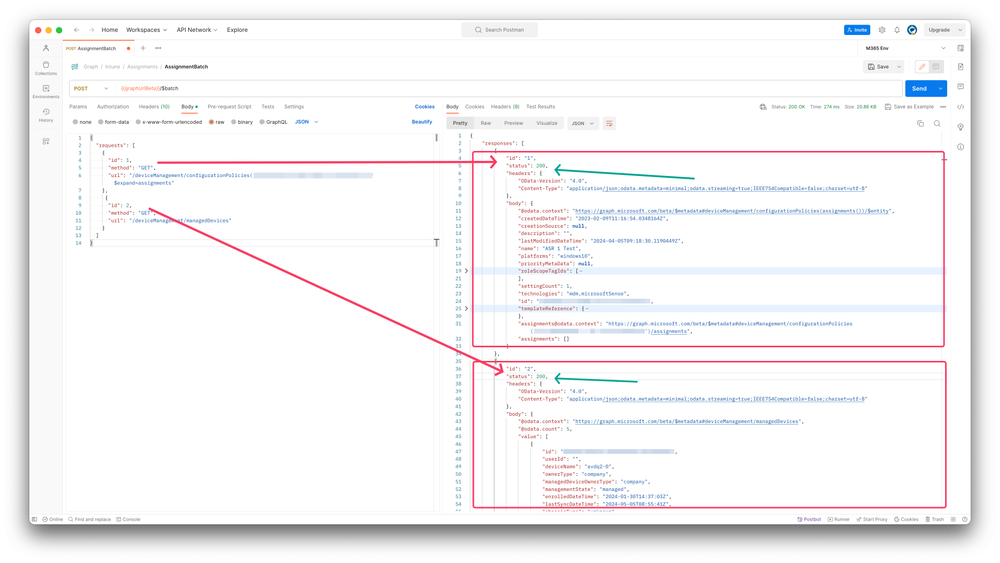

Maybe you heard of it before, Graph API. It is the platform where many Microsoft Services are connected to. Think about Entra ID, Microsoft Intune, SharePoint and many more. If you want to automate things regarding these services, it’s the way to talk against the Graph API.

Every specific resource in a service has its own endpoint. Think about users, devices, Intune resources, mailboxes, SharePoint sites.
All together makes the Graph API.
The platform can handle many many requests at a time.
But, also the Graph API has its limits. When requesting the Graphp API at scale you have seen a 429 request for sure.
The 429 response means you requesting the platform that much it holds you for a time. This is called throttling.

In this post I show how to handle with this and also show how to automate at scale using Graph API Batch.

## Graph response 429 “to many requests”
As said in the intro, the Graph API platform handles many requests and response very quick.
To keep the platform reliable, there is a limit how many requests you can send in a certain time frame.
If the limit is reached you will get a “To Many Requests” response.
The HTTP response code is 429.

### Response header
The response code is one part of a whole response. The response header gives you the response code (200 is OK), the message and more.
In the case of a 429 response code the message is “to many requests”

### Retry-After
When the limit is reached, Graph gives you a response like below.
{
  "error": {
    "code": "TooManyRequests",
    "innerError": {
      "code": "429",
      "date": "2020-08-18T12:51:51",
      "message": "Please retry after",
      "request-id": "94fb3b52-452a-4535-a601-69e0a90e3aa2",
      "status": "429"
    },
    "message": "Please retry again later."
  }
}

It is good then to fetch the “retry-after” value, in this case 10. (I’ve seen also 30 as response)

This value is the number in seconds.

Good to know that every service has its own limit. To see all the limit values follow the link below.
[Graph API Throttling limits](https://learn.microsoft.com/en-us/graph/throttling-limits)


## Graph API requests with PowerShell
With the above in mind, use can use the PowerShell code below to send API requests and including the 429 check.
I filled the `$authHeader` based on this blog post: https://rozemuller.com/how-to-use-rest-api-with-powershell/

I created a do until loop where the request status code is checked for 429. If the response is 429, the loop start at value 0 and tries again after the secondes + 1 returned in the retry-after object. 
This till the max of 3.

I have added a max retries to avoid a infinite loop.
```powershell
$graphUrl = "https://graph.microsoft.com/devicemanagement/manageddevices"
$request = Invoke-WebRequest -Method GET -Uri $graphUrl -Headers $authHeader -SkipHttpErrorCheck
do {
    $i = 0
    Write-Warning "
                    /(  ___________
                   |  >:===========
                    )("
    Write-Warning "Hammering Graph API to much, waiting now for $($request.Headers.'retry-after') seconds"

    [double]$waitTimeInSec = $($request.Headers.'retry-after')
    Start-Sleep -Seconds ($waitTimeInSec + 1)
    $costs = Invoke-WebRequest -Uri $graphUrl -Method GET -Headers $authHeader -SkipHttpErrorCheck
    $i++
}
until (($request.StatusCode -ne 429) -and ($i -lt 3))
```
Make a note for the `-SkipHttpErrorCheck` flag. You will need this, otherwise you just get the error message returned instead of the 429 code.
I look for the code 429 especialy because this is a HTTP request standard, where the response message is free to fill in by the API developer.

For more information about throttling check the [Microsoft Learn about Graph API throttling](https://learn.microsoft.com/en-us/graph/throttling).

Check this [WIKI for all HTTP return codes](https://en.wikipedia.org/wiki/List_of_HTTP_status_codes)

## Graph Batch
If you want to send API requests at scale, it could be better to use the Graph API batch method.
This method allows you to send up to 20 API calls in a single request. This could help avoiding the 429 response.
And, besides that, is also way more faster than sending 20 separate requests.

The Graph batch endpoint is always the same and accessible at `https://graph.microsoft.com/v1.0/$batch`. The url is also available in the Beta.

### Graph Batch body
The most API requests are GET requests. The GET request fetches information from the platform.
When using the batch endpoint, you have to send information to the platform. Sending information is done by using a POST request.

A POST request always need a body. The body looks like below.
I send two requests at a single time. One for all managed devices and one for a specific configuration policy with assignments in Intune.

The url object accepts the inner endpoints, you dont need the `https://graph.microsoft.com` part.
```json
{
  "requests": [
    {
      "id": 1,
      "method": "GET",
      "url": "/deviceManagement/configurationPolicies('1cb49a48-e146-40fb-b95e-8cdc5e455776')?$expand=assignments"
    },
     {
      "id": 2,
      "method": "GET",
      "url": "/deviceManagement/managedDevices"
    }
  ]
}
```

### Graph Batch response
The response from the call above looks like below.
As you can see the response returnes a JSON body with all the responses. I simplyfied the response a bit the clarify.
Every resonse has an id, status, headers and the body with the values.
The id represents the id of the request in the body, the status is the return code, 200 is OK.
The body are the values you are searching for.

```json
{
 "responses": [
        {
            "id": "1",
            "status": 200,
            "headers": {
                "OData-Version": "4.0",
                "Content-Type": "application/json;odata.metadata=minimal;odata.streaming=true;IEEE754Compatible=false;charset=utf-8"
            },
            "body": {
                "@odata.context": "https://graph.microsoft.com/beta/$metadata#deviceManagement/configurationPolicies(assignments())/$entity",
                "createdDateTime": "2023-02-09T11:16:54.0348164Z",
                "creationSource": null,
                "description": "",
                "lastModifiedDateTime": "2024-04-05T09:18:30.1190449Z",
                "name": "ASR 1 Test"
            }
        },
        {
            "id": "2",
            "status": 200,
            "headers": {
                "OData-Version": "4.0",
                "Content-Type": "application/json;odata.metadata=minimal;odata.streaming=true;IEEE754Compatible=false;charset=utf-8"
            },
            "body": {
                "@odata.context": "https://graph.microsoft.com/beta/$metadata#deviceManagement/managedDevices",
                "@odata.count": 5,
                "value": [
                    {
                        "id": "f012d909-2edb-4bb4-bdff-392bae86c10f",
                        "userId": "",
                        "deviceName": "avdq2-0",
                        "ownerType": "company",
                        "managedDeviceOwnerType": "company"
                    }
                ]
            }
        }
 ]
 }
```



For more information about Graph API batching, check the [Microsoft Learn](https://learn.microsoft.com/en-us/graph/json-batching)

## Graph batch in automation
Actually I use graph batch all the time. Also even when sending just the one request.

Why??

For a single request it is maybe a bit overkill but when having more requests you immediately have the advantage of speed.

I have written a script block that can generate a batch request body automated.
By using that script block for me every request is the same all the time.

This saves a lot of complexity and I don’t have to write different script blocks for every different api endpoint.

Another thing is you can combine different api endpoint in a single request.
So one call to different endpoints. Instead of creating different code blocks for all different endpoints.

### Generate batch requests body in PowerShell

The PowerShell below consists of two functions. The main function `Create-UrlListBatchOutput` is the one that generates a batch request with the maximum of 20 urls.
It returnes an object with request bodies.

The `Chunk-List` function creates chunks of 20 urls.

```powershell
function Create-UrlListBatchOutput {
    param (
        [System.Collections.Generic.List[string]] $urlList
    )

    $chunks = Chunk-List $urlList 20
    $outputJsonStrings = @()

    foreach ($chunk in $chunks) {
        $outputObject = @{
            requests = @()
        }

        $requestId = 1
        foreach ($urlValue in $chunk) {
            $request = @{
                id = $requestId++
                method = "GET"
                url = $urlValue
            }
            $outputObject.requests += $request
        }
        $outputJsonStrings += ($outputObject | ConvertTo-Json)
    }
    return ,$outputJsonStrings
}

function Chunk-List {
    param (
        [System.Collections.Generic.List[string]] $list,
        [int] $chunkSize
    )

    $chunks = @()
    for ($i = 0; $i -lt $list.Count; $i += $chunkSize) {
        $chunks += ,$list[$i..($i + $chunkSize - 1)]
    }
    return ,$chunks
}
```

### How to use the PowerShell method

Imagine you want information for all devices that only are available when requesting the specific device. Then do the following.

- Request all devices;
- Generate specific URLs for all devices;
- Then send the batch bodies to the batch API;
- At last, convert the response from JSON the get PowerShell objects returned.

```powershell
$graphUrl = "https://graph.microsoft.com/v1.0/`$batch"
$batchBody = Create-UrlListBatchOutput("/devicemanagement/manageddevices")
$allDevices = Invoke-WebRequest -Uri $graphUrl -Method POST -body $batchBody -Headers $authHeaders -SkipHttpErrorCheck
$specificDeviceUrls = [System.Collections.ArrayList]::new()
foreach ($device in ($allDevices.Content | ConvertFrom-Json).responses.body.value) {
    $specificDeviceUrls.add("devicemanagement/manageddevices('{0}')" -f $device.id )| Out-Null
}

$specificDeviceBatchBody = Create-UrlListBatchOutput($specificDeviceUrls)

$specificDevices = Invoke-WebRequest -Uri $graphUrl -Method POST -body $specificDeviceBatchBody -Headers $authHeaders -SkipHttpErrorCheck
$deviceInfo = ($specificDevices | ConvertFrom-Json).responses.body
```

You can find the PowerShell script at my [GitHub](https://github.com/srozemuller/GeneralScripts/blob/main/GraphAPI/generate-batchRequestBody.ps1)

