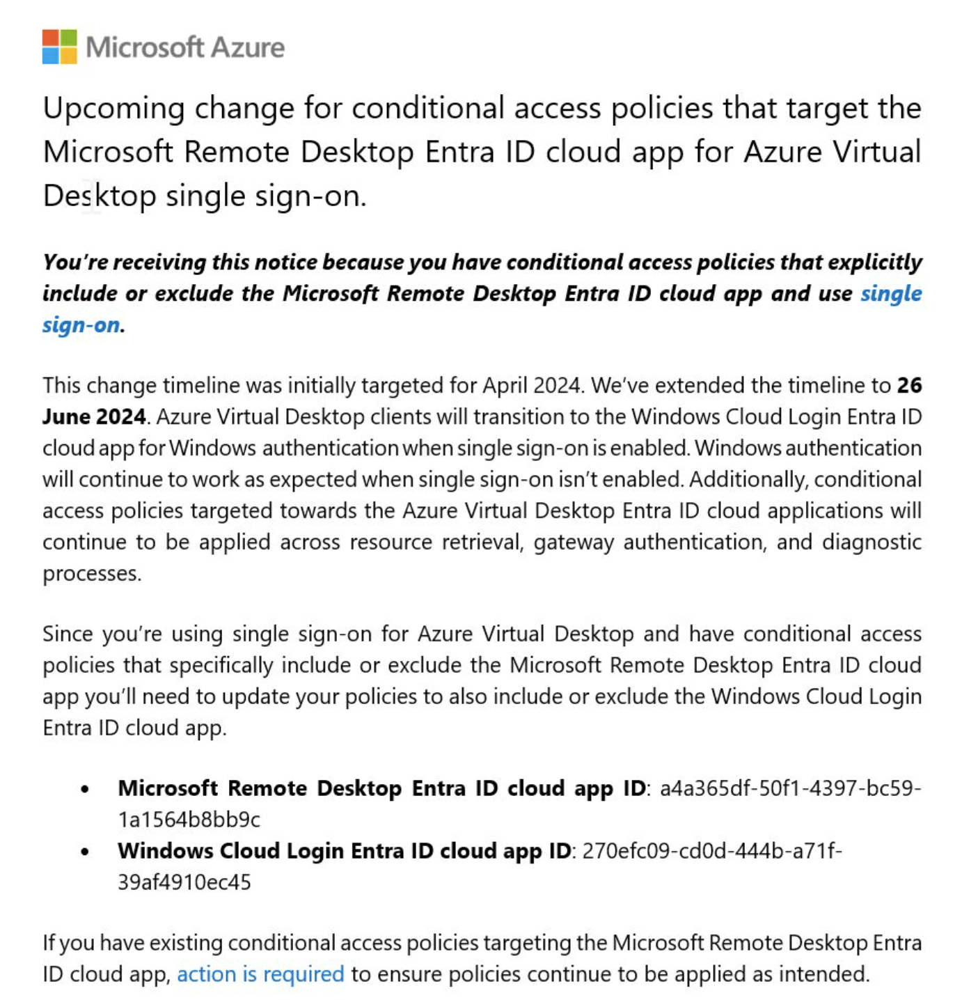
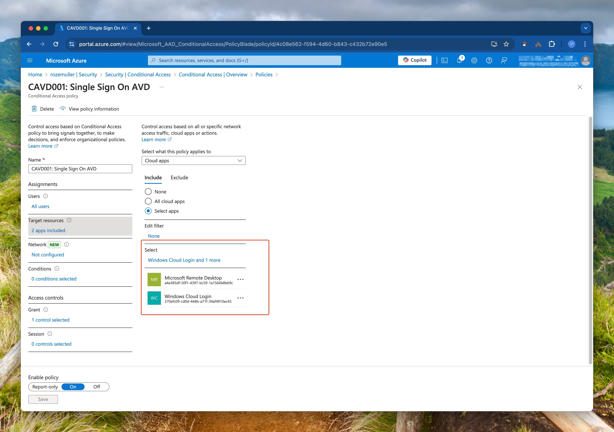
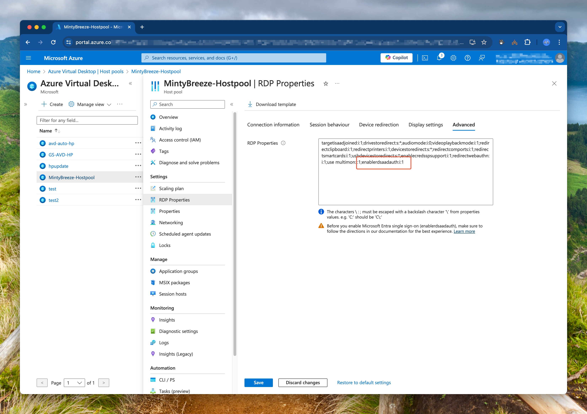

Single Sign On (SSO) for Azure Virtual Desktop (AVD) gives users a seamless login experience from their Windows 10 or Windows 11 device to AVD. This feature is available for a while and most people have configured this feature already. Also, most are also using Conditional Access (CA) (I hope). To make Single Sign On work for AVD in combination with CA policies you need to add the applications `Microsoft Remote Desktop (a4a365df-50f1-4397-bc59-1a1564b8bb9c)` to your CA policies. Based on your situation the applications are in- or excluded. 
Now, Microsoft announced that the Single Sign On traffic will be transitioned from the `Microsoft Remote Desktop` app to `Windows Cloud Login`. This means you have to add this application to your CA policies. This can be done manually, but I prefer to automate this. In this blog post, I will show you how to add the `Windows Cloud Login` application to your CA policies automated.



## Add Windows Cloud Login application to Conditional Access automated
In this blog post, I will skip the SSO for AVD configuration part. I assume you have already configured this. If not, please follow the [Microsoft documentation](https://learn.microsoft.com/en-us/azure/virtual-desktop/configure-single-sign-on#enable-microsoft-entra-authentication-for-rdp) to configure this. 
I will show you how to add the `Windows Cloud Login` application to your CA policies automated by using PowerShell and the Microsoft Graph API.



In the following steps, I will show you how to check if your AVD host pools are configured with SSO and how to add the `Windows Cloud Login` application to your CA policies automatically.
>> The code blocks below are snippets of the complete script. You can find the complete script on my [GitHub]()

### Pre-requisites
- Make sure you have installed the latest version of `Az.Avd` PowerShell module. You can install this module by running the following command: `Install-Module -Name Az.Avd -Force -AllowClobber -Scope CurrentUser`
- Make sure you have installed the latest version of `Az.Accounts` PowerShell module. You can install this module by running the following command: `Install-Module -Name Az.Accounts -Force -AllowClobber -Scope CurrentUser`
- Make sure you have installed the latest version of `MSGraph` PowerShell module. You can install this module by running the following command: `Install-Module -Name MSGraph -Force -AllowClobber -Scope CurrentUser`

### Check if AVD host pools are configured with SSO
The first thing we need to do is check if the AVD is configured with SSO. To make that happen I will use the `Get-AvdHostpool` from the `Az.Avd` PowerShell module and check if host pools are configured with the RDP property `enablerdsaadauth:i:1`. If this property is set to `1` the host pool is configured with SSO. 

First, I connect with Azure using the `Connect-AzAccount`. This command is from the `Az.Account` PowerShell module. Then I fetch the access token that I need to connect to the AVD environment. I use the `Connect-Avd` command from the `Az.Avd` PowerShell module to connect to the AVD environment.  When connected to AVD, I search for all host pools in a subscription. At last, I check if in one of the host pools the RDP property `enablerdsaadauth:i:1` is set. If this is the case, I will output a message that the host pool is configured with SSO.



For more information about RDP properties please check the [AVD RDP properties](https://learn.microsoft.com/en-us/azure/virtual-desktop/rdp-properties#connection-information).


```powershell
    Connect-AzAccount
    Connect-Avd -AccessToken $(Get-AzAccessToken).token -subscriptionId $SubscriptionId
# Check if the hostpool has SSO enabled
$hostpools = Get-AvdHostPool
$hostpools.ForEach({
    $hostpool = $_
    if ($hostpool.properties.customrdpproperty.Contains("enablerdsaadauth:i:1")){
        Write-Output "Hostpool $($hostpool.name) has SSO enabled"
    }
})
```

### Add Windows Cloud Login application to Conditional Access automated
In the next step, I will add the `Windows Cloud Login` application to the CA policies if the application is not there already. To make this happen I will use the Microsoft Graph API. I will use the `MSGraph` PowerShell module to connect to the Microsoft Graph API.

First, I connect to the Microsoft Graph API using the `Connect-MgGraph` command from the `MSGraph` PowerShell module. Then I fetch all the applications from the Microsoft Graph API. I search for the  `Microsoft Remote Desktop` application. Then in the policy, I check if  `Windows Cloud Login` is missing. This is for me a sign, that CA is used with AVD SSO but not up to date with the correct applications. 

After connecting, I fetch all the conditional access policies from the Microsoft Graph API. I searched, for the `Microsoft Remote Desktop` included application in the policies. If the `Windows Cloud Login` application is missing, I will add this application to the policy.

```powershell
Connect-MgGraph -Scopes "https://graph.microsoft.com/.default"
$caPolicies = Invoke-MgGraphRequest -Method GET -Uri "beta/identity/conditionalAccess/policies/" -OutputType Json | ConvertFrom-Json
$caPolicies.value | ForEach-Object {
    $policy = $_
    Write-Information "Checking policy $($policy.displayName)" -InformationAction Continue
    $includedApps = $policy.Conditions.applications.includeApplications
    # Check if the Windows Cloud Login is missing but has the Microsoft Remote Desktop application
    if (($includedApps.contains("a4a365df-50f1-4397-bc59-1a1564b8bb9c")) -and (!$includedApps.contains("270efc09-cd0d-444b-a71f-39af4910ec45"))) {
        # Adding the application to the included applications
        $policy.Conditions.applications.includeApplications += "270efc09-cd0d-444b-a71f-39af4910ec45"
                try {
                    $body = @{
                        conditions = $policy.conditions
                    }
                    $body | ConvertTo-Json -Depth 99 | Invoke-MgGraphRequest -Method PATCH -Uri "beta/identity/conditionalAccess/policies/$($policy.id)" -OutputType Json
                
                }
                catch {
                    Write-Error "Failed to update policy $($policy.displayName)"
                }
    }
}
```
## How to use my script
The script can be downloaded from my GitHub and can be used in your environment. The script is a PowerShell script and can be run from your local machine. The script is tested and works in my environment. Please test the script in a test environment before running it in production.

The script has several scenarios:
Just search for Conditional Access policies that need to be changed:
```powershell
.\FindAppInCA.ps1 -SubscriptionId "yourSubscriptionId"
```

Change Conditional Access policies interactive that need to be changed:
```powershell
.\FindAppInCA.ps1 -SubscriptionId "yourSubscriptionId" -UpdatePolicies
```

Change Conditional Access policies in automation that need to be changed:
```powershell
.\FindAppInCA.ps1 -SubscriptionId "yourSubscriptionId" -ForceChange
```

In both change scenarios, backups are made of the changed policies. If you want to skip backup, add the `-MakeBackup $false` parameter.

You can find the PowerShell script on my [GitHub](https://github.com/srozemuller/Identity/blob/main/ConditionalAccess/AvdSingleSignOn/FindAppInCA.ps1)

