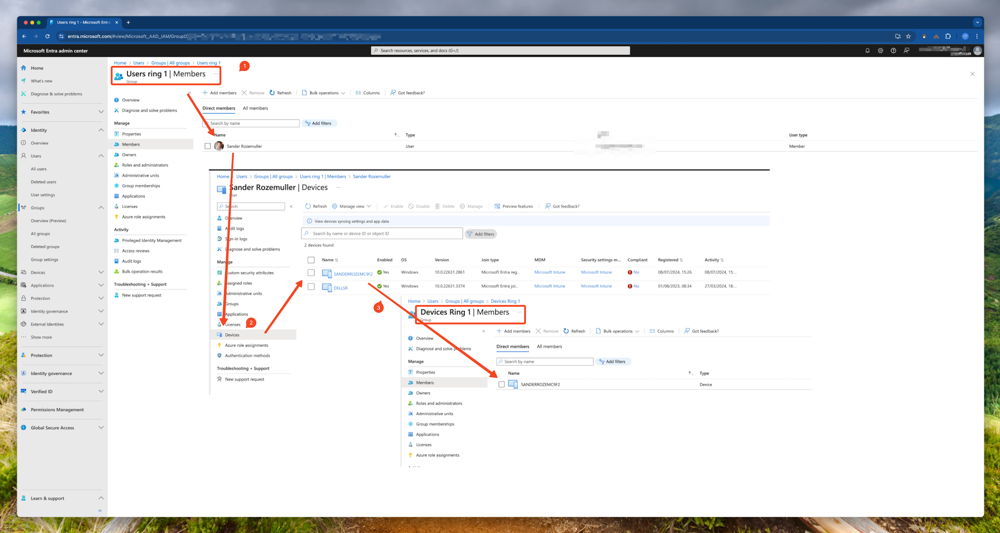

Testing settings and updates in Microsoft Intune is a good idea. Many Intune administrators use a test group and Update Rings for this. In the base of Windows Updates, administrators configure an update ring and assign a group to it. The group is filled with devices (I call it a device group). 
In this blog post, I will show you how to dynamically manage a device group in an automated way for your Intune update rings based on 
a user group. Let's call it dynamic device group management.



## Introduction
Besides Update Rings, more and more device-based settings become available in Microsoft Intune. To test settings granularly, it is a good idea to scope new configurations to select a group of devices. 

So far so good, but what about managing those device groups? Because, it is a user that tests the settings, but the settings are applied to a device. In this blog post, I will show you how to manage a device group in an automated way for your update rings based on a user group.
This blog post solves the problem that you have to manually manage the device group for your update rings. The solution is a PowerShell script that automatically manages the device group based on a user group.

## The idea
The idea is to create a device group based on a user group. The device group is filled with devices that are owned by the user group. You can run the script on a scheduled basis manually. 
Two scenarios are possible: 
- remove all members from a device group first, and add owned devices from a user to a device group.
- add owned devices from a user to a device group.

In both scenarios, the script selects the owned devices that are Intune managed, where the log-in time was within the last 29 days and has the provided operating system.



## The script
The script is written in PowerShell. I use the `MgGraph` PowerShell module and have written some custom functions for creating batch request bodies. 
Because I always 'talk' to the API directly I use the `Invoke-MgGraphRequest` command. 

> Using API requests saves me lots of time learning all the specific commands. And for you, the script is way more easy to read.  

The script is divided into three phases:
- Get the user and device group including members
- Fetching owned devices per user (and backup current device group members)
- Requesting the owned devices and adding them to the device group


### Get the user and device group including members
In this first phase, the script gets the user and device group including the members. The script checks if the groups exist and if the groups have members. If the groups do not exist, the script stops. If the user group has no members, the script stops also.
The snippets below show how to get the user and device group including the members using the `Invoke-MgGraphRequest` command.
```powershell
# Get the members from the user group
$userGroup = Invoke-MgGraphRequest -Method GET -Uri "beta/groups?`$filter=displayName eq '$UserGroupName'" -OutputType Json | ConvertFrom-Json
$userGroupMembers = Invoke-MgGraphRequest -Method GET -Uri "beta/groups/$($userGroup.value.id)/members" -OutputType Json | 
ConvertFrom-Json

# Get the members from the device group
$deviceGroup = Invoke-MgGraphRequest -Method GET -Uri "beta/groups?`$filter=displayName eq '$DeviceGroupName'" -OutputType Json | ConvertFrom-Json
$deviceGroupMembers = Invoke-MgGraphRequest -Method GET -Uri "beta/groups/$($deviceGroup.value.id)/members" -OutputType Json | ConvertFrom-Json
```

### Fetching owned devices per user (and backup current device group members)
The second phase of the script is fetching the owned devices per user. Based on the `$userGroupMembers` value, I create a list of API URLs for later use. I also do this for the device group members.
Later I create a list of URLs needed for my batch request. First, I filter the members from the user group that are actually users. This is to avoid also selecting other objects like applications or devices that are in the group.

> I have to filter is afterwards because the Graph API does not support filtering on the member request.

```powershell
    # Fetch all owned devices of the users in the user group
    $userGroupMembers.value | Where-Object {$_.'@odata.type' -eq '#microsoft.graph.user'} | ForEach-Object {
        $user = $_
        $ownedDevicesUrlList.Add("/users/$($user.id)/ownedDevices")
    }
    # Fetch all devices in the device group
    $deviceGroupMembers.value | Where-Object {$_.'@odata.type' -eq '#microsoft.graph.device'}  | ForEach-Object {
        $member = $_
        $memberList.Add("https://graph.microsoft.com/beta/directoryObjects/$($member.id)")
    }
    }
```
In between the phases, I create a backup of the device group members. This is done because I want to restore the members if something goes wrong. The backup is a JSON file that contains the members of the device group. 

```powershell
    # Making a backup of the members of the device group
    if ($memberList.Count -gt 0) {
        Write-Information "Backing up members of group $DeviceGroupName, putting values in $BackupPath/membersBackup.json" -InformationAction Continue
        $memberBatchBackup = Create-BodyList -bodyList $memberList

        $jsonOutput = @{
            memberBatches = $memberBatchBackup 
        } | Convertto-Json -Depth 99
        $jsonOutput | Out-File -path  "{0}/{1}" -f $BackupPath, "membersBackup.json" 
    }
```

The JSON content looks like below. I will talk later about how to restore the members to the device group. 
As you can see, I created also member batches. This is because it is also possible to add members to a group in batches. The Graph API has a limit of 20 members per batch. 
```json
{
  "memberBatches": [
    {
      "members@odata.bind": [
        "https://graph.microsoft.com/beta/directoryObjects/4adced81-993b-4340-b4e8-28c44afb29ea",
        "https://graph.microsoft.com/beta/directoryObjects/da4702cc-d801-4ffe-8e82-8697cd683b9b"
      ]
    },
    {
      "members@odata.bind": [
        "https://graph.microsoft.com/beta/directoryObjects/2715051b-19ee-48cf-af9b-c3261f516b3b",
        "https://graph.microsoft.com/beta/directoryObjects/2006faa8-d29e-498f-8012-34e3d771ee2f"
      ]
    }
  ]
}
```

For more information about adding members in batch check the [Microsoft documentation about adding multiple users to a group in a single request](https://learn.microsoft.com/en-us/graph/api/group-post-members?view=graph-rest-1.0&tabs=http#example-2-add-multiple-members-to-a-group-in-a-single-request)

### Requesting the owned devices and adding them to the device group
In the past phase, I created a list of API URLs for the owned devices. That means I have created a request URL for every user. The request URL looks like this: `/users/8c287fa3-6d4a-4d0b-a2d8-ef1ddef936ad/ownedDevices`. This URL is accepted by the Graph API batch endpoint. 
In this phase, I create a batch list from the ownedDevicesUrlList. The list looks like this:
```json
{
  "requests": [
    {
      "url": "/users/8c287fa3-6d4a-4d0b-a2d8-ef1ddef936ad/ownedDevices",
      "id": 1,
      "method": "GET"
    },
        {
      "url": "/users/2006faa8-d29e-498f-8012-34e3d771ee2f/ownedDevices",
      "id": 2,
      "method": "GET"
    }
  ]
}
```
To create a batch request, I use the `Create-UrlListBatchOutput` command. This command creates a batch request body based on the owned device URL list. 
The function accepts a list and creates chunks of 20 requests per request object. The function returns a list of batch requests. The list is used in the next phase to get the owned devices per user. 
The script adds the owned devices to the device group if the device is managed, the last sign-in date is within the last 29 days, and the operating system is the provided operating system.

```powershell
$devicesBatch = Create-UrlListBatchOutput -Method GET -urlList $ownedDevicesUrlList
$devicesBatch.ForEach({
            $response = Invoke-MgGraphRequest -Method POST -Body $_ -Uri "beta/`$batch"
            $devicesResponseList.Add($response) >> $null
        })
    $devicesResponseList.responses | Where-Object {$_.status -eq 200} | ForEach-Object {
        $deviceResponse = $_.body.value
        $deviceToAdd = $deviceResponse | Where-Object {($_.isManaged) -and ($_.approximateLastSignInDateTime -gt (Get-Date).AddDays(-29)) -and ($_.operatingSystem -eq $DeviceType)}
        $devicesList.Add("https://graph.microsoft.com/beta/directoryObjects/$($deviceToAdd.id)") >> $null
    }
    $deviceBatch = Create-BodyList -bodyList $devicesList
    $deviceBatch.ForEach({
        Invoke-MgGraphRequest -Method PATCH -Body $_ -Uri "/beta/groups/$($deviceGroup.value.id)"
    })
```

### How to use
Using the script is easy by following the steps below:

- Download the script from my [GitHub](https://github.com/srozemuller/Identity/tree/main/Devices)
- In PowerShell, run the script with the following parameters:
    - `-UserGroupName {user group name}`: The name of the user group
    - `-DeviceGroupName {device group name}`: The name of the device group
    - `-DeviceType {device type}`: The operating system of the device, default is Windows
    - `-BackupPath {path}`: The path where the backup JSON file is stored
    - Optional `-MakeDeviceGroupEmpty`: removes all members from the device group first
    - Optional `-AccessToken {token}`: When using in automation pipelines and you are logged already, you can provide the token

```powershell
PS> .\Set-DeviceGroupForUpdate.ps1 -UserGroupName "Ring1Users" -DeviceGroupName "Ring1Devices" -DeviceType "Windows" -MakeDeviceGroupEmpty -BackupPath "C:\temp"
```
## Backup and restore
When using the script, a backup is automatically made of the members of a device group. While executing a JSON file is default created at the same location as the script. If you want to change the location add the `-BackupPath {path}` parameters. The JSON file has content like below. 
Based on the total number of members, the members are divided into chunks of 20. This is because the Microsoft Graph API has a limit of 20 members per batch. The JSON file looks like this:

```json
{
  "memberBatches": [
    {
      "members@odata.bind": [
        "https://graph.microsoft.com/beta/directoryObjects/4adced81-993b-4340-b4e8-28c44afb29ea",
        "https://graph.microsoft.com/beta/directoryObjects/94f9234a-7aa9-4d38-92a9-5d9ee794330f",
        "https://graph.microsoft.com/beta/directoryObjects/5d31d749-2c3a-468c-b5d6-c43ff6703365",
        "https://graph.microsoft.com/beta/directoryObjects/da4702cc-d801-4ffe-8e82-8697cd683b9b",
        "https://graph.microsoft.com/beta/directoryObjects/d0fe2112-86e8-4c3e-b314-beb2aaf9fc95",
      ]
    },
    {
      "members@odata.bind": [
        "https://graph.microsoft.com/beta/directoryObjects/2715051b-19ee-48cf-af9b-c3261f516b3b",
        "https://graph.microsoft.com/beta/directoryObjects/2006faa8-d29e-498f-8012-34e3d771ee2f",
        "https://graph.microsoft.com/beta/directoryObjects/07b57341-94d1-4877-a066-c8694dce3a26",
        "https://graph.microsoft.com/beta/directoryObjects/413683f0-5d39-4972-9d30-dcff3d8fa67e",
        "https://graph.microsoft.com/beta/directoryObjects/0f458653-d51e-4c33-8245-c3bd1a3a0fbe",
        "https://graph.microsoft.com/beta/directoryObjects/8058943e-3ff7-406d-9c2f-f88e86d557be"
      ]
    }
  ]
}
```
Based on the JSON content, you can restore the members to the device group. The following PowerShell snippet can be used to restore the members to the device group:

```powershell
$batches = get-content ./membersBackup.json | ConvertFrom-Json
$batches.foreach({
        $batch = $_
        $batch.memberBatches.foreach({
            $membersBody = $_ | ConvertTo-Json
                Invoke-MgGraphRequest -Method PATCH -Body $membersBody -Uri "/beta/groups/$($deviceGroup.value.id)"
            })
    })
```


## For the real nerds 🤓, Graph API batching explained
When looking more deeply into the backend, Microsoft is moving to use Graph Batch requests more and more. Where in the past every click and every fetch was a single Graph request, Graph Batch is used more and more. It speeds up the process a lot, reduces the number of requests, and makes the process more reliable. But it is not always easy to understand and complex.

Also, this script uses batch requests and even it batches the device objects into chunks. I use the `Create-UrlListBatchOutput` command several times. Also, I use the `Create-BodyList` command to chunk the devices into batches.

Both commands have their own purpose. The `Create-UrlListBatchOutput` command creates a batch request body based on a list of URLs. The list is divided into chunks of 20 requests per request object. This can be used for fetching data from the Graph API.
The example below is an output of the `Create-UrlListBatchOutput` command. The provided list is for requesting the current device group members to delete them. 
The list is divided into two request objects because there were more than 20 users. There is a request for 20 and a request for 6. 
To keep it readable I removed parts of the content. I think this makes sense to you.

```json
{
  "requests": [
   ....
    {
      "url": "https://graph.microsoft.com/beta/directoryObjects/db8c9f60-8a1a-4bce-bc44-1ce265257f2d",
      "id": 18,
      "method": "DELETE"
    },
    {
      "url": "https://graph.microsoft.com/beta/directoryObjects/d13fb59f-5704-4276-82c7-cf03ced38b3c",
      "id": 19,
      "method": "DELETE"
    },
    {
      "url": "https://graph.microsoft.com/beta/directoryObjects/bed8f90a-1a79-4395-baf2-f04611c87fd6",
      "id": 20,
      "method": "DELETE"
    }
  ]
}
{
  "requests": [
    ....
    {
      "url": "https://graph.microsoft.com/beta/directoryObjects/0f458653-d51e-4c33-8245-c3bd1a3a0fbe",
      "id": 5,
      "method": "DELETE"
    },
    {
      "url": "https://graph.microsoft.com/beta/directoryObjects/8058943e-3ff7-406d-9c2f-f88e86d557be",
      "id": 6,
      "method": "DELETE"
    }
  ]
}
```
It is also possible to batch requests for adding members to a group. Also here the Graph API has a limit of 20 members per batch.
To make a batch request with a body, I use the `Create-BodyList` command first to generate the body. The command creates a batch request body based on a list of objects. The list is divided into chunks of 20 objects per request object.

Per body, I can send a request with the members to the Graph API. It is even possible to send batch requests in batch. I will discuss this in a later blog post.
More about batching, take a look a [my blog post about Graph API at scale](https://rozemuller.com/graph-api-in-automation-at-scale/)

## Wrap-up
Oke, the main goal of this blog post is to show you how to dynamically manage device groups that you can use for Update Rings in Intune. All in an automated way based on a user group. The automation script is written in PowerShell and uses the Graph API to manage the device groups. The script has three phases. The first phase is to get the user and device group including the members. The second phase is fetching the owned devices per user and backing up the current device group members. The last phase is requesting the owned devices and adding them to the device group.

You can find the PowerShell script on my [GitHub](https://github.com/srozemuller/Identity/tree/main/Devices)

