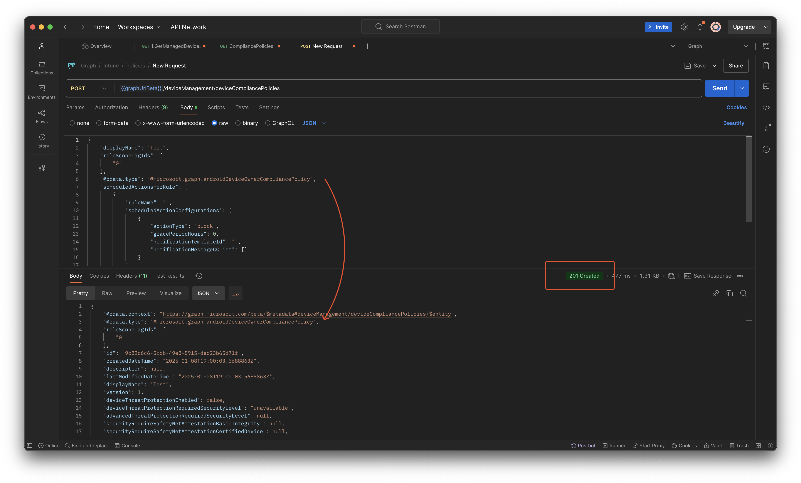
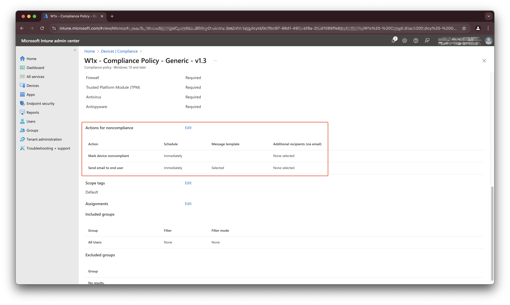

## Govern OS Versions in Microsoft Intune
This article is based on a post of my good friend Kenneth van Surksum. He has written as good blog post about how to govern OS versions in your environment with the use of Microsoft Intune. 

In Microsoft Intune there is a good way to avoid old OS versions in your environment.
Kenneth's article describes how to setup those ways using the portal, in this article, I explain how to deploy those settings but also how to maintain those settings in an automated way. 


This article asumes that your update strategy is in place and updates the devices. Another thing in this kind of automation is that your environment is clean and ready for optimization. In this case, that means you have two assigned compliance policies per type that handles compliance checks for OS build numbers. Of course you can have more other compliance policies per type. 

The rest of the article asuming you have this in place. 


## Components
To set your OS version base level two components are leading: 
- Compliance policies
- Device platform restriction policies

The main difference between those two are that compliance policy works for devices that are already in Intune where the device restriction policy kicks in before a device comes into Intune. See it as a sort of gatekeeper. 

In the upcoming parts we first take a look how to implement these components in an automated way. To do this I use the Graph API in the first place. 

### Create Intune compliance policies automated
Creating compliance policies is a bit strange thing in Intune using the Graph API. This is because compliance policies are devided in multiple types, Windows, Android, iOS, macOS but all use the same endpoint. That means that based on the provided body, Graph knows what policy type it is. 

A widely used configuration is having two compliance policies per platform. The first one is marking non-compliant after a grace period (14, 30 days) and one marking non-compliant imediately. 
For the grace period policy, we use the buildnumber n -1 and imediately n -2. All based on your current devices inventory. 


To create Intune compliance policies in an automated way you need the `/deviceManagement/deviceCompliancePolicies` endpoint. 
Because this is an global endpoint for all device compliance policies you have to specify the correct policy type. Currently the following policy types are available:

|Type   | Platform   |   Platform type|
|---|---|---|
|#microsoft.graph.windows10CompliancePolicy|Windows 10 and later|Windows 10/11 compliance policy |
|#microsoft.graph.androidDeviceOwnerCompliancePolicy|Android Enterprice|Fully managed, dedicated, and corporate-owned work profile|
|#microsoft.graph.androidWorkProfileCompliancePolicy|Android Enterprice|Personally-owned work profile|
|#microsoft.graph.iosCompliancePolicy|iOS/iPadOs|iOS compliance policy|
|#microsoft.graph.macOSCompliancePolicy|macOS|Mac compliance policy|

>I have skipped the Android Device Administrator part, since it is deprectated since 1 January 2025.


So, the `@odata.type`, the property that tells Graph which kind of resource it is, must be provided in the body. Otherwise you will get an error like below.


The errorcode is `ModelValidationFailure` with the message `Cannot create an abstract class.`

With the code below you are able to create compliance policies with the OS minimum version in it. To make things clear, the code only sets the OS minimum version. To set the OS version, the `osMinimumVersion` property is used. This `osMinimumVersion` is a property that is available in every kind of policy. 

Just change the `@odata.type` to the correct policy type and you're all set.

```json
{
    "displayName": "Android Device Owner Compliance",
    "roleScopeTagIds": [
        "0"
    ],
    "@odata.type": "#microsoft.graph.androidDeviceOwnerCompliancePolicy",
    "scheduledActionsForRule": [
        {
            "ruleName": "",
            "scheduledActionConfigurations": [
                {
                    "actionType": "block",
                    "gracePeriodHours": 0,
                    "notificationTemplateId": "",
                    "notificationMessageCCList": []
                }
            ]
        }
    ],
    "deviceThreatProtectionRequiredSecurityLevel": "unavailable",
    "passwordRequiredType": "deviceDefault",
    "deviceCompliancePolicyScript": null,
    "osMinimumVersion": "1.0.0.0",
    "deviceThreatProtectionEnabled": false
}
```




### Create device platform restriction policy automated
To create a device platform restriction policies automated, we need a another Graph API endpoint. The endpoint you need for device platform restrictions is `/deviceManagement/deviceEnrollmentConfigurations`. When requesting this endpoint you will notice you get more policies than only the platform restriction policies. Also policies for Windows Hello for Business or Device Limit restrictions came up.

Well, also in this case, we have to provide the correct `@odata.type`. When not adding the `@odata.type` you will get the same error as mentioned above. 

The JSON body needed for creating a device platform restriction policy should be the code below
```json
{
    "@odata.type": "#microsoft.graph.deviceEnrollmentPlatformRestrictionConfiguration",
    "displayName": "Windows platform device restriction",
    "description": "",
    "roleScopeTagIds": [
        "0"
    ],
    "platformType": "windows",
    "platformRestriction": {
        "platformBlocked": false,
        "personalDeviceEnrollmentBlocked": true,
        "osMinimumVersion": "10.0",
        "osMaximumVersion": "",
        "blockedManufacturers": []
    }
}
```
The example above is for the Windows platform. There are four platform types with all the same body. The only thing that change is the `platformType` property. This can be `Windows`, `iOS`, `androidForWork` and `mac`. For last one, you can create a policy but platform restriction is not supported.


## Govern OS version in an automated way
Providers like Microsoft, Apple or Android continue improve their operating systems. If a new version comes out the build number changes. Buildnumers are internally used numbers and represents a specific OS version. That could result in numbers that do not followup by 1. In the basic a build number does not tell how old a specific OS is. So it is crucial to govern OS build numbers in your environment and make sure build number configurations are growing with the device environment.

Example, we have a Windows 11 environment. In meantime (at moment of writing) Windows 11 has three buildnumbers: `22621.4602` (22H2), `22631.4602` (23H2) and `26100.2605` (24H2). Buildnumber `22621.4602` is available since 2022-09-20 which is more than two years old from now. Looking at the number itself it does not tell how old it is. But you want to avoid this buildnumber is entring your environment in the first place and make sure your current environment is up-to-date as well. 

Source I used: https://learn.microsoft.com/en-us/windows/release-health/windows11-release-information

Of course, this is for every OS type.

In the next steps, we will walk through the automation logic how to make sure your OS build numbers are updated automatically in your policies.

### Automation philosophy
The main idea of this automation is that compliance policies and device platform restriction policies with buildnumbers are updated with the n -1 and n -2 build numbers based on your devices inventory. 
The most ideal scenario is to fetch buildnumbers from the internet directly from the vendors. That will be the next step in a other blog. 

That means that the automation task searches for all OS platform types, and per type the n -1 latests build calculates. The reason why n -1 is because of the most update strategies do not update all devices at once. When updating policies based on the latest OS build, only the first ring is compliant. 


This automation task only works when having your update proces in place. That means you have configured your update strategy in Intune. 



When NOT having your updates in place, it could cause non-compliant devices.


### Automation
In the examples below, I use the Microsoft.Graph.Authentication PowerShell module.

Install the module using the command below.
```powershell
Install-Module Microsoft.Graph.Authentication -Repository psgallery    
```

### Get OS build numbers per device
To keep the blog post as short a possible we only will walk through the Windows plaform. All other platforms work in the same way.  

The first step is to fetch all devices per OS type and calculate the n -1 and n -2 latest builds. To fetch all devices deviced by type, use the `/deviceManagement/managedDevices` endpoint.  
Use `?$filter=operatingSystem eq 'Windows'&$select=id,operatingSystem,deviceType,osVersion` to fetch the correct devices for every context.  

The whole endpoint make then:  

`https://graph.microsoft.com/beta/deviceManagement/managedDevices?$filter=operatingSystem eq 'Windows'&$select=id,operatingSystem,deviceType,osVersion`


In this filter, we filter on the `Windows` operatingSystem. To keep the data a clean as possible, I only select the `id`,`operatingSystem`,`deviceType` and the most important `osVersion`. The `osVersion` is the one that is the value which is in the policies. 
Other available operating system types are `Android`, `iOS`, `macOS`. As mentioned earlier, the macOS operating system is not supported yet regarding the device platform restriction.


The results of the Windows filter are in the list as shown in the screenshot. 


To fetch all devices, including next pages, I used the command below. This command fetches all Windows machines.

```powershell
$platform = "Windows"
$devices = [System.Collections.ArrayList]::new()
$url = "beta/deviceManagement/managedDevices?`$filter=operatingSystem eq '{0}'&`$select=id,operatingSystem,deviceType,osVersion" -f $platform
$results = Invoke-MgGraphRequest -Method GET -URI $url -OutputType PSObject
$results.value.Foreach({
    $devices.Add($_) >> $Null
})
do {
    $url = $results.'@odata.nextLink'
    $results = Invoke-MgGraphRequest -Method GET -URI $url -OutputType PSObject
    $results.value.Foreach({
    $devices.Add($_) >> $Null
})
}
while ($results.'@odata.nextLink')
```

Now we have a list with all devices in the `$devices` variable we can calculate the n -1 build version. 
To find the second highest value in the list, we select the $devices.osVersion property. This selects all the osVersion values in the list. 
The command below sorts all the os version with the highest above. Then it selects all unique values. That results in a smaller list representing unique OS versions. At last it selects the second value in the whole list. 

The reason why sorting in descending way it is make sure the highest value is always on top of the list. You don't know how long a list is at the end. The only thing you know there is a list.
Example: if you have a list with 10 OS version and want to select row `[9]` but if the list is 1000 then select `[999]`. If you sort descending than you always can select `[1]`. 

In PowerShell an array starts with 0, so the second value is 1. 

```powershell
$secondHighest = ($devices.osVersion | Sort-Object -Descending | Select-Object -Unique)[1]
$thirdHighest = ($devices.osVersion | Sort-Object -Descending | Select-Object -Unique)[2]
```

In the screenshot below I showed the result of the above command, as the unique list.  


When sending a GET request to this endpoint all compliance policies are returned.

This is also a good example when NOT selecting the n -1 value and not having your update strategy in place. A lot of build numbers are there. When updating the policies to n -1 based on this list will result in lot of non-compliant devices. So make sure you have a patched your environment in a proper way. 

When having a situation like above, you could choose to use n -x.
Then change the `[1]` to `[x]` where x represents a higher value. 

### Get device compliance policies
Now we have the correct version numbers, it is time to update the compliance policies where buildnumbers are in. In this case lets search for the compliance policies. To fetch the policies you need the endpoint `/deviceManagement/deviceCompliancePolicies`. Just as mentioned above. As also mentioned, you need to provide the correct type to create a correct compliance policy. This is also happening when fetching the policies.

So, just requesting all the compliance policies results in a list with all policy types. In this case we ONLY need to update the Windows policies. That means we need to fetch only that type. 
Now, back to the earlier mentioned `@odata.type`. Instead of provding the correct type, we now filter on that type using the URL below.

`https://graph.microsoft.com/beta/deviceManagement/deviceCompliancePolicies?$filter=(isof('microsoft.graph.windows10CompliancePolicy'))`  

Then the next thing is that we have two compliancy policies, one with grace period and one without grace period. 
To fetch that information as well we need to expand some extra properties. 

`https://graph.microsoft.com/beta/deviceManagement/deviceCompliancePolicies?$filter=(isof('microsoft.graph.windows10CompliancePolicy'))&expand=assignments,scheduledActionsForRule($expand=scheduledActionConfigurations)`

Now we have all Windows compliance policies with their actions and assignments.


When having an optimized environment you should have two policies. The one that has a greace period and the one without grace period.

In PowerShell the code looks like this.

```powershell
$url = "https://graph.microsoft.com/beta/deviceManagement/deviceCompliancePolicies?`$filter=(isof('microsoft.graph.windows10CompliancePolicy'))&`$expand=assignments,scheduledActionsForRule(`$expand=scheduledActionConfigurations)"
$compliancePolicies = Invoke-MgGraphRequest -Method GET -URI $url -OutputType PSObject
```

### Get correct device compliance policy
The next step is to update the compliance policies. To update the correct we have to select the correct policy for each build number.
First select the policy with the grace period.

To find out the grace period configuration it is good to know how the rule configuration works.
In the screenhost below, I show a policy that has a greace period configured and also a send email configuration. 



When looking to the Graph response, the configuration looks like this.


As you can see, there are two objects. Take a look at the mark non compliant setting and template Id GUID. This is an empty GUID. Which means it has no message template available. 
This is the object we need in the next check. 

When looking at the PowerShell command below. I search in the `compliancePolicies` object for a policy that has a `osMinimumVersion` filled in, `assignments` count is higher than 0 (which means there are assignments), and is must have a `gracePeriodHours` greater then 0 (otherwise immediately) including also a `notificationTemplateId` with the empty GUID (and emtpy GUID is always `00000000-0000-0000-0000-000000000000`).

The reason why we look for the empty GUID as well is because all the objects also have a `gracePeriodHours` object where you can put something in. So only the combination `gracePeriodHours` and empty GUID makes that specific rule. 

```powershell
$n1Policy = $compliancePolicies.value.Where({ 
    ($null -ne $_.osMinimumVersion) `
    -and ($_.assignments.Count -gt 0) `
    -and (($_.scheduledActionsForRule.scheduledActionConfigurations.gracePeriodHours -gt 0) -and $_.scheduledActionsForRule.scheduledActionConfigurations.notificationTemplateId -eq "00000000-0000-0000-0000-000000000000")
})
```

The policy fetching with the code above is the compliance policy you need for the n -1 scenario. For the n -2 scenario, you only have to change the code `-and ($_.assignments.Count -gt 0)` into `-and ($_.assignments.Count -eq 0)` (gt changes into eq).

### Update device compliance policy
The PowerShell code above stores the correct policy into `$n1Policy` variable. The only thing we need to do now is using the `$n1Policy.id` and send an update request (PATCH request) with the correct `osMinimumVersion` value and ofcourse the policy type. 

```powershell
$body = @{
    '@odata.type' = $n1Policy.'@odata.type'
    osMinimumVersion = $secondHighest
} | ConvertTo-Json
$url = "https://graph.microsoft.com/beta/deviceManagement/deviceCompliancePolicies/{0}" -f $n1Policy.id
Invoke-MgGraphRequest -Method PATCH -URI $url -Body $body
```

## Device platform restriction
This one is a bit more simple because, normally (assumption) you only have one platform restriction per type (Windows, iOS, Android and macOS). Where macOS is not supported yet. 

So the only thing we need to do is to find those restrictions and update the OS build number. 

**Or not ?!?!**


Unfortenately, it is only possible to fetch the policies. but **NOT** to update the policies using aan app registration or a managed identity in basic. This has to do with tenant wide settings and RBAC in the backend. 

The error when updating, or creating, device platform restriction in Intune is:

`Tenant is not Global Admin or Intune Service Admin. Operation is restricted`

So, you are able to update the restriction policy only using an interactive script. Yes, there are other options but due complexity reasons I will write another blog for that specific item. 
For now, you can use the code below to update, but as said, only using it in an interactive way. That means when the script run, you will get a login popup.

I use this endpoint to fectch the enrollment configurations: `/deviceManagement/deviceEnrollmentConfigurations?$expand=assignments`. This will result in different enrollment restriction types like `device limit` and `device enrollment`. In this scenario we need the device enrollment policies.  
Due Graph API inconsistancy, we need to use another way to filter the correct resource. The `(isof... )` filter does not work here.  

To filter the correct device enrollment configuration types, I used this endpoint `/deviceManagement/deviceEnrollmentConfigurations?$filter=deviceEnrollmentConfigurationType eq 'platformRestrictions'`


```powershell

```

 
