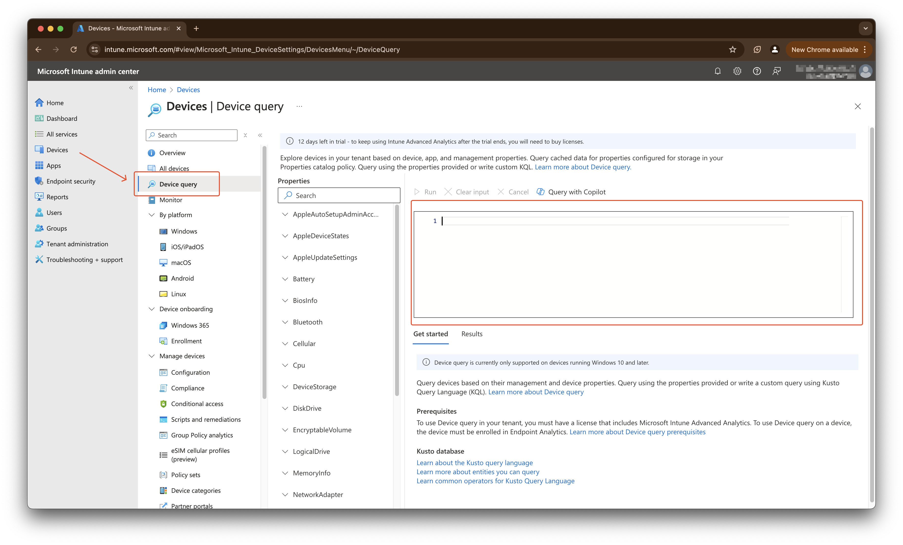
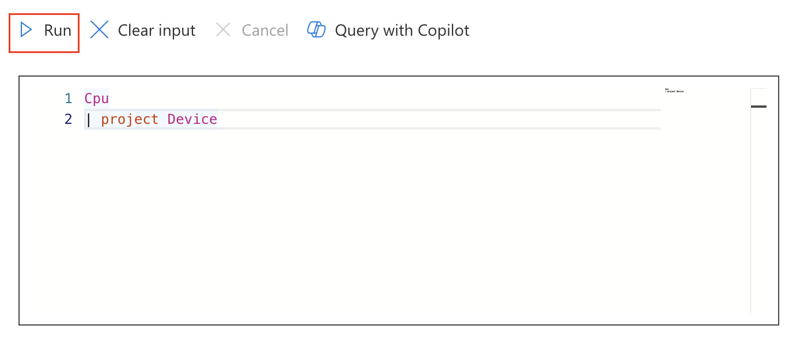
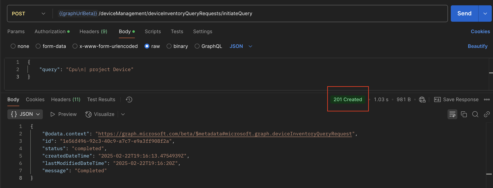
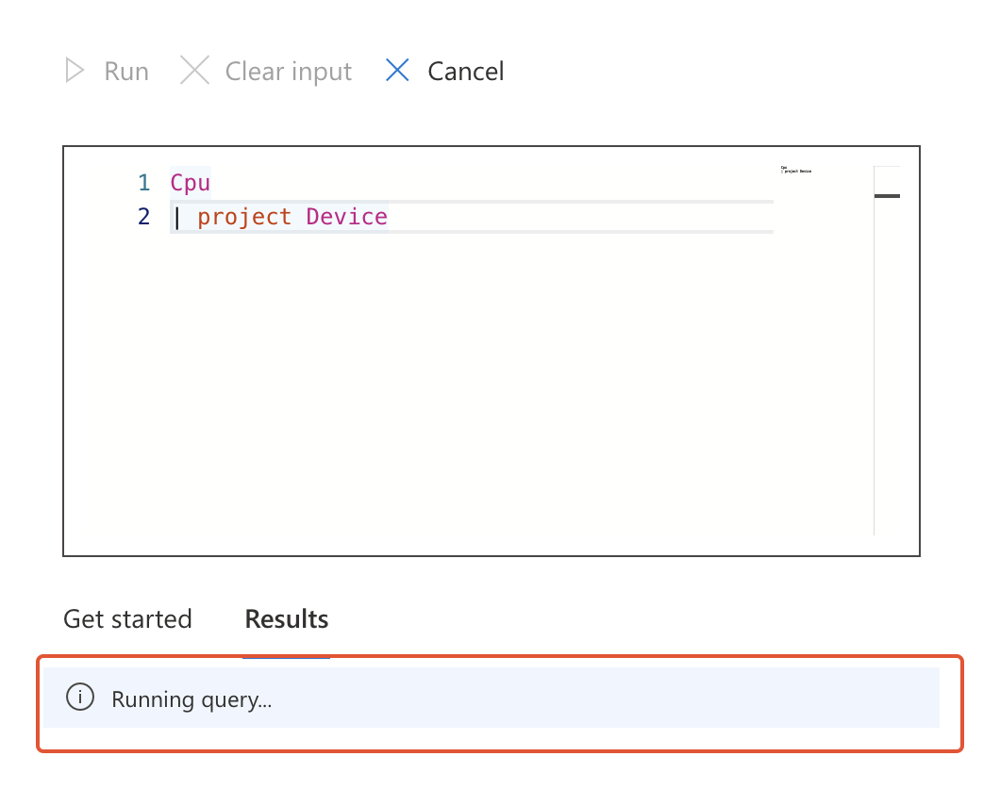
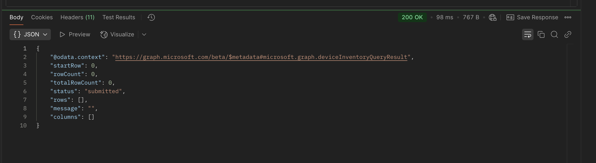
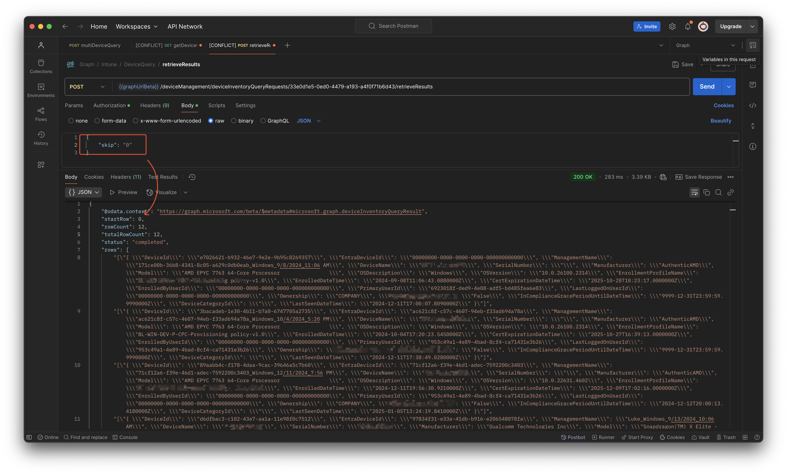
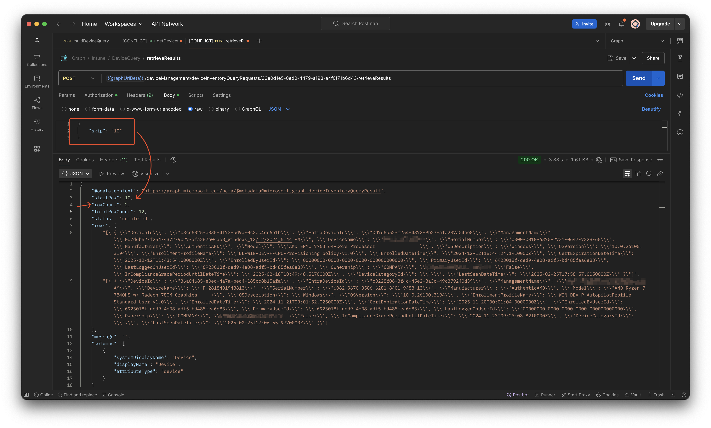
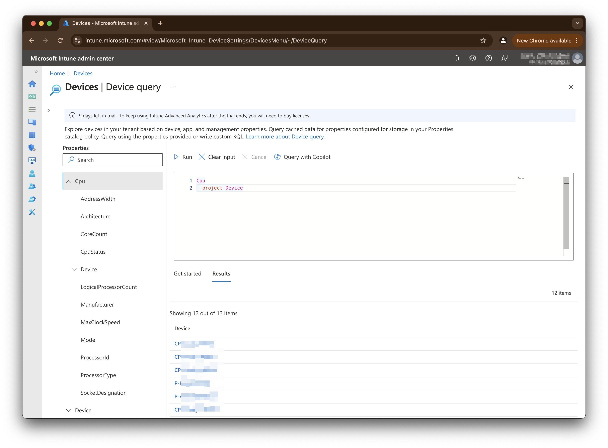
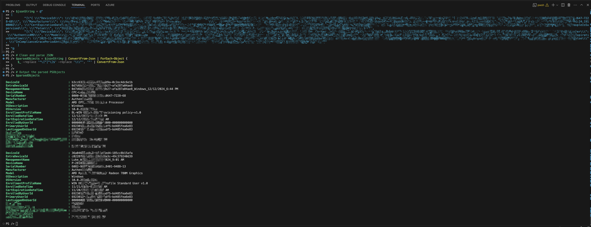

Microsoft has released a new, highly wanted, feature in Intune Device Query for multiple devices. Quering single devices does exist for a while and now it is also possible to query for information at a higher level. Now this option is available it can be very useful for proactive monitoring purposes, troubleshooting and more. 

In this blog, I explain how to use device query (for multiple devices) from an automation perspective. 



## Intune Device Query (for multiple devices) in short
Device query allows you to quickly gain on-demand information about the state of your devices. When you enter a query on a selected device, Device query runs a query in real time. After a short time, the data returned. 

Device query for multiple devices allows you to gain comprehensive insights about your entire fleet of devices. That means the query gains information for every supported device with pointing to every single device.

To query you have to use the Kusto Query Language (KQL).



Thing to keep in mind are:

- Your tenant must be licensed for Microsoft Intune Advanced Analytics
- You must assign the Managed Devices – Query and Organization – Read permissions to non Intune Administrators
- Devices must be Intune managed and corporate owned
- Device query for multiple devices only works on devices that are already collecting device inventory data
- Currently only devices with Windows 10 and higher are supported

For more information about device query, I would suggest checking the blog from my buddy Joost Gelijsteen [Device Query for multiple devices](https://joostgelijsteen.com/device-query-for-multiple-devices/)

This blog goes further with the device query feature from an automation perspective.

## Intune Device Query and Graph API
As almost every Intune part also the device query communication goes through the Graph API backend. The device query process has in basic three stages: submit, processing, respond.

The Intune Device Query has a main Graph API endpoint called `/deviceManagement/deviceInventoryQueryRequests/`. On that endpoint there is a task are available called `initiateQuery`.


### Submit the query
The first step is to submit the query. This is the point where we send the Kusto query to the backend. At that moment a request is send to the Graph API. 



The endpoint used for the initiateQuery task is `https://graph.microsoft.com/beta/deviceManagement/deviceInventoryQueryRequests/initiateQuery`. A POST request is send with the query in the body. 

The body looks like this and is in JSON format. The `\n` means a new line. 

```json
{
    "query": "Cpu\n| project Device"
}
```
The response is a `201 Created` response. Does that mean that something is created?!?. Yes, that is true from a platform perspective. No nothing is created in Intune but your query is staged in the backend. From that point the backend takes overs and executes the query. 



As you can see in the screenshot, you will get a response with an `id`, `status`, a `message` and some other information. The id and status are important for the next steps. 
During some tests, I also got a message like below. The query is submitted to the backend and is waiting till it gets executed.

```json
{
    "@odata.context": "https://graph.microsoft.com/beta/$metadata#microsoft.graph.deviceInventoryQueryRequest",
    "id": "33e0d1e5-0ed0-4479-a193-a4f0f71b6d43",
    "status": "submitted",
    "createdDateTime": "2025-02-25T20:04:19.6764959Z",
    "lastModifiedDateTime": "2025-02-25T20:04:24Z",
    "message": "Query processing is scheduled for execution."
}
```

Another response you can get is `inProgress` when requesting the specific Id.
```json
{
    "@odata.context": "https://graph.microsoft.com/beta/$metadata#deviceManagement/deviceInventoryQueryRequests(id,status,message)/$entity",
    "id": "46e218a2-20e0-409c-8eb6-02e0ec788a0c",
    "status": "inProgress",
    "message": "InProgress"
}
```

Till the moment the query is running in the backend not finished you will see the `Running` state in the portal.



In meantime, there is no response from the backend. 

### Check query status
Initiating a query is a sort of set and forget. You send the query and that's it. That means you have to go after it. In the screenshot above you see an `id` and `status` returned. In the next step we will use that Id to find out the current status. 
As also mentioned, the query is staged in the backend. From that point you are out of control and it depends on the platforms current load how fast you will get the results. 



In meantime, till the query is completed, you will see a status `submitted` in the repsonse. 

To request the status use this Graph API endpoint `/deviceManagement/deviceInventoryQueryRequests/{id}`. Where the Id is the Id from above.

### Retrieve device query results
Checking the query status can be more done more efficient by adding `/retrieveResults` and the end of the endpoint. That will be then `/deviceManagement/deviceInventoryQueryRequests/{id}/retrieveResults`

When sending a request to the `retrieveResults` endpoint, you have to send a POST request. In the body you have to provide a `skip` property. 

The body looks like this.

```json
{
    "skip": "0"
}
```
The skip value tells how much rows the output will skip. In the screenshosts below the first result is without a skip. The second one is the same result but then we will skip the first 10 rows. By skipping the first 10 of 12 the result is just 2 rows. 




I think the skip has something to do with pagination when using the portal. If results are more then x you will get more pages in the result page. Currently, I haven't tested with that yet. 

## What you see is not what you get
No, it is better :) and that is the power of the Graph API. Lets check it out and see what is the difference.

In the screenshot below you see the results in the portal. As you can see, the devices are returned but only the device's names are shown. 
]

Now lets check the results in the back. You see much more information is present. 


In this case, the all information about the devices is available. 

### How to use the device query response
As you can see, the response is a huge string with all the content. Based on this, it is not very usefull yet. To make the data usable (for reports or so), we have to convert the data into object.
Luckily, the data has a JSON format which makes it quite ease to convert the data to useable properties in PowerShell.
In the code snippet below, I filled the JSON string with the rows output from the `/retrieveResults` request. 
From there, I use the ConvertFrom-Json method that breaks down the string into seperate rows. After that process, every row is still an unusable string. So, for every row we need to remove the escape characters `\` first. Then the string becomes a useable JSON string that is able to convert it again.
After that process every column like `DeviceID` and `DeviceName` is converted to a PowerShell object.

```powershell
$jsonString = "The rows output from the retrieveResults request"
# Clean and parse JSON
$parsedObjects = $jsonString | ConvertFrom-Json | ForEach-Object {
    $_ -replace '^\["|"\]$' -replace '\\\"', '"' | ConvertFrom-Json
}
# Output the parsed PSObjects
$parsedObjects
```


## How to use Intune Device Query in automation?
Now you know the basics, we can take a look on how to create some automation around it. Lets say the starting point is to get a report every day with machines 

