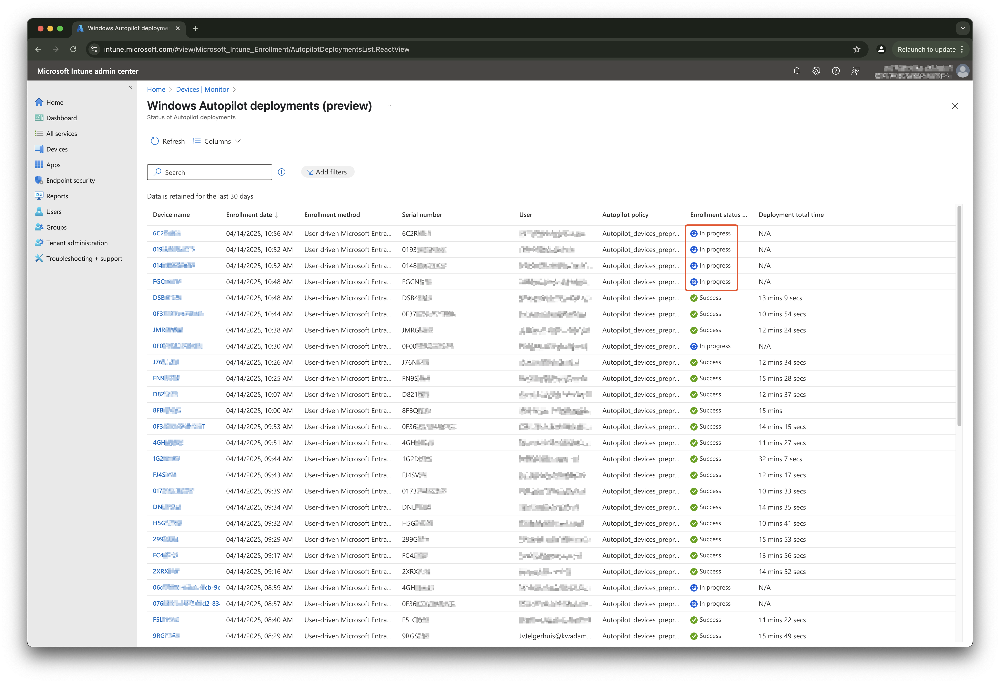
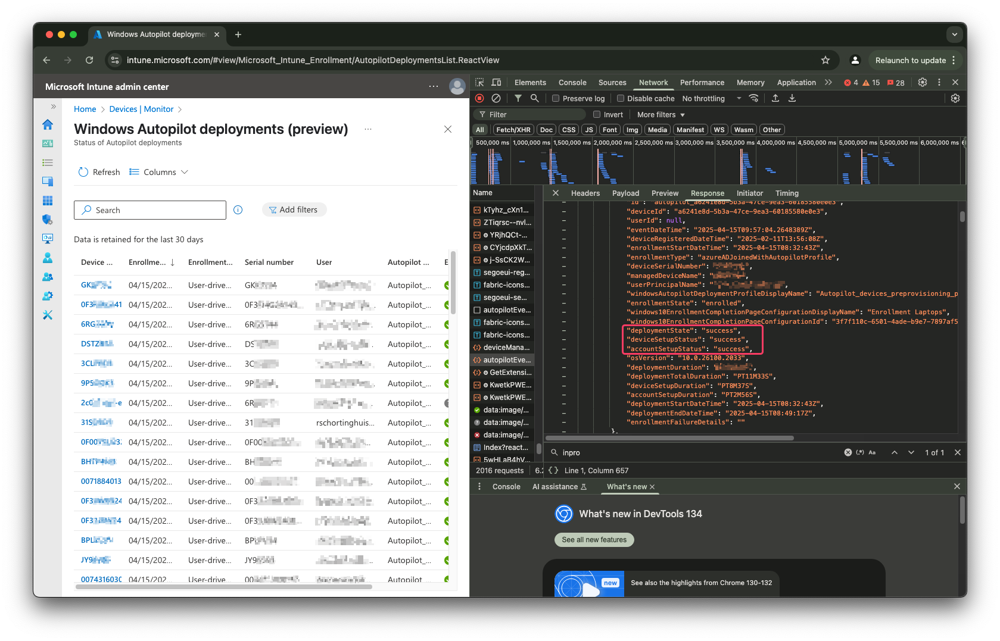
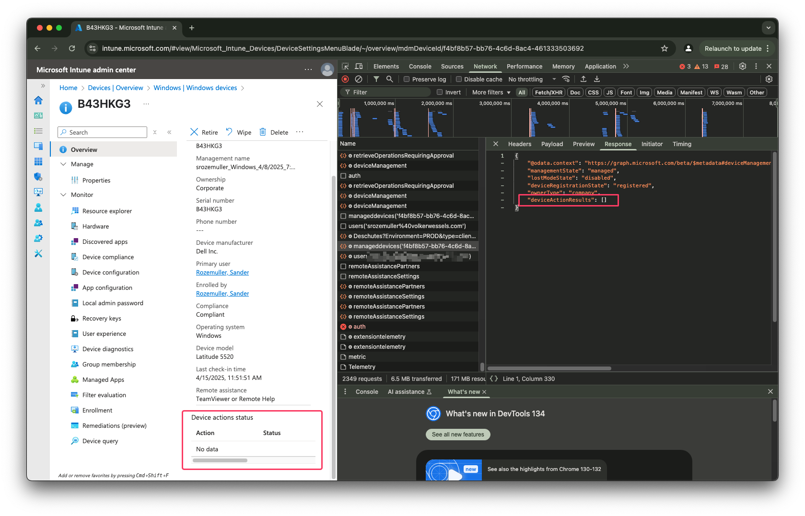
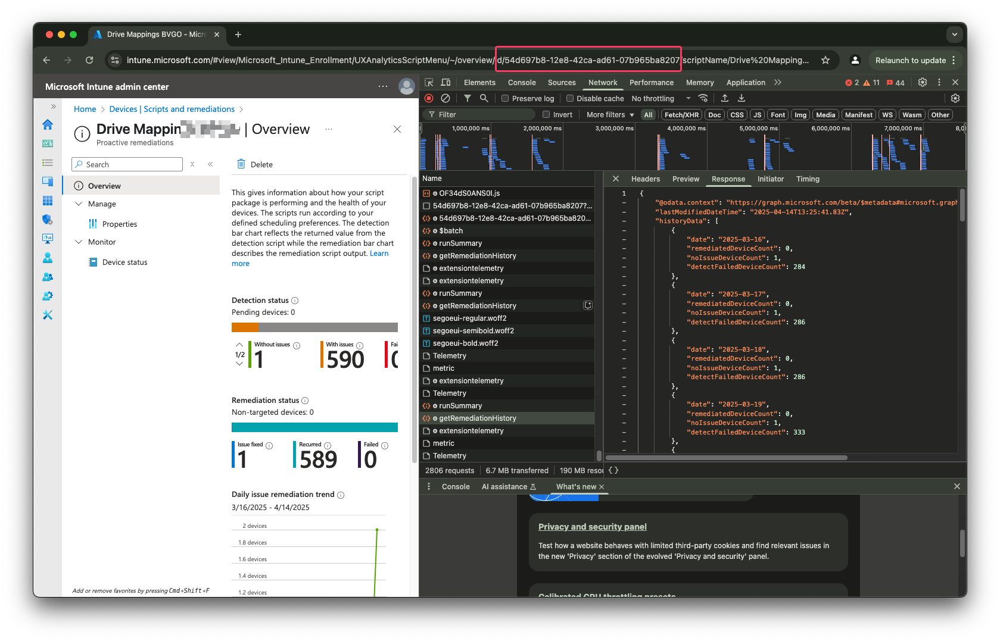
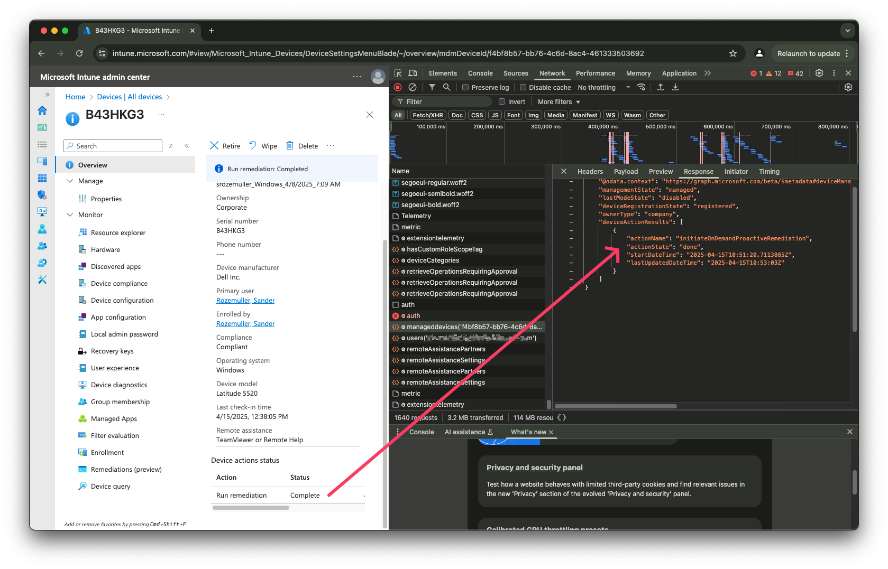

If you've ever tried to run proactive remediation scripts automatically during the Windows Autopilot enrollment process in Microsoft Intune, you've likely noticed that the Enrollment Status Page (ESP) doesn't support this by default. Today, we'll explore how to work around this limitation using Azure Functions, making your Autopilot deployments even smoother.



## Why this approach
Recently, I had a situation where devices badly relies on specific configuration. To set that configuration, remediation scripts execute by a PowerShell script. Unfortunatly, scripts are not part of the enrolment status page so had to figure something out. Something that forces to run the script during enrollment besided the default schedule. Because I am an automation guy and not a packager, I want to avoid packaging apps. 
Another big thing are:
- When using apps, you don't have any sight anymore what is going on in that script if packaged;
- You don't have (full) control on when the script is running after enrollment;
- When using apps and scripts, you have to maintain two different resources with the same aproach, one at remediation level, and one at application level. This is not scalable. 

So, I want to use the native scripting platform.


## What is Proactive Remediation in Intune?
As said, the native platform is the proactive remediation platform in Intune. 
Proactive remediation is a powerful capability in Microsoft Intune designed to detect and automatically fix common issues on managed devices. It consists of two scripts:

- **Detection script**: Checks if an issue exists.
- **Remediation script**: Fixes the issue if detected.

For more details, refer to the [official Microsoft documentation](https://learn.microsoft.com/en-us/intune/intune-service/fundamentals/remediations).

## Why Automation via Azure Functions?
Several options to run automations are available like, Logic Apps, Azure Automation and Azure Functions. 
In this case, to run remediation scripts automatically during Autopilot enrollments, I used an Azure Function with PowerShell. Azure Functions offer several benefits:

- **Serverless**: Cost-effective with pay-as-you-go pricing.
- **Scalable**: Automatically scales based on workload.
- **Secure**: Supports Managed Identities for secure, passwordless authentication.

Azure Logic Apps can also perform similar automation tasks but are better suited for workflows needing visual orchestration. Azure Functions excel at running lightweight scripts rapidly, providing better performance and lower overhead for this scenario.

The reason we use a timer trigger in Azure Functions is that Log Analytics may not capture data quickly enough, making the timer trigger a reliable method for near real-time execution.

## Creating an Azure Function
In short to create an Azure Functions, follow these steps:

1. **Log in to Azure Portal**: Navigate to the [Azure Portal](https://portal.azure.com) and log in.
2. **Create a Function App**:
   - Click on "Create a resource".
   - Search for "Function App" and click "Create".
   - Fill in the required details (Subscription, Resource Group, Function App Name, Runtime Stack as PowerShell, Region).
   - Click "Review + create" and then "Create".

3. **Configure Managed Identity**:
   - In your Function App, navigate to "Identity".
   - Enable "System assigned" identity and click "Save".

## Managed Identities in Azure Functions
To authenticate against Graph API, several options are available like a managed- or user idenitity, or an application registration. 

There are two types of managed identities:

### 1. **System-Assigned Managed Identity**
- **Automatically created and tied exclusively to one Azure resource.**
- **Automatically deleted when the resource is deleted.**
- **Ideal when the identity is strictly bound to a single resource for enhanced security.**

### 2. **User-Assigned Managed Identity**
- **Created independently and can be associated with multiple resources.**
- **Ideal when multiple resources need the same identity for easier management.**

I used a system-assigned managed identity. And that's for a reason.
A system-assigned identity ensures the identity is only used by (in this case) the Azure Function. This reduces the risk of misuse or accidental sharing.


## Explanation of the PowerShell Script

Here's a walkthrough of your Azure Function PowerShell script:

### Script Initialization and Authentication

- **Timer Trigger**: The function runs based on the configured timer.
- **Managed Identity Authentication**: Authenticates securely to Microsoft Graph using the Azure Function's system-managed identity.

```powershell
if ($env:MSI_SECRET) {
    $azureAccount = Connect-AzAccount -Identity
    $accessToken = Get-AzAccessToken -ResourceUrl $env:graphApiUrl -DefaultProfile $azureAccount
}
```


## Benefits of Timer Trigger
Using a timer trigger ensures the remediation checks happen frequently and reliably, bypassing delays often experienced when relying solely on Log Analytics. Also, Log Analytics is not fast enough to give the current enrollment state since is takes time to get the logs into Log Analytics. This can take up for more than an hour.

### Get Autopilot Enrollment Status
When going to the Device monitor and select the Windows Autopilot deployments (preview) report, you see all the devices and their enrollment state. When devices are enrolling, you will see an `InProgress` status. As shown in the screenshot below. 



From a backend perspective, an enrollment has three main phases: `deploymentState`, `deviceSetupStatus` and `accountSetupStatus`. The `deploymentState` phase is the global phase that stays at the `InProgress` status during the whole enrollment process. The other two are a sort of substages of the total. This approach waits till the `deviceSetupStatus` stage has the status `InProgress`. 

The reason why is because when the `deploymentState` reaches the `InProgress` state it can happend the remedition script is triggert to fast. The device isn't ready to accept actions yet. When triggering on `deviceSetupStatus` I know for sure the device has communicated with Intune.


- Retrieves a list of devices currently enrolling through Autopilot with a status of "InProgress".


```powershell
$url = "https://graph.microsoft.com/beta/deviceManagement/autopilotEvents?$filter=deviceSetupStatus eq 'InProgress'" 
```

### Check Current Remediation State
This step isn't fully 100% closed. I asume when a device starts to enroll, my task will be the first task that runs on the machine. So what I do in this step is checking if a script was initiated already. 
This is because the task runs every 5 minutes and want to avoid the proactive remediation is triggerd multiple times. 

To checks each enrolling device for any planned remediation tasks I used the Graph endpoint below. 

```powershell
$url = "https://graph.microsoft.com/beta/deviceManagement/manageddevices('{0}')?`$select=deviceactionresults,managementstate,lostModeState,deviceRegistrationState,ownertype" -f $deviceId
```
If now script was planned yet, the response is empty. 



### Trigger Remediation Script
If the step above return no planned script, this step initiates remediation script execution for the device.
The script ID can be found by going to Device -> Scripts & Remediation. Then go to the script and than grab the ID from the address bar.



```powershell
$scriptId = "54d697b8-12e8-42ca-ad61-07b965ba8207"
$url = "https://graph.microsoft.com/beta/deviceManagement/managedDevices('{0}')/initiateOnDemandProactiveRemediation" -f $deviceId
$body = @{ "ScriptPolicyId" = $scriptId } | ConvertTo-Json
```

### Confirming Remediation Execution
Also this step isn't fully 100% closed. Unfortunately, the `deviceactionresults` endpoint does not respond which task was scheduled. I use the same endpoint again to request the status.

If the script is still pending the actionState is `pending`. 

```powershell
    $url = "https://graph.microsoft.com/beta/deviceManagement/manageddevices('{0}')?`$select=deviceactionresults,managementstate,lostModeState,deviceRegistrationState,ownertype" -f $deviceId
    $remediationStatus = Invoke-WebRequest -Method GET -URI $url -Headers $authHeader
```
After the script was executed the return now is the response below.


## Conclusion

With this automated approach using Azure Functions and PowerShell, you can reliably ensure remediation scripts execute during the critical Autopilot enrollment phase, creating a more efficient and robust deployment experience.

You can find the script at my [GitHub IntuneAutomation repository](https://github.com/srozemuller/IntuneAutomation/tree/main/TriggerRemediation)
