Welcome to the updated AVD Automation Cocktail. This cocktail is updated with all new Bicep and AVD features since september 2023.
In this cocktail series I will show different AVD deployment strategies and languages. In this cocktail, the Fresh Minty Breeze, I will show you how to deploy an AVD environment automated with Bicep and Azure CLI.



### What is changed
In this updated version, I optimized the automation and templates. I consolidated the Azure resource deployment templates, created a main.bicep and modules, and created one big parameter file. One parameter file results in no duplicate parameter settings anymore.

Result of this optimization also is the deployment of the Azure Compute Gallery. In the previous version, the gallery was deployed first, then I created an image. From there I went back to create an image source and deploy an image version in a separate Bicep file.  

In this deployment, I first create a generalized image source. From there, the whole environment is deployed at once. This results in no more back and forth with seperate gallery deployment templates and parameters anymore.

At last it saves lots of extra deployment steps, since we have just one Bicep file and parameter file still.

## Recipe
In this “MintyBreeze”-deployment recipe I will deploy an AVD environment automated with Bicep and Azure CLI. Bicep is a fresh new coding language for deploying Azure resources. Bicep helps reduce the syntax complexity which ARM templates has. Because it is very new I like to show in this article how to deploy an AVD environment with Bicep. To give Azure CLI also a stage I thought this could be a really nice combination.

### Before to drink
To start enrolling AVD automated with Bicep and Azure CLI you will need to install the Bicep CLI and Azure CLI software first. To download the Bicep installer go to the following URL, choose your favorite operating system and follow the instructions. <https://github.com/Azure/bicep/blob/main/docs/installing.md#install-the-bicep-cli-details>

After the installation of Bicep install the Azure CLI software by clicking this URL:[ https://docs.microsoft.com/en-us/cli/azure/install-azure-cli](https://docs.microsoft.com/en-us/cli/azure/install-azure-cli)

More information about Bicep or Azure CLI please check the following URLs:

- <https://docs.microsoft.com/en-us/azure/azure-resource-manager/bicep/overview>
- <https://docs.microsoft.com/en-us/cli/azure/>

### List CLI of ingredients
- [https://docs.microsoft.com/en-us/cli/azure/vm/run-command?view=azure-cli-latest#az\_vm\_run\_command\_invoke](https://docs.microsoft.com/en-us/cli/azure/vm/run-command?view=azure-cli-latest#az_vm_run_command_invoke) (VM Run command)
- [https://docs.microsoft.com/en-us/cli/azure/vm?view=azure-cli-latest#az\_vm\_capture](https://docs.microsoft.com/en-us/cli/azure/vm?view=azure-cli-latest#az_vm_capture) (VM Capture)
- <https://docs.microsoft.com/en-us/azure/virtual-machines/image-version-vm-cli> (Image Version)
- [https://docs.microsoft.com/en-us/cli/azure/vm?view=azure-cli-latest#az\_vm\_generalize](https://docs.microsoft.com/en-us/cli/azure/vm?view=azure-cli-latest#az_vm_generalize) (VM Generalize)
- [https://docs.microsoft.com/en-us/cli/azure/desktopvirtualization/hostpool?view=azure-cli-latest#az\_desktopvirtualization\_hostpool\_update](https://docs.microsoft.com/en-us/cli/azure/desktopvirtualization/hostpool?view=azure-cli-latest#az_desktopvirtualization_hostpool_update) (AVD Hostpool token)
- <https://docs.microsoft.com/en-us/cli/azure/ad/signed-in-user?view=azure-cli-latest> (AD Signed in User)
- [https://docs.microsoft.com/en-us/cli/azure/deployment/group?view=azure-cli-latest#az\_deployment\_group\_create](https://docs.microsoft.com/en-us/cli/azure/deployment/group?view=azure-cli-latest#az_deployment_group_create) (Deployment)


### Aftertaste

In the beginning this cocktail has a fresh taste with a lot Bicep and a pinch of Azure CLI. At the end you will have an AVD environment in Azure deployed with all the needed resources. These are a hostpool, a workspace, an application group. Also there are some session hosts. These hosts have an underlying image from a shared image gallery.

## AVD automated with Bicep en Azure CLI

In this chapter I will explain how to deploy an AVD environment automated with Bicep and Azure CLI. I will recommend to clone my [AVD GitHub repository ](https://github.com/srozemuller/AVD)to get all the needed files, also for the other cocktails. I like to work with Bicep modules as much as I can. This will avoid you are repeating yourself in lines of code and will help you keeping your code nice and clean. You will notice that when looking back in the file structure I’ve setup in the repository.

For every purpose, in this case create an AVD environment with a default Windows 11 Multisession 22h2 image from the Microsoft Marketplace in basics, I will create a `main.bicep` file and will use modules in it. All the parameters are stored in the `parameters.json` file.

The full deployment is the most basic environment and consists of the following components:
- Resource Group
- Virtual Network (VNET)
- Azure Virtual Desktop Host Pool
- Azure Virtual Desktop Application Group
- Azure Virtual Desktop Workspace
- Log Analytics Workspace

### Bicep scopes
In Bicep you have four levels to deploy to, also called scopes. The scopes are at `managementgroup`, `subscription`, `resource group` or `tenant` level.
The deployment in this cocktail uses the subscription and resource group scope.

## Prerequisites
Using an image from a Compute Gallery is a best practice in AVD. Before deploying AVD and its components, we first need to create an image source first. The source is used later in the deployment.


### Initial Image Version
The next step in this MintyBreeze-deployment is creating an initial image version in the Compute Gallery. In basic, I do the following: I create an Windows 11 VM based on an image from the Microsoft marketplace, then I run a sysprep command. At last, I generalize the vm to make it possible to create a image version from it.

In the first step I create a temporary resource group. There after I create a virtual machine with Bicep.

```powershell
az group create --name rg-initialImage --location westeurope
```

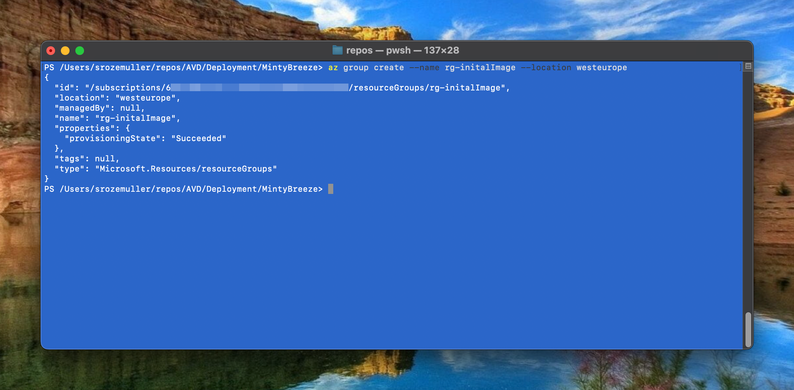

```powershell
az deployment group create --resource-group rg-initalImage --template-file .\Templates\VM\main.create_image.bicep --parameters .\Parameters\initial_image.parameters.json
```

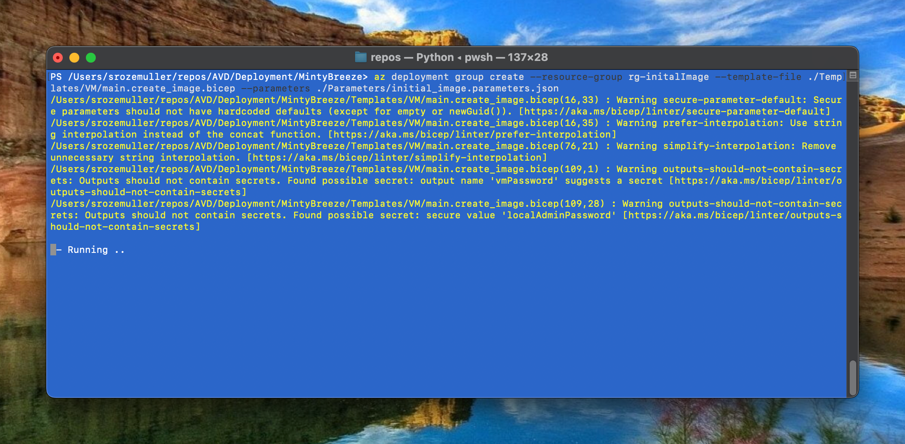

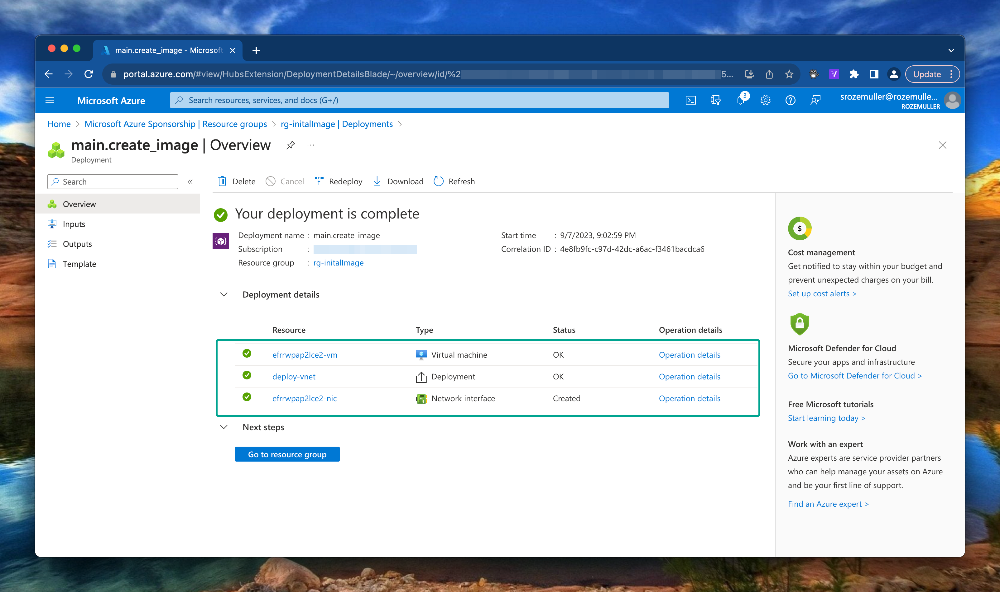

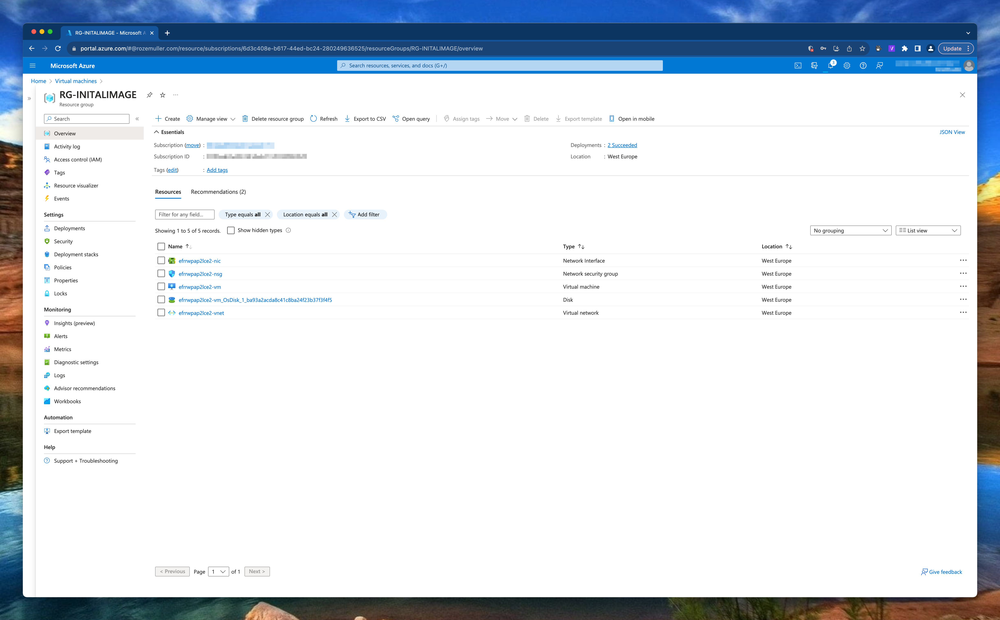

#### SysPrep

First the VM must be generalized and Sysprepped. There are several options for running a script on a VM. Think about a Custom Script Extension or an Invoke-AzRunCommand in PowerShell. In this case I’m using the Azure CLI.

```powershell
az vm run-command invoke  --command-id RunPowerShellScript --name <vmName> -g rg-initalImage --scripts 'param([string]$sysprep,[string]$arg) Start-Process -FilePath $sysprep -ArgumentList $arg' --parameters "sysprep=C:\Windows\System32\Sysprep\Sysprep.exe" "arg=/generalize /oobe /shutdown /quiet /mode:vm"
```

Using the az vm run-command CLI comand gives me the option to skip creating an separate script first. In the –scripts part of the command is able to create a PowerShell on-the-fly. In the –parameters part I will send these parameters.
When running the command, the VM will create a PowerShell file on the local machine. The provided –scripts content is stored in that local file.

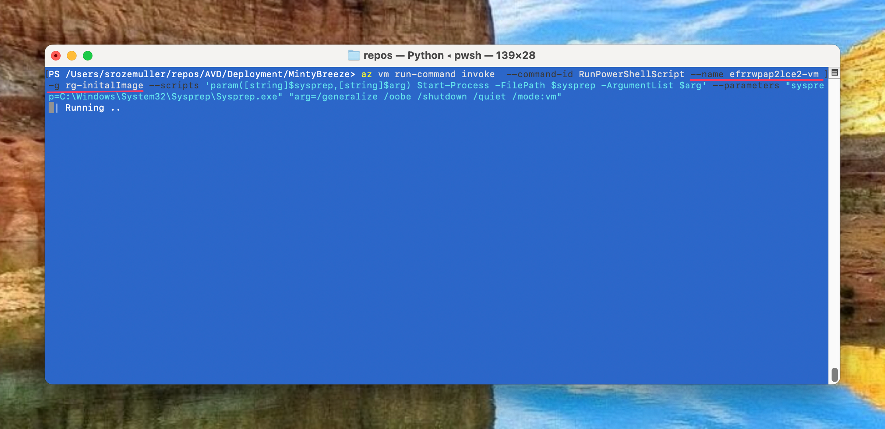

When the command ran succesfully, the machine is in stopped state.

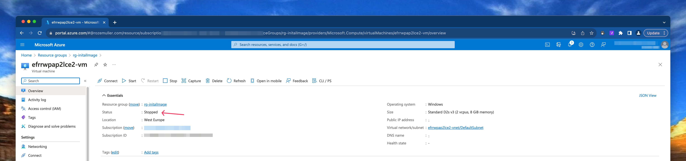
#### Generalize VM

Next step beforce creating an image version is generalize and capture the virtual machine. To achieve that goal we are using the CLI again.

```powershell
az vm generalize -n efrrwpap2lce2-vm -g rg-initalImage
```

Check my [GitHub repository at this location](https://github.com/srozemuller/AVD/tree/main/Deployment/MintyBreeze/Bicep/Templates/VM) for the VM deployment file.


## AVD Components
As mention I created a `main.bicep` file where all the resources are deployed including the resource group itself.

### Resource Group
To deploy resources to a subscription, we need a resource group first. Deploying a resource group is at subscription level.
In the `main.bicep` file I set the default scope at subscription level by adding `targetScope = 'subscription'` at the top of the file.

Thereafter deploy the resource group by providing a name and location.

```bicep
targetScope = 'subscription'

resource resourceGroup 'Microsoft.Resources/resourceGroups@2021-04-01' = {
  name: resourceGroupName
  location: location
}
```
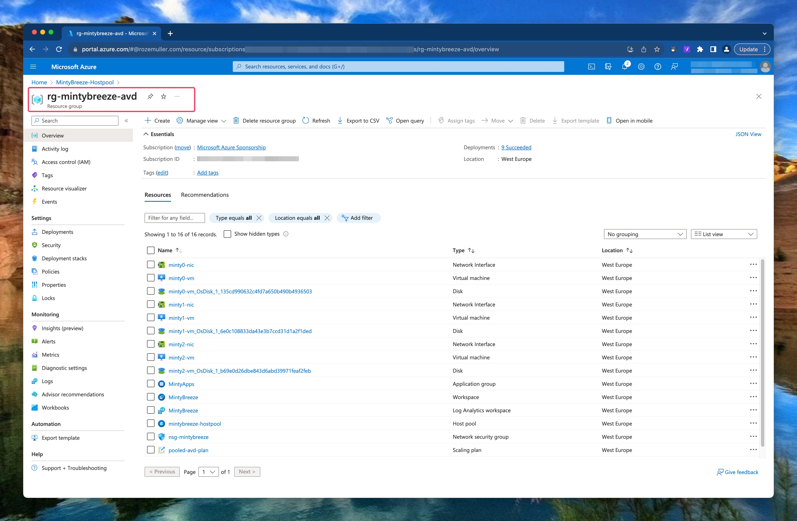

### Networking
The base of every environment is networking. In this step the idea is to deploy a new virtual network (VNET) with one subnet. Because my goal is to deploy as much as I can from parameter files I’ve create an array into a parameter file. That array will be transformed to a Bicep array. The array is used to deploy the vnet.

The parameter snippet looks like the following:

```json
"vnetSubnets": {
            "value": {
                "subnets": [
                    {
                        "name": "DefaultSubnet",
                        "addressPrefix": "10.0.0.0/24"
                    }
                ]
            }
        }
```
If you want to deploy more subnets just add a subnet object in the subnets array.
```json
"vnetSubnets": {
            "value": {
                "subnets": [
                    {
                        "name": "DefaultSubnet",
                        "addressPrefix": "10.0.0.0/24"
                    },
                    {
                        "name": "AvdSubnet",
                        "addressPrefix": "10.0.0.1/24"
                    }
                ]
            }
        }
```
A dynamic array is created and inserted into the deployment. A dynamic array has its pros because now you are scale able within your parameter file. It doesn’t matter how many subnets are in the parameter file. If you need one extra just add it to the file.

In the Bicep file `main.bicep` and the module file `deploy-vnet-with-subnet.bicep` I create a parameter with type object. Based on the object input, every subnet is formatted to a Bicep value and stored in the `subnets` variable. The variable is provided as input in the subnets object in the resource deployment.

```powershell
param vnetSubnets object

var subnets = [for item in vnetSubnets.subnets: {
  name: item.name
  properties: {
    addressPrefix: item.addressPrefix
  }
}]

resource vnet 'Microsoft.Network/virtualNetworks@2020-06-01' = {
  name: vnetName
  location: location
  properties: {
    addressSpace: {
      addressPrefixes: [
        addressPrefix
      ]
    }
    enableVmProtection: false
    enableDdosProtection: false
    subnets: subnets
  }
}
```

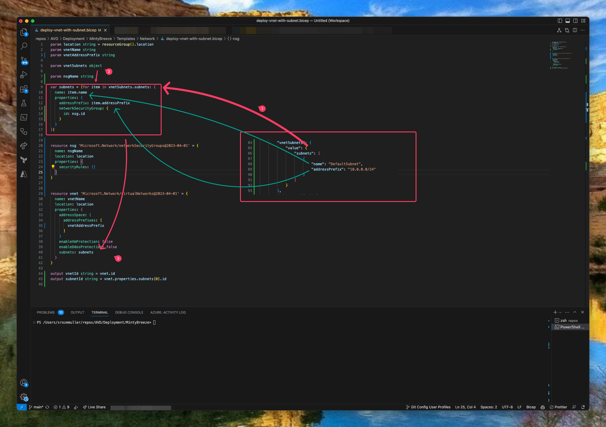

Mention the format of the array. It must be the same format as the deployment code.
At the parameter side (1) there is a vnetSubnets JSON array with a subnets object. In the object the subnets are defined. In the Bicep code (2) there is a loop searching in the vnetSubnets.subnets object for every subnet called `item`. There after the `subnets` variable in Bicep is filled with every subnet. At last, the `subnets` variable is provided in the resource deployment code (3).

### Azure Compute Gallery

In this step, we are going to create an Azure Compute Gallery including an image definition and version based on the generalize VM we created above.
I created a template bicep file for creating a the Compute Gallery and other components. As you can see in the screenshot it will deploy three resources in sequence.

In step 1 the Compute Gallery is deployed, step 2 deploys the image definition. By providing the parent resource you don't have to provide the gallery name again.
At last (3), the image version is created and deployed in the image definition. The version name must be in x.x.x format. In the example below, I created a name based on the UTC date. I created the data using the utcNow Bicep function in the `main.bicep`.
```powershell
param utc string = utcNow('yyyy.MM.dd')
var versionName = utc
```


```powershell

//Create Azure Compute Gallery
resource azg 'Microsoft.Compute/galleries@2022-03-03' = {
  name: galleryName
  location: location
}

//Create Image definition
resource galleryDefinition 'Microsoft.Compute/galleries/images@2022-03-03' = {
  parent: azg
  name: imageDefinitionName
  location: location
  properties: {
    osState: osState
    osType: osType
    identifier: {
      publisher: imagePublisher
      offer: imageOffer
      sku: imageSKU
    }
    hyperVGeneration: hyperVGeneration
  }
}

resource imageVersion 'Microsoft.Compute/galleries/images/versions@2022-03-03' = {
  name: '${galleryName}/${imageDefinitionName}/${versionName}'
  dependsOn: [
    azg
    galleryDefinition
  ]
  location: location
  tags: {}
  properties: {
    publishingProfile: {
      replicaCount: 1
    }
    storageProfile: {
      source: {
        id: imageSource
      }
      osDiskImage: {
        hostCaching: 'ReadWrite'
      }
    }
  }
}
```


### Monitoring
As in every environment, we also like to monitor this environment. To monitor this environment we are going to use Log Analytics.

I used a template that deploys a LogAnalytics workspace. This will enable the provided logs for the AVD environment. In the Log Analytics Bicep deployment I write the workspace ID to the output to use later in the AVD Bicep deployment. After creating the workspace the diagnostic settings will be deployed in later steps.

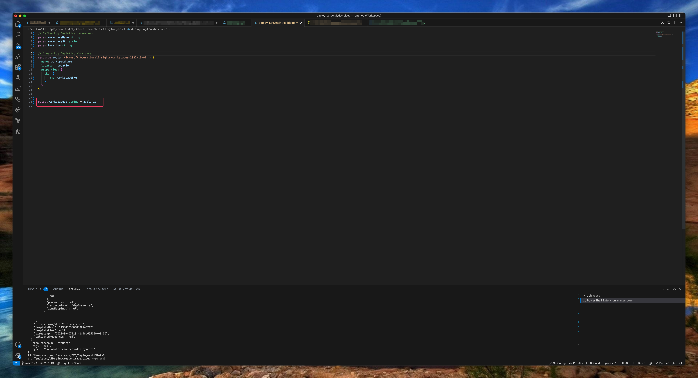


```powershell
// Define Log Analytics parameters
param workspaceName string
param workspaceSku string
param location string

// Create Log Analytics Workspace
resource avdla 'Microsoft.OperationalInsights/workspaces@2022-10-01' = {
  name: workspaceName
  location: location
  properties: {
    sku: {
      name: workspaceSku
    }
  }
}


output workspaceId string = avdla.id
```

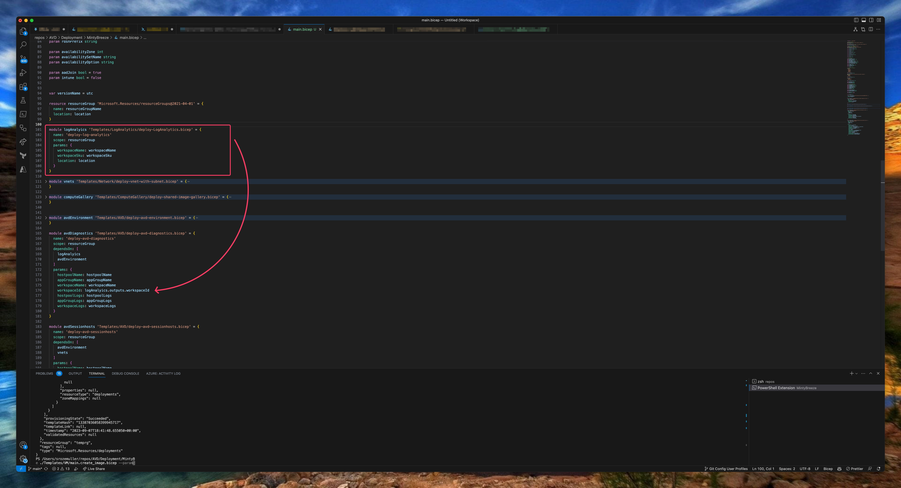

### Azure Virtual Desktop

Now every needed component is in place it is time to deploy the the Azure Virtual Desktop environment with Bicep. In this deployment we are going to deploy a host pool. The next step is the application group. The last step is a workspace. I have chosen to create a separate Bicep file for the session host.I created two Bicep templates. The AVD backend part with the host pool, application group and workspace. The second template for the AVD session hosts.

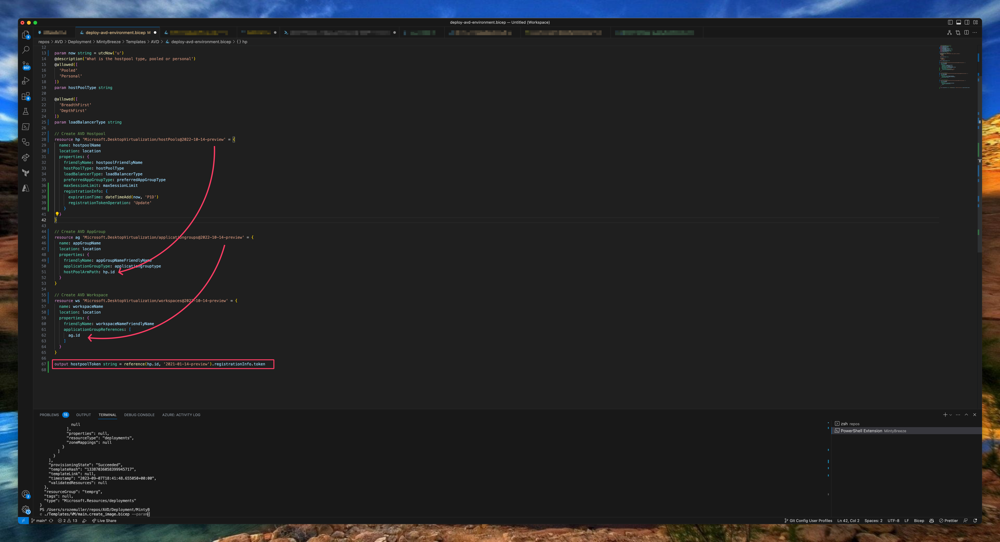

The template part below deploys the AVD backend. As you can see in the screenshot above, I reuse the resource deployment outputs into the next deploymenet. 
At last I output the host pool token to create session hosts in the last step.

The output is a bit changed because of a bug in the API and Bicep. See [this GitHub issue](https://github.com/Azure/bicep/issues/6105#issuecomment-1383119081).

```powershell
//Create AVD Hostpool
resource hp 'Microsoft.DesktopVirtualization/hostpools@2019-12-10-preview' = {
  name: hostpoolName
  location: avdlocation
  properties: {
    friendlyName: hostpoolFriendlyName
    hostPoolType: hostPoolType
    loadBalancerType: loadBalancerType
    preferredAppGroupType: preferredAppGroupType
  }
}

//Create AVD AppGroup
resource ag 'Microsoft.DesktopVirtualization/applicationgroups@2019-12-10-preview' = {
  name: appgroupName
  location: avdlocation
  properties: {
    friendlyName: appgroupNameFriendlyName
    applicationGroupType: applicationgrouptype
    hostPoolArmPath: hp.id
  }
}

//Create AVD Workspace
resource ws 'Microsoft.DesktopVirtualization/workspaces@2019-12-10-preview' = {
  name: workspaceName
  location: avdlocation
  properties: {
    friendlyName: workspaceNameFriendlyName
    applicationGroupReferences: [
      ag.id
    ]
  }
}

output hostpoolToken string = reference(hp.id, '2021-01-14-preview').registrationInfo.token

```

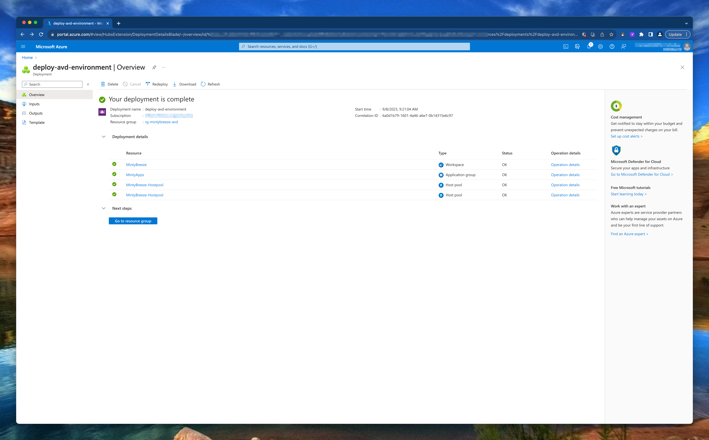


#### Create session host
The next step is creating session hosts. Creating session hosts consists of several deployment steps. First we have to create a network card, the VM itself and deploy the AVD extensions.
New in this deployment is the addition of the disk and nic deletion options. When removing the VM, other components are also deleted automatically.


```powershell

resource nic 'Microsoft.Network/networkInterfaces@2023-04-01' = [for i in range(0, rdshNumberOfInstances): {
  name: '${rdshPrefix}${(i + rdshInitialNumber)}-nic'
  location: location
  tags: networkInterfaceTags
  properties: {
    ipConfigurations: [
      {
        name: 'ipconfig'
        properties: {
          privateIPAllocationMethod: 'Dynamic'
          subnet: {
            id: subnetId
          }
        }
      }
    ]
    enableAcceleratedNetworking: enableAcceleratedNetworking
  }
}]

resource vm 'Microsoft.Compute/virtualMachines@2023-03-01' = [for i in range(0, rdshNumberOfInstances): {
  name: '${rdshPrefix}${(i + rdshInitialNumber)}-vm'
  location: location
  tags: virtualMachineTags
  identity: {
    type: (aadJoin ? 'SystemAssigned' : 'None')
  }
  properties: {
    hardwareProfile: {
      vmSize: rdshVmSize
    }
    availabilitySet: ((availabilityOption == 'AvailabilitySet') ? vmAvailabilitySetResourceId : null)
    osProfile: {
      computerName: '${rdshPrefix}-${(i + rdshInitialNumber)}'
      adminUsername: vmAdministratorAccountUsername
      adminPassword: password
    }
    storageProfile: {
      imageReference: {
        id: imageResourceId
      }
      osDisk: {
        createOption: 'FromImage'
        deleteOption: 'Delete'
        managedDisk: {
          storageAccountType: rdshVMDiskType
        }
      }
    }
    networkProfile: {
      networkInterfaces: [
        {
          id: resourceId('Microsoft.Network/networkInterfaces', '${rdshPrefix}${(i + rdshInitialNumber)}-nic')
          properties: {
            primary: true
            deleteOption: 'Delete'
          }
        }
      ]
    }
    diagnosticsProfile: {
      bootDiagnostics: {
        enabled: false
      }
    }
    licenseType: 'Windows_Client'
  }
  zones: ((availabilityOption == 'AvailabilityZone') ? array(availabilityZone) : emptyArray)
  dependsOn: [
    nic
  ]
}]

resource vm_DSC 'Microsoft.Compute/virtualMachines/extensions@2023-03-01' = [for i in range(0, rdshNumberOfInstances): {
  name: '${rdshPrefix}${(i + rdshInitialNumber)}-vm/Microsoft.PowerShell.DSC'
  location: location
  properties: {
    publisher: 'Microsoft.Powershell'
    type: 'DSC'
    typeHandlerVersion: '2.73'
    autoUpgradeMinorVersion: true
    settings: {
      modulesUrl: artifactsLocation
      configurationFunction: 'Configuration.ps1\\AddSessionHost'
      properties: {
        hostPoolName: hostpoolName
        registrationInfoToken: hostpoolToken
        aadJoin: aadJoin
      }
    }
  }
  dependsOn: [
    vm
  ]
}]

resource vm_AADLoginForWindows 'Microsoft.Compute/virtualMachines/extensions@2023-03-01' = [for i in range(0, rdshNumberOfInstances): if (aadJoin && !intune) {
  name: '${rdshPrefix}${(i + rdshInitialNumber)}-vm/AADLoginForWindows'
  location: location
  properties: {
    publisher: 'Microsoft.Azure.ActiveDirectory'
    type: 'AADLoginForWindows'
    typeHandlerVersion: '1.0'
    autoUpgradeMinorVersion: true
  }
  dependsOn: [
    vm_DSC
  ]
}]

resource vm_AADLoginForWindowsWithIntune 'Microsoft.Compute/virtualMachines/extensions@2023-03-01' = [for i in range(0, rdshNumberOfInstances): if (aadJoin && intune) {
  name: '${rdshPrefix}${(i + rdshInitialNumber)}-vm/AADLoginForWindowsWithIntune'
  location: location
  properties: {
    publisher: 'Microsoft.Azure.ActiveDirectory'
    type: 'AADLoginForWindows'
    typeHandlerVersion: '1.0'
    autoUpgradeMinorVersion: true
    settings: {
      mdmId: '0000000a-0000-0000-c000-000000000000'
    }
  }
  dependsOn: [
    vm_DSC
  ]
}]

output localPass string = password
```

### Azure Key vault
The last step is to create an Azure Key Vault with Bicep and store the session host administrator local password in it. The session host deployment output is used to send the password to the Key Vault.

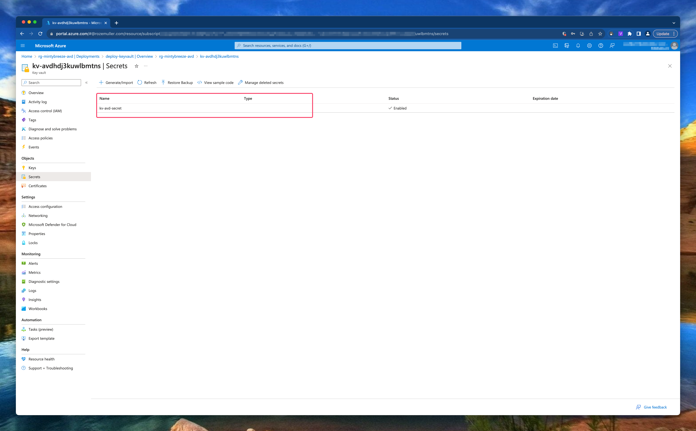

The secret is added with the correct access policy.
During deployment the Key Vault access is set to RBAC permissions where I provide my user ID to assign the Azure Key Vault Secrets User. The Azure Key Vault Secrets User built-in ID is: `4633458b-17de-408a-b874-0445c86b69e6`. (See: [Azure Built-in roles](https://learn.microsoft.com/en-us/azure/role-based-access-control/built-in-roles#key-vault-secrets-user))

In the code below, I first create a Key Vault and then add secrets to it.


```powershell
resource vault 'Microsoft.KeyVault/vaults@2023-02-01' = {
  name: keyVaultName
  location: location
  tags: {
    displayName: 'KeyVault'
  }
  properties: {
    enabledForDeployment: enabledForDeployment
    enabledForTemplateDeployment: enabledForTemplateDeployment
    enabledForDiskEncryption: enabledForDiskEncryption
    enableRbacAuthorization: true
    tenantId: tenantId
    accessPolicies: []
    sku: {
      name: skuName
      family: 'A'
    }
    networkAcls: {
      defaultAction: 'Allow'
      bypass: 'AzureServices'
    }
  }
}

resource secrets 'Microsoft.KeyVault/vaults/secrets@2018-02-14' = [for secret in secretsObject.secrets: {
  name: '${vault.name}/${secret.secretName}'
  properties: {
    value: secret.secretValue
  }
}]
```

After deployment, in step 3 & 4, I deploy a RBAC role assignment to the Azure Key Vault resource using Bicep. For the role resource based on the built-in ID.
In the rbacAccess block, take a note of the scope. I use the `vault` resource above to assign the role assignment to.

```powershell
@description('the role deffinition is collected')
resource roleDefinition 'Microsoft.Authorization/roleDefinitions@2018-01-01-preview' existing = {
  scope: resourceGroup()
  name: roleDefinitionId
}

resource rbacAccess 'Microsoft.Authorization/roleAssignments@2022-04-01' = {
  name: guid('${vault.name}-${roleDefinitionId}-${principalId}')
  scope: vault
  properties: {
    principalId: principalId
    principalType: 'User'
    roleDefinitionId: roleDefinition.id
  }
}

```

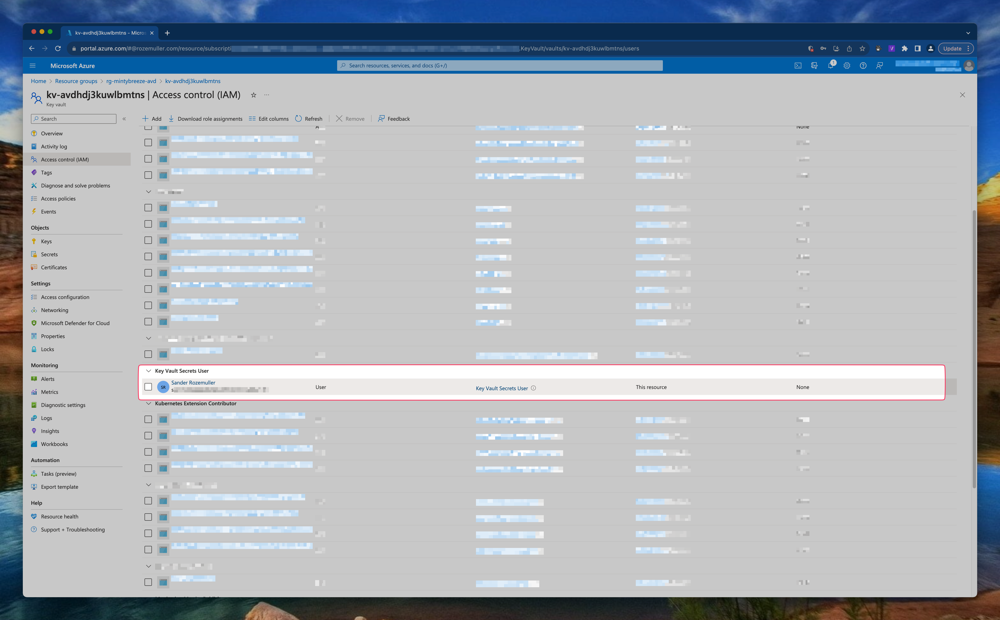

## Deployment
Before deploying anything we need to login first. To log in with Azure CLI use the `az login` command
After running the command a browser opens and ask you to log in.
There are more ways to login like using a service principal.

For more information about log in with Azure CLI please check [this Microsoft document](https://learn.microsoft.com/en-us/cli/azure/authenticate-azure-cli).

After log in you get a screen like below.
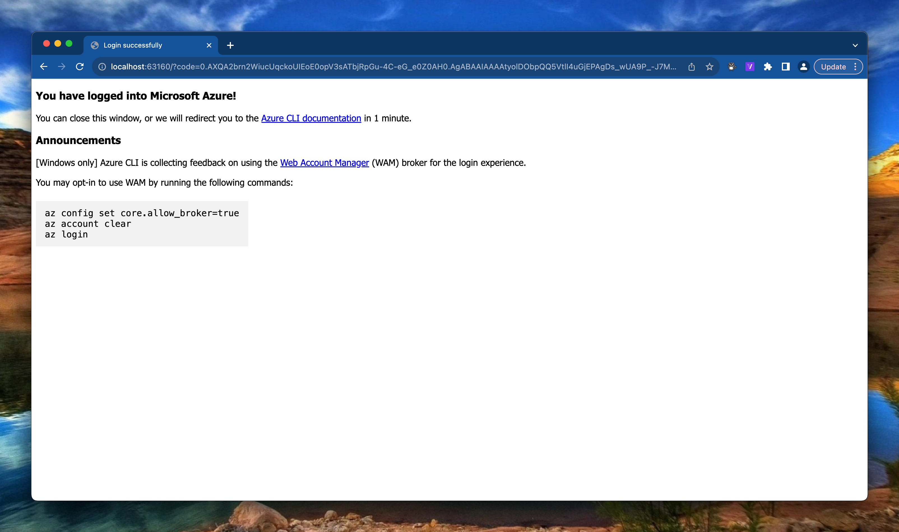

Also make sure you have the correct subscription selected to deploy to. Check the current context by using the `az account show` command. Set the correct subscription using `az account set --subscription <subId>`
When selected the correct context, use the command below to deploy Azure Virtual Desktop and all other components like a VNET, Compute Gallery and AVD Session hosts using Bicep and Azure CLI.

```powershell
az deployment sub create --template-file ./main.bicep --parameters ./Parameters/avd-environment.parameters.json imageSource='subscriptions/xxx/resourceGroups/RG-INITALIMAGE/providers/Microsoft.Compute/virtualMachines/EFRRWPAP2LCE2-VM' --location westeurope
```

The command deploys at subscription level ([See Azure CLI scopes](https://learn.microsoft.com/en-us/cli/azure/deployment/sub?view=azure-cli-latest#az-deployment-sub-create)). I provide the parameter file and additional de image source to create an image version in the Azure Compute Gallery.

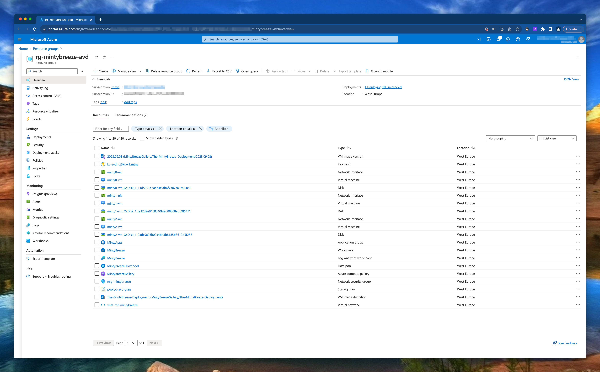

## Conclusion
I’m very exited about the way how Bicep works. Bicep is well documented ([check the GitHub page](https://github.com/Azure/bicep)).
But after all Bicep in basics is very useful can help a lot of people with less coding experience.

I have chosen to keep it as simple as possible from my opinion.
I’m also very surprised about Azure CLI. It feels very fast in relation to PowerShell, at least with deployment (or other ‘push’ tasks). As you read above I’m also querying some info which isn’t very fast. A big advantage in relation to PowerShell is that you don’t need modules.
An another point is that you don’t have to remember use a lot different commands like get-avd, set-avd, update-avd. It all starts with the same context and then what you like to do, show, remove, update for example.

Please keep in mind, the deployment above is an initial deployment for Azure Virtual Desktop.

## Thank you!

I hope you liked the Fresh Minty Breeze 🍃💨 you are a bit inspired. Now you know deploy AVD automated with Bicep and Azure CLI is one of the options. If you like another cocktail feel free to stay and check the [AVD Automation Cocktail menu](https://www.rozemuller.com/avd-automation-cocktail-the-menu/).

