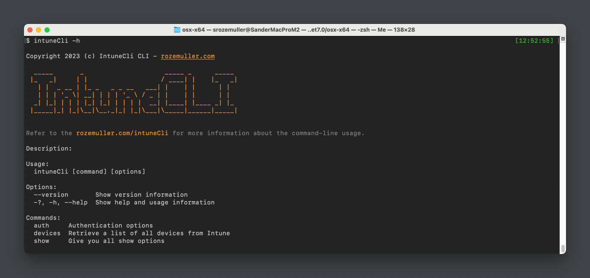



## General module information
<a href="https://github.com/srozemuller/intuneassistant" target="_blank"></a> <a href="https://github.com/srozemuller/intuneassistant/issues" target="_blank"></a> </a><a href="https://github.com/srozemuller/intuneassistant/tree/beta" target="_blank"></a> </a><a href="https://github.com/srozemuller/intuneassistant/tree/beta" target="_blank"></a>


<a href="https://www.nuget.org/packages/IntuneCLI/" target="_blank"></a>

If you want to buy a nice #MEMBEER for all the work, feel free :)  
  <a href="https://www.buymeacoffee.com/srozemuller" target="_blank"></a>
    </div>


### Binary Downloads
Binaries are avaialable for this operating systems:

- Windows x64
- MacOS (ARM and x64)
- Linux

To download the binaries go to: https://github.com/srozemuller/IntuneAssistant/releases


### Installation
To use this tool several options are available and can be use on Windows, MacOS and Linux.
In any way you first need to install at least `dotnet 7.0`. To install dotnet use the commands below.

#### Install dotnet 7 sdk Windows
```basic
winget install --id Microsoft.DotNet.SDK.7 --source winget --log C:\Temp\install.log
```

Check the link on [Microsoft Learn](https://learn.microsoft.com/en-us/dotnet/core/install/windows?tabs=net70) for installing dotnet 7.0 on Windows.
### Install dotnet 7 sdk macOS
Check the link on [Mircosoft Learn](https://learn.microsoft.com/en-us/dotnet/core/install/macos)

After installing dotnet, first *restart the termimal*. Otherwise the dotnet commands are not recognized.

#### NuGet
The recommended way to install this tool is with the use of the NuGet repository. Using the NuGet repository simplifies the download process. 
By using the install command below the correct package is selected automatically.  
Another advantage is using the NuGet installation method is that the command ```intuneCli``` becomes available in your whole system. 
You don't have to execute the specific file.

##### Add the nuget feed
```basic
dotnet nuget add source https://api.nuget.org/v3/index.json --name nuget.org
```

##### This command will install the tool
```basic
dotnet tool install --global IntuneCLI
```

##### Update to the latest version
```basic
dotnet tool update --global IntuneCLI
```

##### Clear nuget cache (if the tool is not found)
It can happen that the update process does not find the latest package available on NuGet. In that case, you have to clear the local NuGet cache.
```basic
dotnet nuget locals all --clear
```

### Global Help
To get help in the IntuneCLI, there is always an argument available called -h.
When using -h in an command you get help in the specific context.


### Feedback
To evolve the IntuneCLI, I need feedback. If you have any feedback, please let me know using one of the channgels below:
- GitHub issues: [https://github.com/srozemuller/intuneassistant/issues](https://github.com/srozemuller/intuneassistant/issues)
- X: [https://twitter.com/SandeRozemuller](https://twitter.com/SandeRozemuller)
- LinkedIN: [https://www.linkedin.com/in/sanderrozemuller/](https://www.linkedin.com/in/sanderrozemuller/)

If you want to buy a nice #MEMBEER for all the work, feel free :)  
<a href="https://www.buymeacoffee.com/srozemuller" target="_blank"></a>
</div>

<script async src="https://pagead2.googlesyndication.com/pagead/js/adsbygoogle.js?client=ca-pub-8130597253774789"
     crossorigin="anonymous"></script>
<!-- footer -->
<ins class="adsbygoogle"
     style="display:block"
     data-ad-client="ca-pub-8130597253774789"
     data-ad-slot="5757826545"
     data-ad-format="auto"
     data-full-width-responsive="true"></ins>
<script>
     (adsbygoogle = window.adsbygoogle || []).push({});
</script>