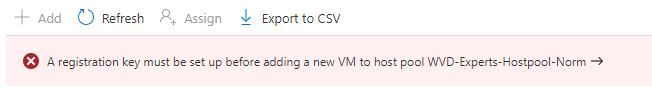
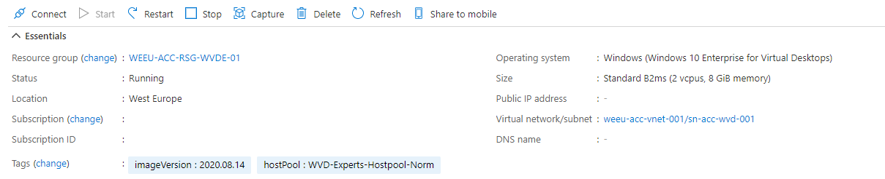
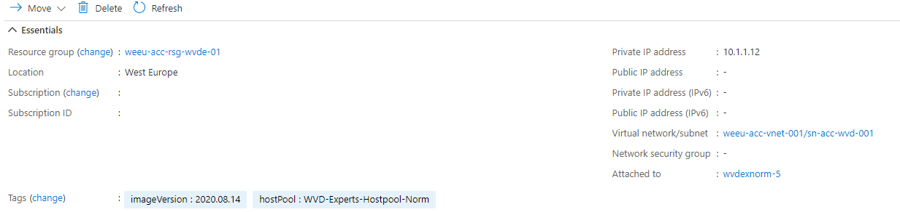
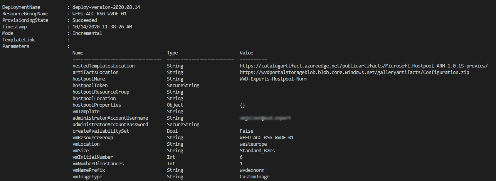

This article is serie of posts about AVD Image Management Automated. In this part we are going to add new sessionhosts to an existing AVD hostpool based on a ARM template.

This post is a part of the series Azure Virtual Desktop Image Management Automated.

1. [Create AVD image version based on existing config with PowerShell – Part 1](https://www.rozemuller.com/create-avd-image-version-based-on-existing-config-with-powershell/)
2. [Save AVD image with Sysprep as Image Gallery version – Part 2](https://www.rozemuller.com/save-avd-image-with-sysprep-as-image-gallery-version/)
3. [Create AVD Sessionhosts based on Shared Image Gallery version – Part 3](https://www.rozemuller.com/azure-virtual-desktop-image-management-automated-part-3-create-avd-sessionhosts-based-on-shared-image-gallery-version-with-arm/)
4. [AVD housekeeping, removing all unused sessionhosts, disks and images – Part 4 ](https://www.rozemuller.com/azure-virtual-desktop-image-management-automated-part-4-avd-clean-up-unused-resources/)
5. [Monitor Image Versions with Azure Monitor – Part 5](https://www.rozemuller.com/azure-virtual-desktop-image-management-automated-part-5-monitor-image-versions-with-azure-monitor/)
6. Enroll MSIX packages automated – Part 6 – (coming soon)



### Introduction

The situation so far: we have created a new image, did a Sysprep, set the image as a version into the Shared Image Gallery.  
In this part we deploy new AVD sessionhosts and add it to an existing hostpool.

##### Requirements

There are some few requirements which are important.

<span class="has-inline-color has-vivid-red-color"><sup>Before continuing make sure have at least module version 2.5.1 of AZ.Resources in PowerShell. There is a bug fixed about passing a securestring into a templateParameterObject. ([See github issue securitystring broken](https://github.com/Azure/azure-powershell/issues/12792#issuecomment-706294242))</sup></span>

I assume you know how to update PowerShell modules.

### Let’s start

Information we need first:

- hostpoolname,
- administrator credentials (needed to join the sessionhosts into the domain),
- the number of instances you like to create (optional)
- drainmode to on at the old sessionshosts.

```powershell
param(
    [parameter(mandatory = $true)][string]$hostpoolName,
    [parameter(mandatory = $true)][string]$administratorAccountUsername,
    [parameter(mandatory = $true)][securestring]$administratorAccountPassword,
    [parameter(mandatory = $false)][int]$sessionHostsNumber,
    [parameter(mandatory = $true)][boolean]$setDrainModeToOn
)

import-module az.desktopvirtualization
import-module az.network
import-module az.compute
import-module az.resources #At least version 2.5.1
```

### Hostpool registration key

You need a registration key before you are able to add sessionhosts to a hostpool. Otherwise you will be notified.


To make code nice and clean I wrote a function for creating a AVD Hostpool registration key. After running the function you will receive the whole registration info.

```powershell
function create-wvdHostpoolToken($hostpoolName,$resourceGroup,$hostpoolSubscription) {
    $now = get-date
    # Create a registration key for adding machines to the AVD Hostpool
    $registered = Get-AzWvdRegistrationInfo -SubscriptionId $hostpoolSubscription -ResourceGroupName $resourceGroup -HostPoolName $hostpoolName
    if (($null -eq $registered.ExpirationTime) -or ($registered.ExpirationTime -le ($now))) {
        $registered = New-AzWvdRegistrationInfo -SubscriptionId $hostpoolSubscription -ResourceGroupName $resourceGroup -HostPoolName $hostpool.Name -ExpirationTime $now.AddHours(4)
    }
    if ($registered.Token) {
    }
    return $registered
}
```

### AVD Hostpool information

The function needs parameters and then continues.   
The script depends on existing session hosts. If there are no hosts, the script will not continue.

```powershell
# Get the hostpool information
$hostpool = Get-AzWvdHostPool | ? { $_.Name -eq $hostpoolName }
$resourceGroup = ($hostpool).id.split("/")[4].ToUpper()
$hostpoolSubscription = ($hostpool).id.split("/")[2]
# Get current sessionhost information
$sessionHosts = Get-AzWvdSessionHost -ResourceGroupName $resourceGroup -HostPoolName $hostpool.name

# Doing some checks beforce continuing
if ($null -eq $sessionHosts) {
    Write-Host "No sessionhosts found in hostpool $hostpoolname, exiting script"
    exit;
}

$hostPoolRegistration = create-wvdHostpoolToken -hostpoolName $hostpoolName -resourceGroup $resourceGroup -hostpoolSubscription $hostpoolSubscription
if ($hostPoolRegistration) {
    $hostPoolToken = (ConvertTo-SecureString -AsPlainText -Force ($hostPoolRegistration).Token)
}

```

### AVD Sessionhost information

With all the needed information the script will continue to the final check about the number of session hosts that will be created. If the variable $sessionHostNumber is empty the script will count the existing AVD session hosts and will use that number.

```powershell
if ($null -eq $sessionHostsNumber) {
    $sessionHostsNumber = $sessionHosts.count
    Write-Host "No sessionHostsNumber provided, creating $sessionHostsNumber hosts"
}
```

In the next part all other variables will be filled based on a existing sessionhost. This is almost the same part I described in [part ](https://www.rozemuller.com/create-avd-image-version-based-on-existing-config-with-powershell/)[one](https://www.rozemuller.com/create-avd-image-version-based-on-existing-config-with-powershell/).   
(in the future I will create a module or function for that)

```powershell
# Get current sessionhost configuration, used in the next steps
$existingHostName = $sessionHosts[-1].Id.Split("/")[-1]
$prefix = $existingHostName.Split("-")[0]
$currentVmInfo = Get-AzVM -Name $existingHostName.Split(".")[0]
$vmInitialNumber = [int]$existingHostName.Split("-")[-1].Split(".")[0] + 1
$vmNetworkInformation = (Get-AzNetworkInterface -ResourceId $currentVmInfo.NetworkProfile.NetworkInterfaces.id)
$virtualNetworkName = $vmNetworkInformation.IpConfigurations.subnet.id.split("/")[-3]
$virutalNetworkResoureGroup = $vmNetworkInformation.IpConfigurations.subnet.id.split("/")[4]
$virtualNetworkSubnet = $vmNetworkInformation.IpConfigurations.subnet.id.split("/")[-1]

# Get the image gallery information for getting latest image
$imageReference = ($currentVmInfo.storageprofile.ImageReference).id
$galleryImageDefintion = get-AzGalleryImageDefinition -ResourceId $imageReference
$galleryName = $imageReference.Split("/")[-3]
$gallery = Get-AzGallery -Name $galleryName
$latestImageVersion = (Get-AzGalleryImageVersion -ResourceGroupName $gallery.ResourceGroupName -GalleryName $gallery.Name -GalleryImageDefinitionName $galleryImageDefintion.Name)[-1]
```

### Tags

To make things easier to find later I’m using tags which are deployed to every sessionhost component like networkinterface, virtual machine, disk, etc. By adding extra values into the hashtable you are able to extent the tags.

```powershell
$tags = @{
    ImageVersion = $latestImageVersion.Name
    HostPool     = $hostpoolName
}
```




### Splatting parameters

After setting all the variables the template parameter will be created. In most situations you will use a JSON template file in combination with a JSON parameter file. It is unnecessary filling a lot of parameters which are mostly known by the system, with all its consequences.

```powershell

$templateParameters = @{
    resourceGroupName               = $resourceGroup
    hostpoolName                    = $hostpoolName
    administratorAccountUsername    = $administratorAccountUsername
    administratorAccountPassword    = (ConvertTo-SecureString $administratorAccountPassword -AsPlainText -Force)
    createAvailabilitySet           = $false
    hostpooltoken                   = $hostPoolToken
    vmInitialNumber                 = $vmInitialNumber
    vmResourceGroup                 = ($resourceGroup).ToUpper()
    vmLocation                      = $currentVmInfo.Location
    vmSize                          = $currentVmInfo.HardwareProfile.vmsize
    vmNumberOfInstances             = $sessionHostsNumber
    vmNamePrefix                    = $prefix
    vmImageType                     = "CustomImage"
    vmDiskType                      = $currentVmInfo.StorageProfile.osdisk.ManagedDisk.StorageAccountType
    vmUseManagedDisks               = $true
    existingVnetName                = $virtualNetworkName
    existingSubnetName              = $virtualNetworkSubnet
    virtualNetworkResourceGroupName = $virutalNetworkResoureGroup
    usePublicIP                     = $false
    createNetworkSecurityGroup      = $false
    vmCustomImageSourceId           = $imageReference
    availabilitySetTags             = $tags
    networkInterfaceTags            = $tags
    networkSecurityGroupTags        = $tags
    publicIPAddressTags             = $tags
    virtualMachineTags              = $tags
    imageTags                       = $tags
}
```

Because of splatting parameters instead of using a parameter file you will need at least PowerShell module Az.Resources version 2.5.1. (As I mentioned at the beginning).   
At the total end we use the new-AzResourceGroupDeployment command for deploying the environment by an ARM template.

### Deploy with ARM

```powershell
$deploy = new-AzresourcegroupDeployment -TemplateUri "https://raw.githubusercontent.com/srozemuller/Windows-Virtual-Desktop/master/Image%20Management/deploy-sessionhost-template.json" @templateParameters -Name "deploy-version-$($latestImageVersion.Name)"
```


### Drainmode

After deployment was successful the “old” session hosts drainmode should be set to ON. This will ensure no new sessions will be accepted. Actually you force new connections to new session hosts.

```powershell
if (($deploy.ProvisioningState -eq "Succeeded") -and ($setDrainModeToOn)) {
   foreach ($sessionHost in $sessionHosts) {
        $sessionHostName = $sessionHost.name.Split("/")[-1]
        Update-AzWvdSessionHost -HostPoolName $Hostpoolname -ResourceGroupName $ResourceGroup -Name $sessionHostName -AllowNewSession:$false
    }
}
```

At my [Github](https://github.com/srozemuller/Windows-Virtual-Desktop/tree/master/Image%20Management) you will find the script and template file.

