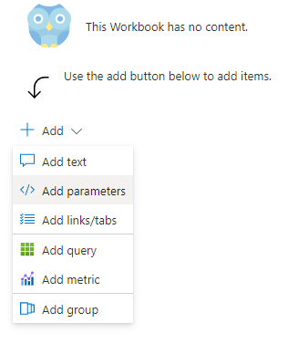
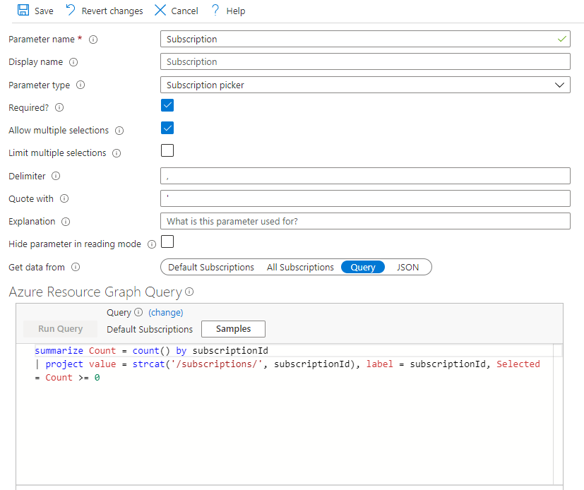

When using the Azure Virtual Desktop for a longer time and created images several times you will noticed you are not able to remove old images directly when a new version has been deployed. Or in case of a MSP when you need to manage more then one image after some time you will lose sight on images and versions. An image overview would be nice to have. In this article I will show how to do some image version control on a AVD environment.

In this part I will describe some options how to create an image overview with Azure Monitor creating a Workbook based on Kusto Query. Main goal is to do some image version control on a AVD environment.

This post is a part of the series Azure Virtual Desktop Image Management Automated.

1. [Create AVD image version based on existing config with PowerShell – Part 1](https://www.rozemuller.com/create-wvd-image-version-based-on-existing-config-with-powershell/)
2. [Save AVD image with Sysprep as Image Gallery version – Part 2](https://www.rozemuller.com/save-wvd-image-with-sysprep-as-image-gallery-version/)
3. [Create AVD Sessionhosts based on Shared Image Gallery version – Part 3](https://www.rozemuller.com/azure-virtual-desktop-image-management-automated-part-3-create-wvd-sessionhosts-based-on-shared-image-gallery-version-with-arm/)
4. [AVD housekeeping, removing all unused sessionhosts, disks and images – Part 4 ](https://www.rozemuller.com/azure-virtual-desktop-image-management-automated-part-4-wvd-clean-up-unused-resources/)
5. [Monitor Image Versions with Azure Monitor – Part 5](https://www.rozemuller.com/azure-virtual-desktop-image-management-automated-part-5-monitor-image-versions-with-azure-monitor/)



### Create dashboard parameters

First we need some dashboard parameters like subscription and image name. With parameters the report will find the information out of Azure Resource Graph.   
Although creating a complete workbook from scratch is not a part of the scope in this article, I will describe the basics from where to start.  
  
Go to Azure Monitor, click Workbook and click an Empty workbook


In the workbook click Add and choose Add Parameters


From there you will be able to create dynamic parameters by executing queries. For example when requesting all subscriptions you will need to execute an Azure Resource Graph query.


```basic
summarize Count = count() by subscriptionId
| project value = strcat('/subscriptions/', subscriptionId), label = subscriptionId, Selected = Count >= 0
```


The parameters you need are Subscription, SubscritptionId and ImageName.  
I’ve used the following queries to achieve that goal.

```basic
resourcecontainers
 | where type =~ "microsoft.resources/subscriptions"
 | summarize Count = count() by subscriptionId
 | project Label = subscriptionId, Id = subscriptionId, Selected = Count >= 0
```

And for the image name parameter

```basic
resources 
| where type =~ "microsoft.compute/virtualmachines"
 and isnotnull(properties.storageProfile.imageReference.exactVersion)
| mvexpand imageVersion = properties.storageProfile.imageReference.exactVersion
| extend imageInfo = split(properties.storageProfile.imageReference.id,"/")
| summarize Count=count() by Image=tostring(imageInfo[10])
| project Label =Image
```

  
At the end it will properly looks like this


## Latest image version per image 

After creating parameters you can add modules by clicking the Add button (in the Workbook) and click Add Query.  
In the first place I want to know which is the last image version per image. This will result in the following overview.


For creating this image overview i’ve used the following Azure Resource Graph Kusto query.

```basic
resources | where type contains "microsoft.compute/galleries/images/versions" 
| extend GalleryInfo = split(id,"/")
| project GalleryName=GalleryInfo[8], ImageName=GalleryInfo[10], ImageVersion=GalleryInfo[12], GalleryInfo[2]
| summarize LastVersion=max(tostring(ImageVersion)) by tostring(GalleryName), tostring(ImageName)
```

## Session host image version overview

The second overview will show the Azure Virtual Machines which are not on the latest version. It responds on the selected Image parameter.

The needed information is scattered over more resource types, to get the information together we need to join all the resources together. At first we query for Azure virtual machines which has an image version and extending the imageId and the exact version the virtual machine is using. Before creating a join we need to project the information first. This information will be used by the join statement.

```basic
resources 
| where type =~ "microsoft.compute/virtualmachines" and isnotempty(properties.storageProfile.imageReference.exactVersion)
| extend currentImageVersion = properties.storageProfile.imageReference.exactVersion
| extend imageName=split(properties.storageProfile.imageReference.id,"/")[10]
| project tostring(imageName), tostring(currentImageVersion), vmId=id 

```

The the most tricky and fun part is to join other resource types. This query is quite complex because of multiple joins.  
The main join will get the versions per image. The second join will check if the result is the last version and will put the result in a new column. This has been achieved by the summarize. If it is the latest version the result is yes, otherwise no 🙂  
I only return the latest version to avoid getting the no-results as well even when an Azure Virutual Machine is on the latest version.

```basic
| join kind=inner(
resources
| where type=~'microsoft.compute/galleries/images/versions'
| extend  imageName=split(id,"/")[10]
| project id, name, tostring(imageName)
| join kind=inner ( 
resources 
| where type =~ 'microsoft.compute/galleries/images/versions' 
| extend versionDetails=split(id,"/")
| project id, name, imageName=versionDetails[10], imageGallery=versionDetails[8], resourceGroup, subscriptionId
| summarize LastVersion=max(tostring(name)) by tostring(imageName) , tostring(imageGallery), resourceGroup, subscriptionId
) on imageName
| extend latestVersion = case(name != LastVersion, "No", "Yes")
| where latestVersion == "Yes"
) on imageName

```

Now we know the image version status the last part is matching the current Azure virtual machine version with the latest version.

```basic
| extend vmLatestVersion = case(currentImageVersion != LastVersion, "No", "Yes")
| extend vmDetails = split(vmId,"/")
| project vmLatestVersion,imageName, currentImageVersion, vmId, imageGallery, resourceGroup, subscriptionId, LastVersion

```

This query will return the complete list with Azure Virtual Machines with latest versions yes and no. If you like to seperate the results you can add a where statement which shows the status you want. This could be usefull when counting rows by state.

```basic
| where vmLatestVersion =~ "No"
```


### Final Kusto query

The final Kusto query for Azure Resource Graph will result in the following

```basic
resources 
| where type =~ "microsoft.compute/virtualmachines" and isnotempty(properties.storageProfile.imageReference.exactVersion)
| extend currentImageVersion = properties.storageProfile.imageReference.exactVersion
| extend imageName=split(properties.storageProfile.imageReference.id,"/")[10]
| project tostring(imageName), tostring(currentImageVersion), vmId=id 
| join kind=inner(
resources
| where type=~'microsoft.compute/galleries/images/versions'
| extend  imageName=split(id,"/")[10]
| project id, name, tostring(imageName)
| join kind=inner ( 
resources 
| where type =~ 'microsoft.compute/galleries/images/versions' 
| extend versionDetails=split(id,"/")
| project id, name, imageName=versionDetails[10], imageGallery=versionDetails[8], resourceGroup, subscriptionId
| summarize LastVersion=max(tostring(name)) by tostring(imageName) , tostring(imageGallery), resourceGroup, subscriptionId
) on imageName
| extend latestVersion = case(name != LastVersion, "No", "Yes")
| where latestVersion == "Yes"
) on imageName
| extend vmLatestVersion = case(currentImageVersion != LastVersion, "No", "Yes")
| extend vmDetails = split(vmId,"/")
| project vmLatestVersion,imageName, currentImageVersion, vmId, imageGallery, resourceGroup, subscriptionId, LastVersion
```

Thank you for reading this post about how to do some image version control for a AVD environment.

{{ bye }}