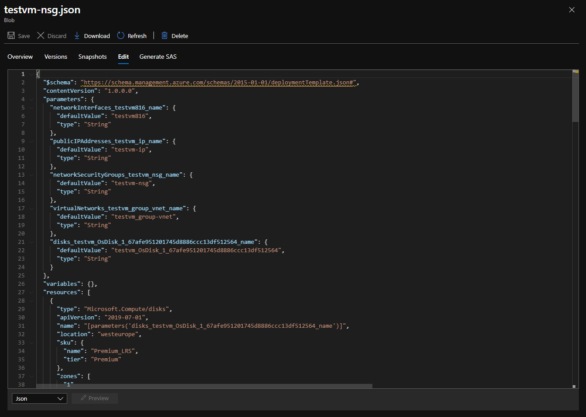

In this quick blog post I will explain a way how to backup Azure resources and how to restore them with PowerShell, in JSON format, to an Azure Storage Account which is “deployment ready”.



### Main idea

The main idea is to export the resource configuration into a JSON file, with the parameters included. In case of emergency or when you like to setup the same resource to an another resourcegroup or subscription the JSON file can be download and deployed.

### Backup Azure Resources

Before creating backups we need a backup location. Of course the file can be stored at every place you like. I’m using an Azure Storage Account. Because I like to have my backups all at the same place I will put all the resources into the same Storage Account. I recommend using low costs storage with Cool access tier and Standard performance. (in this example it is Hot)

In this case I am using a Network Security Group (NSG) for example. First I will check if there is already a container for this resource type, if not it will be created.


The next step is creating a JSON output for each NSG. The -IncludeParameterDefaultValue switch in the Export-AzResourceGroup PowerShell command will take care of the resource specific parameters. Without this switch only an empty ARM template will be returned. So you better be use it :).

The export automatically download the file into the current folder where the script is at. Next I will create a blobname (filename at the storage account). The last step is to upload the file to the storage account. This can be achieved by executing the Set-AzStorageBlobContent command.

```powershell
$Resources = Get-AzNetworkSecurityGroup
if ($Resources) {
    $StorageAccount = get-AzStorageAccount | ? { $_.StorageAccountName -eq "satestsrbackup" }
    $ContainerName = ($Resources.Id).Split("/")[-2].ToLower()
    $StorageAccountContainer = $StorageAccount | Get-AzStorageContainer | Where { $_.Name -match $ContainerName }
    if ($null -eq $StorageAccountContainer){
        $StorageAccount | New-AzStorageContainer $ContainerName.ToLower()
    }
    foreach ($Resource in $Resources) {
        
        $BlobName = $($Resource).Name + ".json"
        $Export = $Resource | Export-AzResourceGroup -IncludeParameterDefaultValue -Force
        Set-AzStorageBlobContent -File $Export.Path -Container $ContainerName -Blob $BlobName  -Context $StorageAccount.context -Force
    }
}
```



### Restore

When a restore is needed just download the file from the storage account and use it as input for the New-AzResourceGroupDeployment command.

```powershell
New-AzResourceGroupDeployment -TemplateParameterFile [file]
```

Now you are able to backup Azure resources and to restore them fully automatically.

