As mentioned in earlier posts Azure DevOps is a really nice way to deploy Azure resources automated. During my travel through Azure DevOps for managing Windows Virtual Desktop resources I moved from classic pipelines and releases to the new YAML pipelines. Using YAML has a lot of advantages in relation to classic. But there are some new challenges coming, approval or manual interventions for example. In this article I will explain how to use approvals and checks with dynamic recipients in DevOps environments within a YAML configuration.



## Introduction

Azure DevOps is a service which helps you streaming projects, storing code and creating automated deployment sequences. For deploying an AVD environment Azure DevOps is a really good place to start if you like to automate deployments and install applications. Sometimes you just want to stop the sequence for a while to do some manual actions.

**For example:**

- You need manual installation
- A 3rd party which need to install software by itself
- You have a DTAP (Developement, Testing, Acceptanc, Production) environment which need manual intervention between stages

No special thing so far, Azure DevOps has manual interventions between stages and environments. But what if you don’t know where to send manual intervention messages at the first place before a task is started.   
For example when a user starts a pipeline for creating a new image which needs some manual intervention afterwards. That is the part which Azure DevOps environments can’t handle. When configuring an Azure DevOps environments approvals needs an existing recipient from the Azure AD.   
  
In this blog post I will zoom into that part and how to deal with dynamic recipients in a DevOps environments you just don’t know at the start or even don’t exists in the Azure AD at all.

## Windows Virtual Desktop Image management

In this chapter I will explain the process at top level. This will help you understanding the different types of interventions and why. In the chapters thereafter I will explain the used components and to configure and connect them to each other.

In the illustration below I draw the main AVD image management process.   
At the start you have a current production image which you like to update. You will start an Azure virtual machine from that image and will install the applications. The first intervention is after install applications. Most of the time an internal user is working on that image. After the applications are installed the pipeline will continue with the next steps. After generalizing the new image is ready. That is the next manual intervention point. This approval can be also an internal user or a customer which should test the new image.


The main challenge in this process is the unknown approvers combined with a YAML pipeline and environments. Where in the classic pipeline a manual intervention task is available, it is recommended you should use a deployment job with environments in a YAML pipeline.   
In the classic task you are able to put a variable into the recipient field. In an environment you have configure approvals and select an existing identity from the AD first which will be used in a pipeline.

## Azure DevOps components

In this first part I will explain the needed DevOps components in a nutshell with the image process in mind.

### Environments

The first component are environments. This is a collection of resources like virtual machine which can be targeted to deploy to from a pipeline. There are several extra options which can be configured before deploying an environment. It is also possible to configure these options without selecting resources.

#### Job type

Each type of jobs has its own options. A default job consists of tasks and steps, where a template points to a other YAML pipeline file. To target to an environment you have to configure deployment jobs in the YAML pipeline.

When creating jobs in a YAML pipeline you have several types of jobs. (job, template or deployment)

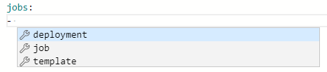
A deployment pipeline can look like below where the pipeline deploys to a test environment. From the steps part the default tasks will be configured.

```yaml
jobs:
- deployment: TestDeployJob
  environment: TestEnvironment
  strategy:
    runOnce:
      deploy:
        steps:
```

See the Microsoft documentation for [more information about environments](https://docs.microsoft.com/en-us/azure/devops/pipelines/process/environments?view=azure-devops).

## Approval and checks

Withing the approval and checks there are a lot of options which can be used.   
Pipelines rely on resources such as environments, service connections, agent pools, variable groups, and secure files. Checks enable the *resource owner* to control if and when a stage in any pipeline can consume a resource. As an owner of a resource, you can define checks that must be satisfied before a stage consuming that resource can start. For example, a *manual approval check* on an environment would ensure that deployment to that environment only happens after the designated user(s) has reviewed the changes being deployed.

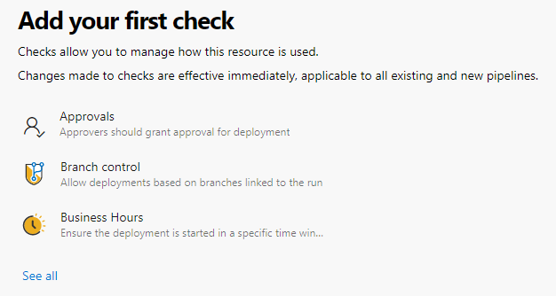
More information about approvals please [check define approval and checks](https://docs.microsoft.com/en-us/azure/devops/pipelines/process/approvals?view=azure-devops).

## Azure Resources

To setup a dynamic approval the basic approval will not fill in the needs. This because of a basis approval needs an existing AD identity as an approver and will not accept variables. With the first introduction example in mind this means you have to setup an environment for every user and you will have to create one every time a new user comes in. From management perspective you have a lot of housekeeping.

### Azure Functions

Because of it can be triggered from outside the function through an URL I use an Azure Function. There is also an option called Invoke REST API which will need a service connection with the correct permissions. To keep as less components as needed I decided to choose functions.


### Azure Logic App

An another resource I used is an Azure Logic App. An Logic App has really nice preconfigured actions, accepts HTTP requests and has a way to authenticate to Microsoft Teams. With a few simple steps I’m able to send messages, to Teams in my scenario.

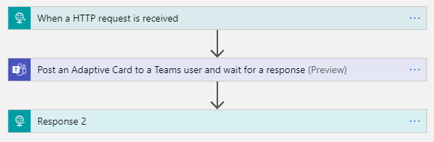
## Microsoft Teams

The past year the usage of Microsoft Teams has been grown exceptionally and there is no day I’m not using it. Because of that and its accessibility for every kind of user Microsoft Teams is a really good addition to your pipeline process.   
So I decided to extend my DevOps pipelines to Microsoft Teams.

### Azure Pipelines with Microsoft Teams

The first thing was to install the Azure Pipeline application into a Teams channel. This application is subscribed to projects or pipeline and follows every step. If an intervention is there the application will show a message like below.

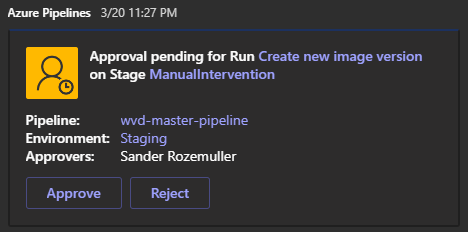
Check the link for more information about the installation and the download location: <https://docs.microsoft.com/en-us/azure/devops/pipelines/integrations/microsoft-teams?view=azure-devops>

### Adaptive Cards

Adaptive cards is a open card format which is possible to format in every way you like. It will allow you to exchange UI content across many applications. An adaptive card consist of JSON code. Luckily you don’t have to figure it out by yourself :). For creating cards you can take a look at: <https://adaptivecards.io/designer/>

In the logic app I’m using the *Post an Adaptive Card to a Teams user and wait for a response* action where the message contains the adaptive card JSON body.

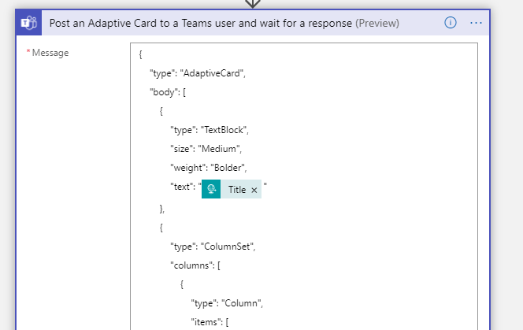
## Connecting the dots

The illustration below represents the process at top level. It start with the pipeline, of course ;). When the pipeline arrived at the manual intervention stage the deployment job will trigger the environment.


### Stage configuration

As mentioned earlier in this post you will need a deployment job type to ‘trigger’ an environment (TestEnvironment in this scenario). If the approval and checks are successful then the tasks within the job will be executed.

```yaml
jobs:
- deployment: TestDeployJob
  environment: TestEnvironment
  strategy:
    runOnce:
      deploy:
        steps:
```

### DevOps Environment

I just created an empty environment name TestEnvironment. After creation I clicked the 3 dots to configure Approval and checks.

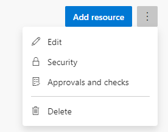
In the next screen click the ‘see all’ link to show all the options. From the list I selected the Invoke Azure Function.

To send messages to dynamic users you will need an another option, Invoke Azure Function. This option allows you to send DevOps variables into the function. From there you are free to do anything with it. The configuration will looks like below.   
The Azure Function URL is the first part without the authentication key. The key needs to be filled into the next field.


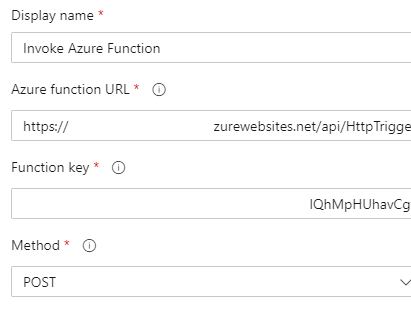
I left the headers part untouched. In the body you are able to put text and variables in JSON format. There are a lot of [predefined variables](https://docs.microsoft.com/en-us/azure/devops/pipelines/build/variables?view=azure-devops&tabs=yaml) which can be used. It is also possible to send your own created variables, in that case you will have to put the variables into a [variable group](https://docs.microsoft.com/en-us/azure/devops/pipelines/process/approvals?view=azure-devops&tabs=check-pass).

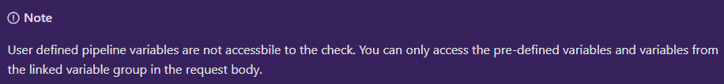
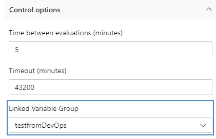
The body has the following content, where the keys are just text and the values are variables from DevOps. The Build. and System. are predefined variables. The other variable came from the variable group. (I created a task in the DevOps pipeline which will update the variable group content with the new content)

```json
{
 "BuildRequestedBy" : "$(Build.RequestedFor)",
 "BuildRequestedForEmail" : "$(Build.RequestedForEmail)",
 "Status" : "Ready for manual actions",
 "TeamProject" : "$(System.TeamProject)",
 "BuildNumber" : "$(Build.BuildNumber)",
 "DomainToJoin" : "$(DomainToJoin)",
 "VMadminUsername" : "$(VMadminUsername)",
 "VMadminPassword" : "$(VMadminPassword)",
 "VirtualMachineName" : "$(VirtualMachineName)",
 "PublicIp": "$(PublicIp)"
 }
```

At last make sure you have set the ApiResponse selected. This option will wait till the Logic App responded.

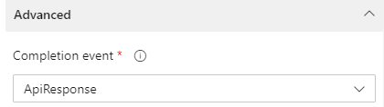
### Function App

Now the data is out of DevOps you will be able to send these data to anyone through mail by example ([SendGrid](https://sendgrid.com/)). I decided to put the data to a Logic App. The function itself isn’t very complex. The first step is creating variables from the request input body.   
For example the $Request.Body.BuildRequestedForEmail is the “BuildRequestedForEmail” key from the JSON code above. The BuildRequestedForEmail is the email of the user which has started the pipeline. Now the function app has this email you you can handle dynamic recipients from Devops environments.  
After creating all the variables I will format the body which will be send to the Logic App.

```powershell
$LogicAppUri = "url to Logic App"
# These are the variables from the DevOps environment
$Email = $Request.Body.BuildRequestedForEmail
$Status = $Request.Body.Status
$ProjectName = $Request.Body.TeamProject
$BuildNumber = $Request.Body.BuildNumber
$VMadminUsername = $Request.Body.VMadminUsername
$VMadminPassword = $Request.Body.VMadminPassword
$VirtualMachineName = $Request.Body.VirtualMachineName
$PublicIp = $Request.Body.PublicIp
$JsonBody = @{
    account = @{
        name = $Email
    }
    text = @{
        Message = "Job $BuildNumber has status $Status."
        Title = "Update from $ProjectName"
        VmName = $VirtualMachineName
        VmUserName = $VMadminUsername
        VmPassword = $VMadminPassword
        VmPublicIp = $PublicIp
    }  
}
$Body = $JsonBody | Convertto-Json -depth 2
$Headers = @{
    'Content-Type' = 'application/json'
}
$Request = invoke-webrequest -URI $LogicAppUri -Body $Body -Method 'Post' -Headers $Headers
```

The full function app code I used can be found at my [Github repository](https://github.com/srozemuller/Azure/blob/main/DevOps/Automation/Environments/Checks/fa-sendto-la.ps1).

### Logic App

The Azure Pipeline application is a great addition but for some scenario’s I don’t want to send messages to a complete Teams channel. That’s the point I decided to create a Logic App as well. Now I have dynamic data I’m able to send Teams messages to everyone I like.   
Logic App has a really nice integration with Microsoft Teams and a lot of predefined actions. They are still in preview but working quite well.

In the basic the Logic App has and HTTP Request, a post adaptive card and a response action.

The HTTP Request action will generate an unique URL which you need in the Function App. This is the public URL where the Logic App is listening. In the Request Body JSON Schema you tell the Logic App how a incoming request look like. This is the same as the body which will be send from the Function App.

```json
{
    "properties": {
        "account": {
            "properties": {
                "name": {
                    "type": "string"
                }
            },
            "type": "object"
        },
        "text": {
            "properties": {
                "Message": {
                    "type": "string"
                },
                "Title": {
                    "type": "string"
                },
                "VmName": {
                    "type": "string"
                },
                "VmPassword": {
                    "type": "string"
                },
                "VmPublicIp": {
                    "type": "string"
                },
                "VmUserName": {
                    "type": "string"
                }
            },
            "type": "object"
        }
    },
    "type": "object"
}
```

The next action is the adaptive card action. It is a quite simple action which need two inputs. A recipient and a message. By adding the JSON code in the message body, Teams will generate a card from that code.  
Check the adaptive card design page (<https://adaptivecards.io/designer/>) for creating an adaptive card JSON body.


Because of the request output from the step above is generated you will be able to select that output in the next step.

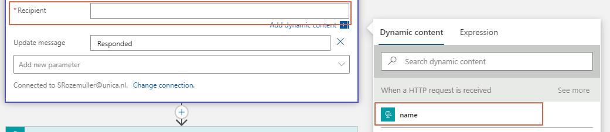
In the rest of the JSON body you are able to add dynamic content as well. This is also the output from the previous action.

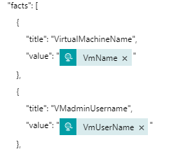
The card will allow you to send back a response with a submit button. To make sure you have responded the card needs to be updated. Make sure to add extra parameters for updating the card in Teams.

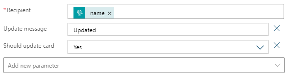
### Response

The response needs a status code which will returned to the request (in this scenario the function app). A status code must be an HTTP statuscode like 202 (Accepted) or 400 (Bad Request). A status code is a code which will be returned by an action button in the adaptive card setup.   
In this example I have a submit button with a OK value which will return 202. This status code will be returned to the function which will send this OK status to DevOps.   
  
This is the most important part of the sequence. If the response is OK, the pipeline will continue.

```json
"actions": [
    {
        "type": "Action.Submit",
        "title": "OK",
        "id": 202
    }
],
```

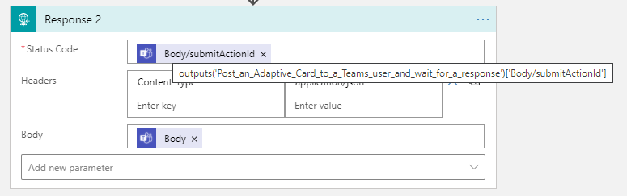
*Statuscode expression: outputs(‘Post\_an\_Adaptive\_Card\_to\_a\_Teams\_user\_and\_wait\_for\_a\_response’)\[‘Body/SubmitActionId’\]*

The adaptive card code I used can be found at my [Github repository](https://github.com/srozemuller/Azure/tree/main/DevOps/Automation/Environments/Checks).

Now you are able to use dynamic recipients in DevOps environments. At the end a personal message from DevOps could be like this.

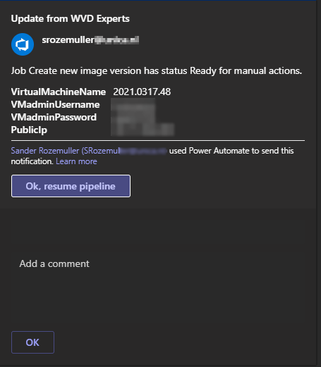
## Troubleshooting

The most tricky part is the data handling in the Logic App. Especially in the beginning a lot went wrong. To troubleshoot some things I used (and still do) the Logic App run history. When navigating to the app at the main page you see the latest runs which tell you a lot what is going on in the app.

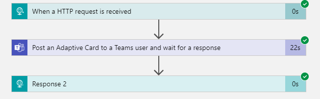
To find out the correct expression for the status code just open the response task and see what was the input.  
For example the response code from the adaptive card must be a HTTP status code.

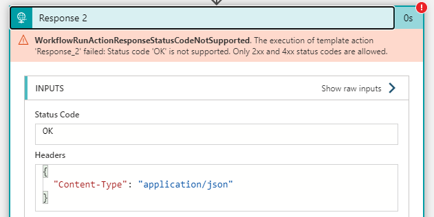
I fixed it by adding an ID to the button which will be returned, otherwise the title is the response.

## Used Resources

Summary of the links I posted throughout the article.

- <https://www.rozemuller.com/save-avd-image-with-sysprep-as-image-gallery-version/#overview>
- <https://docs.microsoft.com/en-us/azure/devops/pipelines/process/environments?view=azure-devops>
- [https://docs.microsoft.com/en-us/azure/devops/pipelines/process/approvals?view=azure-devops&amp;tabs=check-pass](https://docs.microsoft.com/en-us/azure/devops/pipelines/process/approvals?view=azure-devops&tabs=check-pass)
- <https://adaptivecards.io/designer/>

Thank you for reading my post about configuring dynamic recipients in DevOps environments :).
