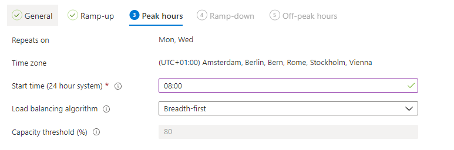
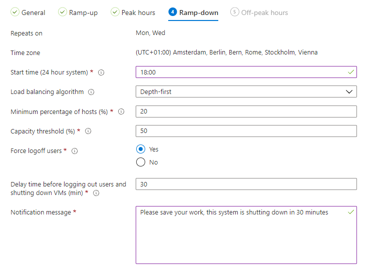
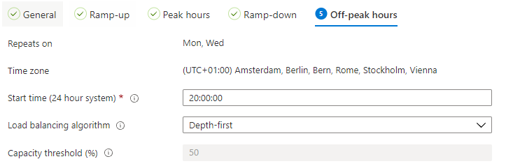

In this article, I explain how to configure AVD scaling plans automated with the Az.Avd module. This is one of the options to save costs on AVD. A plan which helps you start VM’s when needed. And stopping VM’s when not needed. Microsoft announced the public preview of AVD auto-scaling.

In Azure the best way is to save costs is to make sure you don’t ‘claim’ resources when you don’t need them. For Azure VM’s, it means they must be deallocated. This results in session hosts which are unavailable. AVD already knows the ability to [start VM’s on connect](https://www.rozemuller.com/configure-wvd-start-vm-on-connect-automated-with-role-assignments-and-graph-api/) at the moment a user connects to it. Start VM on connect works fine at the moment the environment isn’t used (mostly at night) and every host is down.   
  
Now there is also AVD Auto Scaling which came in public preview. Scaling plans help you control your AVD environment automatically within a specific time window. If hosts are unused it shutdown hosts (automatically) and start them if the environment needs one.   
  
Good to know is that scaling plans only work for existing hosts. It is not creating new hosts.


## Scaling Plans

As mentioned in the introduction, scaling plans are in public preview. https://docs.microsoft.com/en-us/azure/virtual-desktop/autoscale-scaling-plan?WT.mc\_id=EM-MVP-5004578. However this is a nice feature, there are some requirements and some restrictions which need some attention.

### Preview symptoms

At this time it is only possible to assign pooled host pools to a scaling plan. I’ve tried it and got an error message like below.

{“code”:”400″,”message”:”ActivityId: 97ba26e2-b679-4744-946a-936df75ea57e Error: ≤{\\”code\\”:\\”BadRequest\\”,\\”message\\”:\\”Only Pooled Host Pools are supported. Personal Host Pools will be included in a future release. Go to: https://go.microsoft.com/fwlink/?linkid=2146741\\”,\\”target\\”:\\”/xxx.\\”,\\”details\\”:null,\\”innerError\\”:null}≥”}

To calculate the host pool’s total capacity, the maxSessionLimit must be set without using the default 99999 setting.  
Update the maxSessionLimit with the code below.

```powershell
Update-AvdHostpool -HostpoolName avd-hostpool -ResourceGroupName rg-avd-01 -maxSessionLimit 15
```

### Create RBAC role automated

The last requirement is granting access to manage power on the VM compute resources.

As mentioned earlier, a scaling plan will take care of starting and stopping existing AVD session hosts. Before a plan will be able to do that it needs the correct permissions. These permissions are set on the host pool and the virtual machines, and needed to read the session count for example. If the sessions are zero a host will shut down. Also for the shutdown part, the Windows Virtual Desktop service (yes the old name) needs the correct permissions.   
In the code below we create a new role and assign it directly to the session host resource group.

If you only like to create a role, skip the -Assign parameter.

```powershell
$roleParameters = @{
    RoleName = "AVD Autoscale Role"
    RoleDescription = "An autoscale role for AVD"
    ResourceGroup = "RG-ROZ-AVD-01"
}
New-AutoScaleRole @roleParameters -Assign
```

[image-4](image-4.png)
## Create scaling plan

Creating a scaling plan is very easy. But an AVD scaling plan has a lot of options. Some of these options need some extra context. In the upcoming paragraphs, I explain these options.

[image-2](image-2.png)
### Ramp-up

[image-1](image-1.png)
Ramp-up means the start time of the autoscale process. In this screenshot, the process will start at 08:00 AM and will balance the available session hosts.

**Capacity threshold**  
Imagine you have 5 session hosts with a max limit of 10. Then the total WVD hostpool can handle up to 50 sessions. If you have configured a 60% threshold the autoscale will kick in when 60% of 50 sessions has been reached. As a result that at session 53 a new host will be started.

### Peak hours

Peaks hours means the time where the maximum of session host should be present for usage.


### Ramp down

Ramp down is the time where the process starts shutting down machines. The minimum percentage of hosts means the percentage of available hosts after the shutdown process. In this example, the process starts at 18:00. It will look for the host pool’s capacity. It will look from 18:00 if the total capacity is 50% or less. After that point, the ramp-down process starts.


### Off-peak hours

This is the time where minimal hosts are available. If the total hostpool capacity is 50% or less, the system will start a new host.


### Create scaling plan automated

In the commands below I create an AVD-ScalingPlan and assign it to two host pools directly. I also add two scheduled days, Monday and Wednesday.

```powershell
$parameters = @{
    ScalingPlanName   = "AVD-ScalingPlan"
    ResourceGroupName = "RG-ROZ-AVD-01"
    location         = "WestEurope"
    HostpoolType      = "Pooled"
    Description       = "TestDesc"
    FriendlyName      = "MegaFriendly"
    AssignToHostPool = @{"Rozemuller-Hostpool" = "RG-ROZ-AVD-01"; "Rozemuller-Hostpool-2" = "RG-ROZ-AVD-01" }
    ScheduleName     = "Schedule"
    ScheduleDays     = @("Monday", "WednesDay")
    rampUpStartTime   = "06:00"
    rampUpLoadBalancingAlgorithm = "DepthFirst"
    rampUpMinimumHostsPct = 20
    rampUpCapacityThresholdPct = 80
    peakStartTime = "08:00"
    peakLoadBalancingAlgorithm = "BreadthFirst"
    rampDownStartTime = "18:00"
    rampDownLoadBalancingAlgorithm = "DepthFirst"
    rampDownMinimumHostsPct = 20
    rampDownCapacityThresholdPct = 50
    rampDownForceLogoffUsers = $true
    rampDownWaitTimeMinutes = 30
    rampDownNotificationMessage = "message"
    offPeakStartTime = "20:00"
    offPeakLoadBalancingAlgorithm = "DepthFirst"
}
New-AvdScalingPlan @parameters
```
[image-6](image-6.png)
The Az.Avd PowerShell module is updated with these two commandlets. Feel free to download and test it.

```powershell
Install-Module Az.Avd
Import-Module Az.Avd
```

More information about scaling plans, check the URL: https://docs.microsoft.com/en-us/azure/virtual-desktop/autoscale-scaling-plan?WT.mc\_id=EM-MVP-5004578

Thank you for reading this blog on how to enable AVD scaling plans automated.   

