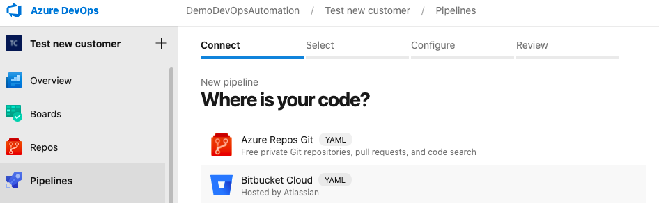
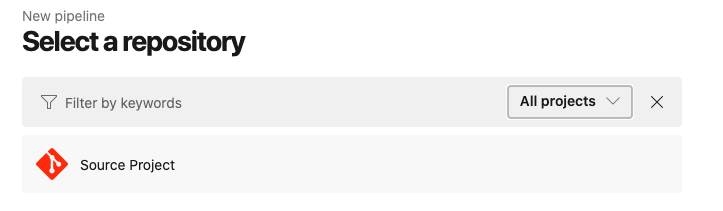
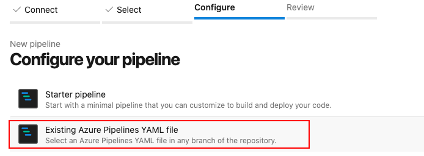

In this 4th slice of Prepare Azure DevOps for AVD deployment series, I will show how to copy or clone an existing YAML pipeline automated from a source project into a new AVD project. This will help you keep one main pipeline as a source and will allow you to create a “linked” pipeline into a new project directly from the source.

## Introduction

In this series about Prepare Azure DevOps for Azure Virtual Desktop deployment, I will post a few small blog posts which will help you set up an AVD prepared DevOps environment, fully automated. At the end of this series, you will be able to create a script that lets you fill in an application name, a project name, and a PAT code for connecting to DevOps and will run all the needed steps to start with DevOps.

What we have so far:

- We have created an [App registration in Azure Active Directory](https://www.rozemuller.com/prepare-azure-devops-for-windows-virtual-desktop-deployment-app-registration/) which allows us to build a connection from DevOps to a subscription
- We have created an [Azure DevOps project](https://www.rozemuller.com/prepare-azure-devops-for-windows-virtual-desktop-deployment-create-devops-project/). This is the first step in DevOps (after you created an organization first)
- Then we create a [Service connection in the DevOps project](https://www.rozemuller.com/prepare-azure-devops-for-wvd-deployment-create-a-service-connection/). This is the connection itself

Finally, it is time to create the first pipeline into the project.



## Why?

The first steps are pretty clear and need to get started in the first place. Now we are getting to a point where the discussion starts. First of all, there is no good or bad. Whatever you do, if it works for you it’s OK :).   
So why do I create a pipeline in every new project instead of using one pipeline in one project with all the service connections within the project?

Well, the answer is very simple in my opinion. A project represents a tenant and a connection to a subscription. A project could have more connections but all pointing to the same tenant.   
Every tenant could have its parameters (in files) and properly also specific pipelines. So I’m creating a new project anyway. Now I have to manage only one service connection for a subscription.

Hope that will make things clear up a bit.

## Clone the YAML pipeline

We are creating an existing pipeline. That means we are creating a pipeline into a new project based on an exciting pipeline. The source always remains in the source repository. If you edit a pipeline it will be changed over all other pipelines based on this source.

Another side is when changing the pipeline in another than the source project then the pipeline will be also changed. To avoid that make sure you have set the correct permissions for end-users on the projects.

Creating an existing pipeline through the portal is very simple. Go to the project, choose pipelines and create a new pipeline. Then select the source, for me Azure Repos Git, and select the correct repository.


After selecting the correct repository choose the existing pipeline and we’re all set.




However, this isn’t very hard it is always nice to play around with automation and it can help you create a new project fully automated.

### Code Explained

We are creating the pipeline with a PowerShell script and some REST API. The script needs some basic information

**Organization**: This is the Azure DevOps organization and the first thing you need. Please check [About organization management in Azure DevOps](https://docs.microsoft.com/en-us/azure/devops/organizations/accounts/organization-management?view=azure-devops) about creating an Azure DevOps organization or go to [https://dev.azure.com](https://dev.azure.com/).

**PersonalToken:** A personal access token (PAT) is used as an alternate password to authenticate into Azure DevOps. You are able to create a PAT under your own personal account. Want to learn how to create, use, modify, and revoke PATs for Azure DevOps please check to [Authenticate with personal access tokens](https://docs.microsoft.com/en-us/azure/devops/organizations/accounts/use-personal-access-tokens-to-authenticate?view=azure-devops&tabs=preview-page).

**CopyToProjectName**: This is the project where to copy the pipeline.  
**source project**: This is de source project.  
**PipelineName**: Which pipeline do you like to copy.

```powershell
Param(
    [Parameter(Mandatory)]
    [string]$personalToken = '',
    
    [Parameter(Mandatory)]
    [string]$organisation = '',
    
    [Parameter(Mandatory)]
    [string]$CopyToProjectName = '',
  
    [Parameter(Mandatory)]
    [string]$SourceProject = '',

    [Parameter(Mandatory)]
    [string]$PipelineName = ''
)

# Creating a header for autorisation
$token = [System.Convert]::ToBase64String([System.Text.Encoding]::ASCII.GetBytes(":$($personalToken)"))
$header = @{authorization = "Basic $token" }
```

In this first API call, we are requesting the pipeline settings from the source project. In the second call, we are gathering all the pipeline information and storing it into a result variable.

```powershell
$GetDefinitionsUrl = "https://dev.azure.com/$organisation/$SourceProject/_apis/build/definitions?name={$PipelineName}api-version=5.0"
$Parameters = @{
    Uri         = $GetDefinitionsUrl
    Method      = "GET"
    Headers     = $header
    ContentType = "application/json"
    Erroraction = "Stop"
}
$Defintions = Invoke-RestMethod @Parameters
$NeededDefinitionId = $GetDefinitionsUrl.id
$DefinitionUrl = "https://dev.azure.com/$organisation/$SourceProject/_apis/build/definitions/$NeededDefinitionId`?api-version=4.1"
$Parameters = @{
    Uri         = $DefinitionUrl
    Method      = "GET"
    Headers     = $Header
    ContentType = "application/json"
    Erroraction = "Stop"
}

$Result = Invoke-RestMethod @Parameters
```

The next few lines of code will remove some unnecessary information like unique IDs, creation date, etc.

```powershell
$values = @("id", "url", "uri", "revision", "createdDate", "project")
foreach ($value in $values) {
    $Result.PSObject.Properties.Remove($value)
}
```

At last, the new result will be used as a body to create a pipeline into the new project.

```powershell

$CloneToUrl = "https://dev.azure.com/$organisation/$CopyToProjectName/_apis/build/definitions?api-version=4.1"
$Parameters = @{
    Uri         = $CloneToUrl
    Method      = "Post"
    Body        = ($Result | ConvertTo-Json -Depth 3)
    Headers     = $Header
    ContentType = "application/json"
    Erroraction = "Stop"
}

$Result = Invoke-RestMethod @Parameters
```

Thank you for reading my post about how to clone a YAML pipeline from a source project automated. Hopefully, it will help you.