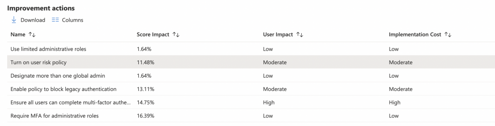
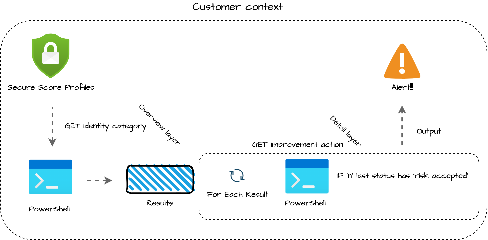
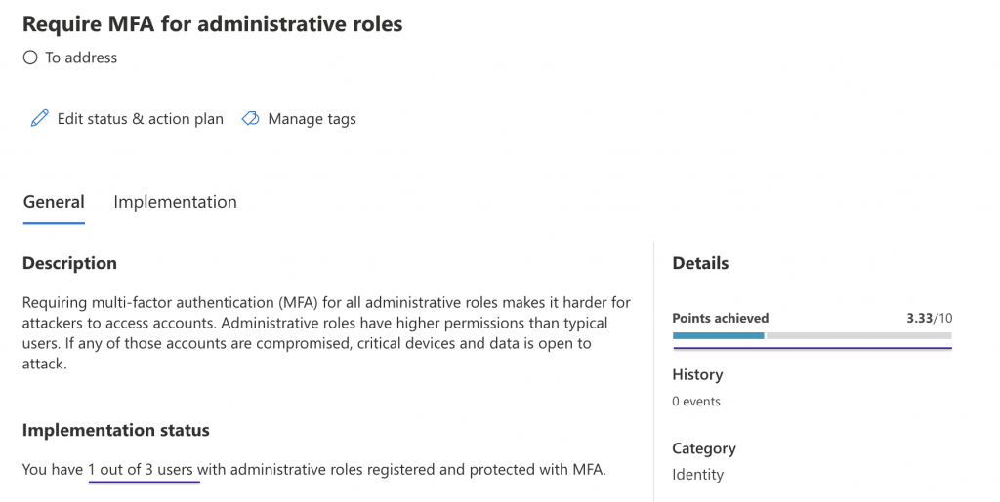
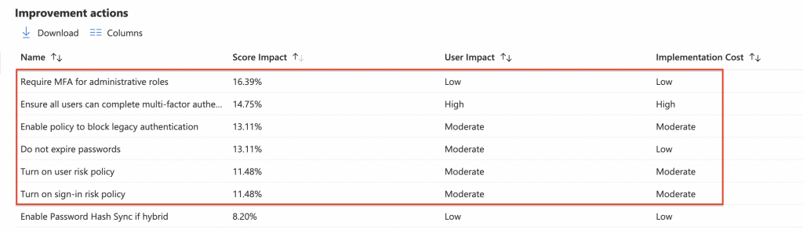
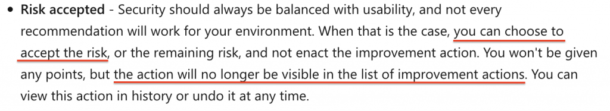
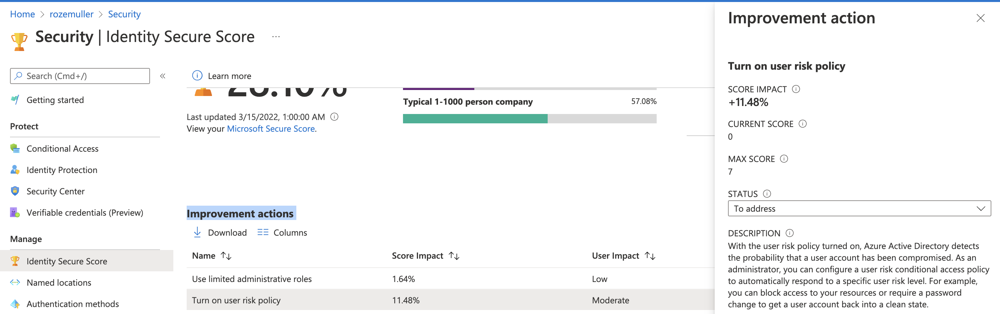
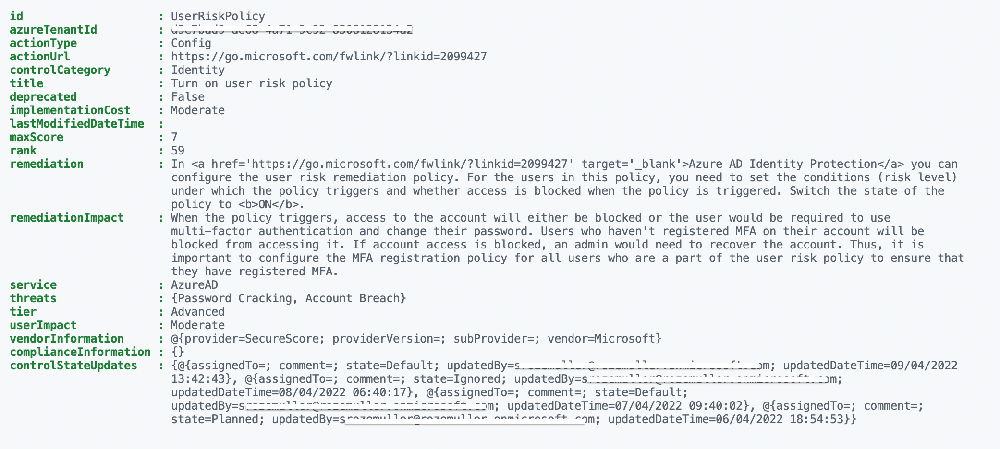
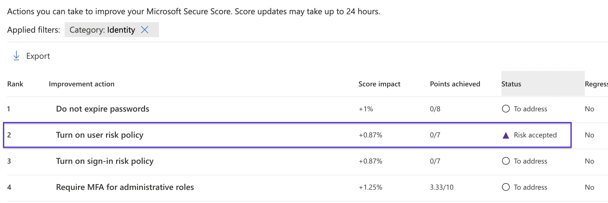
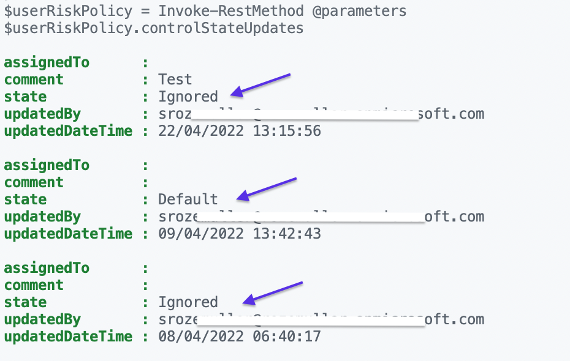

An Azure tenant is the Microsoft public cloud base. It is very important to keep your bases as secure as possible. To keep your tenant secure, Microsoft provides actions that give you insights into your tenant’s security and how to improve it. In this blog, I show how to monitor the secure score security improvement action status.

As mentioned it is very important to keep your tenant as secure as possible and Mircosoft provides recommendations to help. Every recommendation has its own impact, score, and status. In this blog post, I look at the improvement actions and their status. I will explain in this blog post why that status is that important.


**Resolving actions is out of scope in this post.**


## Prerequisites

To start with this blog post, make sure you have configured an application with the correct permissions. Thereafter make sure you are authenticated.

The needed API permissions for reading security improvement actions are:

- **Delegated or Application**: *SecurityEvents.Read.All, SecurityEvents.ReadWrite.All*

To authenticate against the Graph API with PowerShell, check [this part](https://www.rozemuller.com/monitor-security-baselines-in-endpoint-security/#auth-with-powershell).

## Main idea and philosophy

The main idea is to get insights into which security improvement action has a risk accepted state but actually needs to be fixed. Yes, there is also an overview at the [security.microsoft.com](https://security.microsoft.com) portal. But, when the status has changed, I want a trigger. This over multiple environments. In this blog post, I check if a self-defined action is set to ‘**risk accepted**‘ and has the identity category.

The reason I want to know is that, in my opinion, identity is the basis for every platform. In this blog post, I show how to get information and store the output for later use. I use PowerShell to get the data. From that point, I am able to send data to any system.


## Identity Secure Score

It all starts with the [Microsoft Secure Score](https://security.microsoft.com/securescore?viewid=overview). The Microsoft Secure Score is divided into three subcategories: Identity, Device, and Apps. The focus of this post is on the identity part. The Identity Secure Score tells how secure your tenant is from an identity perspective. You can find the identity score also in the Azure portal under ***Azure Active Directory -&gt; Security -&gt; Identity Secure Score***.

Make a note that the Identity Secure Score is part of the grand total.

### How is the score calculated?

Where the Identity Secure Score is a part of the grand total, an improvement action is part of the identity score.

The score is calculated every 24 hours. Think about enabling password expiration, turning on the sign-in risk policy, or removing global admins to get the max of 5. And so, many more. Every task has an impact on the score, users, and costs. Some actions have a high improvement on the score while others have a high user impact.

For me getting a high score is not a goal in itself. Resolving every task won’t say it is the best for your situation. The best is to find a balance between what works and your security level.

To clarify, an example from Microsoft:

For example, an improvement action states you get 10 points by pr*otecting all your users with multi-factor authentication. You only have 50 of 100 total users protected, so you’d get a partial score of 5 points (50 protected / 100 total \* 10 max pts = 5 pts).*

In addition to the example above, it means that when you have more users you will have a higher risk. In the case of MFA for administrative roles. The screenshot below shows, that we have 3 administrative users. For this action, the max score is 10 (fixed). In this situation, 10 is divided by 3 which makes the current score of 3.33 per user. Currently, there is 1 administrative user with MFA who makes a score of 3.33.

In the case of 4 users, the score per user is 2.5. So when you add administrative users with no MFA the score decrease.

  
For more information about score calculation, check the [documentation](https://docs.microsoft.com/en-us/microsoft-365/security/defender/microsoft-secure-score?view=o365-worldwide#how-improvement-actions-are-scored).

### Security Improvement Actions overview

As the name says we have to do something to improve your security. An action could be a rule like a user risk policy or enforcing MFA for administrative roles. Every role has its own score- and user impact, and implementation costs. Let’s say this is the <span style="text-decoration: underline;">overview layer.</span>



### Security Improvement Actions detailed

But there is more when looking into an action. It has some really interesting information, also from an automation perspective. Information about how and where to solve the issue, the implementation status, and the general action status. The last one is where it all goes about in this blog post on how to monitor secure score improvement actions. This is the <span style="text-decoration: underline;">detail layer</span>.

The general status tells everything about <span style="text-decoration: underline;">YOUR</span> action and the next steps. There are five statuses available: **To Address, Planned, Risk Accepted, Resolved through third party** and Resolved through alternate mitigation. I’m not going into detail about all these statuses. but pick the risk accepted.   
The risk accepted is quite interesting status. Let’s take a look at what Microsoft tells about this status:


When the risk accepted status is selected, the action is no longer visible in the portal. There could be a good reason the accept a risk but in any circumstance, you want to get notified about the fact someone has accepted the risk. To get this information I use the REST API. The API also provides who has accepted the risk and when. Let’s take a look in the next chapter at how to get this data.

For more information about the improvement actions, check the [Microsoft documentation](https://docs.microsoft.com/en-us/microsoft-365/security/defender/microsoft-secure-score-improvement-actions?view=o365-worldwide#choose-an-improvement-action-status).

## Monitor Identity Secure Score improvement action status

Below you see a screenshot of an improvement action and the details. As mentioned above, I divided an improvement action into two layers. The overview layer and the detail layer. In this chapter, I explain both layers of how to get data and give you some takeaways.



### Get improvement actions overview

At first, we get the improvement actions from the overview layer. I use PowerShell for that in combination with the Graph API. To clarify I posted the API endpoint for secure score improvement actions below.

```
https://graph.microsoft.com/beta/security/secureScoreControlProfiles
```

After [authenticating](https://www.rozemuller.com/monitor-security-baselines-in-endpoint-security/#auth-with-powershell) with the application, let’s search for actions. To keep my code clean I often work with the splatting technique. In fact, you create a table and push all the parameters as one single parameter. In the case of 3 parameters, it looks a bit overkill but if you have 5 or more it really helps.

The $authHeader variable is the output from the code in the [authentication](https://www.rozemuller.com/monitor-security-baselines-in-endpoint-security/#auth-with-powershell) part. I used a filter to gather only the identity actions.

```powershell
$improvementsParams = @{
    method  = "GET"
    uri     = "https://graph.microsoft.com/beta/security/secureScoreControlProfiles?`$filter=controlCategory eq 'Identity'"
    headers = $authHeader
}
$improvements = Invoke-RestMethod @improvementsParams
$improvements.value
```

For more information about security profiles, check the [Microsoft documentation](https://docs.microsoft.com/en-us/graph/api/security-list-securescorecontrolprofiles?view=graph-rest-1.0&tabs=http).

I store the output into a variable. Storing output into a variable helps you search for the content in further actions. Let’s take a look at what is in the variable. You see all the information out of the overview layer (title, implementation costs, and user impact). This is the overview of the Identity Secure Score in the AzureAD. If you look at the same actions from the security center you will get more overview information.



### Get improvement action details

Now we have information. In the query above I already filtered the Identity actions out. Now it is time to look into the action details to get the current state and previous states. For the test, I changed the status to risk accepted and query the action again.


To query the action I only search for the UserRiskPolicy. This is the id from the output above. This is also the part when you are looking for specific actions only. After querying I look into the controlStateUpdates object. This is the place where the states are held.

```
$parameters = @{
    method  = "GET"
    uri     = "https://graph.microsoft.com/beta/security/secureScoreControlProfiles('UserRiskPolicy')"
    headers = $authHeader
}
$userRiskPolicy = Invoke-RestMethod @parameters
$userRiskPolicy.controlStateUpdates
```

Again, I stored the output in a variable that I need in the next steps. In the screenshot below you see I toggled the status a few times. Per switch, there is an object where you can see a new status, who changed that status, and when. Also, you need to provide a reason why you did change the status.



Finally, this is the point where we need to be. Now we have the correct data, we can go back to the overview part. The part where we searched for all **Identity** actions. I picked the $improvents variable again where I search in the output for actions with an **Ignored** state. The state is stored in the controlStateUpdates object.   
I search for the last *n* statuses. If the ignored state (Risk Accepted) is in there, I will get the action back on my screen.

*In my example below I* search for the last 3 statuses. Normally you would say the last status is leading but I got no output due to *all changes I did.*

```powershell
$n = 3
$improvements.value | ForEach-Object {
    if (($_.controlStateUpdates.state | Select-Object -Last $n) -eq 'Ignored')
    {
        $_ #result to send anywhere
    }
}
```

From this point, you can choose what to do. Sending the output to any place you like.

## Summary

To sum up the main parts of this blog post about how to monitor the secure score security improvement action status I explained what an improvement status is. I showed your actions depend on statuses in the portal. In the most not-ideal situation, an action gets a Risk Accepted state whereafter the action is out of sight. Especially when you have multiple environments.

I showed how to get the improvement action status with the Graph API and how to search for Risk Accepted statuses.

I hope you got a bit inspired.

Enjoy your day and happy automating 👋