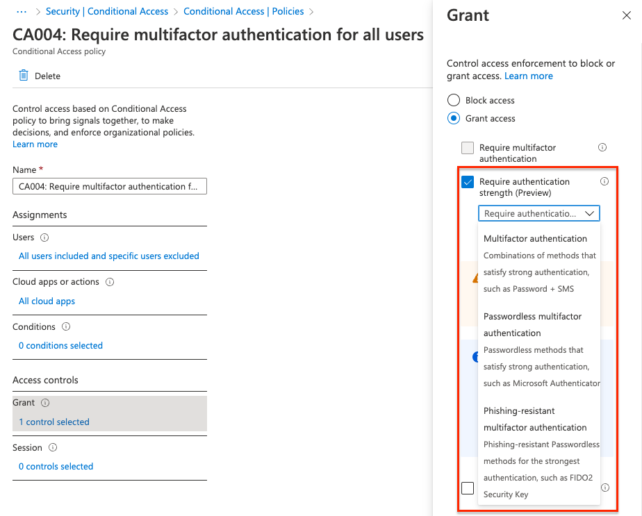
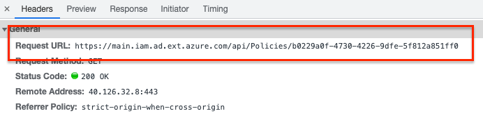
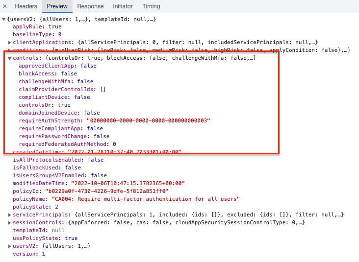
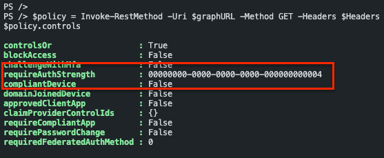
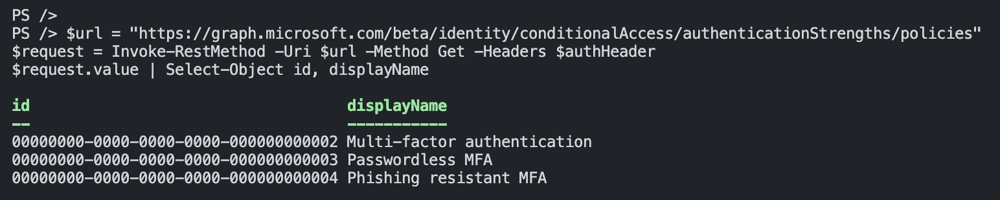
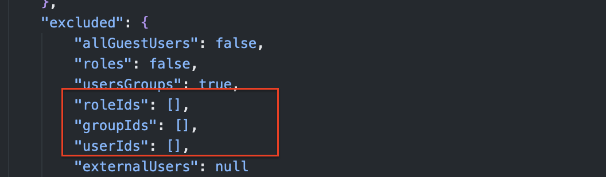
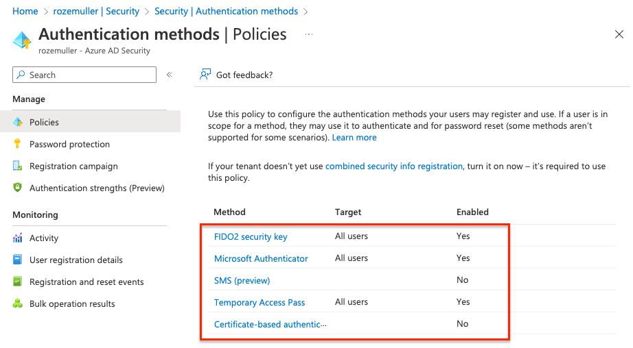

Conditional access is an indispensable configuration setting in Azure AD. Conditional Access policies are in basic if-then statements, if a user wants to access a resource, then they must complete an action. Example: A payroll manager wants to access the payroll application and is required to do multi-factor authentication to access it. Or, it requires everyone to use multifactor authentication. Multifactor authentication can be a password in combination with an SMS or the use of the Microsoft Authenticator app for example. 
In the past, a user can choose to use SMS or the authenticator or what the admins provide you to use.

Now it is also possible to configure a setting called *Require authentication strength*. This new setting is in preview now. In this blog post, I show how to configure and monitor this setting in a conditional access policy.



## Require Authentication Strength Conditional Access policy
The required authentication strength setting can be used to force users to use a specific set of authentication methods. For example, all admins MUST use a biometric device and end-users must use the Microsoft Authenticator. In this case, you have to create two conditional access policies and assign them to the correct user group. For the admin group, you have to select the Phishing-resistant multifactor authentication. For all end-users select the Passwordless multifactor authentication. 




## Deploy conditional access policy automated
To deploy a conditional access policy automated with the new authentication strength option, the process is a bit different from the 'normal' Graph API deployments. After screening what is happening in the background I noticed there is no Graph API endpoint available (yet) for conditional access policies and access controls.  

To deploy a conditional access policy automated with controls we need the *https://main.iam.ad.ext.azure.com/api/* URL.   



This is because the Graph API endpoint has no control object available. (https://learn.microsoft.com/en-us/graph/api/conditionalaccesspolicy-get?view=graph-rest-beta&tabs=http)  
It has the ```grantControls``` object but the authentication strength is missing.



### Authenticate to main.iam.ad.ext.azure.com
To use this hidden API you MUST log in with a user for the first time. Based on the login and user_impersonation make sure you receive a refresh token. This token can be used to reauthenticate later interactively without providing credentials.   
Make sure you put the token in a safe place!! (Azure KeyVault for example).  
A refresh token has a 90-day lifetime. If the token is used it refreshes (as the name says) to a new token that needs to be stored again.

Inspired by [Jos Lieben`s script](https://www.lieben.nu/liebensraum/2020/04/calling-graph-and-other-apis-silently-for-an-mfa-enabled-account/), I created a script that creates an access token and the refresh token based on a device login.
The script is stored on my GitHub. https://github.com/srozemuller/Identity


### Request conditional access policies
The Graph API has an endpoint for conditional access policies but I use the main.iam.ad.ext.azure.com API for this task as well because I only have to authenticate once. 
To get the conditional access policies I used the API URL below.

```powershell
$mainIamUrl = "https://main.iam.ad.ext.azure.com/api/Policies/Policies?top=10&nextLink=null&appId=&includeBaseline=true"
(Invoke-RestMethod -Uri $mainIamUrl -Method GET -Headers $Headers ).items
```  

The ```$headers``` variable is filled by the script.

When having the correct policy ID use the API URL below.

```powershell
$resource = "https://main.iam.ad.ext.azure.com"
$graphURL = "{0}/api/Policies/5a766b5b-fbcf-4480-bb6f-8bee83b73c83" -f $resource
$policy = Invoke-RestMethod -Uri $graphURL -Method GET -Headers $Headers
$policy.controls
```



### Authentication strength values
The values returned are GUID`s. Every GUID represents a setting. Although there is no option to get the required authentication strength from the Graph API, there is a resource type called ```authenticationStrength```. https://learn.microsoft.com/en-us/graph/api/resources/authenticationstrength?view=graph-rest-beta  

I requested the Graph API endpoint https://graph.microsoft.com/beta/identity/conditionalAccess/authenticationStrengths/policies to get all available values.
The ```$authHeader``` variable is filled based on 


```powershell
$url = "https://graph.microsoft.com/beta/identity/conditionalAccess/authenticationStrengths/policies"
$request = Invoke-RestMethod -Uri $url -Method Get -Headers $authHeader
$request.value | Select-Object id, displayName
```



#### Required authentication strength ID`s
|id|displayname|description|
|--|--|--|
|00000000-0000-0000-0000-000000000002|Multi-factor authentication|Combinations of methods that satisfy strong authentication, such as a password + SMS|
|00000000-0000-0000-0000-000000000003|Passwordless MFA|Passwordless methods that satisfy strong authentication, such as Passwordless sign-in with the Microsoft  Authenticator|
|00000000-0000-0000-0000-000000000004|Phishing resistant MFA|Phishing-resistant, Passwordless methods for the strongest authentication, such as a FIDO2 security key|

### Create a conditional access policy with authentication strength
Let's say we have a situation where administrators MUST use a biometric device to authenticate. In that case, I create a conditional access policy with authentication strength with *Phishing resistant MFA* (ID: 00000000-0000-0000-0000-000000000004). 

```powershell
$resource = "https://main.iam.ad.ext.azure.com"
$mainIamURL = "{0}/api/Policies/" -f $resource
$body = Get-Content ./Identity/ConditionalAccess/CA004-Require-multifactor-authentication-for-all-admins.json
$caPolicy = Invoke-RestMethod -Uri $mainIamURL -Method POST -Headers $Headers -Body $body
$caPolicy
```

The JSON file is stored in my GitHub repository. In the policy, all Azure Admin Roles are embedded. Make sure you also add an identity (break-glass account) to the exclude-part. This is to avoid lockout yourself. 

https://github.com/srozemuller/Identity/tree/main/ConditionalAccess




## Monitor conditional access policy required authentication strength
I would suggest using code like PowerShell to monitor resources behind the https://main.iam.ad.ext.azure.com endpoint. This is easier than using Logic Apps for example because of the authentication flow that does not support service principals.
Azure Functions could be a good option for monitoring.

A good monitoring option could be monitoring ADMIN policies that do not have a biometric strength configured. 
In that case, use the GET request to get all the policies and their information. 

Make sure you have the refresh token stored in the Azure Functions environment using the app service configuration. Point the configuration item to an Azure Keyvault secret. Every time the refresh token has been renewed, you should update the secret.

How to configure a monitoring environment using the hidden Azure API, will be discussed later. 

## Final words
This feature is still in PREVIEW. It is good to test with it but make sure you have a breakglass account. 

Another thing, make sure you have enabled the authentication methods as well. For example, when using phishing-resistant (FIDO2), make sure you have enabled the FIDO2 authentication method.  

**The conditional access policy does not check this for you!**

