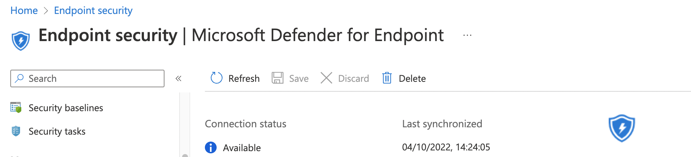

https://learn.microsoft.com/en-us/mem/intune/protect/advanced-threat-protection-configure

## Microsoft Intune Connection -> On

Find the if there is a connector already. Otherwise, create one.

```powershell
$url = "https://graph.microsoft.com/beta/deviceManagement/mobileThreatDefenseConnectors/fc780465-2017-40d4-a0c5-307022471b92"  #/fc780465-2017-40d4-a0c5-307022471b92
$request = Invoke-RestMethod -Uri $url -Method Get -Headers $authHeader
$request.value | ConvertTo-Json -Depth 9


$body = @{
  androidEnabled = $false
  iosEnabled = $false
  androidDeviceBlockedOnMissingPartnerData = $false
  iosDeviceBlockedOnMissingPartnerData = $false
  partnerUnsupportedOsVersionBlocked = $false
  windowsEnabled = $false
  partnerUnresponsivenessThresholdInDays = 6
} | ConvertTo-Json
$postRequest = Invoke-RestMethod -Uri $url -Method Patch -Headers $authHeader -Body $body
$postRequest
```




