I often write blogs about getting data with the Graph API and using it for monitoring. A while ago I was thinking about how to get my own data into Log Analytics.  
In this blog post, I show how to ingest custom MEM data into a Log Analytics table. I also show how to configure all components in an automated way.

I knew it was possible to create custom tables but it was only possible to ingest data from an extension, performance counters, Syslog, or Windows events as a source. Now I have REST API output. After some search in Microsoft Docs, I found an ARM template that allows me to create another type of data collection rule. That allows me to ingest data that come from any other resource.



## Situation

What is the situation? I have data grabbed with the Graph API. In my case, Microsoft Secure Score recommendation action information. I want to create workbooks that show that information. The data is not available out of the box and not with diagnostics settings.   
I need this custom data in Log Analytics.

### Architecture

The schema below shows what components I have and what is configured at the end of this blog. On the left, I have a task that grabs the information with the Graph API. A service principal is used for that. On the right side, we have Log Analytics and the data collection environment.   
The service principal from the grab script has also been permitted to use the Data Collection Rule.

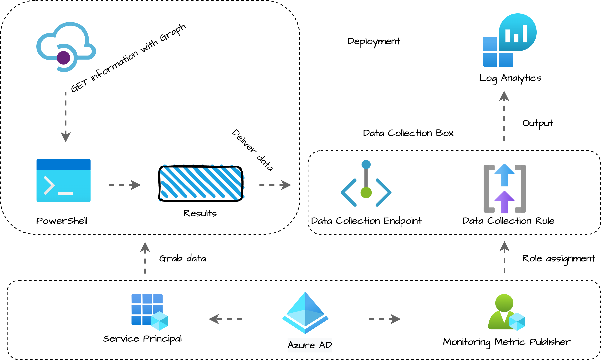

### Authentication

In this blog, different authentication layers will pass. To clarify, I divided these layers into three themes. Deployment, Grab and Deliver. In the deployment part, I use an Azure account with proper permissions to create resources. I connect with Connect-AzAccount and request a token. (See the code below)

```powershell
Connect-Azaccount
$tokenInfo = Get-AzAccessToken -ResourceUrl "https://management.azure.com"
$authHeader = @{
    Authorization = "{0} {1}" -f $tokenInfo.Type, $tokenInfo.Token
    ContentType = "application/json"
}

$subscriptionId = (Get-AzContext).Subscription
$resourceGroupName = 'rg-mem-monitoring'
```

In the Grab and Deliver layers I use a service principal with Graph API permissions to grab the data. In this blog, I use the same account to grab and deliver the data to Log Analytics.

## Before we start

I’m always excited when it comes to using the technique. But for now, hold your horses. Before we dive into the awesome techniques we first need to know what data we want in the table. However, data ingestion is the last step we need to think about the data first. Because the output decides how we have to build the environment.

### Get the data

In the example below I used data from one of [my earlier blogposts](https://rozemuller.com/monitor-identity-secure-score-security-improvement-action-status/). With the Graph API, I search for security improvement action statuses. This information is not available out of the box to monitor. In the blog post, I search for actions with an ignored state. For this example, I skip the ignore-state part and search for all statuses.

As you see, I want to output with a time, the ID, Title, Service, State, UpdatedBy, and, UpdatedDateTime. We have to create columns for that in our new custom table.

*This is the Grab layer, I used a service principal with the correct Graph API permissions.*

```powershell
$policies = Invoke-RestMethod @parameters
$allobjects = [System.Collections.ArrayList]@()
foreach ($pol in $policies.value) {
  $pol.controlStateUpdates | ForEach-Object {
    $object = [PSCustomObject]@{
      TimeGenerated   = $currentTime
      Id              = $pol.Id
      Title           = $pol.Title
      Service         = $pol.Service
      State           = $_.State
      UpdatedBy       = $_.UpdatedBy
      UpdatedDateTime = $_.UpdatedDateTime
    }
    $allobjects.Add($object) | Out-Null 
  }
}
```

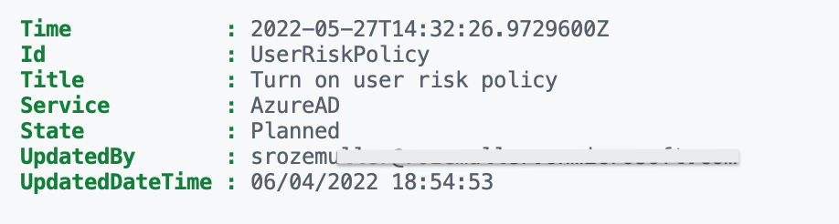

## Create a custom Log Analytics table

To store data, we use a Log Analytics Workspace. In LAWS we must create a new custom table. To create a custom table I use the REST API. Based on the data above, we create a table schema. Below I created a table schema with seven columns. The columns are based on the output above.

```powershell
$tableSchema = @(
  @{
    "name"        = "TimeGenerated"
    "type"        = "datetime"
    "description" = "The time at which the data was generated"
  }
  @{
    "name"        = "Id"
    "type"        = "string"
    "description" = "The policys name"
  }
  @{
    "name"        = "Title"
    "type"        = "string"
    "description" = "The policys title"
  }
  @{
    "name"        = "Service"
    "type"        = "string"
    "description" = "The which service belongs the policy"
  }
  @{
    "name"        = "State"
    "type"        = "string"
    "description" = "The new state"
  }
  @{
    "name"        = "UpdatedBy"
    "type"        = "string"
    "description" = "Who did the update"
  }
  @{
    "name"        = "UpdatedDateTime"
    "type"        = "datetime"
    "description" = "When did the updated happend"
  }
)
```


After we have exactly know what data to ingest we create a table with the code below. As you can see the $tableSchema is stored in the columns object. During the deployment, I store the output into the **$table** variable. We need some table information in later steps.

*This is the deployment layer. Use the Azure account to deploy.*

```powershell
$subscriptionId = (Get-AzContext).Subscription
$resourceGroupName = "rg-mem-monitoring"
$lawsName = "la-mem-workspace78433"
$tableName = "SecImpAction_CL"
$tableBody = @{
  properties = @{
    schema = @{
      name    = $tableName 
      columns = $tableSchema
    }
  }
} | ConvertTo-Json -Depth 10
$createTableParameters = @{
  uri     = "https://management.azure.com/subscriptions/{0}/resourceGroups/{1}/providers/Microsoft.OperationalInsights/workspaces/{2}/tables/{3}?api-version=2021-12-01-preview" -f $subscriptionId, $resourceGroupName, $lawsName, $tableName
  method  = "PUT"
  headers = $authHeader
  body    = $tableBody
}

$table = Invoke-RestMethod @createTableParameters
```


As you can see the table is created with the provided columns. Besides that, during deployment, Microsoft also put some extra columns into the table. These are standard columns. The table can be found under the Custom Logs component.

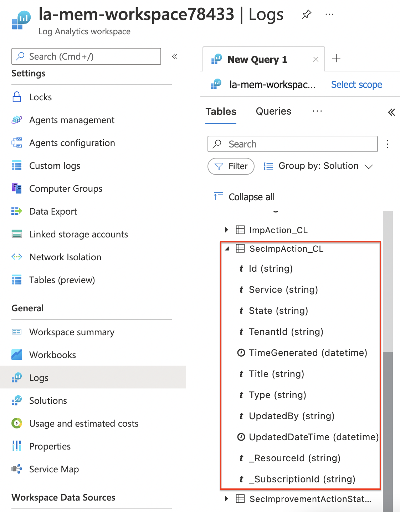
## Create a Data Collection Endpoint (Preview)

At the moment of writing, this feature is in preview. A DCE is a public endpoint to deliver logs. Every DCE has its own private endpoint URL and ID (*immutableId*). In the code below I create an endpoint and store the output in the $dce variable. Also from this variable we information in later steps.

*Also, this is a part of the deployment layer*.

```powershell
$dceName = "custom-dce"
$dceUrl = "https://management.azure.com/subscriptions/{0}/resourceGroups/{1}/providers/Microsoft.Insights/dataCollectionEndpoints/{2}?api-version=2021-04-01" -f $subscriptionId, $resourceGroupName, $dceName
$dceBody = @{
    Location = "WestEurope"
    properties = @{
        networkAcls = @{
          publicNetworkAccess = "Enabled"
        }
      }
} | ConvertTo-Json -Depth 5
$dce = Invoke-RestMethod -Uri $dceUrl -Method PUT -Headers $authHeader -body $dceBody
$dce
```

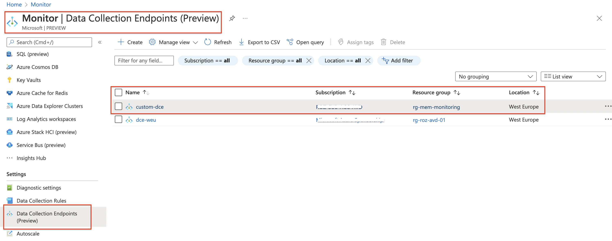

For more information about Data Collection Endpoints, [check the documentation](https://docs.microsoft.com/en-us/rest/api/monitor/data-collection-endpoints/create).

## Data Collection Rule

A data collection rule (DCR) is the most intelligent part and the data flow’s brain. A DCR can be compared with a network route table. It tells how to route your data to the next hop.

When creating a DCR through the portal we are a bit limited in resources. We only can select Azure resources. But there are options. We have the option to create a DCR with an ARM template. The DCR structure is quite simple. We have three components, a stream, a destination, and a data flow.

### Data collection structure in ARM

A stream has a name and a data structure called columns in ARM. The stream name is the stream identification. In the column part, you provide the custom table’s data structure. The column names must exactly match the table.

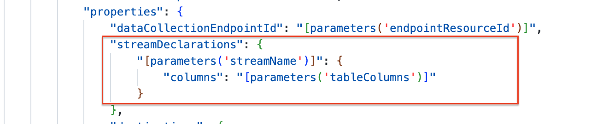
In the destination part, the rule must send the data to. Also, a destination has a name. In addition, it also has a Log Analytics part. You can send data to more than one workspace.

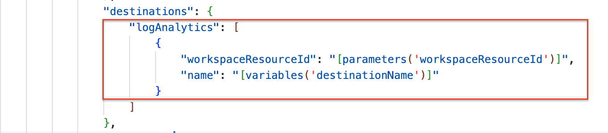
At last, we have the data flow. In a data flow, we configure the stream- and destination name (from previous steps). In the next part, we have a transform KQL part. We need to provide a Kusto Query on how the incoming data must be converted to the custom table. In my example, we have straight data. I try to provide clean data as much as possible (rubbish in is rubbish out). Withing the DCR the query converts the data and sends it to the output stream.

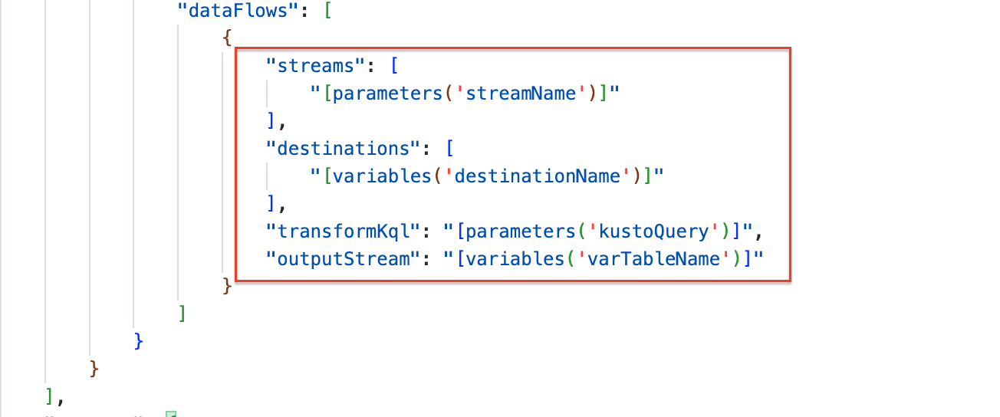
For more information about transformation, check the [transformation docs](https://docs.microsoft.com/en-us/azure/azure-monitor/essentials/data-collection-rule-transformations).

The stream name must begin with **Custom-** followed by the custom table name. To achieve that, I created a variable in the ARM template.

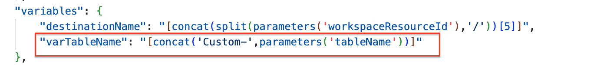
### Data Collection Rule deployment

I modified the template, to make the template suitable for automation. The template accepts extra parameters with data out of the variables in earlier steps. [The template is stored on my GitHub.](https://github.com/srozemuller/Monitoring/blob/main/CustomLogs/data-collection-rule.json) If you prefer the Azure portal, then use a custom deployment.

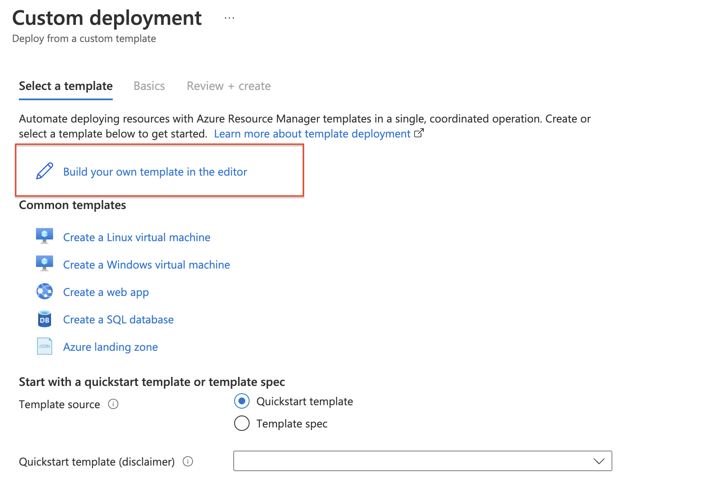
To deploy the data collection rule with an ARM template I used PowerShell. Download the template from my GitHub and store it in a good location. From that location run the code below.

(***Assuming you did the deployments at the first steps and stored the output in a variable)***  
First I grab the created columns from the table to use in the Kusto query. This is the query that converts the data to the output stream, which is the custom table. This is fully supported Kusto Query language. In the $columns variable I create a part of the Kusto query based on the columns in the custom table. Using the table output helps me create a Kusto query fully automated.

*Again, this is the deployment layer*.

```powershell
$columns = $([String]::Join(', ', ($table.properties.schema.columns | Select-Object name).Name))
$kusto = "source | project {0}" -f $columns
$dcrName = "secImprove-dcr"
$streamName = "Custom-new-stream"
$parameterObject = @{
  dataCollectionRuleName = $dcrName
  workspaceResourceId    = "/subscriptions/{0}/resourceGroups/{1}/providers/Microsoft.OperationalInsights/workspaces/{2}" -f $subscriptionId, $resourceGroupName, $lawsName
  endpointResourceId     = $dce.id
  tableColumns           = $tableSchema
  streamName             = $streamName
  tableName              = $tableName
  kustoQuery             = $kusto
}
$dcr = New-AzResourceGroupDeployment -resourcegroupname $resourceGroupName -Name $dcrName -TemplateParameterObject $parameterObject -TemplateFile ./data-collection-rule.json
```

I also looked to create a DCR with the REST API and custom data but got some errors that not every component is available at the REST API endpoint.

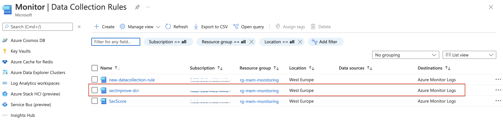
## Ingest your data

Till now we have created a custom table on a Log Analytics Workspace, created a public data endpoint to accept data, and, a data rule to map data from the outside on the correct table. At this point, we only have just one more thing to do before we are able to ingest data into the table. Setting permissions on the collection rule to the account which is ingesting data.

### Set permissions on DCR

To ingest data over the Data Collection Rule we need permissions. In the code below, a service principal is added with the Monitoring Metrics Publisher role. The ID in the code below is a fixed ID provided by Microsoft. To get a list of all build-in roles, check [the Azure build-in roles overview](https://docs.microsoft.com/en-us/azure/role-based-access-control/built-in-roles). The principal ID is the service principal’s object ID.

*This is also the deployment layer*

```powershell
$guid = (new-guid).guid
$monitorMetricsPublisherRoleId = "3913510d-42f4-4e42-8a64-420c390055eb"
$roleDefinitionId = "/subscriptions/{0}/providers/Microsoft.Authorization/roleDefinitions/{1}" -f $subscriptionId, $monitorMetricsPublisherRoleId 
$roleUrl = "https://management.azure.com/{0}/providers/Microsoft.Authorization/roleAssignments/{1}?api-version=2018-07-01" -f $dcr.outputs.datacollectionRuleId.value, $guid
$roleBody = @{
    properties = @{
        roleDefinitionId = $roleDefinitionId
        principalId      = "xxxxx-xxxx-xxxx-xxxx-xxxxxxx" # Service Principal object ID
        scope            = $dcr.outputs.datacollectionRuleId.value
    }
}
$jsonRoleBody = $roleBody | ConvertTo-Json -Depth 6
Invoke-RestMethod -Uri $roleUrl -Method PUT -Body $jsonRoleBody -headers $authHeader
```

### Push the data

Now it is time to push the data. We’ve got the data from the first chapter in this blog and sent it to the Data Collection Endpoint. Because the DCE is behind the monitor.azure.com endpoint, we need a new token. In the code block below I request a new token based on the same service principal as used in [the ‘get-the-data’-part](#get-the-data).

*This is the deliver layer, get a new token based on the service principal with Monitoring Metrics Publisher permissions.*

```powershell
$tenantId = "xxx"
$secMonAppId = "xxx"
$secMonAppSecret = "xxx"
$scope = [System.Web.HttpUtility]::UrlEncode("https://monitor.azure.com//.default")   
$body = "client_id=$secMonAppId&scope=$scope&client_secret=$secMonAppSecret&grant_type=client_credentials";
$headers = @{"Content-Type" = "application/x-www-form-urlencoded" };
$loginUri = "https://login.microsoftonline.com/$tenantId/oauth2/v2.0/token"
$bearerToken = (Invoke-RestMethod -Uri $loginUri -Method "Post" -Body $body -Headers $headers).access_token
```


After acquiring a token we pick up the body from [the ‘get-the-data’-part](#get-the-data). The output is stored in the $allobjects variable, which must be converted to a JSON format. In the URI, first, we pick up the output from the [Data Collector Endpoin](#create-data-collector-endpoint-restapi)t and [Data Collector Rule](#create-data-collection-rule). Secondly, we reuse the $streamName also from the Data Collector Rule deployment. This makes an URL like:

*https://new-custom-dce-xxx.westeurope-1.ingest.monitor.azure.com/dataCollectionRules/dcr-02cd4b7c9e5844e3b2xxxxxxx/streams/Custom-new-stream?api-version=2021-11-01-preview*

Then, we sent the data with REST API to the endpoint. Good to know that the REST API does not give a response. I mentioned that to the Microsoft team to investigate.

```powershell
$uploadBody = $allobjects | ConvertTo-Json
$uri = "{0}/dataCollectionRules/{1}/streams/{2}?api-version=2021-11-01-preview" -f $dce.properties.logsIngestion.endpoint, $dcr.Outputs.immutableId.Value, $streamName
$monitorHeaders = @{"Authorization" = "Bearer $bearerToken"; "Content-Type" = "application/json" };
$uploadResponse = Invoke-RestMethod -Uri $uri -Method POST -Body $uploadBody -Headers $monitorHeaders 
$uploadResponse
```

In the end, the data has arrived at the Log Analytics Workspace.

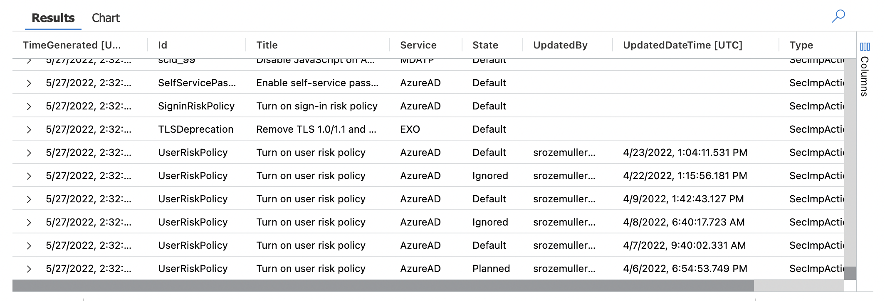
## Summary

In this blog post about how to ingest custom MEM data into Log Analytics based on Custom logs, I showed which components we need and how to implement an automated way. First, we looked at our data to create a custom Log Analytics table. After we created a table, we deployed a Data Collector Endpoint. The DCE is the 'outside' of Azure Monitor to send data to.

After the DCE deployment, we created a custom Data Collector Rule which routes data to the custom table. A DCR has a stream, destination, and a dataflow. We also set the Monitor Metrics Publisher role on the DCR.   
At last, we grabbed the data and sent it to the DCE.

### Keep in mind

There are a few things to keep in mind that I like to share.

- The custom Data Collector Rule is in preview;
- The data may take some time to be ingested, especially if this is the first time data is being sent to a particular table. It shouldn’t take longer than 15 minutes;
- The data ingestion input schema must exactly match the database schema. Otherwise, the data will not import;
- The table name must end with **\_CL**;
- The table must contain a column name **TimeGenerated**;

https://docs.microsoft.com/en-us/azure/azure-monitor/logs/tutorial-custom-logs

