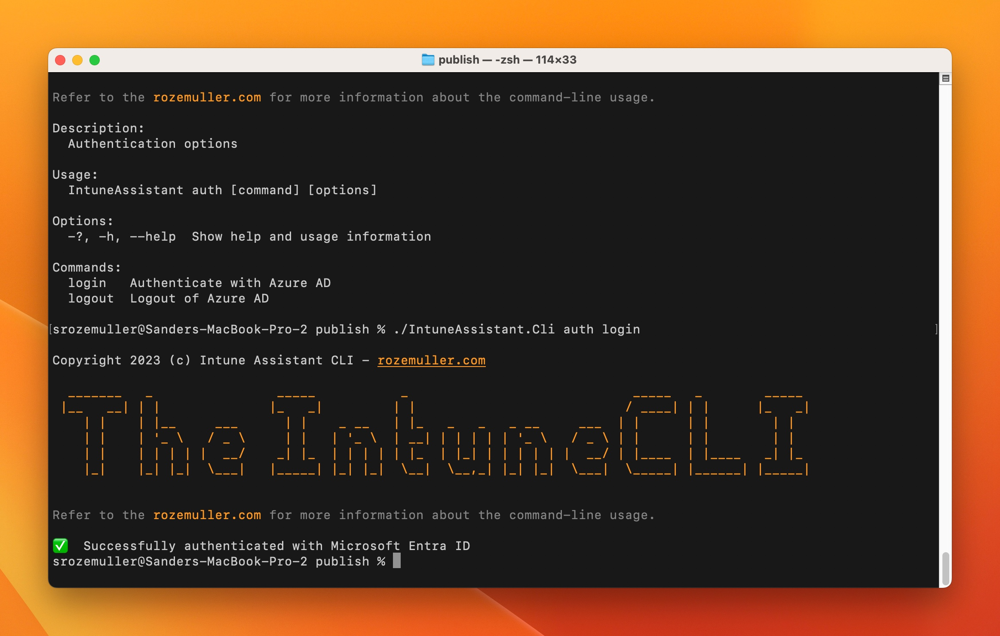
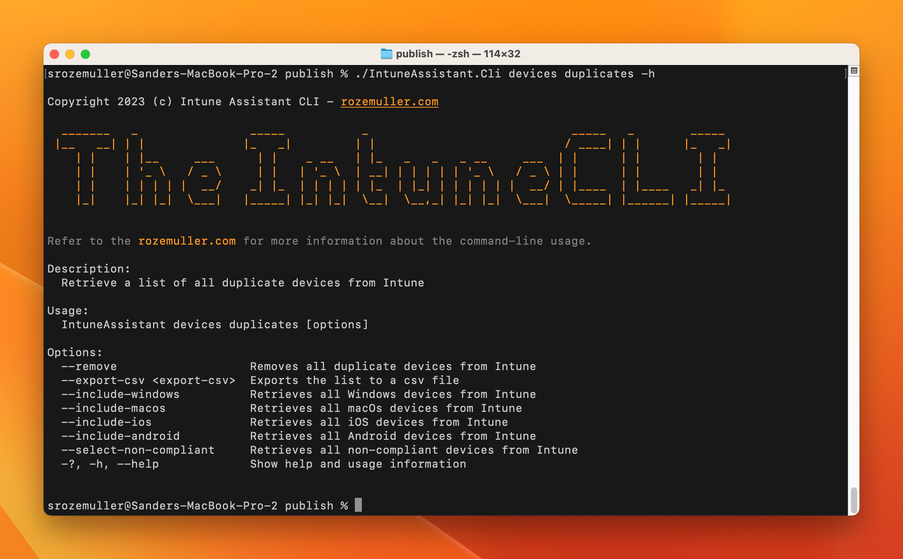
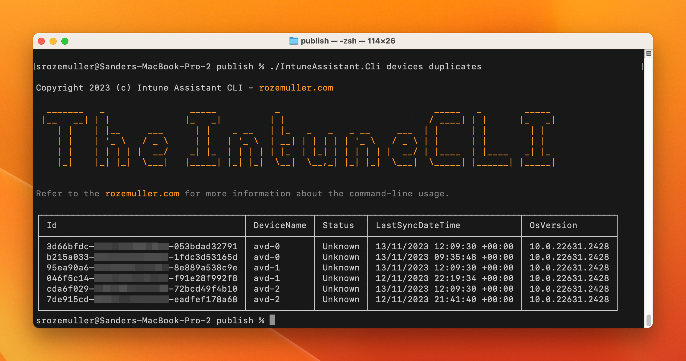
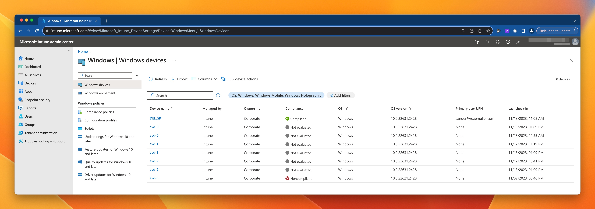

Managing Intune can be challenging, especially when having multiple Microsoft Intune environments. Because of that, I started project IntuneAssistant. A part of the project is a CLI tool that can run as a daemon in your own environment. 
In this small blog, I explain how to use the CLI and what are my thoughts for the future. 

The mean idea for now is to figure out it the tool is needed in the first place.



## The IntuneCLI
The IntuneCLI is the part in the IntuneAssistant project that helps you managing Intune in an automated way. 
At this moment a fews commands are available that helps you removing all duplicate devices from Microsoft Intune. 

### Authentication  
To authentication use this command. The command opens a browser for interactive login.  
  
```shell  
./IntuneAssistant.Cli auth login
```  
  
  
For now interactive login is supported. 
  
To log out use:  
```
./IntuneAssistant.Cli auth logout
```  

### Remove duplicate devices from Intune
An annoying thing are duplicate devices. It ruins reporting and your device view. This command helps you removing duplicate devices based on the Intune last sync date. The *MOST* recent device will remain.

The command has a few options to narrow selection, show the results, export and remove them.



The command below just show all duplicate devices. 
```
./IntuneAssistant.Cli devices duplicates
```

By providing the `--export-csv` parameter followed by the path and filename the list will be exported to a CSV file. 
When using the `--remove` command the export is made automated using app defaults.





The command below, saves the output to a CSV file. The file only contains the duplicate devices instead of all devices.
```
./IntuneAssistant.Cli devices duplicates --export-csv duplicates.csv
```
### Help  
If you need more information about all commands available use the `-h` option in a specific area.  
  
```  
./IntuneAssistant.Cli auth -h
```  
```  
./IntuneAssistant.Cli devices -h
```


## Future thoughts
This first step is a sort of tryout to determine if the CLI makes sense. If so, then I do have the following additions in mind:

- Export options in CSV, HTML, PDF, etc
- Full Microsoft Intune configuration export
- Devices missing from any compliance policy
- Devices with no mam policy 
- New apps available for MAM notification
- Automated filter evaluation check
- Update compliance policies base on OS build
- Automated Intune configurator based on templates

The list is just some thoughts I have, if you have any suggestion, please let me know.
## Download the CLI
In this very first version one small command is available to help you removing duplicate devices from Intune.  
The current version has two supported platforms, Windows and macOS.  
  
The Windows client can be downloaded here: [The IntuneCLI Windows](https://github.com/srozemuller/IntuneAssistant/tree/main/ClientDownloads/Windows)  
The macOS client can be downloaded here: [The IntuneCLI macOS](https://github.com/srozemuller/IntuneAssistant/tree/main/ClientDownloads/macOS)  


I hope the CLI makes sense and can help you managing Intune in an automated way. If you have any thoughts, ideas or feedback, please let me know using the socials or add an issue on the GitHub repository: https://github.com/srozemuller/IntuneAssistant


