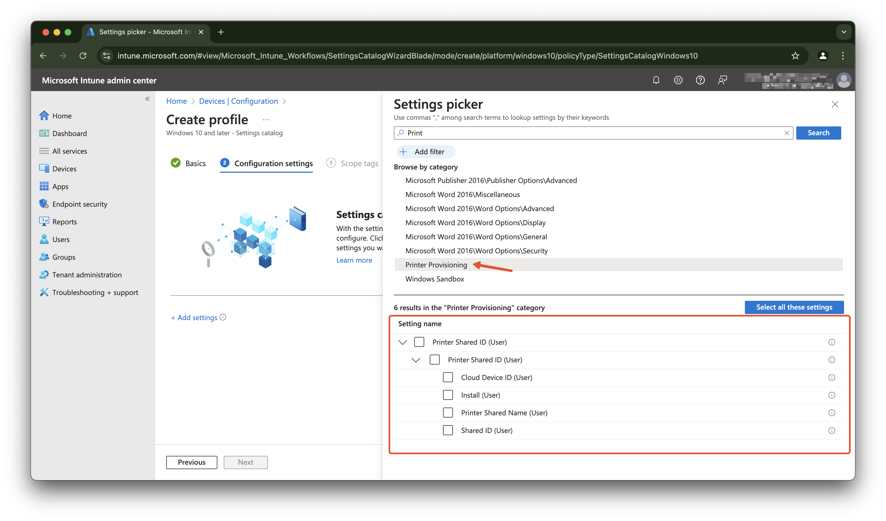
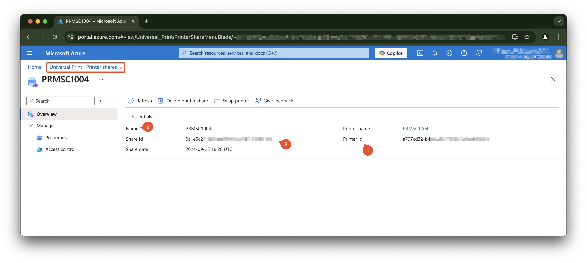
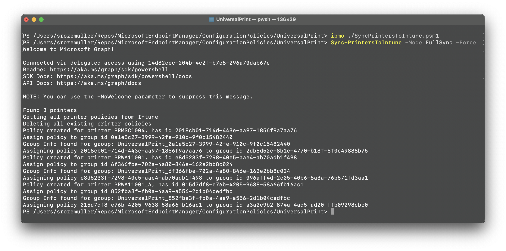
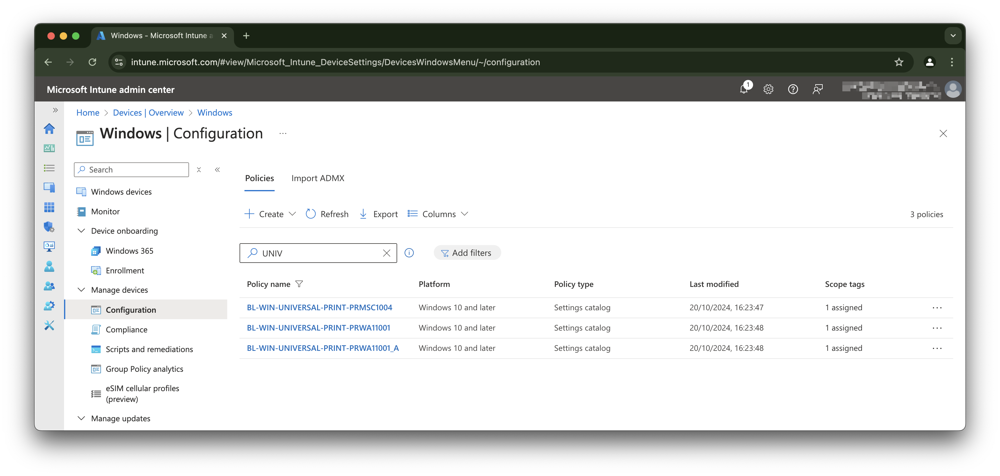

Universal Print is a cloud-based print solution that organizations can use to manage their print infrastructure through the Microsoft 365 cloud. Universal Print can also be managed through Intune. 

In this blog post, I show how to create Intune configuration policies based on Universal Print in an automated way. 



## Universal Print
As said, Universal Print is a cloud-based print solution. In basic your printers are configured in the Microsoft cloud. From there printer are configured like name and location. On the printer you are able to create shares. The printer shares are the endpoints where users connect to. On the shared it is possile to configure two release types, direct and secure. With direct print, the print job is immediately released at the printer after the user sends it. Secure release helps prevent waste from unnecessary printing and helps maintain user privacy by holding their jobs until they show-up at the printer.


### Print provisioning
To let users print to a printer, the printer needs to be configured on the user's device. This can be done manually by searching for devices and printers and add a printer. But this can also be done my using Microsoft Intune and configuration policies.

In the settings catalog there is a category called `Print Provisioning`. In this category, you can create a configuration policy that adds a printer share to the user's device.



In the setting you must configure the following settings:
- Cloud Device Id: Identifies the Universal Print printer, by its Printer ID. The printer's Printer ID can be found in the printer's properties via the Universal Print portal;
- Install: The option to install the printer on the device (the only option so far);
- Printer Shared Name: Identifies the Universal Print printer, by its Share Name. The printer's Share Name can be found in the printer's properties via the Universal Print portal.
- Shared Id: Universal Print printer shared id

The screenshot below shows the settings that need to be configured in the Intune configuration policy. 



For more information about the settings, see the [Universal Print Settings Catalog documentation](https://learn.microsoft.com/en-us/mem/intune/configuration/settings-catalog-printer-provisioning).

For more information about Universal Print, see the [Universal Print documentation](https://learn.microsoft.com/en-us/universal-print/discover-universal-print).

## The "thing" 
As you have read, it is possible to create a configuration policy in Intune that adds a printer share to the user's device. This by providing very specific information that can change over time. Think about the share name or printer name. 
When having a hand full of printers, managing Intune configuration policies is doable. For me the thing is I have hundreds of printers that are managed in Universal Print. And let me tell you, besides automating processes is fun, managing hundreds of printers in Intune is not doable :).

So, I want to automate the process of creating Intune configuration policies based on Universal Print.

The main idea is to fetch all printers from Universal Print, including the share information. Next is to create an Intune configuration policy for each printer (because of the printer location).

### Background information
The process explained in this post is based on the situation where I have of creating an Intune configuration policy for a printer is a manual process. The process is as follows:
The script I have created, creates a configuration policy for each printer. This is because every printer represents a location where users can print. The configuration policy is assigned to a group that represents the location. This way, the printer is available to the users who are in the group at that specific location.

Good to know is that:
- When creating a print share, an Entra ID group is created automated. The group is named `UniversalPrint_<printShareId>`. This group is also used to assign the configuration policy to;
- A printer can have only one share;


## Sync printers to Intune with PowerShell
The synchronize process Universal Print to Intune has three main steps:
- Get all printers from Universal Print including the share information;
- Create an Intune configuration policies;
- Assign the configuration policy to a group.

In the next sections, I will explain the steps in more detail.

### Authentication
In the script, I use the `Microsoft.Graph.Authentication` PowerShell module to authenticate with the Microsoft Graph API. The module is available in the PowerShell Gallery. 
The scopes used in the script are:
- DeviceManagementConfiguration.ReadWrite.All: Read and write all device configuration policies;
- Printer.Read.All: Read all printers information;
- PrinterShare.Read.All: Read all printer shares information;

Unfortunately, the printer scopes can have delegated permissions only. This means that the script runs under the user context and must have the correct permissions to read the printer and share information. 
When running the Sync-PrintersToIntune script, a browser window opens, and the user must log in with an account that has the correct permissions.

The service principal I use is the `Graph Commandline Tools` service principal. This service principal has the all correct Graph permissions, so also to read the printer and share information. The principal id is the same as in every tenant and is `14d82eec-204b-4c2f-b7e8-296a70dab67e`.

### Get all printers from Universal Print
The first step is to get all printers from Universal Print including share information. This can be done by using the Microsoft Graph API. The API endpoint to get all printers is `https://graph.microsoft.com/beta/print/printers?$expand=shares`. The response contains all printers, including the share information.

The code block below shows how to get all printers from Universal Print. I use the output type `JSON`. Other possible types are `Hashtable`, `HttpResponseMessage` and `PSObject`. Because I work with JSON all the time, I prefer to use the JSON output type. You could use the `PSObject` type if you want to work with PowerShell objects. This saves you from converting the JSON to a PowerShell object but converting JSON is fine for me and holds a single way of work.

By using the `$expand` query parameter, the response contains all printers, and adds an extra property in the resonse with the share information. 

```powershell
    try {
        # Get all printers and their shares using the $expand query parameter
        $apiUrl = 'https://graph.microsoft.com/beta/print/printers?$expand=shares'
        $results = Invoke-MgGraphRequest -Uri $apiUrl -Method GET -OutputType JSON
        $printers = $results | ConvertFrom-Json
        Write-Information "Found $($printers.value.length) printers" -InformationAction $informationPreference
    }
    catch {
        Write-Error "Unable to get printer information from Universal Print. $_"
    }
```

### Create an Intune configuration policy
The next step is to create an Intune configuration policy for each printer. The policy is based on the settings catalog. A setting catalog policy consists of some general policy properties and the settings that need to be configured. The settings that need to be configured are the `Cloud Device Id`, `Install`, `Printer Shared Name` and `Shared Id`.
In the script, I have created a `JSON` template in front and use `Regex` to change the values in to correct ones. 
The placeholders in the template are:

- `<!--policyName-->`: The name of the policy;
- `<!--description-->`: The description of the policy;
- `<!--printerId-->`: The printer's Printer ID;
- `<!--printShareName-->`: The printer's Share Name;
- `<!--printShareId-->`: The printer's Share ID.

```json
        {
    "@odata.type": "#microsoft.graph.deviceManagementConfigurationPolicy",
    "name": "<!--policyName-->",
    "description": "<!--description-->",
    "platforms": "windows10",
    "technologies": "mdm",
    "roleScopeTagIds": [
        "0"
    ],
    "settings": [
        {
            "@odata.type": "#microsoft.graph.deviceManagementConfigurationSetting",
            "settingInstance": {
                "@odata.type": "#microsoft.graph.deviceManagementConfigurationGroupSettingCollectionInstance",
                "settingDefinitionId": "user_vendor_msft_printerprovisioning_upprinterinstalls_{printersharedid}",
                "groupSettingCollectionValue": [
                    {
                        "children": [
                            {
                                "@odata.type": "#microsoft.graph.deviceManagementConfigurationSimpleSettingInstance",
                                "settingDefinitionId": "user_vendor_msft_printerprovisioning_upprinterinstalls_{printersharedid}_clouddeviceid",
                                "simpleSettingValue": {
                                    "@odata.type": "#microsoft.graph.deviceManagementConfigurationStringSettingValue",
                                    "value": "<!--printerId-->"
                                }
                            },
                            {
                                "@odata.type": "#microsoft.graph.deviceManagementConfigurationChoiceSettingInstance",
                                "settingDefinitionId": "user_vendor_msft_printerprovisioning_upprinterinstalls_{printersharedid}_install",
                                "choiceSettingValue": {
                                    "@odata.type": "#microsoft.graph.deviceManagementConfigurationChoiceSettingValue",
                                    "value": "user_vendor_msft_printerprovisioning_upprinterinstalls_{printersharedid}_install_true",
                                    "children": []
                                }
                            },
                            {
                                "@odata.type": "#microsoft.graph.deviceManagementConfigurationSimpleSettingInstance",
                                "settingDefinitionId": "user_vendor_msft_printerprovisioning_upprinterinstalls_{printersharedid}_printersharedname",
                                "simpleSettingValue": {
                                    "@odata.type": "#microsoft.graph.deviceManagementConfigurationStringSettingValue",
                                    "value": "<!--printShareName-->"
                                }
                            },
                            {
                                "@odata.type": "#microsoft.graph.deviceManagementConfigurationSimpleSettingInstance",
                                "settingDefinitionId": "user_vendor_msft_printerprovisioning_upprinterinstalls_{printersharedid}_printersharedid",
                                "simpleSettingValue": {
                                    "@odata.type": "#microsoft.graph.deviceManagementConfigurationStringSettingValue",
                                    "value": "<!--printShareId-->"
                                }
                            }
                        ]
                    }
                ]
            }
        }
    ]
}
```
To replace the placeholders in the template, I use the `Regex` class. The `Regex` class is used to find and replace text in a string. The `Regex` class has a `Replace` method that replaces all occurrences of a specified pattern with another string. The pattern is defined by a regular expression.

In the example code below I change the description.
```powershell
$descriptionToken = "<!--description-->"
$description = "This policy adds the printer share to the user's device."
$jsonContent -replace [regex]::Escape($descriptionToken), $description
```

### Assign the configuration policy to a group
The last step is the policy assignment. To assign a policy to a group, you must have the group id and also the policy id. This is the reason I first create a policy with settings. The policy id is returned in the response. From there, I can assign the policy to a group using an assignments object. The assignments object contains the group id and assignment type.

To fetch the printershare group id, I have to search for a group that starts with `UniversalPrint_` followed by the printershare id. 

```powershell
$groupUrl = "https://graph.microsoft.com/beta/groups?`$filter=startswith(displayName,'UniversalPrint_{0}')&`$select=id,displayName" -f $PrinterShareId
$groupInfo = Invoke-MgGraphRequest -Uri $groupUrl -Method GET -OutputType JSON
$groupObject = $groupInfo | ConvertFrom-Json
```
I store the response in the groupObject to use in the assignment body. From there, I send the request to the print policy for assignment.

```powershell
 $groupId = $groupObject.value.id        
$assignment = @{
    "assignments" = @(
        @{
            "target" = @{
                "@odata.type" = '#microsoft.graph.groupAssignmentTarget'
                "groupId"     = "{0}" -f $groupId
            }
        }
    )
} | ConvertTo-Json -Depth 6
$assignPolicyUrl = "https://graph.microsoft.com/beta/deviceManagement/configurationPolicies/{0}/assign" -f $IntunePrintPolicyId
Invoke-MgGraphRequest -Uri $assignPolicyUrl -Method POST -Body $assignment
```

## How to use the script
The script is available on my GitHub repository. You can find the script [here](https://github.com/srozemuller/MicrosoftEndpointManager/blob/main/ConfigurationPolicies/UniversalPrint/SyncPrintersToIntune.psm1)
I made the script so that it can be used as a module. Just import the script using `Import-Module .\Sync-PrintersToIntune.psm1` and run the `Sync-PrintersToIntune` function.

The script has a few parameters that need to be set. The parameters are:
- AccessToken: If you have an access token already, then provide this token. If not, the script will open a browser window to authenticate;
- Mode: This can be 'Create', 'Update', 'FullSync'. Create mode will create new policies (leaves existing policies), Update mode will update existing policies (does not create), FullSync will DELETE all universal print polices and create new policies.
- Force:  If FullSync mode is used, the Force switch will delete all existing policies without confirmation.





