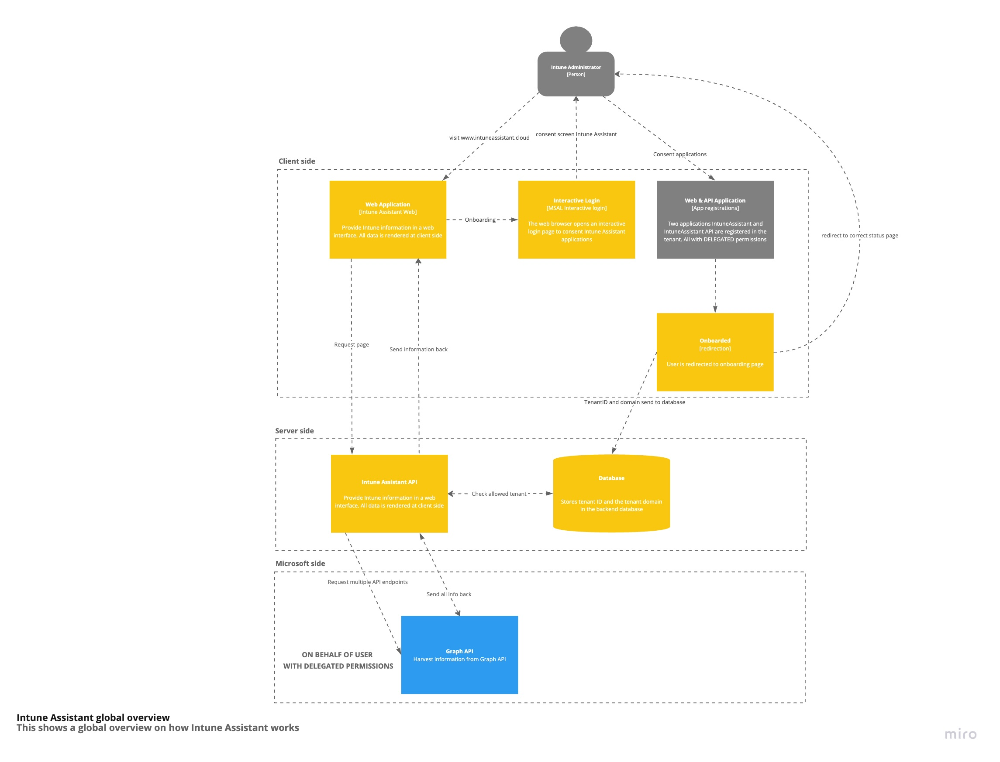
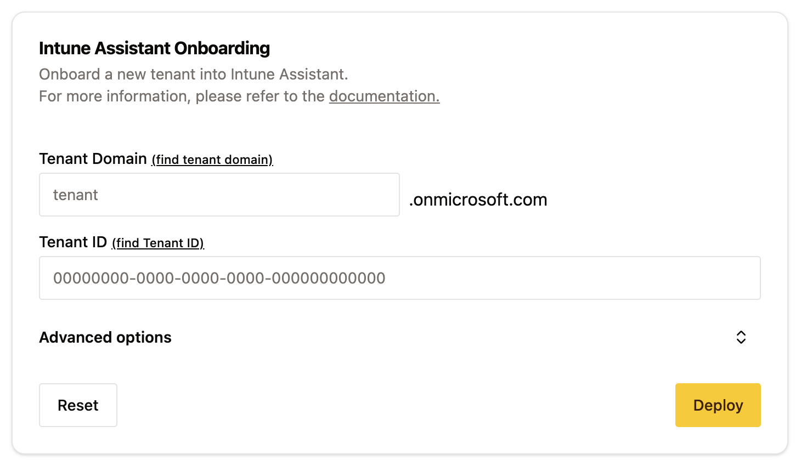
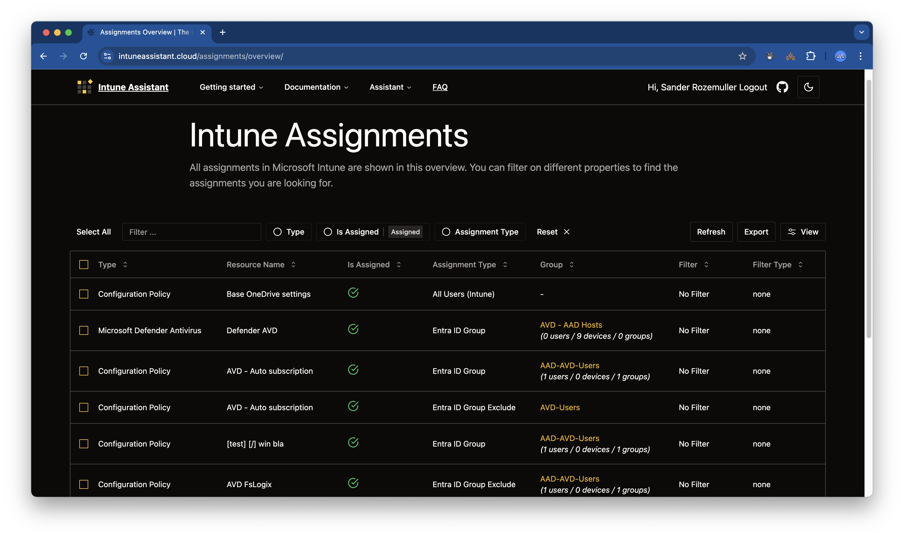
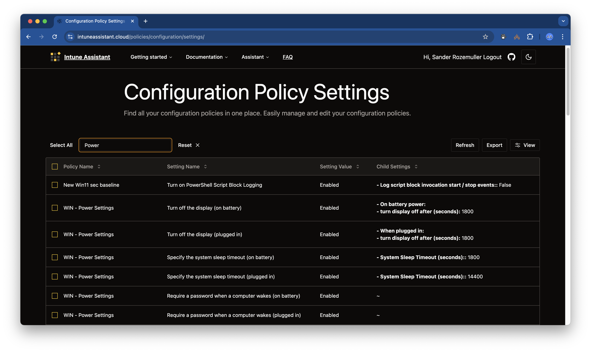

Microsoft Intune becomes more and more important in the modern workplace. It is used to manage devices, applications, and users. More and more resources are available in Intune. To make resources work, you need to assign them. Finding assignments in Intune is a hard job. Another thing is that resources consist of settings, think about configuration profiles, compliance policies, and more.
To get more insights into Microsoft Intune assignments, the configured settings and more, I created a tool to help you with this. The tool is called Intune Assistant. 
In this blog post, I will show you what Intune Assistant is and how it can help you with your daily work.



## What is Intune Assistant?
Intune Assistant is the web-based tool that helps you to get insights into your Microsoft Intune environment. The main idea behind Intune Assistant is to get an overview of all assignments in your Intune environment. This includes all assignments for configuration profiles, compliance policies, and more.
In the meantime the tool is growing and more features are added. You can find the it [here](https://intuneassistant.cloud).

## How does it work?
As mentioned, Intune Assistant is the webinterface. Behind the scenes al lot is happening. The whole platform consists of multiple layers. The main layers are:
- The webinterface Intune Assistant ([IntuneAssistant.cloud](https://intuneassistant.cloud))
- The Intune Assistant API
- The Microsoft Graph API

### Components
The webinterface is the place where you can find all the information. This is a react page where all the information is presented at.

The Intune Assistant backend API is the place where all the magic happens. All the logic is at the layer where all the requests are handled between the uesr interface (Web & CLI) and the Microsoft Graph API. The Microsoft Graph API is the place where all the data is stored. The backend API is responsible for getting all the data from the Microsoft Graph API and returning it to the user interface.

## How Intune Assistant interacts in your environment
The Intune Assistant platform has two main layers. These are the user interface and the Intune Assistant API. Both layers are responsible for different tasks and works individually. To use Intune Assistant you need to install two applications in your tenant. 
These are the Intune Assistant application and the Intune Assistant API application. Both has their own permissions and are responsible for different tasks. To make it as simple as possible, I created an onboarding page to help you consenting the applications and get started with Intune Assistant.

### Onboarding
The onboarding process is quite simple, at the (onboarding page)[https://intuneassistant.cloud/onboarding/] you are asked for a tenant ID and tenant domain. From there you will be redirected to your tenant and asked to consent the IntuneAssistant application. After consenting the application two enterprise applications are added to your tenant. The Intune Assistant application (0f0f930f-a5c7-4da2-a985-8464d1ff51d0) and the Intune Assistant API application (6317a049-4e55-464f-80a1-0896b8309fec).

After succesful onboarding you will be redirected to the Intune Assistant application. From there you can start using the application.

For more information about the onboarding process, please visit the [documentation page](https://intuneassistant.cloud/docs/web/getting-started/onboarding).

### Permissions
Before onboarding the Intune Assistant application, it is important to know what permissions are needed.
First important thing to know is that the Intune Assistant needs only **READ** permissions to read data from your tenant. All permissions are delegated, that means that Intune Assistant and the rest of the platform is acting on behalf of the logged-in user. 

The delegated permissions that are needed are:

- **DeviceManagementApps.Read.All** -> Read Microsoft Intune apps
- **DeviceManagementConfiguration.Read.All** -> Read Microsoft Intune Device Configuration and Policies
- **Directory.AccessAsUser.All**-> Access directory as the signed in user
- **Group.Read.All** -> Read all groups
- **Policy.Read.All** -> Read your organization’s policies
- **User.Read** -> Sign in and read user profile
- **User.Read.All** -> Read all users’ full profiles

The permissions are needed to read the data from your tenant. The Intune Assistant does not write any data to your tenant. The permissions are needed to read the data from your tenant and present it in the Intune Assistant application. 

The second important thing is that the Intune Assistant does not store any sensitive data from your tenant. The only thing Intune Assistant needs is the tenant ID and tenant domain. 
All the information is presented in your browser. The data is only stored is the session of the user that is logged in at client side. When the user logs out the data is removed from the session.

### Authentication
When a user logs in to the Intune Assistant Web interface, the user authenticates with the Intune Assistant application. The Intune Assistant application has permissions to use the API application. The API application is responsible for getting the data from the Microsoft Graph API. 
When a user goes to a page in the Intune Assistant Web interface, the Intune Assistant Web interface interacts with Intune Assistant API.
From there the IntuneAssistant API uses the Microsoft Graph API to read the data from your tenant.

The authentication flow has two steps. The first step is to authenticate with the IntuneAssistant enterprise application. This enterprise application has exposed an API. 
The second step is to authenticate on behalf of the user with the Microsoft Graph API. The step is done by the Intune Assistant API application.

## Features
Currently the following features are available already in the Intune Assistant:
- Assignments overview with export options
- Configuration policy overview
- Configuration policy settings overview
- Conditional access policy overview including assignments

For more information about Intune Assistant please check the [documentation](https://intuneassistant.cloud/docs/general/authentication/).

If you have any question, suggestion, feedback or something else, please let me know. You can reach me on [BlueSky](https://bsky.app/profile/sander.rozemuller.com) or [LinkedIn](https://www.linkedin.com/in/srozemuller/).

Parts of the project are open source and can be found on [GitHub](https://github.com/srozemuller/IntuneAssistant). If you like it that much, please star the project ⭐️.
I hope it helps you with your daily work.

 