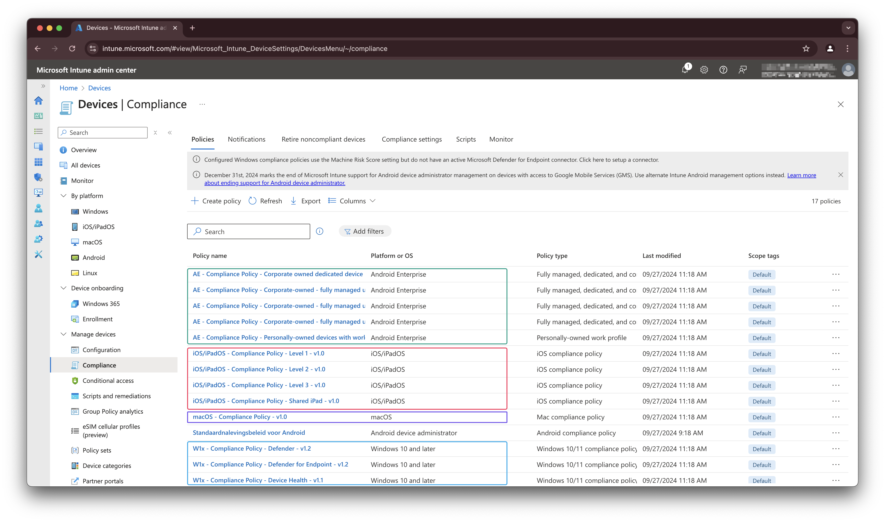

This article is based on a [post of my good friend Kenneth van Surksum](https://www.vansurksum.com/2025/01/07/governing-os-versions-in-microsoft-intune-best-practices-and-configuration/). He has written as good blog post about how to govern OS versions in your environment with the use of Microsoft Intune. 

In Microsoft Intune there is a good way to avoid old OS versions in your environment.
Kenneth's article describes how to set up those ways using the portal, in this article, I explain how to deploy those settings but also how to maintain those settings in an automated way. 


This blog moving point is that you have two assigned compliance policies per operating system (Windows 10, Windows 11, Android). Those two policies per OS handles compliance handles the checks for OS build numbers. The build numbers are already filled in.
Of course, you can have more other compliance policies per operating system.


## Components
To set your OS version base level two components are leading: 
- Compliance policies
- Device platform restriction policies

The main difference between those two are that compliance policy works for devices that are already in Intune where the device restriction policy kicks in before a device comes into Intune. See it as a sort of gatekeeper. 

In the upcoming parts we first take a look how to implement these components in an automated way. To do this I use the Graph API in the first place. 

### Create Intune compliance policies automated
Creating compliance policies is a bit strange thing in Intune using the Graph API. This is because compliance policies are categorized in multiple types, Windows, Android, iOS, macOS but all use the same endpoint. That means that based on the provided body, Graph knows what policy type it is. 

A widely used configuration is having two compliance policies per platform. The first one is marking non-compliant after a grace period (14, 30 days) and one marking non-compliant immediately. 
For the grace period policy, we use the buildnumber n -1 and immediately n -2. All based on your current devices inventory. 



To create Intune compliance policies in an automated way you need the `/deviceManagement/deviceCompliancePolicies` endpoint. 
Because this is a global endpoint for all device compliance policies you have to specify the correct policy type. Currently, the following policy types are available:

| Type                                                | Platform             | Platform type                                              |
|-----------------------------------------------------|----------------------|------------------------------------------------------------|
| #microsoft.graph.windows10CompliancePolicy          | Windows 10 and later | Windows 10/11 compliance policy                            |
| #microsoft.graph.androidDeviceOwnerCompliancePolicy | Android Enterprise   | Fully managed, dedicated, and corporate-owned work profile |
| #microsoft.graph.androidWorkProfileCompliancePolicy | Android Enterprise   | Personally-owned work profile                              |
| #microsoft.graph.iosCompliancePolicy                | iOS/iPadOs           | iOS compliance policy                                      |
| #microsoft.graph.macOSCompliancePolicy              | macOS                | Mac compliance policy                                      |

**I have skipped the Android Device Administrator part, since it is deprecated since 1 January 2025.**


So, the `@odata.type`, the property that tells Graph which kind of resource it is, must be provided in the body. Otherwise, you will get an error like below.


The error code is `ModelValidationFailure` with the message `Cannot create an abstract class.`

With the code below you are able to create compliance policies with the OS minimum version in it. To make things clear, the code only sets the OS minimum version. To set the OS version, the `osMinimumVersion` property is used. This `osMinimumVersion` is a property that is available in every kind of policy. 

Just change the `@odata.type` to the correct policy type and you're all set.

```json
{
    "displayName": "Android Device Owner Compliance",
    "roleScopeTagIds": [
        "0"
    ],
    "@odata.type": "#microsoft.graph.androidDeviceOwnerCompliancePolicy",
    "scheduledActionsForRule": [
        {
            "ruleName": "",
            "scheduledActionConfigurations": [
                {
                    "actionType": "block",
                    "gracePeriodHours": 0,
                    "notificationTemplateId": "",
                    "notificationMessageCCList": []
                }
            ]
        }
    ],
    "deviceThreatProtectionRequiredSecurityLevel": "unavailable",
    "passwordRequiredType": "deviceDefault",
    "deviceCompliancePolicyScript": null,
    "osMinimumVersion": "1.0.0.0",
    "deviceThreatProtectionEnabled": false
}
```


## Govern OS version in an automated way
Providers like Microsoft, Apple or Android continue to improve their operating systems. If a new version comes out the build number changes. Build numbers are internally used numbers and represents a specific OS version. That could result in numbers that do not follow up by 1. In the basic a build number does not tell how old a specific OS is. So it is crucial to govern OS build numbers in your environment and make sure build number configurations are growing with the device environment.

Example, we have a Windows 11 environment. In meantime (at moment of writing) Windows 11 has three build numbers: `22621.4602` (22H2), `22631.4602` (23H2) and `26100.2605` (24H2). Buildnumber `22621.4602` is available since 2022-09-20 which is more than two years old from now. Looking at the number itself it does not tell how old it is. But you want to avoid this buildnumber is entering your environment in the first place and make sure your current environment is up-to-date as well. 

Source I used: https://learn.microsoft.com/en-us/windows/release-health/windows11-release-information

Of course, this is for every OS type.

In the next steps, we will walk through the automation logic how to make sure your OS build numbers are updated automatically in your policies.

### Automation philosophy
The main idea of this automation is that the policies with build numbers are updated with the n -1 and n -2 build numbers based on your devices inventory. 

That means that the automation task searches for all OS platform types first, and then, per type it calculates the n -1 latest's build numbers. 
The reason why n -1 is because of the most update strategies do not update all devices at once. When updating policies based on the latest OS build, only the first ring is compliant. 

After that, the automation task fetches all compliance policies based on the platform and searches for the correct compliance policies. Then it updates the policies with the correct build numbers. 

Considering the device's platform is Windows 11. 
The process searches for all Windows10 (yeah) policies, picking those where a filter is configured for Windows 11, where a grace period is configured and where a build number is configured.
The n-1 policy is the policy that has a grace period. The n-2 policy is the policy that has grace period of 0 days.


This automation task only works when having your update process in place. That means you have configured your update strategy in Intune that updates the devices. That means build numbers are changing all the time. 



### Automation
In the examples below, I use the Microsoft.Graph.Authentication PowerShell module.
Install the module using the command below.
```powershell
Install-Module Microsoft.Graph.Authentication -Repository psgallery    
```

### Get OS build numbers per device
To keep the blog post as short a possible we only will walk through the Windows platform. All other platforms work in the same way.  

The first step is to fetch all devices per OS type and calculate the n -1 and n -2 latest builds. To fetch all devices categorized by type, use the `/deviceManagement/managedDevices` endpoint.  
Use `?$filter=operatingSystem eq 'Windows'&$select=id,operatingSystem,deviceType,osVersion` to fetch the correct devices for every context.  

The whole endpoint make then:  

`https://graph.microsoft.com/beta/deviceManagement/managedDevices?$filter=operatingSystem eq 'Windows'&$select=id,operatingSystem,deviceType,osVersion`


In this filter, we filter on the `Windows` operatingSystem. To keep the data a clean as possible, I only select the `id`,`operatingSystem`,`deviceType` and the most important `osVersion`. The `osVersion` is the one that is the value which is in the policies. 
Other available operating system types are `Android`, `iOS`, `macOS`. As mentioned earlier, the macOS operating system is not supported yet regarding the device platform restriction.


The results of the Windows filter are in the list as shown in the screenshot. 


To fetch all devices, including next pages, I used the command below. This command fetches all Windows machines.

```powershell
$platform = "Windows"
$devices = [System.Collections.ArrayList]::new()
$url = "beta/deviceManagement/managedDevices?`$filter=operatingSystem eq '{0}'&`$select=id,operatingSystem,deviceType,osVersion" -f $platform
$results = Invoke-MgGraphRequest -Method GET -URI $url -OutputType PSObject
$results.value.Foreach({
    $devices.Add($_) >> $Null
})
do {
    $url = $results.'@odata.nextLink'
    $results = Invoke-MgGraphRequest -Method GET -URI $url -OutputType PSObject
    $results.value.Foreach({
    $devices.Add($_) >> $Null
})
}
while ($results.'@odata.nextLink')
```

Now we have a list with all devices in the `$devices` variable we can calculate the n -1 build version. 
To find the second-highest value in the list, we select the `$devices.osVersion` property.  
This selects all the `osVersion` values in the list. 
The command below sorts all the os version with the highest above. Then it selects all unique values. That results in a smaller list representing unique OS versions. At last, it selects the second value in the whole list. 

The reason why sorting in descending way it is make sure the highest value is always on top of the list. You don't know how long a list is at the end. The only thing you know there is a list.
Example: if you have a list with 10 OS version and want to select row `[9]` but if the list is 1000 then select `[999]`. If you sort descending than you always can select `[1]`. 

In PowerShell an array starts with 0, so the second value is 1. 

```powershell
$secondHighest = ($devices.osVersion | Sort-Object -Descending | Select-Object -Unique)[1]
$thirdHighest = ($devices.osVersion | Sort-Object -Descending | Select-Object -Unique)[2]
```

In the screenshot below I showed the result of the above command, as the unique list.  


When sending a GET request to this endpoint all compliance policies are returned.

This is also a good example when NOT selecting the n -1 value and not having your update strategy in place. A lot of build numbers are there. When updating the policies to n -1 based on this list will result in a lot of non-compliant devices. So make sure you have a patched your environment in a proper way. 

When having a situation like above, you could choose to use n -x.
Then change the `[1]` to `[x]` where x represents a higher value. 

## Compliance policies
The next step is to update the compliance policies with the correct build numbers. In this case, we only update the Windows compliance policies.
A little background information about the strategy. An Intune configuration can have multiple compliance policies per operating system (OS).  
The strategy is to have two compliance policies per OS that handles build numbers. One policy with a grace period of n-days and one with a 0-day grace period. The grace period is a period where a device is marked as non-compliant but still has access to the resources. The non-grace period is a period where a device is marked as non-compliant and has no access to the resources.
These two policies are a kind of general policies that holds the device properties. 

On top of that you add more policies for Defender, Device Health and other security related policies.
The policy with the device properties and hold the build numbers are the policies we are after at. 

### It's all about the filters
The most important thing in this strategy is the filters. Especially for the Windows platform. This is because for the Intune background it does not matter if it is a Windows 10 or Windows 11 device when it comes to compliance. But there is a big different regarding build numbers.  
Both compliance policies are the same and relies on the same platform type `Windows10AndLater`.  

I have seen many situations having a mixed fleet, where Windows 10 and Windows 11 devices are in the same environment. 
To avoid non-compliant Windows 10 devices after updating build numbers, you should have two policies per OS version (10 and 11). In total makes that four policies. Then it all comes down to good targeting. In basic, the four policies are targeted to the same group where the filter differs.  


You should have two specific filters, for Windows 10 and Windows 11. Make sure that a filter only have the build numbers in it for that particular OS.  
So, don't mix the build numbers in one policy.


Example filter rules for Windows 10 and Windows 11:

- Windows 10 filter rule: `(device.osVersion -startsWith "10.0.1")` This handles all build numbers starting with 10.0.1 which represents Windows 10.
- Windows 11 filter rule: `(device.osVersion -startsWith "10.0.2")` This handles all build numbers starting with 10.0.2 which represents Windows 11 (e.g. 10.22xx and 10.26xx)

Check all the build information at the [Windows release information](https://learn.microsoft.com/en-us/windows/release-health/windows11-release-information) page at Microsoft Learn.

What I did is created those filters, created the four compliance policies. In the Windows 10 policy I added the minimum OS build as also in the Windows 11 policies. Both are targeted to the same group but with a different filter.

### Get device compliance policies
Now we have the correct version numbers, it is time to update the compliance policies where build numbers are in. In this case we search for the compliance policies. To fetch the policies you need the endpoint `/deviceManagement/deviceCompliancePolicies`. Just as mentioned above. As also mentioned, you need to provide the correct type to create a correct compliance policy. This is also happening when fetching the policies.

So, just requesting all the compliance policies results in a list with all policy types. In this case we ONLY need to update the correct (in this example Windows) platform policies. That means we need to fetch only that type. 
Now, back to the earlier mentioned `@odata.type`. Instead of providing the correct type, we now filter on that type using the URL below.

`https://graph.microsoft.com/beta/deviceManagement/deviceCompliancePolicies?$filter=(isof('microsoft.graph.windows10CompliancePolicy'))`  

Then the next thing is that we have two compliance policies, one with grace period and one without grace period. 
To fetch that information as well we need to expand some extra properties. 

`https://graph.microsoft.com/beta/deviceManagement/deviceCompliancePolicies?$filter=(isof('microsoft.graph.windows10CompliancePolicy'))&expand=assignments,scheduledActionsForRule($expand=scheduledActionConfigurations)`

Now we have all Windows compliance policies with their actions and assignments.


When having an optimized environment you should have two policies. The one that has a grace period and the one without grace period.

In PowerShell the code looks like this.

```powershell
$url = "https://graph.microsoft.com/beta/deviceManagement/deviceCompliancePolicies?`$filter=(isof('microsoft.graph.windows10CompliancePolicy'))&`$expand=assignments,scheduledActionsForRule(`$expand=scheduledActionConfigurations)"
$compliancePolicies = Invoke-MgGraphRequest -Method GET -URI $url -OutputType PSObject
```

### Get correct device compliance policy
The next step is to update the compliance policies. To update the correct we have to select the correct policy for each build number.
First select the policy with the grace period.

To find out the grace period configuration it is good to know how the rule configuration works.
In the screenshot below, I show a policy that has a grace period configured and also a send email configuration. 


When looking to the Graph response, the configuration looks like this.


As you can see, there are two objects. Take a look at the mark non-compliant setting and template ID GUID. This is an empty GUID. Which means it has no message template available. 
This is the object we need in the next check. 

When looking at the PowerShell command below. I search in the `compliancePolicies` object for a policy that has a `osMinimumVersion` filled in, `assignments` count is higher than 0 (which means there are assignments), and is must have a `gracePeriodHours` greater than 0 (otherwise immediately) including also a `notificationTemplateId` with the empty GUID (and empty GUID is always `00000000-0000-0000-0000-000000000000`).

The reason why we look for the empty GUID as well is because all the objects also have a `gracePeriodHours` object where you can put something in. So only the combination `gracePeriodHours` and empty GUID makes that specific rule. 

```powershell
$n1Policy = $compliancePolicies.value.Where({ 
    ($null -ne $_.osMinimumVersion) `
    -and ($_.assignments.Count -gt 0) `
    -and (($_.scheduledActionsForRule.scheduledActionConfigurations.gracePeriodHours -gt 0) -and $_.scheduledActionsForRule.scheduledActionConfigurations.notificationTemplateId -eq "00000000-0000-0000-0000-000000000000")
})
```

The policy fetching with the code above is the compliance policy you need for the n -1 scenario.  

For the n -2 scenario, you only have to change the code `-and ($_.scheduledActionsForRule.scheduledActionConfigurations.gracePeriodHours -gt 0)` into `-and ($_.scheduledActionsForRule.scheduledActionConfigurations.gracePeriodHours -eq 0)` (gt changes into eq).

### Update device compliance policy
The PowerShell code above stores the correct policy into `$n1Policy` variable. The only thing we need to do now is using the `$n1Policy.id` and send an update request (PATCH request) with the correct `osMinimumVersion` value and of course the policy type. 

```powershell
$body = @{
    '@odata.type' = $n1Policy.'@odata.type'
    osMinimumVersion = $secondHighest
} | ConvertTo-Json
$url = "https://graph.microsoft.com/beta/deviceManagement/deviceCompliancePolicies/{0}" -f $n1Policy.id
Invoke-MgGraphRequest -Method PATCH -URI $url -Body $body
```

## Device platform restriction
This part is a bit more complex than the compliance policies. The reason is that the device platform restriction policies are not directly linked to the devices. The device platform restriction policies are linked to device OS types like Windows, iOS or Android.
Updating build numbers in this kind of policy has dependencies. 

Sorry for saying but yes, it depends 🤷🏼.

I have seen configurations where the default policy has a restriction for all personal devices and allows a very low minimum build. For example when enrolling Cloud PC based on a marketplace image than can have a lower build.  
But also I have seen configurations where the default policy has a restriction for all personal devices and allows a very high minimum build because of security reasons or there are no older builds involved.

And, both is fine. In fact a platform restriction is the front door of your environment. It is the first thing a device sees when enrolling. The most important thing using this policy is that users only can enroll devices that are known by the tenant.
But, it is good to know that you are aware of the configured build numbers, so it is good to know what is configured.

### Houston???
Yes, we have a problem.  

As you can read above, it is not that necessary to update the device platform restriction policies in an automated way. And, I'm glad about that, because it is not possible to update the device platform restriction policies in an automated way 🤯.
Yes, I am right, it is only possible to fetch the policies using Graph API. 


It is **NOT** possible to update the policies using an app registration or a managed identity in basic. This has to do with tenant wide settings and RBAC in the backend. 

The error when updating, or creating, device platform restriction in Intune is:

`Tenant is not Global Admin or Intune Service Admin. Operation is restricted`

So, you are able to update the restriction policy only using an interactive script. Yes, there are other options but due complexity reasons I will write another blog for that specific item. 

### Get the device platform restriction policies
As mentioned before, we are able to fetch the policies using a service principal. That is where this paragraph is focussing on.
You can use the code below to fetch the device platform restriction policies. 

I use this endpoint to fetch the enrollment configurations: `/deviceManagement/deviceEnrollmentConfigurations?$expand=assignments`. This will result in different enrollment restriction types like `device limit` and `device enrollment`. In this scenario we need the device enrollment policies.  
We need to use another way to filter the correct resource. The `(isof... )` filter does not work here.  

To filter the correct device enrollment configuration types, I used this endpoint `/deviceManagement/deviceEnrollmentConfigurations?$filter=deviceEnrollmentConfigurationType eq 'singlePlatformRestriction'`
The filter fetches all device enrollment configurations that are platform restrictions or single platform restrictions.
The policy with the `platformRestrictions` type is the default policy.  


The policy with the `singlePlatformRestriction` type is a policy that is created by the user and specific for a platform.


To get both policy types, use the PowerShell command below. This results in all platform restriction policies of every platform type. 

```powershell
$url = "https://graph.microsoft.com/beta/deviceManagement/deviceEnrollmentConfigurations?`$filter=deviceEnrollmentConfigurationType eq 'singlePlatformRestriction'"
$restrictionPolicies = Invoke-MgGraphRequest -Method GET -URI $url -OutputType PSObject
$restrictionPolicies.value | Select-Object displayName, platformType,  @{Name="osMinimumVersion"; Expression={$_.platformRestriction.osMinimumVersion}},  @{Name="osMaximumVersion"; Expression={$_.platformRestriction.osMaximumVersion}}
```

```basic
displayName                    platformType   osMinimumVersion osMaximumVersion
-----------                    ------------   ---------------- ----------------
All users and all devices                                      
iOS n2 restriction             ios            18.2.1           
Windows Enrollment restriction windows        22621.4037       
Android restriction policy     android        14.0.0           
Android restriction policy     androidForWork     
```

## Bringing all parts together
In the above parts, I have explained how to fetch the correct devices and policies. Now it is time to bring all parts together using PowerShell.
The idea behind the script is to log in to the Graph API interactive (when no access token is provided), fetch all devices, calculate the n -1 and n -2 build numbers, fetch the correct compliance policies, update the policies. For the device platform restriction policies a warning is shown when build numbers are old but not updated.

When an access token is provided, that token will be used. This is very useful when running the script in a GitHub environment or in Azure (Automation or Function) as a managed identity.

### Resources parts
The first part in the script is the resources part. This part is used to load the resources, devices, filters and compliance policies. And, calculated the n -1 and n -2 build numbers. 

```powershell
#region resources

# Find the devices
$devices = GetDevices -platform $platform

# Finding OS Build numbers second highest
$secondHighest = ($devices.value.osVersion | Sort-Object -Descending | Select-Object -Unique)[1]
$thirdHighest = ($devices.value.osVersion | Sort-Object -Descending | Select-Object -Unique)[2]

# Find the specific filter
$platformFilter = GetFilters -platform $platform

# Find device compliance policy by platform
$compliancePolicies = GetCompliancePolicies -platform $platform

# Find platform restriction policy by platform
$restrictionPolicies = GetCompliancePolicies -platform $platform
#endregion 
```

### Update compliance policies
The next part is the update compliance policies part. This part is used to update the compliance policies with the correct build numbers. 
In the snippet below, you see the N -1 policy.
```powershell
 #region compliance policy updates
##### N -1 policy handling with grace period
# This is the policy that allows not that old machine having a grace period
$n1Policy = $compliancePolicies.value.Where({ 
    ($null -ne $_.osMinimumVersion) `
    -and ($_.assignments.Count -gt 0) `
    -and (($_.scheduledActionsForRule.scheduledActionConfigurations.gracePeriodHours -gt 0) `
    -and $_.scheduledActionsForRule.scheduledActionConfigurations.notificationTemplateId -eq "00000000-0000-0000-0000-000000000000") `
    -and $_.assignments.target.deviceAndAppManagementAssignmentFilterId -eq $platformFilter.id
})
if ($n1Policy.Count -gt 1) {
    Throw "There are multiple $platform compliance policies that are holding an OS build number, have a grace period and is assigned to the same filter, $($n1Policy.displayName). Consider using just one policy for OS build handling"
}
$body = @{
    '@odata.type' = $n1Policy.'@odata.type'
    osMinimumVersion = $secondHighest
} | ConvertTo-Json
$url = "https://graph.microsoft.com/beta/deviceManagement/deviceCompliancePolicies/{0}" -f $n1Policy.id
Invoke-MgGraphRequest -Method PATCH -URI $url -Body $body
#endregion
```
### Checking restriction policies
The last region is to check the restriction policies. This part is used to check the restriction policies and show a warning when the build numbers are not updated. 

```powershell
#region Device restriction policies
$restrictionPolicies | Foreach({
    Write-Warning "Check restriction policy $($_.displayName) because it has a build number configured"
})
#endregion
```

### How to use the script
You can use the script in two ways. The first way is to use the script in an interactive way. The second way is to use the script in an automated way. Keep in mind the automation mode only changes the compliance policies. The device platform restriction policies are not updated but you will get notified.

The interactive way is to run the script without any parameters. The script will pop up an interactive login window using MSAL. From there just log in and let the magic happen. 

When the script is running in an automated way, you have to provide an access token. This is useful when having a GitHub Action, Azure Function, Azure Automation or other automation pipelines running already.. 
Then request a Graph API token and provide it to the script.

```powershell
./govern-buildnumbers.ps1 -Platforms @("Windows11") -graphToken $graphtoken
```

The result of the script is shown in the screenshot below.


You can find the script at my [GitHub repository](https://github.com/srozemuller/IntuneAutomation/tree/main/GovernOsBuildNumbers)
 
