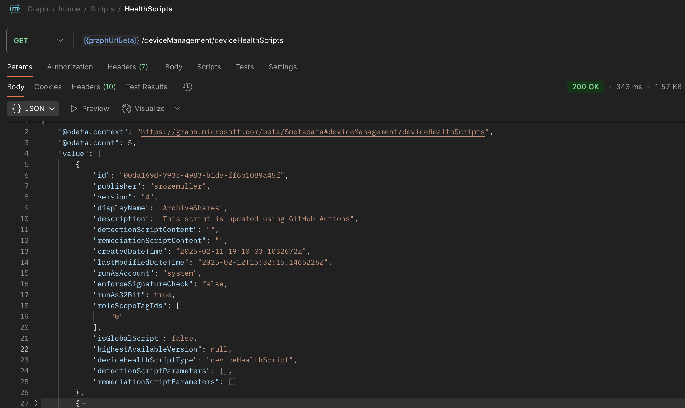
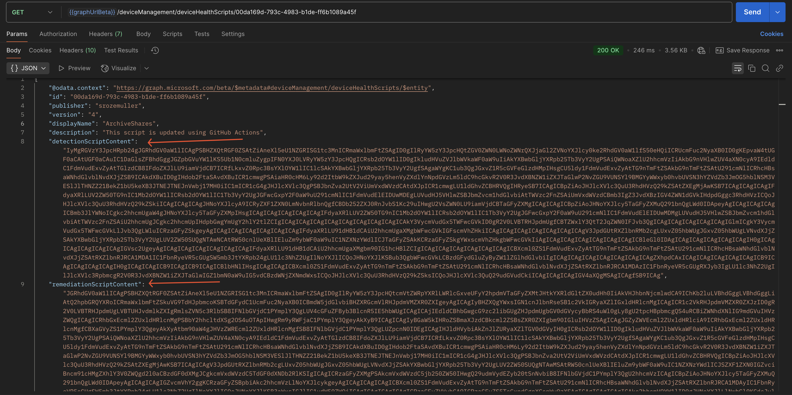
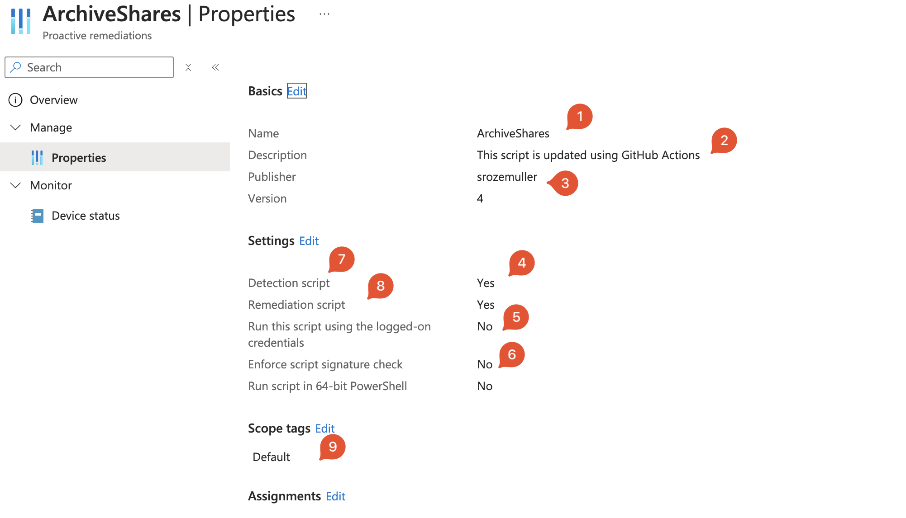
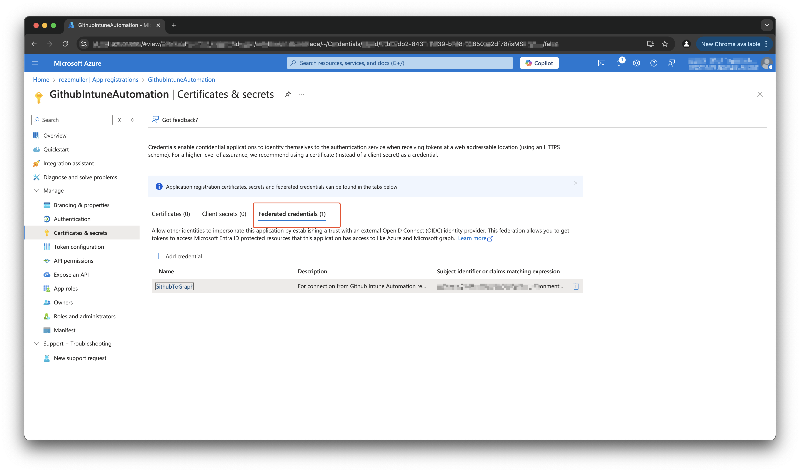
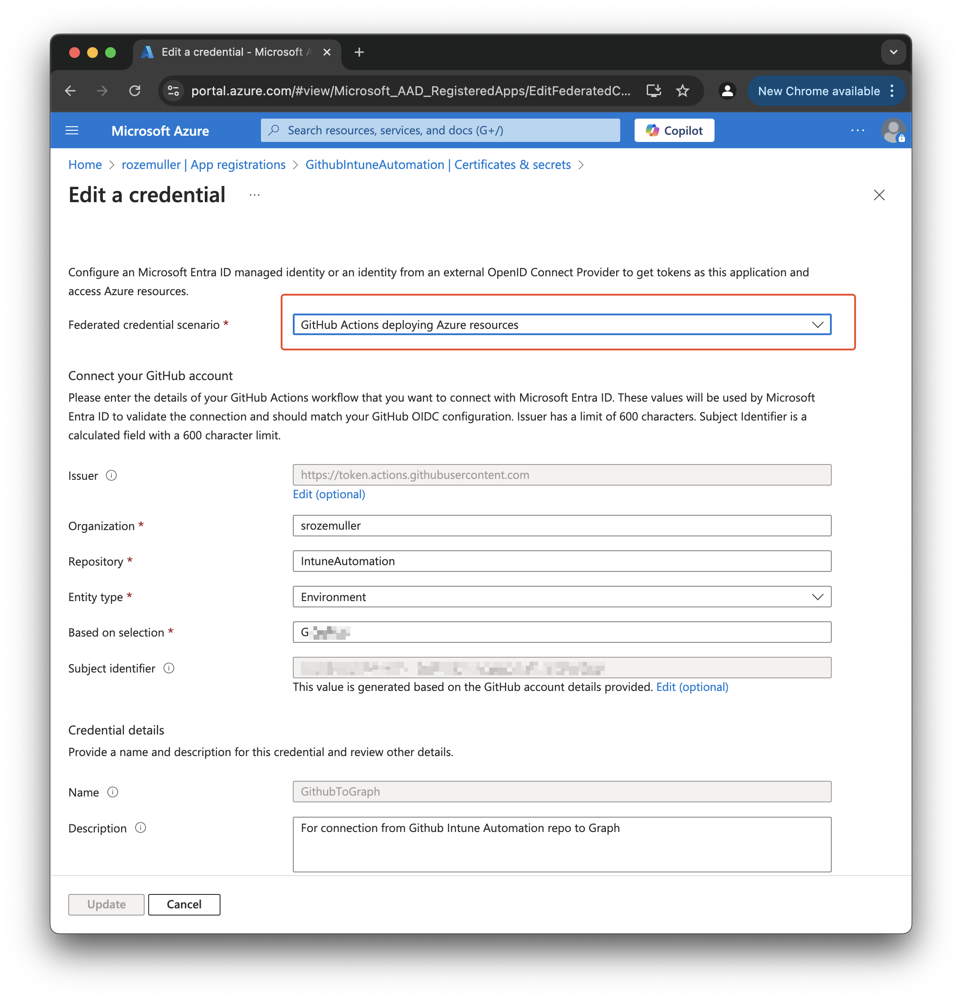
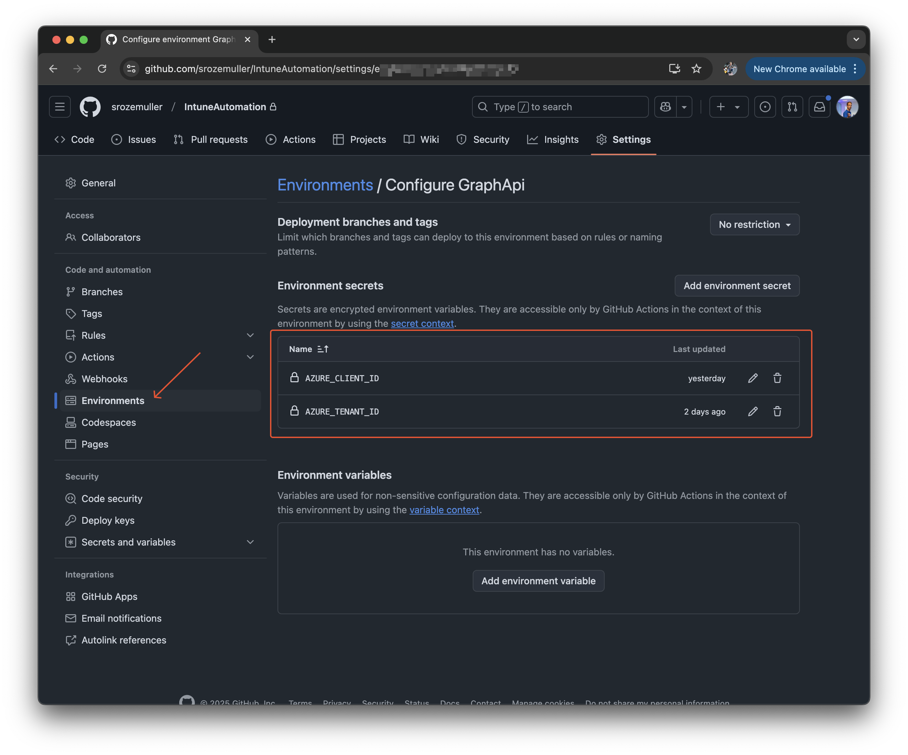
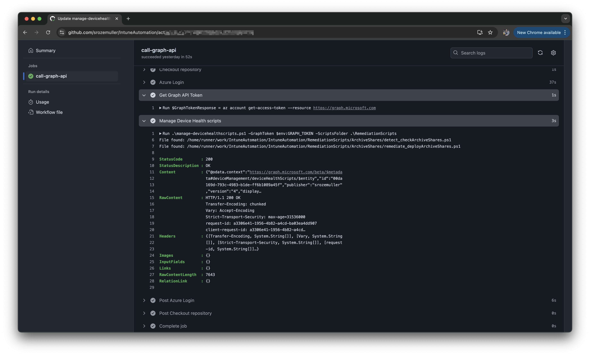

Microsoft Intune allows the use of scripts for various purposes, with the most common being detection and remediation scripts. These scripts can be found under the Scripts and Remediations blade in Intune.

A remediation package typically consists of a detection script and a remediation script. The detection script checks for a specific condition that requires remediation, such as identifying devices with battery health issues. In some cases, only a detection script is needed.



## Scripts in Intune
Currently, Intune does not provide built-in versioning for scripts. This means that when a script is updated, the previous version is lost. In this blog, I will demonstrate how to implement version control and automate script updates in Intune using GitHub Actions. The main goal is to automatically update scripts in Intune whenever they are modified and committed to a GitHub repository.

## GitHub (in short)
GitHub is a cloud-based platform for storing and managing code. It enables teams to collaborate efficiently by tracking changes, reviewing updates, and working on code together. You can think of it as OneDrive or SharePoint for code, but with much more functionality tailored to software and script development.

### What is a Repository?
A repository (repo) is like a folder where all files and the history of a project are stored. In the modern workplace, you can consider it as a central location where you manage scripts, configuration files, or automation workflows.

### Tracking changes
GitHub uses Git, a version control system that keeps track of file modifications. Think of it as "Version History" in OneDrive, but with much more control and flexibility. Git allows multiple people to work on the same files without accidentally overwriting each other’s changes.

### Save code to a repo
A save operation in Git is called a commit. Each commit is like creating a new version of a file, accompanied by a message describing the change. For example, updating a PowerShell script for Intune deployment might have a commit message like:

`Updated script to support additional device types.`

All commits are tracked, allowing you to roll back to previous versions if necessary.

## The idea
Now that you have some background on GitHub, you can see how it provides a powerful platform for storing and tracking script changes. If something goes wrong in a script, you always have the ability to revert to an earlier version.

With GitHub Actions, we can automate the deployment of Intune scripts. When a script is committed to a GitHub repository, a GitHub Action will trigger and update the script in Intune. This eliminates manual script management and ensures scripts are centrally controlled.

## Graph API
For automation in Intune, the Microsoft Graph API is essential. To manage scripts in Intune, we use the following endpoint:

`/deviceManagement/deviceHealthScripts`

Below is an example of the API response listing existing scripts:



The response contains essential information such as the name, creation date, and version of each script. The key properties here are detectionScriptContent and remediationScriptContent, which store the actual script content. However, the script content is only visible when querying a specific script using:

`/deviceManagement/deviceHealthScripts/{scriptId}`. The screenshot below makes more sense. A lot of content is there. 



### Create Intune device scripts automated
Now that we understand the structure of scripts in Intune, we need to create them in a similar format. Notice that the `detectionScriptContent` and `remediationScriptContent` properties do not store plain text; instead, they use Base64 encoding.

To create detection and remediation scripts, we first need to convert the script content into Base64 format. This can be done in PowerShell as follows:

```powershell
$command = get-content ./path-to-the-script.ps1 ## This is where you read the content
$bytes = [System.Text.Encoding]::UTF8.GetBytes($command) ##Converts the string (PowerShell script content) into an array of bytes using UTF-8 encoding. This is needed because the ToBase64String converstion needs a byte array.
$detectionScriptBinary = [Convert]::ToBase64String($bytes) #Converts the byte array into a Base64-encoded string, which allows storing or transmitting the script in a compact, text-safe format.
```

When converted we can setup a body for Graph API. In the PowerShell below you see a body that Graph accepts.\
```powershell
$body = @{
    displayName = "Script dislayname" #1
    description = "Script description" #2
    publisher = "Publisher" #3
    runAs32Bit = $true #4
    runAsAccount = "system" #5
    enforceSignatureCheck = $false #6
    detectionScriptContent = $detectionScriptBinary #7 This is the Base64String content from above
    remediationScriptContent = $remediationScriptBinary #8 The same as above, but other script. 
    roleScopeTagIds = @( #9
        "0"
    )
} | ConvertTo-Json
$headers = @{
    "Content-Type" = "application/json"
    Authorization = "Bearer {0}" -f $GraphToken
}
$apiUrl = "https://graph.microsoft.com/beta/deviceManagement/deviceHealthScripts"
Invoke-webrequest -Uri $apiUrl -Method "POST" -Headers $headers -Body $body
```

I numbered the items as in the code above.


## Automating Intune script management
Now the basic topics are disqussed it is time to craft the solution where GitHub is the fundament. (Asuming you have a GitHub account and a repository). From there we pick up the next steps.

### Authentication
To authenticate against Microsoft Graph API, we use a service principal with federated credentials. You can create a service principal using the Azure Portal.
The necessary API permission is:

DeviceManagementConfiguration.ReadWrite.All (Application-level permission)

Once configured, the GitHub Action authentication step looks like this: 






After the application is created and federated credentials are configured, make sure your GitHub enviroment meets exact the configuration you have provided. In this case, that means my connection MUST come from a GitHub organisation `srozemuller` from the repo `IntuneAutomation` that has the provided environment, in my case `GraphApi`. 

In the GitHub action the authentication part looks like this.

In the job I have a step that uses the `azure/login@v2` component and using the client-id and tenant-id to log in. There are a few things to note. First make a note of the `environment: GraphApi`. That is the final piece in the federated credential. By providing this you make sure you come from the correct environment. 
Second thing is the `allow-no-subscriptions: true`. This is to tell the authentication no Azure subscription is needed. There are situation where customers having M365 but no Azure, so no subscription. 

```yaml
jobs:
  call-graph-api:
    runs-on: ubuntu-latest
    environment: GraphApi
    steps:
      - name: Azure Login
        uses: azure/login@v2
        with:
          client-id: ${{ secrets.AZURE_CLIENT_ID }}
          tenant-id: ${{ secrets.AZURE_TENANT_ID }}
          allow-no-subscriptions: true
          enable-AzPSSession: true
```

As said, the client-id and tenant-id are stored as environment secrets at repo level.


### Authentication to Graph API
After logging in, we obtain a Graph API token:

```yaml
- name: Get Graph API Token
shell: pwsh
run: |
    $GraphTokenResponse = az account get-access-token --resource https://graph.microsoft.com
    $GraphToken = ($GraphTokenResponse | ConvertFrom-Json).accessToken
    Add-Content -Path $env:GITHUB_ENV -Value "GRAPH_TOKEN=$GraphToken"
```

### Create & update scripts 
Finally, we trigger the script update process:

```yaml
- name: Manage Device Health scripts
shell: pwsh
run: |
    .\manage-devicehealthscripts.ps1 -GraphToken $env:GRAPH_TOKEN -ScriptsFolder .\RemediationScripts
```
The scripts folder is the main folder where the subfolders are in. Every subfolder represents a script in Intune.
More about the PowerShell below. 

## Manage Intune device health scripts with PowerShell
The script has a few blocks. The first block is a preperation for the rest of the script. It sets the authentication headers, the Graph API endpoint and the default REST method, POST. 
A `POST` reqeust creates a new script. 

```powershell
$folders = Get-ChildItem -Path $ScriptsFolder -Directory
$headers = @{
    "Content-Type" = "application/json"
    Authorization = "Bearer {0}" -f $GraphToken
}
$apiUrl = "https://graph.microsoft.com/beta/deviceManagement/deviceHealthScripts"
$method = "POST"
```

Then the script has a loop that loops over all the sub folders in the main scripts folder.
```powershell
    foreach ($folder in $folders) {
        ...
    }
```

In the loop there are three blocks. 
The first block is checking if the script already exists, if so, then update the script. To check for the existing script, first fetch all scripts and then look for the script display name. 
I use the subfolders name as script displayname. If the script exists already, then create a new API endpoint that points to the script. Also change the REST method from `POST` to `PATCH`.

```powershell
$scripts = Invoke-webrequest -Uri $apiUrl -Method GET -Headers $headers
$existingScript = ($scripts.content | Convertfrom-json).value | Where-Object {$_.displayName -eq $folder.Name}
if ($existingScript) {
    $apiUrl = "{0}/{1}" -f $apiUrl, $existingScript.id
    $method = "PATCH"
}
```

The next block is converting the scripts from string to Base64String as mentioned above. The code below is the example for detection scripts. The same is needed for remediation scripts. 

```powershell
$detectScript = Get-ChildItem -Path $folder.FullName -File -Filter "detect_*" | Select-Object -First 1
if ($detectScript) {
    Write-Host "File found: $($detectScript.FullName)"
    $command = get-content $detectScript
    $bytes = [System.Text.Encoding]::UTF8.GetBytes($command)
    $detectionScriptBinary = [Convert]::ToBase64String($bytes)
} else {
    Write-Error "No detection file found. File should start with detect_"
}
```

The final block is creating the body with all the content, and then send the request to Graph. 

```powershell
$body = @{
    displayName = $folder.Name
    description = "This script is updated using GitHub Actions"
    publisher = $env:GITHUB_ACTOR ## Here I use a GitHub environment variable that tells who started the action. This is shown as the publisher in Intune.
    runAs32Bit = $true
    runAsAccount = "system"
    enforceSignatureCheck = $false
    detectionScriptContent = $detectionScriptBinary
    remediationScriptContent = $remediationScriptBinary
    roleScopeTagIds = @(
        "0"
    )
} | ConvertTo-Json

Invoke-webrequest -Uri $apiUrl -Method $Method -Headers $headers -Body $body
```
## Final action
When committing to the main branch in the IntuneAutomation repository, the action will start running and updating and/or creating script. 

The complete GitHub action to manage Intune scripts look like below. 
```yaml
name: Manage Intune Device Health Scripts
on:
  workflow_dispatch:
  push:
    branches:
      - main

permissions:
  id-token: write
  contents: read

jobs:
  call-graph-api:
    runs-on: ubuntu-latest
    environment: GraphApi
    steps:
      - name: Checkout repository
        uses: actions/checkout@v4
      - name: Azure Login
        uses: azure/login@v2
        with:
          client-id: ${{ secrets.AZURE_CLIENT_ID }}
          tenant-id: ${{ secrets.AZURE_TENANT_ID }}
          allow-no-subscriptions: true
          enable-AzPSSession: true
      - name: Get Graph API Token
        shell: pwsh
        run: |
          $GraphTokenResponse = az account get-access-token --resource https://graph.microsoft.com
          $GraphToken = ($GraphTokenResponse | ConvertFrom-Json).accessToken
          Add-Content -Path $env:GITHUB_ENV -Value "GRAPH_TOKEN=$GraphToken"
      - name: Manage Device Health scripts
        shell: pwsh
        run: |
          .\manage-devicehealthscripts.ps1 -GraphToken $env:GRAPH_TOKEN -ScriptsFolder .\RemediationScripts

```



You can find the script and the action in my repository: https://github.com/srozemuller/IntuneAutomation.

